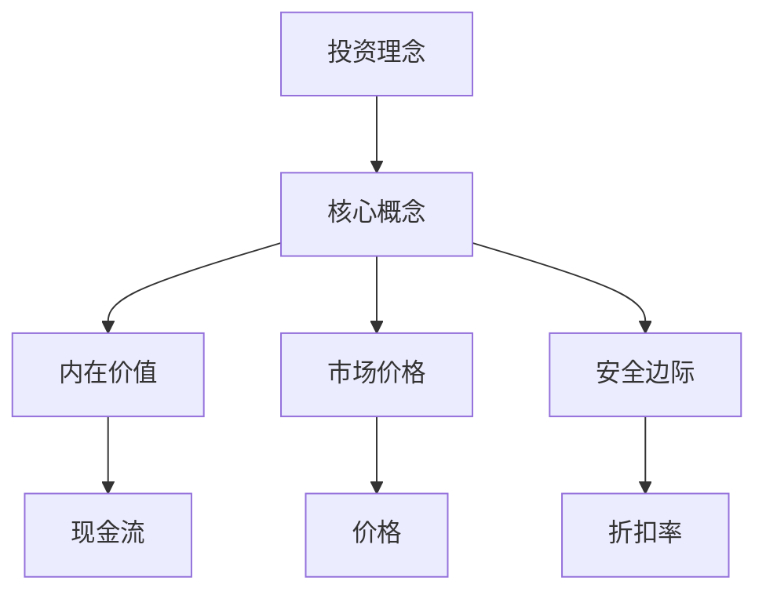
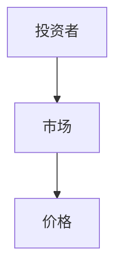
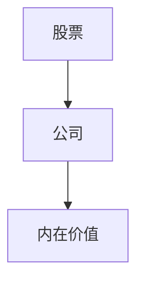
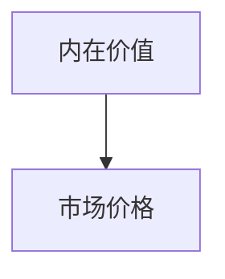
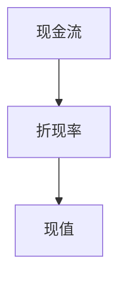
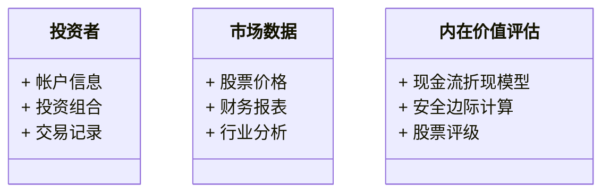
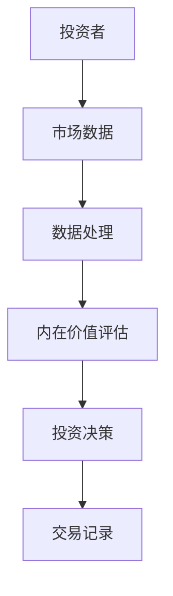

                 


# 深入解析价值投资理念：从格雷厄姆到巴菲特的演变

## 关键词：价值投资，格雷厄姆，巴菲特，内在价值，安全边际，现金流折现模型

## 摘要：价值投资是一种长期有效的投资策略，起源于本杰明·格雷厄姆的老师哲学，经过沃伦·巴菲特的发展与完善，成为现代投资学的重要组成部分。本文从价值投资的起源、核心概念、算法原理、系统分析、项目实战等方面，全面解析价值投资理念的演变过程，帮助投资者更好地理解这一投资策略的本质和应用。

---

# 第1章: 价值投资理念的背景与核心概念

## 1.1 价值投资理念的起源与发展

### 1.1.1 投资学的起源与发展
投资学作为一门学科，起源于对市场行为的研究。从18世纪的亚当·斯密到20世纪初的本杰明·格雷厄姆，投资学经历了从理论到实践的演变。格雷厄姆的老师哲学强调，投资的本质是寻找市场的内在价值，而不是随市场的波动而波动。

### 1.1.2 格雷厄姆与巴菲特的贡献
格雷厄姆被誉为“价值投资之父”，他提出的“安全边际”概念奠定了价值投资的基础。巴菲特则继承并发展了格雷厄姆的理念，将价值投资从理论上推向了实践，并通过长期投资的理念巩固了这一策略。

### 1.1.3 价值投资理念的核心思想
价值投资的核心思想是寻找市场价格低于内在价值的股票，通过长期持有这些股票，实现资本的增值。这种投资策略强调对企业的深入研究，而非市场的短期波动。

## 1.2 价值投资与其他投资理念的区别

### 1.2.1 短期交易与长期投资的对比
短期交易强调市场的波动性，而价值投资强调企业的内在价值。短期交易更注重技术分析和市场情绪，而价值投资更注重基本面分析和企业的长期盈利能力。

### 1.2.2 技术分析与基本面分析的差异
技术分析通过分析价格和成交量等市场数据来预测未来的价格走势，而基本面分析则通过分析企业的财务报表、行业地位等来评估企业的内在价值。价值投资更倾向于基本面分析。

### 1.2.3 价值投资的适用场景与局限性
价值投资适用于市场处于低估状态时，但其局限性在于无法预测市场的短期波动，且需要较长的时间才能实现收益。

## 1.3 价值投资对现代投资市场的影响

### 1.3.1 机构投资者的兴起
价值投资的理念推动了机构投资者的兴起，机构投资者通过长期持有优质股票，实现了资产的稳定增长。

### 1.3.2 个人投资者的策略演变
个人投资者逐渐从短期交易转向长期投资，价值投资的理念逐渐深入人心。

### 1.3.3 价值投资理念的全球化传播
价值投资的理念已经从美国传播到全球，成为全球投资者的重要策略之一。

## 1.4 本章小结
本章从价值投资的起源、核心思想以及与其他投资理念的区别等方面，详细介绍了价值投资的基本概念和其在现代投资市场中的地位。

---

# 第2章: 价值投资的核心概念与联系

## 2.1 价值投资的核心原理

### 2.1.1 安全边际的定义与计算
安全边际是指市场价格与内在价值之间的差距，它是价值投资的核心概念之一。计算公式为：
$$安全边际 = \frac{市场价格}{内在价值}$$
安全边际越大，投资的风险越小。

### 2.1.2 内在价值的评估方法
内在价值是企业未来现金流的现值，计算公式为：
$$V = \sum_{t=1}^{n} \frac{CF_t}{(1 + r)^t}$$
其中，$CF_t$ 是第t年的现金流，$r$ 是折现率。

### 2.1.3 市场情绪与投资决策的关系
市场情绪会影响市场的波动，但价值投资者更关注企业的内在价值，而非市场的短期波动。

## 2.2 价值投资的核心要素对比

### 2.2.1 格雷厄姆与巴菲特的核心理念对比
| 核心要素 | 格雷厄姆 | 巴菲特 |
|----------|----------|--------|
| 投资目标 | 低价买入，高价卖出 | 长期持有，价值增长 |
| 安全边际 | 强调安全边际的重要性 | 也强调安全边际，但更注重企业的竞争优势 |
| 投资策略 | 买入低估股票，短期获利 | 买入优质股票，长期持有 |

### 2.2.2 不同价值投资者的特征对比（表格）
| 特征 | 保守型价值投资者 | 理性型价值投资者 |
|------|-----------------|-------------|
| 投资策略 | 低价买入，短期获利 | 长期持有，价值增长 |
| 风险偏好 | 低风险偏好 | 中等风险偏好 |

### 2.2.3 价值投资的ER实体关系图


## 2.3 价值投资的ER实体关系图

### 2.3.1 投资者与市场的关系


### 2.3.2 股票与公司的关系


### 2.3.3 内在价值与市场价格的关系


## 2.4 本章小结
本章从安全边际、内在价值等核心概念出发，分析了价值投资的核心原理，并通过对比格雷厄姆与巴菲特的理念，总结了价值投资的核心要素。

---

# 第3章: 价值投资的算法原理与数学模型

## 3.1 价值投资的数学模型

### 3.1.1 内在价值的计算公式
$$V = \sum_{t=1}^{n} \frac{CF_t}{(1 + r)^t}$$
其中，$CF_t$ 是第t年的现金流，$r$ 是折现率。

### 3.1.2 现金流折现模型的代码示例
```python
def calculateDCF(cash_flows, discount_rate):
    dcf = 0
    for t in range(len(cash_flows)):
        dcf += cash_flows[t] / (1 + discount_rate) ** t
    return dcf

cash_flows = [100, 200, 300]
discount_rate = 0.1
print(calculateDCF(cash_flows, discount_rate))
```

### 3.1.3 安全边际的计算方法
$$安全边际 = \frac{市场价格}{内在价值}$$

## 3.2 算法原理的Python实现

### 3.2.1 现金流折现模型的代码示例
```python
def calculateDCF(cash_flows, discount_rate):
    dcf = 0
    for t in range(len(cash_flows)):
        dcf += cash_flows[t] / (1 + discount_rate) ** t
    return dcf

cash_flows = [100, 200, 300]
discount_rate = 0.1
print(calculateDCF(cash_flows, discount_rate))
```

### 3.2.2 现金流折现模型的计算流程图


## 3.3 本章小结
本章从数学模型和算法实现的角度，详细讲解了内在价值和安全边际的计算方法，并通过Python代码示例展示了现金流折现模型的实现过程。

---

# 第4章: 价值投资的系统分析与架构设计

## 4.1 价值投资的系统应用场景

### 4.1.1 价值投资决策系统
价值投资决策系统是一个基于内在价值评估的投资决策支持系统，帮助投资者做出更明智的投资决策。

### 4.1.2 系统功能设计


### 4.1.3 系统架构设计


## 4.2 价值投资的系统接口设计

### 4.2.1 系统接口设计
系统接口设计包括投资者与系统的交互，数据的获取与处理，以及投资决策的输出。

### 4.2.2 系统交互流程图


## 4.3 本章小结
本章从系统分析与架构设计的角度，详细讲解了价值投资的系统应用场景，以及系统的功能设计和架构设计。

---

# 第5章: 价值投资的项目实战

## 5.1 价值投资的项目实战

### 5.1.1 环境安装
需要安装Python和相关库，如Pandas、NumPy等。

### 5.1.2 价值投资项目核心实现
```python
import pandas as pd
import numpy as np

def calculate_intrinsic_value(cash_flows, discount_rate):
    iv = 0
    for t in range(len(cash_flows)):
        iv += cash_flows[t] / (1 + discount_rate) ** t
    return iv

cash_flows = [100, 200, 300]
discount_rate = 0.1
print(calculate_intrinsic_value(cash_flows, discount_rate))
```

### 5.1.3 项目小结
通过项目实战，投资者可以更好地理解价值投资的理念，并能够将其应用于实际投资中。

## 5.2 本章小结
本章通过具体的项目实战，详细讲解了价值投资的实现过程，帮助投资者更好地理解这一投资策略。

---

# 第6章: 价值投资的最佳实践与小结

## 6.1 价值投资的最佳实践

### 6.1.1 长期投资的重要性
长期投资是价值投资的核心理念之一，投资者应选择优质的股票进行长期持有。

### 6.1.2 风险管理的重要性
投资者应注重风险管理，避免过度集中投资，分散投资风险。

## 6.2 价值投资的注意事项

### 6.2.1 市场波动的影响
市场波动会影响股票价格，但价值投资者应关注企业的内在价值，而非市场的短期波动。

### 6.2.2 企业基本面分析
投资者应深入分析企业的财务报表，了解企业的盈利能力、财务状况和行业地位。

## 6.3 价值投资的拓展阅读

### 6.3.1 经典书籍推荐
- 《The Intelligent Investor》 by Benjamin Graham
- 《The Warren Buffett Way》 by Bruce Greenwald

## 6.4 本章小结
本章总结了价值投资的最佳实践，强调了长期投资和风险管理的重要性，并推荐了相关书籍供读者进一步阅读。

---

# 作者：AI天才研究院/AI Genius Institute & 禅与计算机程序设计艺术/Zen And The Art of Computer Programming

---

以上是《深入解析价值投资理念：从格雷厄姆到巴菲特的演变》的完整内容，涵盖了价值投资的理念、核心概念、算法原理、系统分析、项目实战以及最佳实践等多个方面。通过本文的分析，读者可以更好地理解价值投资的本质，并能够将其应用于实际投资中。

