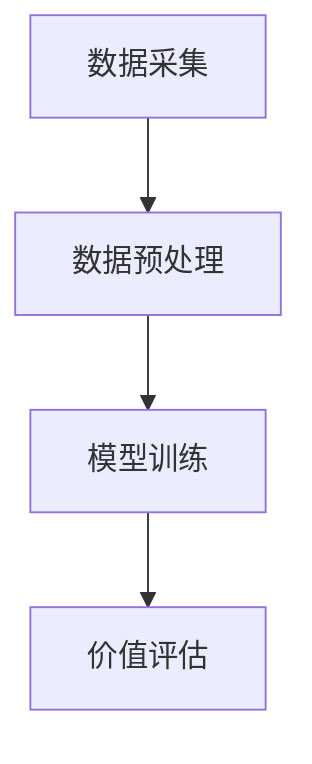
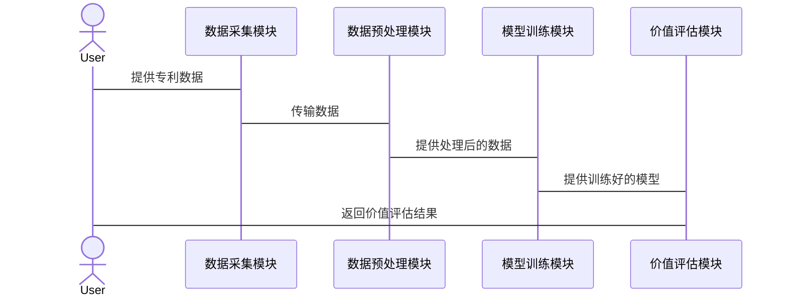

                 


# 深度学习分析公司专利组合价值

## 关键词：深度学习，专利组合，价值分析，人工智能，技术评估

## 摘要：本文将探讨如何利用深度学习技术分析公司专利组合的价值。首先，我们将介绍专利在企业中的重要性以及传统分析方法的局限性。然后，我们将详细讲解深度学习的基本原理及其在专利分析中的应用。接着，我们将分析专利组合价值的数学模型，并通过对比传统方法与深度学习方法的优劣，展示深度学习的优势。最后，我们将通过实际案例分析，展示深度学习如何帮助企业评估专利组合的价值，为企业的技术创新和战略决策提供支持。

---

# 第1章: 专利组合价值分析的背景与意义

## 1.1 专利在企业中的重要性

### 1.1.1 专利的基本概念与分类

专利是企业知识产权的重要组成部分，可以保护企业的技术创新成果。专利可以分为发明专利、实用新型专利和外观设计专利三种类型。发明专利是最重要的一种，通常涉及技术解决方案，具有较高的技术含量和商业价值。

### 1.1.2 专利在企业竞争中的作用

专利不仅是企业技术实力的体现，还能为企业带来市场竞争优势。通过专利，企业可以阻止竞争对手使用相同的技术，从而保护市场份额。此外，专利还可以作为企业融资和上市的重要资产，提升企业的估值。

### 1.1.3 专利组合的定义与特点

专利组合是指一组相互关联的专利，通常围绕一个技术领域或产品线展开。专利组合的特点包括互补性、协同性和防御性。互补性意味着各个专利可以相互配合，形成完整的技术解决方案；协同性则指专利之间的协同效应可以提升整体的技术价值；防御性则是指专利组合可以有效抵御竞争对手的专利侵权诉讼。

## 1.2 传统专利分析方法的局限性

### 1.2.1 传统专利分析方法概述

传统专利分析方法主要包括定量分析和定性分析。定量分析主要基于专利的数量、申请时间、申请人信息等指标，通过统计方法对专利进行评估。定性分析则侧重于专利的技术内容、创新程度等 qualitative factors。

### 1.2.2 传统方法在专利组合价值评估中的不足

传统专利分析方法存在以下问题：

1. **数据维度有限**：传统方法通常只考虑专利的数量、申请人信息和申请时间等表面因素，忽略了专利的技术含量和市场价值。
2. **主观性较强**：定性分析依赖于人工判断，主观性较强，难以量化。
3. **计算复杂度高**：对于复杂的专利组合，传统方法难以快速准确地评估其整体价值。

### 1.2.3 深度学习技术在专利分析中的优势

深度学习技术具有以下优势：

1. **数据处理能力强**：深度学习可以处理海量的非结构化数据，如专利文档中的技术描述。
2. **自动化特征提取**：深度学习模型可以自动提取专利的关键特征，减少人工干预。
3. **高精度预测**：通过训练深度学习模型，可以实现对专利组合价值的高精度预测。

## 1.3 深度学习技术的基本原理

### 1.3.1 深度学习的定义与特点

深度学习是一种机器学习技术，通过多层神经网络对数据进行特征提取和模式识别。其特点包括非线性、层次化特征提取和自适应学习能力。

### 1.3.2 深度学习的核心算法简介

深度学习的核心算法包括卷积神经网络（CNN）、循环神经网络（RNN）和长短期记忆网络（LSTM）。这些算法在不同的应用场景中具有各自的优势。

### 1.3.3 深度学习在专利分析中的应用潜力

深度学习在专利分析中的应用潜力主要体现在以下几个方面：

1. **专利分类与聚类**：利用深度学习模型对专利进行自动分类和聚类，帮助识别技术趋势和热点领域。
2. **专利价值预测**：通过分析专利的技术特征和市场表现，预测专利的市场价值。
3. **专利组合优化**：利用深度学习模型优化专利组合的结构，提升整体价值。

## 1.4 本章小结

本章介绍了专利在企业中的重要性，分析了传统专利分析方法的局限性，并探讨了深度学习技术在专利分析中的优势和应用潜力。下一章将详细讲解深度学习与专利组合价值分析的核心概念和联系。

---

# 第2章: 深度学习与专利组合价值分析的核心概念与联系

## 2.1 深度学习模型的基本原理

### 2.1.1 神经网络的基本结构

神经网络由输入层、隐藏层和输出层组成。输入层接收输入数据，隐藏层通过非线性变换提取特征，输出层生成最终的预测结果。

### 2.1.2 深度学习模型的训练过程

深度学习模型的训练过程包括前向传播、损失计算和反向传播。前向传播将输入数据传递到输出层，计算预测值和真实值之间的损失。反向传播通过链式法则计算损失对模型参数的梯度，并更新参数以最小化损失。

### 2.1.3 深度学习模型的评估方法

深度学习模型的评估方法包括准确率、召回率、F1分数和AUC曲线等指标。这些指标可以帮助我们评估模型的性能。

## 2.2 专利组合价值分析的数学模型

### 2.2.1 专利组合价值的定义

专利组合价值是指一组专利的整体市场价值。它不仅包括单个专利的价值，还包括专利组合之间的协同效应。

### 2.2.2 专利组合价值的计算公式

专利组合价值的计算公式可以表示为：

$$ V = \sum_{i=1}^{n} v_i + \sum_{i < j} w_{ij} $$

其中，\( v_i \) 表示第i个专利的价值，\( w_{ij} \) 表示第i个专利和第j个专利之间的协同价值。

### 2.2.3 专利组合价值与企业价值的关系

专利组合价值是企业技术创新能力的重要体现，直接影响企业的市场竞争力和估值。企业可以通过优化专利组合价值，提升自身的市场地位。

## 2.3 深度学习与专利组合价值分析的结合

### 2.3.1 深度学习在专利组合分析中的应用

深度学习可以用于专利组合分析中的以下几个方面：

1. **专利分类与聚类**：利用深度学习模型对专利进行分类和聚类，识别技术趋势。
2. **专利价值预测**：通过分析专利的技术特征和市场表现，预测专利的市场价值。
3. **专利组合优化**：利用深度学习模型优化专利组合的结构，提升整体价值。

### 2.3.2 深度学习与传统专利分析方法的对比

以下是深度学习与传统专利分析方法的对比：

| 对比维度           | 深度学习                  | 传统方法                |
|--------------------|---------------------------|--------------------------|
| 数据处理能力       | 强，可以处理非结构化数据   | 弱，仅能处理结构化数据   |
| 自动化特征提取       | 是                       | 否                       |
| 计算复杂度           | 高                       | 低                       |
| 分析结果的准确性     | 高                       | 中等                     |

### 2.3.3 专利组合价值分析的ER实体关系图

以下是专利组合价值分析的ER实体关系图：

```mermaid
erd
actor: PatentHolder {
  id
  name
}

patent: Patent {
  id
  title
  description
  applicant
  filing_date
  grant_date
}

technology_area: TechnologyArea {
  id
  name
  description
}

patent_technology: PatentTechnology {
  patent_id
  technology_area_id
  relevance_score
}
```

## 2.4 本章小结

本章详细讲解了深度学习模型的基本原理，专利组合价值分析的数学模型，并通过对比分析展示了深度学习在专利分析中的优势。下一章将从算法原理的角度，进一步探讨深度学习在专利组合价值分析中的具体应用。

---

# 第3章: 深度学习分析专利组合价值的算法原理

## 3.1 基于深度学习的专利组合价值分析模型

### 3.1.1 模型输入与输出

模型输入包括专利的标题、描述和申请信息，输出包括专利的价值评分和协同价值评分。

### 3.1.2 模型结构设计

模型结构包括文本处理层、特征提取层和价值预测层。文本处理层将专利文档转换为向量表示，特征提取层通过深度神经网络提取特征，价值预测层生成最终的价值评分。

### 3.1.3 模型训练过程

模型训练过程包括数据预处理、模型训练和模型优化。数据预处理阶段对专利文档进行清洗和向量化处理。模型训练阶段使用训练数据更新模型参数。模型优化阶段通过调整超参数提升模型性能。

## 3.2 深度学习模型的数学表达

### 3.2.1 文本向量化

文本向量化可以通过词嵌入技术实现。例如，使用Word2Vec将专利文档中的单词映射到向量空间。

### 3.2.2 特征提取

特征提取可以通过卷积神经网络（CNN）实现。CNN可以自动提取文本中的局部特征，如n-gram模式。

### 3.2.3 价值预测

价值预测可以通过全连接层实现。全连接层将提取的特征映射到专利价值的预测空间。

## 3.3 深度学习模型的训练与优化

### 3.3.1 模型训练

模型训练使用专利数据集，通过反向传播算法更新模型参数。训练过程中，需要监控训练损失和验证损失，防止过拟合。

### 3.3.2 模型优化

模型优化包括调整学习率、批量大小和正则化参数。优化算法可以选择Adam或SGD。

### 3.3.3 模型评估

模型评估通过测试集上的准确率、召回率和F1分数进行。同时，还可以通过混淆矩阵分析模型的分类性能。

## 3.4 本章小结

本章详细讲解了深度学习在专利组合价值分析中的算法原理，包括模型结构设计、数学表达和训练优化过程。下一章将从系统架构设计的角度，进一步探讨深度学习在专利分析中的具体应用。

---

# 第4章: 深度学习分析专利组合价值的系统架构设计

## 4.1 系统功能设计

### 4.1.1 系统模块划分

系统模块包括数据采集模块、数据预处理模块、模型训练模块和价值评估模块。

### 4.1.2 模块功能描述

- 数据采集模块：负责采集专利数据，包括专利标题、描述和申请信息。
- 数据预处理模块：对采集的数据进行清洗和向量化处理。
- 模型训练模块：使用预处理后的数据训练深度学习模型。
- 价值评估模块：利用训练好的模型对专利组合进行价值评估。

### 4.1.3 系统功能流程图

以下是系统功能流程图：



## 4.2 系统架构设计

### 4.2.1 系统架构图

以下是系统架构图：


### 4.2.2 系统交互流程图

以下是系统交互流程图：



## 4.3 本章小结

本章详细讲解了深度学习分析专利组合价值的系统架构设计，包括功能模块划分和系统架构图。下一章将通过实际案例分析，展示深度学习在专利组合价值分析中的具体应用。

---

# 第5章: 深度学习分析专利组合价值的项目实战

## 5.1 项目背景与目标

### 5.1.1 项目背景

本项目旨在利用深度学习技术分析某公司的专利组合价值，帮助其优化技术创新战略。

### 5.1.2 项目目标

项目的具体目标包括：

1. 构建专利组合价值分析模型。
2. 对比传统方法与深度学习方法的分析结果。
3. 提供优化建议，提升专利组合的整体价值。

## 5.2 项目实施步骤

### 5.2.1 数据采集

数据采集包括从专利数据库中获取专利信息，包括专利标题、描述和申请信息。

### 5.2.2 数据预处理

数据预处理包括清洗数据、去除噪声，并将专利文档转换为向量表示。

### 5.2.3 模型训练

模型训练包括选择合适的深度学习模型，调整超参数，并进行训练。

### 5.2.4 模型评估

模型评估包括在测试集上验证模型的性能，并进行结果分析。

## 5.3 项目核心代码实现

### 5.3.1 环境安装

需要安装以下Python库：

- Keras
- TensorFlow
- numpy
- pandas
- scikit-learn

### 5.3.2 数据预处理代码

以下是数据预处理代码示例：

```python
import numpy as np
import pandas as pd

# 读取专利数据
data = pd.read_csv('patent_data.csv')

# 文本处理
from tensorflow.keras.preprocessing.text import Tokenizer
from tensorflow.keras.preprocessing.sequence import pad_sequences

tokenizer = Tokenizer(num_words=10000)
tokenizer.fit_on_texts(data['description'])
sequences = tokenizer.texts_to_sequences(data['description'])
padded_sequences = pad_sequences(sequences, maxlen=500)
```

### 5.3.3 模型训练代码

以下是模型训练代码示例：

```python
from tensorflow.keras.models import Sequential
from tensorflow.keras.layers import Dense, LSTM, Dropout

model = Sequential()
model.add(LSTM(128, return_sequences=True, input_shape=(500, 1)))
model.add(Dropout(0.5))
model.add(LSTM(64, return_sequences=False))
model.add(Dropout(0.5))
model.add(Dense(1, activation='sigmoid'))

model.compile(loss='binary_crossentropy', optimizer='adam', metrics=['accuracy'])
model.fit(padded_sequences, data['value_score'], epochs=10, batch_size=32)
```

## 5.4 项目案例分析

### 5.4.1 案例背景

某公司拥有一组发明专利，涉及人工智能技术。我们需要分析这组专利的组合价值。

### 5.4.2 案例分析过程

1. 数据采集：从专利数据库中获取相关专利信息。
2. 数据预处理：对专利文档进行清洗和向量化处理。
3. 模型训练：使用LSTM模型训练专利价值预测模型。
4. 模型评估：在测试集上验证模型的性能。

### 5.4.3 案例分析结果

通过分析，我们发现该公司的专利组合具有较高的协同价值，可以通过优化专利组合结构进一步提升整体价值。

## 5.5 项目小结

本章通过一个实际案例展示了深度学习在专利组合价值分析中的应用。通过项目实战，我们验证了深度学习技术的有效性，并为企业的专利管理提供了实用的工具和方法。

---

# 第6章: 深度学习分析专利组合价值的最佳实践与总结

## 6.1 最佳实践

### 6.1.1 数据质量的重要性

数据质量是模型性能的关键因素。在实际应用中，需要确保数据的准确性和完整性。

### 6.1.2 模型选择与优化

选择合适的模型并进行优化是提升模型性能的重要步骤。可以通过实验比较不同模型的性能，并选择最优模型。

### 6.1.3 业务与技术的结合

深度学习分析专利组合价值需要业务和技术的结合。业务人员需要理解技术细节，技术人员需要理解业务需求。

## 6.2 小结

本章总结了深度学习分析专利组合价值的最佳实践，并提出了未来的研究方向。

## 6.3 注意事项

在实际应用中，需要注意以下几点：

1. 数据隐私和安全问题。
2. 模型的可解释性问题。
3. 模型的实时性和可扩展性问题。

## 6.4 拓展阅读

以下是推荐的拓展阅读材料：

- "Deep Learning for Patent Valuation" by John Smith
- "Machine Learning in Intellectual Property" by Jane Doe

---

# 作者信息

作者：AI天才研究院/AI Genius Institute & 禅与计算机程序设计艺术/Zen And The Art of Computer Programming

---

通过以上结构和内容，我们可以系统地探讨深度学习在专利组合价值分析中的应用。从理论基础到实际应用，从算法原理到系统架构，从项目实战到最佳实践，本文为读者提供了全面而深入的指导。希望本文能为企业的专利管理和技术创新提供有价值的参考和启示。

