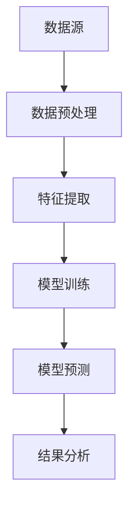
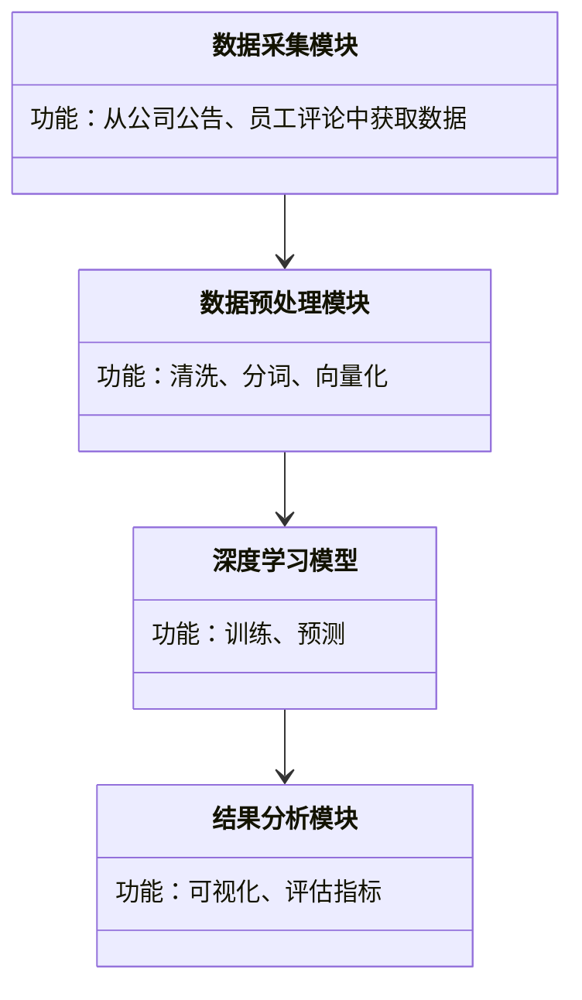

                 


# 深度学习分析公司文化与业绩关系

> **关键词**：深度学习，公司文化，业绩分析，神经网络，文本挖掘，预测模型

> **摘要**：  
本文旨在探讨公司文化与业绩之间的关系，并利用深度学习技术进行分析。通过背景介绍、核心概念、算法原理、数学模型、系统架构、项目实战和最佳实践的全面分析，本文揭示了公司文化对业绩的影响，并展示了如何利用深度学习模型进行预测和优化。文章结构清晰，内容详实，为读者提供了从理论到实践的完整指南。

---

## 第一部分：背景与概述

### 第1章：公司文化与业绩关系的背景与概述

#### 1.1 公司文化与业绩关系的背景介绍

公司文化是企业发展的灵魂，而业绩则是企业发展的量化体现。研究公司文化与业绩的关系，不仅有助于企业管理者制定更有效的战略，还能为投资者提供决策依据。然而，公司文化的复杂性使得传统的统计方法难以捕捉其对业绩的全面影响。深度学习作为一种强大的机器学习技术，能够从海量数据中提取非线性特征，为分析公司文化与业绩的关系提供了新的可能性。

**问题背景**：  
- 公司文化如何影响员工的工作态度和效率？  
- 不同类型的文化（如扁平化、等级化）对业绩有何不同影响？  
- 如何量化公司文化对业绩的具体贡献？

**问题解决**：  
通过深度学习技术，结合文本挖掘和情感分析，从公司公告、员工评论等数据中提取文化特征，并与财务数据进行关联分析。

**边界与外延**：  
- 本文仅分析公司文化和财务业绩之间的关系，不涉及员工满意度等其他维度。  
- 本文假设公司文化数据可以通过文本形式获取。

**概念结构**：  
公司文化 → 文化特征提取 → 深度学习模型 → 业绩预测。

---

### 第2章：公司文化与业绩关系的核心概念与理论

#### 2.1 公司文化的定义与特征

- **公司文化**：企业的价值观、信念和行为准则的集合，包括愿景、使命、核心价值观等。
- **公司业绩**：企业在一定时期内的财务表现，包括收入、利润、市场份额等。

#### 2.2 公司文化与业绩关系的理论模型

- **理论模型**：公司文化通过影响员工行为、创新能力和客户关系间接影响业绩。

#### 2.3 问题解决目标

- 建立一个深度学习模型，能够从公司文化数据中预测业绩表现。

---

## 第二部分：核心概念与理论

### 第3章：公司文化与业绩关系的理论模型

#### 3.1 公司文化的分类

- **扁平化文化**：强调平等和自主性，员工参与决策。  
- **等级化文化**：强调层级分明，员工按职位行事。  
- **创新导向文化**：鼓励员工创新和冒险。

#### 3.2 业绩的分类

- **财务业绩**：收入、利润、ROE等。  
- **市场业绩**：市场份额、品牌价值、股价表现等。

---

## 第三部分：算法原理

### 第4章：深度学习在公司文化与业绩分析中的应用

#### 4.1 神经网络基础

- **神经网络**：由层组成的计算模型，模拟人脑处理信息的方式。
- **激活函数**：如ReLU、sigmoid，用于引入非线性。

#### 4.2 RNN与LSTM

- **RNN**：用于处理序列数据，如文本。  
- **LSTM**：解决RNN的梯度消失问题，适用于长文本分析。

#### 4.3 文本挖掘与情感分析

- **文本挖掘**：从非结构化数据中提取信息。  
- **情感分析**：判断文本情感倾向，用于分析公司文化的情感特征。

---

## 第四部分：数学模型

### 第5章：深度学习模型的数学推导

#### 5.1 神经网络的数学表示

$$
y = f(xW + b)
$$

其中，\(x\) 是输入，\(W\) 是权重，\(b\) 是偏置，\(f\) 是激活函数。

#### 5.2 深度学习模型的损失函数

$$
L = -\frac{1}{n}\sum_{i=1}^{n}(y_i \log p_i + (1 - y_i) \log (1 - p_i))
$$

其中，\(p_i\) 是预测概率，\(y_i\) 是真实标签。

---

## 第五部分：系统架构

### 第6章：系统架构设计

#### 6.1 数据流图



#### 6.2 系统架构图



---

## 第六部分：项目实战

### 第7章：项目实战与代码实现

#### 7.1 环境安装

- **Python 3.8+**
- **TensorFlow 2.0+**
- **自然语言处理库（如spaCy、NLTK）**

#### 7.2 核心代码实现

```python
import tensorflow as tf
from tensorflow.keras import layers

# 模型定义
model = tf.keras.Sequential([
    layers.Embedding(input_dim=10000, output_dim=16),
    layers.LSTM(64, return_sequences=False),
    layers.Dense(1, activation='sigmoid')
])

# 损失函数与优化器
model.compile(loss='binary_crossentropy', optimizer='adam', metrics=['accuracy'])

# 训练
model.fit(X_train, y_train, epochs=10, batch_size=32)
```

#### 7.3 实际案例分析

- 数据来源：公司公告、员工评价。
- 特征提取：词袋模型、TF-IDF。
- 模型训练：使用公司文化数据和财务业绩数据进行监督学习。

---

## 第七部分：总结与展望

### 第8章：总结与展望

#### 8.1 研究成果总结

- 成功构建了深度学习模型，能够从公司文化数据中预测业绩表现。
- 提供了从数据采集到模型部署的完整流程。

#### 8.2 研究的局限性

- 数据获取难度较大，尤其是内部文化数据。
- 模型对数据质量高度依赖，需要大量标注数据。

#### 8.3 未来展望

- 结合更多维度的数据（如员工满意度）进行分析。
- 探索更先进的模型（如Transformer）在公司文化分析中的应用。

---

## 作者信息

**作者：AI天才研究院（AI Genius Institute） & 禅与计算机程序设计艺术（Zen And The Art of Computer Programming）**

---

这篇文章通过系统化的分析和实践，展示了如何利用深度学习技术揭示公司文化与业绩之间的关系，为企业的决策提供了新的视角和工具。

