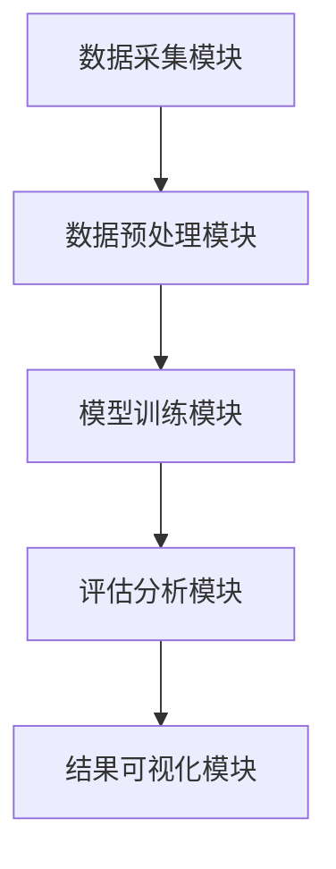

                 


# 深度学习分析公司无形资产价值

## 关键词：
深度学习, 无形资产, 价值评估, 神经网络, 人工智能

## 摘要：
本文探讨了如何利用深度学习技术分析公司无形资产的价值，重点介绍了深度学习的基本原理、数学模型、系统架构设计以及实际案例分析。通过详细的理论和实践相结合，展示了深度学习在无形资产评估中的应用前景。

---

## 第一部分: 深度学习与公司无形资产价值分析背景

### # 第1章: 无形资产与深度学习概述

#### 1.1 无形资产的基本概念
- 无形资产是指没有实物形态，但具有长期使用价值的资产，包括品牌、客户关系、知识产权等。
- 无形资产在企业价值中的占比越来越高，传统评估方法难以准确量化。

#### 1.2 深度学习的基本概念
- 深度学习是一种机器学习技术，通过多层神经网络模拟人脑对数据的处理方式。
- 深度学习具有强大的非线性特征提取能力，适合处理复杂数据。

#### 1.3 深度学习在无形资产评估中的应用背景
- 传统评估方法依赖人工经验，存在主观性和片面性。
- 深度学习可以通过大数据分析，提供更客观、准确的评估结果。

### # 第2章: 深度学习在无形资产评估中的应用背景

#### 2.1 无形资产评估的难点与痛点
- 数据获取困难：无形资产价值受多种因素影响，数据复杂且分散。
- 评估模型的局限性：传统模型难以捕捉非结构化数据中的隐含信息。

#### 2.2 深度学习技术的优势
- 处理复杂数据：深度学习擅长处理文本、图像等多种数据类型。
- 自动特征提取：能够从大量数据中提取关键特征，提高评估准确性。

#### 2.3 深度学习在无形资产评估中的应用前景
- 帮助企业量化品牌价值，优化投资决策。
- 提供实时监控工具，及时发现潜在风险。

---

## 第二部分: 深度学习的核心概念与原理

### # 第3章: 深度学习的核心原理

#### 3.1 神经网络的基本原理
- 神经网络由输入层、隐藏层和输出层组成，通过非线性激活函数处理数据。
- 损失函数衡量预测值与真实值的差距，优化器通过反向传播更新权重。

#### 3.2 深度学习中的特征提取
- 深度学习通过多层网络自动提取特征，降低人工特征工程的复杂性。
- 不同类型的数据需要不同的特征提取方法，如文本使用词嵌入，图像使用卷积。

---

## 第三部分: 数学模型与算法原理

### # 第4章: 基于深度学习的数学模型

#### 4.1 RNN模型原理
- RNN擅长处理序列数据，如公司声誉变化时间序列。
- 通过LSTM单元捕捉长期依赖关系，提高模型性能。

#### 4.2 CNN模型原理
- CNN适用于图像数据处理，提取品牌设计中的视觉特征。
- 卷积层和池化层减少计算量，提高模型泛化能力。

#### 4.3 深度学习模型的数学表达
- 损失函数：$$ L = -\frac{1}{m}\sum_{i=1}^{m} y_i \log(p_i) + (1-y_i)\log(1-p_i) $$
- 优化器：Adam优化器结合动量和自适应学习率，加速收敛。

---

## 第四部分: 系统分析与架构设计

### # 第5章: 系统设计与架构

#### 5.1 项目背景与目标
- 项目目标：开发一个基于深度学习的无形资产评估系统，量化品牌、客户关系等价值。
- 数据来源：公司财务报表、社交媒体评论、专利信息等。

#### 5.2 系统功能设计
- 数据采集模块：爬取和预处理数据，清洗无效信息。
- 模型训练模块：构建和训练深度学习模型，保存最优参数。
- 评估分析模块：输出评估结果，生成可视化报告。

#### 5.3 系统架构设计


---

## 第五部分: 项目实战

### # 第6章: 项目实战与案例分析

#### 6.1 项目环境配置
- 安装Python、TensorFlow、Keras等工具。
- 数据集准备：收集公司品牌相关的文本和图像数据。

#### 6.2 核心实现代码
```python
import tensorflow as tf
from tensorflow.keras import layers

model = tf.keras.Sequential()
model.add(layers.Conv2D(32, (3,3), activation='relu', input_shape=(64,64,3)))
model.add(layers.MaxPooling2D(pool_size=(2,2)))
model.add(layers.Flatten())
model.add(layers.Dense(128, activation='relu'))
model.add(layers.Dense(1, activation='sigmoid'))
model.compile(optimizer='adam', loss='binary_crossentropy', metrics=['accuracy'])
model.fit(train_data, train_labels, epochs=10, batch_size=32)
```

#### 6.3 实际案例分析
- 使用品牌图像数据训练CNN模型，评估品牌价值。
- 模型输出结果与传统评估方法对比，验证深度学习的优势。

---

## 第六部分: 总结与展望

### # 第7章: 总结与展望

#### 7.1 总结
- 深度学习在无形资产评估中具有巨大潜力，能够处理复杂数据，提供准确评估。
- 通过系统设计和项目实战，展示了深度学习的实际应用价值。

#### 7.2 展望
- 结合自然语言处理技术，提升文本数据的分析能力。
- 开发实时监控系统，动态评估无形资产价值。

### 最佳实践 tips:
- 数据质量是关键，确保数据来源多样且准确。
- 模型调优需要结合业务需求，选择合适参数。
- 保持对新技术的关注，及时更新评估方法。

---

## 作者：AI天才研究院 & 禅与计算机程序设计艺术

通过系统地分析和实践，深度学习正在改变无形资产评估的方式，为企业决策提供更有力的支持。希望本文能为相关领域的研究者和实践者提供有价值的参考。

