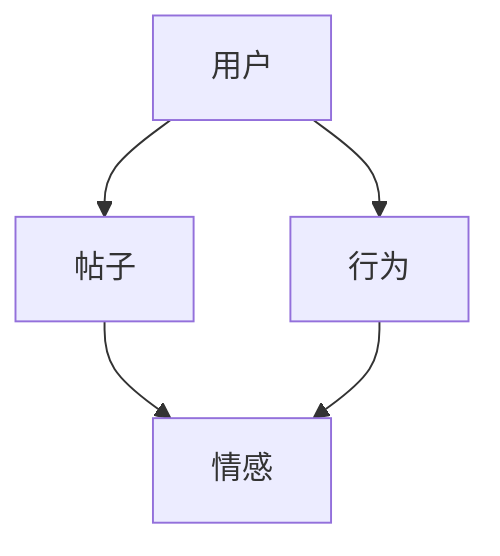

                 


# 深度学习分析社交媒体投资情绪

> 关键词：深度学习，社交媒体，投资情绪，情感分析，自然语言处理，用户行为分析

> 摘要：本文深入探讨了如何利用深度学习技术分析社交媒体上的投资情绪。通过结合情感分类和用户行为分析，我们展示了如何从社交媒体数据中提取有价值的市场情绪信号，为投资者提供决策支持。文章详细介绍了深度学习模型（如LSTM和BERT）的原理，系统架构设计，以及实际项目实现，帮助读者全面理解这一领域的技术应用。

---

## 第一章: 社交媒体与投资情绪分析概述

### 1.1 投资情绪分析的背景与意义

#### 1.1.1 投资情绪分析的背景
社交媒体的兴起使得投资者能够实时分享观点、分析市场趋势。这些海量的用户生成内容（UGC）蕴含着丰富的市场情绪信息。然而，如何有效提取这些信息并转化为投资决策的依据，成为数据科学家和投资者关注的焦点。

#### 1.1.2 投资情绪分析的意义
投资情绪分析可以帮助投资者识别市场趋势、发现潜在风险，并做出更明智的投资决策。通过分析社交媒体上的用户情绪，机构投资者可以提前预判市场的波动，制定更有效的交易策略。

#### 1.1.3 社交媒体在投资分析中的作用
社交媒体不仅是信息传播的平台，更是情绪传播的载体。投资者的情绪通过帖子、评论等形式传播，形成市场共识或分歧，这些情绪信号对市场价格有显著影响。

---

### 1.2 情绪分析的核心概念

#### 1.2.1 情绪分析的定义
情绪分析是通过自然语言处理技术，对文本中的情感倾向进行分类的过程。在投资领域，情绪分析用于识别社交媒体上的乐观、悲观或中立情绪。

#### 1.2.2 投资情绪的分类
投资情绪可以分为以下几类：
- 乐观情绪：用户表达对市场前景的积极看法。
- 悲观情绪：用户表达对市场前景的消极看法。
- 中立情绪：用户表达无明显倾向的观点。

#### 1.2.3 情绪分析的边界与外延
情绪分析的边界包括：
- 数据范围：仅限于社交媒体数据。
- 分析范围：主要关注投资相关的话题。
- 时间范围：通常分析近期数据，以捕捉最新的市场情绪。

---

## 第二章: 深度学习与投资情绪分析

### 2.1 深度学习的背景与特点

#### 2.1.1 深度学习的定义
深度学习是一种基于人工神经网络的机器学习方法，通过多层非线性变换来学习数据的高层次特征。

#### 2.1.2 深度学习的核心特点
- **非线性特征提取**：能够捕捉数据中的复杂模式。
- **自动特征学习**：无需手动提取特征。
- **高容错性**：对噪声数据有较强的鲁棒性。

#### 2.1.3 深度学习与传统机器学习的区别
| 特性               | 深度学习                            | 传统机器学习                        |
|--------------------|------------------------------------|-------------------------------------|
| 特征提取           | 自动提取复杂特征                   | 需要手动提取简单特征                 |
| 模型复杂度         | 高复杂度模型                       | 低复杂度模型                        |
| 数据需求           | 需要大量标注数据                   | 数据量需求较低                      |

---

### 2.2 投资情绪分析中的深度学习应用

#### 2.2.1 情感分类在投资分析中的应用
- **市场情绪预测**：通过分析社交媒体上的文本，预测市场的涨跌趋势。
- **情绪强度分析**：量化用户情绪的强度，帮助投资者评估市场的热情程度。

#### 2.2.2 用户行为分析在投资情绪中的作用
- **用户互动分析**：通过分析用户的点赞、评论、分享行为，评估其情绪态度。
- **用户影响力分析**：识别具有影响力的用户，分析其观点对市场情绪的影响。

#### 2.2.3 深度学习在社交媒体数据处理中的优势
- **自动处理非结构化数据**：深度学习能够自动处理社交媒体中的文本、图片等非结构化数据。
- **捕捉隐含情绪**：通过学习用户的历史行为和文本，深度学习可以捕捉到隐含的情绪信号。

---

## 第三章: 核心概念与联系

### 3.1 投资情绪分析的原理

#### 3.1.1 情感分类的原理
情感分类通过训练模型，识别文本中的情感倾向。常用的深度学习模型包括LSTM、GRU和BERT。

#### 3.1.2 用户行为分析的原理
用户行为分析通过统计用户的互动数据，推断其情绪态度。常用的方法包括网络分析和聚类分析。

#### 3.1.3 深度学习在其中的作用
深度学习通过自动学习特征，提升情感分类和用户行为分析的准确性。

---

### 3.2 核心概念对比

#### 3.2.1 情感分类与用户行为分析的对比
| 维度               | 情感分类                            | 用户行为分析                        |
|--------------------|------------------------------------|-------------------------------------|
| 数据类型           | 文本数据                            | 行为数据（点赞、评论等）            |
| 分析目标           | 情感倾向                            | 用户互动态度                        |
| 挑战               | 文本歧义性                           | 数据稀疏性                          |

#### 3.2.2 深度学习与其他情感分析方法的对比
| 维度               | 深度学习                            | 传统机器学习                        |
|--------------------|------------------------------------|-------------------------------------|
| 模型复杂度         | 高复杂度                            | 低复杂度                            |
| 特征提取           | 自动提取                            | 手动提取                            |
| 数据需求           | 大量标注数据                        | 较少标注数据                        |

---

### 3.3 ER实体关系图



---

## 第四章: 算法原理讲解

### 4.1 情感分类算法

#### 4.1.1 LSTM模型


LSTM（长短期记忆网络）通过门控机制，有效捕捉文本中的长距离依赖关系。以下是LSTM的门控机制：

- **遗忘门**：$f_t = \sigma(w_f a_t-1 + u_f x_t)$
- **输入门**：$i_t = \sigma(w_i a_t-1 + u_i x_t)$
- **细胞状态更新**：$o_t = tanh(w_o a_t-1 + u_o x_t)$
- **输出门**：$a_t = f_t \cdot a_t + i_t \cdot o_t$

其中，$a_t$为当前细胞状态，$x_t$为当前输入，$a_t-1$为前一时刻的细胞状态。

#### 4.1.2 BERT模型


BERT（双向Transformer）通过自注意力机制，捕捉文本中的全局依赖关系。自注意力机制的计算公式为：

$$
\text{Attention}(Q, K, V) = \text{softmax}\left(\frac{QK^T}{\sqrt{d_k}}\right)V
$$

其中，$Q$为查询向量，$K$为键向量，$V$为值向量，$d_k$为向量维度。

---

## 第五章: 数学模型

### 5.1 LSTM模型的数学公式

$$
f_t = \sigma(w_f a_t-1 + u_f x_t)
$$

其中，$\sigma$为sigmoid函数，$w_f$和$u_f$为权重参数，$a_t-1$为前一时刻的细胞状态，$x_t$为当前输入。

### 5.2 BERT模型的数学公式

$$
\text{Attention}(Q, K, V) = \text{softmax}\left(\frac{QK^T}{\sqrt{d_k}}\right)V
$$

其中，$Q$、$K$、$V$分别为查询、键、值向量，$\sqrt{d_k}$为归一化因子。

---

## 第六章: 系统分析与架构设计

### 6.1 系统功能设计

- **数据采集**：从社交媒体平台获取相关文本数据。
- **数据预处理**：清洗数据，提取关键词和用户信息。
- **模型训练**：使用深度学习模型进行情感分类和用户行为分析。
- **结果展示**：将分析结果可视化，提供给投资者参考。

### 6.2 系统架构设计


---

## 第七章: 项目实战

### 7.1 环境安装

安装Python和相关库：

```bash
pip install numpy pandas keras tensorflow transformers
```

### 7.2 核心实现

以下是LSTM模型的Python代码示例：

```python
import numpy as np
from tensorflow.keras.models import Sequential
from tensorflow.keras.layers import LSTM, Dense, Embedding

model = Sequential()
model.add(Embedding(input_dim=10000, output_dim=64, input_length=50))
model.add(LSTM(64, return_sequences=True))
model.add(LSTM(32))
model.add(Dense(1, activation='sigmoid'))
model.compile(loss='binary_crossentropy', optimizer='adam', metrics=['accuracy'])
model.summary()
```

### 7.3 案例分析

分析某段时间内的市场情绪变化，识别市场趋势。

---

## 第八章: 总结与展望

### 8.1 总结

本文详细介绍了如何利用深度学习技术分析社交媒体上的投资情绪，展示了从数据采集、模型训练到结果展示的完整流程。

### 8.2 未来展望

- **模型优化**：探索更高效的深度学习模型，如Transformer。
- **多模态分析**：结合文本、图像等多种数据源进行分析。
- **实时分析**：提升系统的实时性，支持高频交易。

---

## 作者

作者：AI天才研究院/AI Genius Institute  
联系邮箱：contact@aicourse.com  

---

**附录**：更多关于深度学习和自然语言处理的参考资料。

