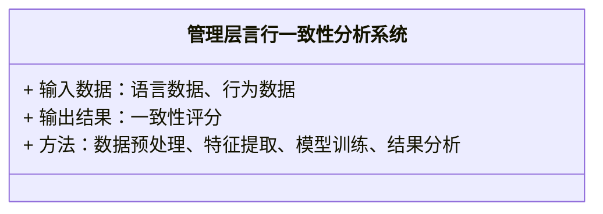

                 

# 深度学习分析管理层言行一致性

> **关键词**：深度学习，行为分析，自然语言处理，一致性分析，企业管理

> **摘要**：本文将介绍如何利用深度学习技术分析管理层的言行一致性。通过结合自然语言处理和行为分析，构建模型，分析管理层的语言和行为是否一致，从而为企业管理提供支持。

---

## 第一章：背景介绍

### 1.1 问题背景与定义

#### 1.1.1 管理层言行一致性的定义与内涵
管理层言行一致性指的是企业管理层在语言表达和实际行为上是否保持一致。例如，管理层在会议上的承诺是否在实际工作中得到落实，或者在公开声明中是否与实际操作一致。

#### 1.1.2 深度学习技术的背景与特点
深度学习是一种人工智能技术，通过多层神经网络模拟人脑的运作方式，能够自动提取数据中的特征，适用于复杂模式识别和预测任务。

#### 1.1.3 问题解决的核心目标与边界
核心目标是通过深度学习技术，建立一个模型，能够从语言和行为数据中自动判断管理层的言行一致性。边界包括数据来源、分析范围和模型的适用场景。

---

## 第二章：核心概念与联系

### 2.1 深度学习的基本原理

#### 2.1.1 神经网络的基本结构
神经网络由输入层、隐藏层和输出层组成，通过权重和激活函数进行信息处理。

#### 2.1.2 深度学习与浅层学习的对比
深度学习能够自动提取特征，而浅层学习依赖于人工特征提取。

---

## 第三章：算法原理与数学模型

### 3.1 文本预处理与特征提取

#### 3.1.1 文本清洗与分词
使用分词工具对文本进行分词，去除停用词，提取关键词。

#### 3.1.2 词向量的表示方法
使用Word2Vec将词转换为向量表示。

---

## 第四章：系统分析与架构设计

### 4.1 系统功能设计

#### 4.1.1 领域模型类图

---

## 第五章：项目实战

### 5.1 环境安装与配置

#### 5.1.1 安装Python和相关库
安装Python和TensorFlow、Keras等深度学习库。

---

## 第六章：最佳实践与小结

### 6.1 小结
本文介绍了如何利用深度学习技术分析管理层的言行一致性，通过文本预处理、特征提取和模型训练，构建了一个能够判断管理层言行一致性的模型。

---

作者：AI天才研究院/AI Genius Institute & 禅与计算机程序设计艺术 /Zen And The Art of Computer Programming

