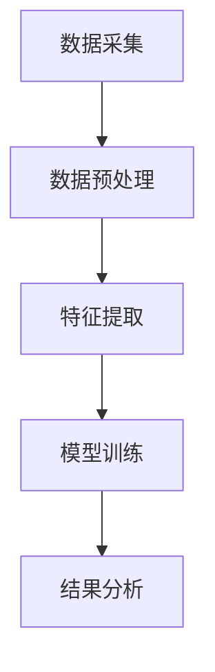

                 


# 深度学习在公司估值中的应用

> 关键词：深度学习、公司估值、神经网络、RNN、CNN、XGBoost

> 摘要：深度学习作为一种强大的人工智能技术，正在逐步改变传统金融领域的估值方式。本文将从公司估值的基本概念出发，详细探讨深度学习在公司估值中的应用，包括深度学习模型的原理、算法选择、系统设计以及项目实战等。通过本文的学习，读者将能够掌握如何利用深度学习技术来提高公司估值的准确性和效率。

---

## 第一部分: 公司估值与深度学习基础

### 第1章: 公司估值的基本概念

#### 1.1 公司估值的定义与方法

公司估值是通过对公司财务状况、市场地位、成长潜力等多方面因素的综合分析，估算出公司价值的过程。传统上，公司估值主要依赖于财务指标（如市盈率、市净率）和行业经验，这种方法虽然简单，但也存在主观性强、难以捕捉复杂市场规律的缺点。

- **传统估值方法**：
  - 市盈率法：基于公司的市盈率和行业平均市盈率进行估值。
  - 市净率法：基于公司的市净率和行业平均市净率进行估值。
  - 股权自由现金流模型：通过预测公司未来现金流折现来估算公司价值。

- **深度学习在估值中的优势**：
  - 可以处理高维、非线性的数据。
  - 能够自动提取特征，减少人工干预。
  - 能够捕捉传统方法难以察觉的市场规律。

#### 1.2 深度学习的基础知识

- **神经网络的基本原理**：
  - 神经网络是由多个神经元组成的网络，模拟人脑的结构和功能。
  - 神经元之间通过权重连接，输入数据经过非线性激活函数处理后输出结果。
  - 常见的神经网络结构包括卷积神经网络（CNN）、循环神经网络（RNN）和长短期记忆网络（LSTM）。

- **深度学习的核心算法**：
  - **RNN**：适用于处理时间序列数据，如股票价格波动。
  - **CNN**：适用于处理图像和文本数据，如公司财务报表的图像化特征。
  - **XGBoost**：一种强大的树模型，常用于特征工程和预测任务。

### 第2章: 深度学习在公司估值中的应用

#### 2.1 深度学习模型的选择

- **RNN在时间序列数据中的应用**：
  - RNN适用于处理股票价格、财务数据等时间序列数据。
  - LSTM（长短期记忆网络）是RNN的一种变体，特别适合处理长期依赖问题。

- **CNN在非结构化数据中的应用**：
  - CNN适用于处理图像数据，如公司财务报表的图像化特征提取。
  - 通过卷积操作，CNN可以自动提取图像中的特征。

- **XGBoost在特征工程中的应用**：
  - XGBoost是一种强大的树模型，适合处理高维数据。
  - 通过特征重要性分析，可以找到影响公司估值的关键因素。

#### 2.2 深度学习模型的训练与优化

- **模型训练流程**：
  1. 数据预处理：清洗数据，处理缺失值和异常值。
  2. 特征工程：提取有用的特征，进行特征组合和降维。
  3. 模型训练：选择合适的模型，调整超参数。
  4. 模型评估：通过交叉验证和指标评估模型性能。

- **模型调参与优化**：
  - 超参数优化：使用网格搜索或随机搜索优化模型的超参数。
  - 正则化：通过L1/L2正则化防止过拟合。
  - 数据增强：通过增加数据多样性提高模型泛化能力。

---

## 第二部分: 深度学习模型的算法原理

### 第3章: RNN模型的算法原理

#### 3.1 RNN的基本原理

- RNN是一种处理序列数据的神经网络，其核心思想是通过循环结构传递当前状态到下一个状态。
- 状态转移公式：
  $$
  s_t = \sigma(W_{s} s_{t-1} + W_{x} x_t)
  $$
  其中，$s_t$ 是当前状态，$x_t$ 是输入数据，$\sigma$ 是激活函数。

#### 3.2 LSTM的结构与优势

- LSTM是一种改进的RNN，通过引入记忆单元（Cell）和遗忘门（Forget Gate）来解决长期依赖问题。
- 遗忘门公式：
  $$
  f_t = \sigma(W_f \cdot [s_{t-1}, x_t])
  $$
- 输入门公式：
  $$
  i_t = \sigma(W_i \cdot [s_{t-1}, x_t])
  $$
- 记忆单元更新公式：
  $$
  c_t = f_t \cdot c_{t-1} + i_t \cdot tanh(W_c \cdot [s_{t-1}, x_t])
  $$

---

## 第三部分: 系统分析与架构设计方案

### 第4章: 系统架构设计

#### 4.1 系统功能设计

- 数据采集模块：负责收集公司的财务数据、市场数据和行业数据。
- 特征工程模块：对数据进行预处理和特征提取。
- 模型训练模块：选择合适的深度学习模型进行训练和优化。
- 结果分析模块：对模型输出的结果进行分析和可视化。

#### 4.2 系统架构图



#### 4.3 系统接口设计

- 数据接口：与数据源（如数据库或API）对接，获取实时数据。
- 模型接口：与前端或第三方系统对接，提供估值结果。

---

## 第四部分: 项目实战

### 第5章: 项目实战

#### 5.1 环境配置

- 安装必要的库：
  ```bash
  pip install numpy pandas scikit-learn keras tensorflow
  ```

#### 5.2 核心代码实现

- 数据预处理：
  ```python
  import pandas as pd
  import numpy as np

  # 读取数据
  df = pd.read_csv('company_data.csv')

  # 数据清洗
  df.dropna(inplace=True)
  ```

- 模型训练：
  ```python
  from tensorflow.keras.models import Sequential
  from tensorflow.keras.layers import LSTM, Dense

  model = Sequential()
  model.add(LSTM(64, input_shape=(timesteps, features)))
  model.add(Dense(1))
  model.compile(optimizer='adam', loss='mean_squared_error')
  model.fit(X_train, y_train, epochs=10, batch_size=32)
  ```

---

## 第五部分: 总结与展望

### 第6章: 总结与展望

#### 6.1 总结

深度学习在公司估值中的应用展示了其强大的数据处理能力和预测能力。通过深度学习模型，可以更准确地捕捉市场规律，提高估值的效率和准确性。

#### 6.2 展望

随着深度学习技术的不断发展，未来在公司估值中将会有更多的应用场景。例如，结合自然语言处理技术，可以从公司新闻和社交媒体中提取情感因素，进一步提高估值的准确性。

---

## 作者：AI天才研究院/AI Genius Institute & 禅与计算机程序设计艺术 /Zen And The Art of Computer Programming

