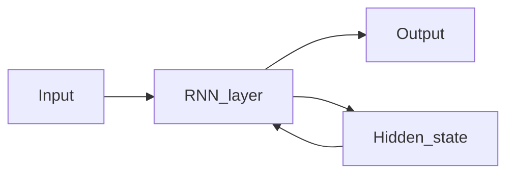
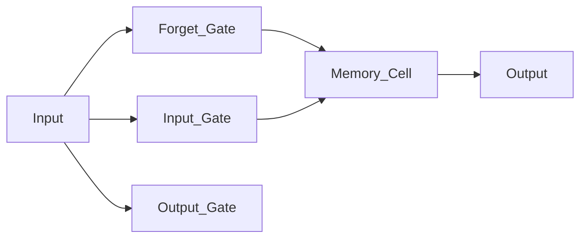

                 


# 深度学习预测公司创新突破概率

> 关键词：深度学习，创新预测，公司突破概率，循环神经网络，长短期记忆网络

> 摘要：本文将详细探讨如何利用深度学习技术，特别是循环神经网络（RNN）和长短期记忆网络（LSTM），来预测公司创新突破的概率。通过分析企业的历史数据和市场环境，我们构建了一个数学模型，利用这些模型来预测企业未来的创新潜力。文章将从背景介绍、核心概念、算法原理、系统设计、项目实战等多个方面展开，结合实际案例，深入分析深度学习在企业创新预测中的应用。

---

## 第一部分：背景与核心概念

### 第1章：问题背景与描述

#### 1.1 创新与企业发展的关系
企业的创新是推动经济增长和社会进步的核心动力。创新不仅体现在产品和服务的改进上，还包括管理模式、技术应用和市场策略的创新。创新能力强的企业通常能够更快地适应市场变化，抓住机遇，从而在竞争中占据优势。

#### 1.2 创新预测的挑战与意义
创新预测的目的是为了帮助企业提前识别潜在的创新机会和风险，从而制定更有效的战略规划。然而，创新预测面临以下挑战：
- **数据多样性**：创新受多种因素影响，包括技术、市场、管理等多个维度。
- **数据稀疏性**：某些企业的创新数据可能不够丰富，尤其是在早期阶段。
- **动态变化**：市场环境和技术进步不断变化，模型需要具备一定的适应性。

创新预测的意义在于帮助企业优化资源配置，提高创新效率，降低创新风险。

#### 1.3 深度学习在创新预测中的优势
深度学习是一种基于人工神经网络的机器学习方法，具有以下优势：
- **非线性建模能力**：深度学习能够捕捉数据中的非线性关系，适合处理复杂的创新问题。
- **特征提取能力**：深度学习可以从原始数据中自动提取有用的特征，减少人工特征工程的工作量。
- **容错性**：深度学习能够处理噪声数据，具有一定的鲁棒性。

### 第2章：创新突破概率的定义与核心要素

#### 2.1 创新突破概率的定义
创新突破概率是指企业在未来一段时间内实现重大创新的概率。这个概率通常基于企业的历史数据和当前的市场环境进行预测。

#### 2.2 创新预测的核心要素
- **企业特征**：包括企业的规模、研发投入、员工数量、专利数量等。
- **市场环境**：包括行业竞争状况、市场需求、政策环境等。
- **历史创新记录**：包括企业过去的创新成果和创新周期。

#### 2.3 创新预测的影响因素
- **技术积累**：企业是否在某个技术领域有深厚的技术储备。
- **研发投入**：企业的研发投入占总收入的比例。
- **管理能力**：企业的管理团队是否具备创新能力。
- **外部合作**：企业是否与其他机构或企业有合作。

### 第3章：创新预测的核心概念与联系

#### 3.1 核心概念原理
创新预测的核心在于将企业的创新潜力转化为一个概率问题。通过深度学习模型，我们可以将企业的历史数据和市场环境转化为一个概率值，从而帮助企业做出决策。

#### 3.2 创新预测的核心要素对比
| 核心要素       | 影响因素                | 数据来源                 |
|----------------|-------------------------|--------------------------|
| 企业特征       | 规模、研发投入、专利数量 | 企业财务报表、专利数据库 |
| 市场环境       | 行业竞争、市场需求     | 行业报告、市场调研数据   |
| 历史创新记录   | 过去的创新成果         | 企业历史数据             |

#### 3.3 实体关系图
```mermaid
er
  company --(属于)-> industry
  company --(拥有)-> innovation_feature
  company --(影响)-> market_environment
  company --(驱动)-> innovation_probability
```

---

## 第二部分：算法原理

### 第4章：循环神经网络（RNN）与长短期记忆网络（LSTM）

#### 4.1 循环神经网络（RNN）的工作原理
RNN是一种用于处理序列数据的神经网络。其核心思想是通过一个隐藏层来捕捉序列中的时序关系。RNN的结构如下：



RNN的数学表达式为：
$$ y_t = \sigma(W_{yx}x_t + W_{yh}h_{t-1} + b_y) $$
$$ h_t = \sigma(W_{hh}h_{t-1} + W_{hx}x_t + b_h) $$

#### 4.2 长短期记忆网络（LSTM）的工作原理
LSTM是一种改进的RNN，通过引入记忆单元（Memory Cell）和遗忘门（Forget Gate）来解决RNN中长期依赖的问题。LSTM的结构如下：



LSTM的数学表达式为：
$$ f_t = \sigma(W_{f}x_t + W_{fh}h_{t-1} + b_f) $$
$$ i_t = \sigma(W_{i}x_t + W_{ih}h_{t-1} + b_i) $$
$$ o_t = \sigma(W_{o}x_t + W_{oh}h_{t-1} + b_o) $$
$$ c_t = f_t \cdot c_{t-1} + i_t \cdot tanh(W_{c}x_t + W_{ch}h_{t-1} + b_c) $$
$$ h_t = o_t \cdot tanh(c_t) $$

#### 4.3 深度学习模型的数学模型与公式
创新突破概率的预测模型可以表示为：
$$ P(innovation) = f(X) $$
其中，$X$ 是企业的创新特征向量，$f$ 是深度学习模型。

---

## 第三部分：系统分析与架构设计

### 第5章：系统设计与架构

#### 5.1 项目介绍与需求分析
我们的目标是构建一个基于深度学习的创新预测系统。系统需要完成以下任务：
- 数据采集：收集企业的历史数据和市场环境数据。
- 特征提取：从数据中提取有用的特征。
- 模型训练：训练深度学习模型。
- 结果展示：输出创新概率。

#### 5.2 系统功能设计
- 数据采集模块：从数据库中获取企业的历史数据和市场环境数据。
- 特征提取模块：将数据转换为模型输入的特征向量。
- 模型训练模块：训练深度学习模型。
- 结果展示模块：输出企业的创新概率。

#### 5.3 系统架构设计


---

## 第四部分：项目实战

### 第6章：项目实施与代码实现

#### 6.1 环境搭建
- 安装Python和深度学习框架（如TensorFlow或Keras）。
- 安装数据处理库（如Pandas、NumPy）。

#### 6.2 数据处理与特征工程
- 数据清洗：处理缺失值和异常值。
- 数据转换：将数据转换为模型输入的格式。

#### 6.3 模型实现
- 编写RNN或LSTM模型的代码。
- 训练模型并评估性能。

#### 6.4 案例分析
通过实际案例分析，展示模型的预测结果和效果。

---

## 第五部分：最佳实践与小结

### 第7章：总结与建议

#### 7.1 最佳实践
- 数据预处理是关键，确保数据质量。
- 选择合适的模型和参数，避免过拟合。
- 定期更新模型，适应市场变化。

#### 7.2 小结
深度学习在创新预测中的应用具有巨大的潜力。通过构建合适的模型和优化算法，我们可以更准确地预测企业的创新突破概率，从而帮助企业制定更有效的战略。

---

## 参考文献

1. LeCun, Y., Bengio, Y., & Hinton, G. (2015). Deep learning. Nature, 521(7555), 436-444.
2. Hochreiter, S., & Schmidhuber, J. (1997). Long short-term memory. Neural computation, 9(8), 1735-1780.
3. Goodfellow, I., Bengio, Y., & Courville, A. (2016). Deep learning. MIT Press.

---

作者：AI天才研究院/AI Genius Institute & 禅与计算机程序设计艺术/Zen And The Art of Computer Programming

