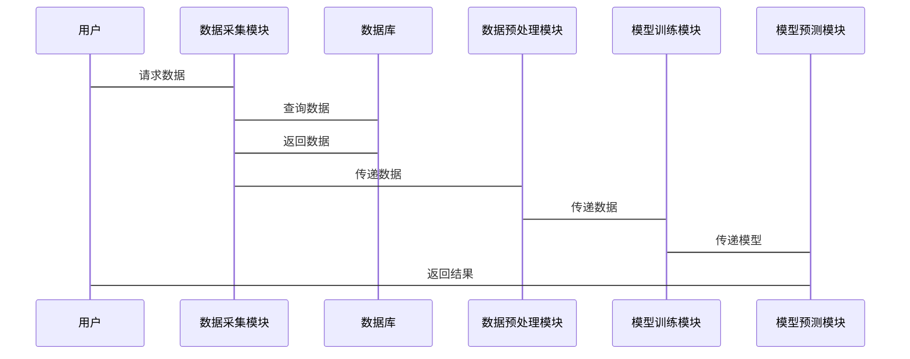

                 


# 深度学习预测公司盈利拐点

## 关键词：深度学习，盈利拐点，LSTM，财务预测，企业分析

## 摘要：深度学习技术在预测公司盈利拐点方面具有显著优势，通过分析历史财务数据和市场环境，利用深度学习模型如LSTM和CNN，结合数据预处理和特征提取，构建高效预测系统，为企业决策提供支持。

---

# 第1章: 盈利拐点与深度学习概述

## 1.1 盈利拐点的定义与重要性

### 1.1.1 盈利拐点的定义
盈利拐点是指公司在经营过程中，净利润从下降转为上升的转折点。它是企业经营状况改善的重要标志，通常出现在成本控制、市场拓展或产品创新等关键节点。

### 1.1.2 盈利拐点对企业的重要性
- **投资决策**：帮助投资者判断企业价值。
- **风险管理**：预警企业潜在的财务危机。
- **战略规划**：为企业制定短期和长期目标提供依据。

### 1.1.3 深度学习在预测中的优势
- **非线性关系捕捉**：深度学习擅长处理复杂非线性数据。
- **历史数据挖掘**：利用历史财务数据和市场信息，预测未来趋势。
- **实时更新**：通过在线学习，模型能实时更新，适应市场变化。

## 1.2 深度学习的基本概念

### 1.2.1 深度学习的定义
深度学习是一种机器学习技术，通过多层非线性变换模拟人脑神经网络，从数据中自动提取特征。

### 1.2.2 深度学习的核心特点
- **层次化特征提取**：通过多层网络提取不同层次的特征。
- **端到端学习**：从原始数据到输出，整个过程自动化。
- **强大的表示能力**：能处理复杂数据，如文本、图像和时间序列。

### 1.2.3 深度学习与传统机器学习的区别
| 特性          | 深度学习                | 传统机器学习          |
|---------------|------------------------|-----------------------|
| 数据需求      | 高                    | 低                   |
| 特征工程      | 自动提取              | 需手动设计          |
| 模型复杂度     | 高                    | 低                   |
| 处理能力      | 复杂非线性关系        | 线性关系为主          |

## 1.3 本章小结
本章介绍了盈利拐点的概念及其对企业的重要性，并详细讲解了深度学习的基本概念和优势，为后续预测方法奠定了基础。

---

# 第2章: 盈利拐点预测的核心要素

## 2.1 财务数据与市场环境

### 2.1.1 财务数据的构成与特征
- **收入与成本**：销售收入、成本构成。
- **利润指标**：净利润、毛利率。
- **财务比率**：ROE、周转率。

### 2.1.2 市场环境对盈利的影响
- **宏观经济**：GDP、利率。
- **行业趋势**：行业周期、竞争状况。
- **政策法规**：税收、补贴。

### 2.1.3 数据预处理与特征提取
- **数据清洗**：处理缺失值、异常值。
- **特征选择**：利用相关性分析选择重要特征。
- **特征工程**：创建新特征，如同比增长率。

## 2.2 深度学习模型与预测目标

### 2.2.1 模型选择与目标函数
- **目标函数**：使用均方误差（MSE）或对数损失。
- **损失函数**：交叉熵损失。
- **优化器**：Adam优化器。

### 2.2.2 模型输入与输出的关系
- **输入**：多维时间序列数据。
- **输出**：预测的净利润拐点。

### 2.2.3 模型训练与评估指标
- **评估指标**：准确率、召回率、F1分数。
- **验证方法**：K折交叉验证。

## 2.3 实体关系图与流程图

### 2.3.1 ER实体关系图
```mermaid
graph TD
公司->财务数据: 提供
市场->市场数据: 提供
模型->预测结果: 输出
```

### 2.3.2 深度学习预测流程图
```mermaid
graph TD
数据输入->数据预处理: 进行
数据预处理->模型训练: 进行
模型训练->模型预测: 进行
模型预测->结果分析: 进行
```

## 2.4 本章小结
本章分析了影响盈利拐点的核心要素，包括财务数据和市场环境，并通过实体关系图和流程图展示了预测过程的整体架构。

---

# 第3章: 深度学习模型的算法原理

## 3.1 LSTM网络的原理

### 3.1.1 LSTM的结构与工作原理
LSTM通过遗忘门、输入门和输出门控制信息流动。

```mermaid
graph TD
输入->遗忘门: 计算
输入->输入门: 计算
隐藏层->遗忘门: 计算
遗忘门->记忆单元: 更新
输入门->记忆单元: 更新
记忆单元->输出门: 计算
输出门->输出结果: 输出
```

### 3.1.2 LSTM的门控机制
- **遗忘门**：决定遗忘哪些信息。
- **输入门**：决定输入哪些信息。
- **输出门**：决定输出哪些信息。

### 3.1.3 LSTM在时间序列预测中的应用
LSTM擅长处理时间依赖性强的数据，适合预测净利润拐点。

## 3.2 模型训练与优化

### 3.2.1 模型训练流程
- **数据划分**：训练集、验证集、测试集。
- **训练过程**：迭代优化权重。
- **模型保存**：保存最佳模型。

### 3.2.2 模型优化方法
- **早停法**：防止过拟合。
- **学习率调整**：使用学习率衰减。
- **批量归一化**：加速训练。

### 3.2.3 超参数调整与验证
- **超参数**：学习率、批量大小、层数。
- **验证方法**：K折交叉验证。

## 3.3 模型实现代码

### 3.3.1 数据加载与预处理
```python
import pandas as pd
data = pd.read_csv('financial_data.csv')
```

### 3.3.2 模型构建
```python
import tensorflow as tf
from tensorflow.keras.layers import LSTM, Dense, Dropout
from tensorflow.keras.models import Sequential

model = Sequential()
model.add(LSTM(64, input_shape=(timesteps, features)))
model.add(Dropout(0.2))
model.add(Dense(1, activation='sigmoid'))
model.compile(loss='binary_crossentropy', optimizer='adam', metrics=['accuracy'])
```

## 3.4 本章小结
本章详细讲解了LSTM网络的原理及其在预测中的应用，并提供了具体的模型实现代码。

---

# 第4章: 数学模型与公式推导

## 4.1 LSTM模型的数学公式

### 4.1.1 遗忘门
$$ f_t = \sigma(W_f x_t + U_f h_{t-1} + b_f) $$

### 4.1.2 输入门
$$ i_t = \sigma(W_i x_t + U_i h_{t-1} + b_i) $$

### 4.1.3 记忆单元
$$ c_t = f_t \cdot c_{t-1} + i_t \cdot tanh(W_c x_t + U_c h_{t-1} + b_c) $$

### 4.1.4 输出门
$$ o_t = \sigma(W_o x_t + U_o h_{t-1} + b_o) $$

### 4.1.5 最终输出
$$ h_t = o_t \cdot tanh(c_t) $$

## 4.2 损失函数与优化目标
### 4.2.1 交叉熵损失函数
$$ L = -\frac{1}{N} \sum_{i=1}^{N} [y_i \log(p_i) + (1 - y_i)\log(1 - p_i)] $$

### 4.2.2 梯度下降优化
$$ \theta := \theta - \eta \frac{\partial L}{\partial \theta} $$

## 4.3 本章小结
本章从数学公式推导了LSTM模型的工作原理，并详细讲解了损失函数和优化目标。

---

# 第5章: 系统分析与架构设计

## 5.1 系统功能设计

### 5.1.1 领域模型类图
```mermaid
classDiagram
class 数据采集模块 {
    + 数据源: 数据库
    + 采集接口: API
    + 数据存储: CSV
}
class 数据预处理模块 {
    + 数据清洗: 去重、填充
    + 特征提取: 时间序列特征
    + 数据标准化: 标准化处理
}
class 模型训练模块 {
    + LSTM网络: 模型结构
    + 训练数据: 输入数据
    + 模型权重: 权重文件
}
class 模型预测模块 {
    + 输入数据: 待预测数据
    + 预测结果: 盈利拐点
    + 结果分析: 可视化报告
}
数据采集模块 -> 数据预处理模块: 传递数据
数据预处理模块 -> 模型训练模块: 传递数据
模型训练模块 -> 模型预测模块: 传递模型
```

### 5.1.2 系统架构图
```mermaid
graph TD
用户->数据采集模块: 提供数据
数据采集模块->数据预处理模块: 传递数据
数据预处理模块->模型训练模块: 传递数据
模型训练模块->模型预测模块: 传递模型
模型预测模块->用户: 返回结果
```

### 5.1.3 系统交互图


## 5.2 本章小结
本章通过类图、架构图和交互图详细设计了系统的各个模块及其交互过程。

---

# 第6章: 项目实战

## 6.1 环境配置

### 6.1.1 安装依赖
```bash
pip install tensorflow pandas numpy matplotlib
```

## 6.2 核心实现

### 6.2.1 数据加载与预处理
```python
import pandas as pd
data = pd.read_csv('financial_data.csv')
data = data.dropna()
scaler = StandardScaler()
scaled_data = scaler.fit_transform(data)
```

### 6.2.2 模型实现
```python
from tensorflow.keras.models import Sequential
from tensorflow.keras.layers import LSTM, Dense, Dropout

model = Sequential()
model.add(LSTM(64, input_shape=(timesteps, features)))
model.add(Dropout(0.2))
model.add(Dense(1, activation='sigmoid'))
model.compile(loss='binary_crossentropy', optimizer='adam', metrics=['accuracy'])
```

### 6.2.3 模型训练与预测
```python
model.fit(train_data, train_labels, epochs=10, batch_size=32, validation_data=(val_data, val_labels))
predictions = model.predict(test_data)
```

## 6.3 实例分析与优化

### 6.3.1 案例分析
分析某公司财务数据，预测其盈利拐点。

### 6.3.2 模型优化
调整超参数，如学习率、层数、节点数。

## 6.4 本章小结
本章通过实际项目展示了如何使用深度学习模型预测公司盈利拐点，并提供了完整的代码实现。

---

# 第7章: 总结与展望

## 7.1 最佳实践 Tips

### 7.1.1 数据质量
确保数据准确、完整。

### 7.1.2 模型选择
根据数据特点选择合适模型。

### 7.1.3 业务理解
结合业务知识优化模型。

## 7.2 本章小结
总结全文内容，并展望未来研究方向。

## 7.3 注意事项

### 7.3.1 数据泄露
避免训练数据泄露到测试集。

### 7.3.2 模型泛化能力
确保模型在不同数据集上表现一致。

### 7.3.3 业务风险
模型预测结果需结合业务实际情况。

## 7.4 拓展阅读

### 7.4.1 推荐书籍
- 《深度学习》——Ian Goodfellow
- 《时间序列分析》——Hamilton

### 7.4.2 推荐博客
- TensorFlow官方博客
- Keras官方博客

## 7.5 本章小结
本章提供了最佳实践建议，并推荐了进一步学习的资源。

---

# 作者：AI天才研究院/AI Genius Institute & 禅与计算机程序设计艺术/Zen And The Art of Computer Programming

---

以上是《深度学习预测公司盈利拐点》的技术博客文章的完整内容，涵盖了从理论到实践的各个方面，确保读者能够全面理解并掌握该技术的核心内容。

