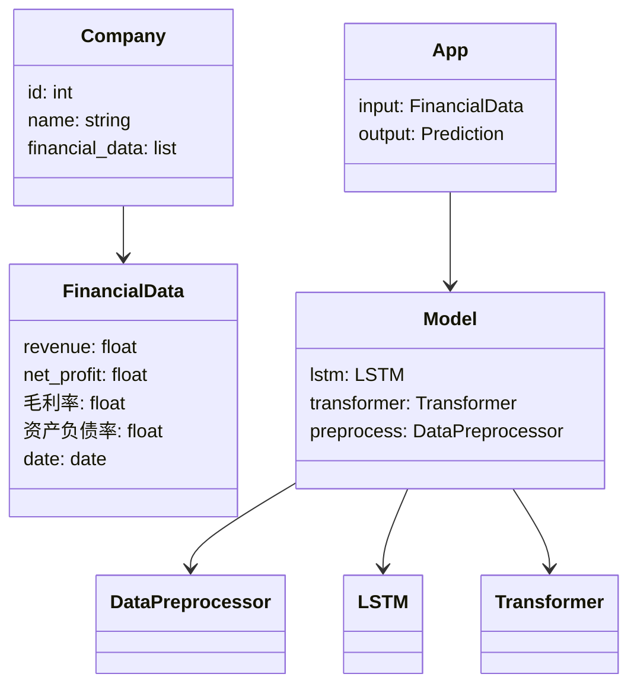
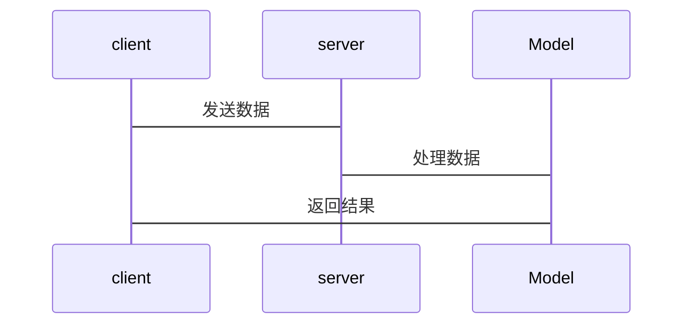

                 


# 深度学习预测公司盈利拐点时机

## 关键词：深度学习，盈利拐点，时间序列预测，LSTM，Transformer，财务指标分析

## 摘要：本文探讨如何利用深度学习技术，特别是LSTM和Transformer模型，来预测公司的盈利拐点。通过分析财务指标和时间序列数据，本文详细讲解了深度学习在金融预测中的应用，从算法原理到系统架构，再到项目实战，为读者提供了全面的指导。

---

# 第一部分: 深度学习预测公司盈利拐点的背景与核心概念

## 第1章: 深度学习预测公司盈利拐点的背景与问题定义

### 1.1 问题背景与重要性
#### 1.1.1 公司盈利拐点的定义与意义
公司盈利拐点是指公司在一段时间内从盈利下降到开始上升，或者从亏损转为盈利的关键时间点。这个拐点对投资者和管理层至关重要，因为它标志着公司财务状况的重大变化。及时预测拐点可以帮助投资者做出更明智的投资决策，避免重大损失或错失利润。

#### 1.1.2 深度学习在金融预测中的优势
深度学习通过处理大量非线性数据，能够捕捉复杂的模式和趋势。与传统统计方法相比，深度学习在处理时间序列数据时表现更优，尤其是在识别长期依赖关系方面。

#### 1.1.3 传统预测方法的局限性
传统方法如ARIMA和线性回归在处理复杂数据时表现有限，难以捕捉复杂的非线性关系和长周期依赖。

### 1.2 深度学习预测的定义与范围
#### 1.2.1 深度学习在时间序列预测中的应用
时间序列预测是深度学习的重要应用领域，特别是LSTM和Transformer模型在处理时间依赖关系方面表现出色。

#### 1.2.2 盈利拐点预测的核心要素
包括历史财务数据、市场趋势、行业动态和公司内部信息。模型需要结合这些因素，准确预测拐点。

#### 1.2.3 问题的边界与外延
本文主要关注公司级别的财务数据，后续章节将探讨模型的实现和优化。

### 1.3 本章小结
本章介绍了盈利拐点的重要性，深度学习的优势，以及后续章节的安排。

---

## 第2章: 深度学习预测的核心概念与联系

### 2.1 深度学习模型的核心原理
#### 2.1.1 神经网络的基本结构
神经网络由输入层、隐藏层和输出层组成，通过权重和激活函数传递信息。

#### 2.1.2 深度学习与传统机器学习的对比
深度学习无需手动特征提取，适合处理复杂数据。

#### 2.1.3 深度学习模型的训练过程
包括正向传播、计算损失和反向传播，使用梯度下降优化参数。

### 2.2 时间序列分析与深度学习的关系
#### 2.2.1 时间序列预测的基本概念
时间序列预测通过历史数据预测未来趋势。

#### 2.2.2 深度学习在时间序列预测中的应用
LSTM和Transformer模型广泛应用于时间序列预测。

#### 2.2.3 常用的时间序列模型对比
下表对比了RNN、LSTM、GRU和Transformer的特点：

| 模型 | 特点 | 优势 | 局限性 |
|------|------|------|--------|
| RNN  | 简单 | 易实现 | 长期依赖处理差 |
| LSTM | 增量门控 | 处理长期依赖 | 训练复杂 |
| GRU  | 合并遗忘和输出门 | 简化结构 | 性能略逊于LSTM |
| Transformer | 自注意力机制 | 并行处理 | 显存需求高 |

### 2.3 财务指标与公司盈利拐点的关系
#### 2.3.1 常用财务指标分析
关键指标包括净利润、营业收入、毛利率和资产负债率。

#### 2.3.2 盈利拐点预测的关键指标
净利润和营业收入的变化率是预测拐点的重要指标。

#### 2.3.3 财务指标与深度学习模型的结合
模型通过分析这些指标的时间序列数据，预测拐点。

### 2.4 核心概念关系图
公司、财务指标和深度学习模型的关系：

```mermaid
erd
    Company (公司)
    FinancialMetrics (财务指标)
    DeepLearningModel (深度学习模型)
    company --> FinancialMetrics: 包含
    company --> DeepLearningModel: 使用
```

---

## 第3章: 深度学习预测的算法原理

### 3.1 LSTM模型的结构与工作原理
#### 3.1.1 LSTM的门控机制
包括输入门、遗忘门和输出门，分别控制信息的流入、保留和流出。

#### 3.1.2 LSTM的数学模型
$$ f_t = \sigma(W_f \cdot [h_{t-1}, x_t] + b_f) $$
$$ i_t = \sigma(W_i \cdot [h_{t-1}, x_t] + b_i) $$
$$ o_t = \sigma(W_o \cdot [h_{t-1}, x_t] + b_o) $$
$$ c_t = f_t \cdot c_{t-1} + i_t \cdot tanh(W_c \cdot [h_{t-1}, x_t] + b_c) $$
$$ h_t = o_t \cdot tanh(c_t) $$

#### 3.1.3 LSTM的训练与优化
使用梯度下降优化，计算损失函数并反向传播。

### 3.2 Transformer模型的结构与工作原理
#### 3.2.1 Transformer的自注意力机制
$$ Q = x \cdot W_q $$
$$ K = x \cdot W_k $$
$$ V = x \cdot W_v $$
$$ \text{Attention}(Q, K, V) = \text{softmax}(\frac{QK^T}{\sqrt{d}}) V $$

#### 3.2.2 Transformer的前向网络
堆叠多个自注意力层和前馈网络层，增强模型表达能力。

#### 3.2.3 Transformer的训练与优化
使用Adam优化器和余弦衰减策略。

### 3.3 深度学习预测的数学模型
$$ y_t = f(x_{t-n}, x_{t-n+1}, ..., x_t) $$
其中，$x$表示输入特征，$y$表示预测值。

---

## 第4章: 深度学习预测的系统分析与架构设计

### 4.1 系统分析
#### 4.1.1 问题场景介绍
预测公司盈利拐点，输入历史财务数据，输出预测拐点和置信度。

#### 4.1.2 系统功能设计
领域模型包括数据层、模型层和应用层：



### 4.2 系统架构设计
#### 4.2.1 系统架构图


#### 4.2.2 接口设计
API接口定义：

```http
POST /predict
Content-Type: application/json

{
    "data": {
        "revenue": [100, 200, 300],
        "net_profit": [50, 100, 150]
    }
}
```

响应：

```json
{
    "prediction": "拐点在季度3",
    "confidence": 0.85
}
```

### 4.3 系统交互流程


---

## 第5章: 深度学习预测的项目实战

### 5.1 环境安装
安装Python、TensorFlow、Keras和必要的数据处理库。

### 5.2 核心代码实现
#### 5.2.1 数据预处理
```python
import pandas as pd
import numpy as np
from sklearn.preprocessing import MinMaxScaler

# 加载数据
df = pd.read_csv('financial_data.csv')

# 标准化处理
scaler = MinMaxScaler()
scaled_data = scaler.fit_transform(df[['revenue', 'net_profit']])
```

#### 5.2.2 模型构建
```python
from tensorflow.keras.models import Sequential
from tensorflow.keras.layers import LSTM, Dense, Dropout

model = Sequential()
model.add(LSTM(64, return_sequences=True, input_shape=(n_timesteps, n_features)))
model.add(Dropout(0.2))
model.add(LSTM(32, return_sequences=False))
model.add(Dense(1))
model.compile(loss='mean_squared_error', optimizer='adam')
```

#### 5.2.3 模型训练
```python
model.fit(X_train, y_train, epochs=50, batch_size=32, validation_split=0.2)
```

### 5.3 案例分析
使用实际公司数据，训练模型并分析预测结果。

### 5.4 总结与经验分享
预测结果的准确性受数据质量和模型调参的影响，需不断优化。

---

## 第6章: 最佳实践与小结

### 6.1 小结
本文详细讲解了深度学习预测公司盈利拐点的背景、核心概念、算法原理和系统设计。

### 6.2 注意事项
- 数据质量至关重要
- 模型调参需谨慎
- 预测结果需结合实际业务

### 6.3 扩展阅读
推荐相关书籍和资源，供读者深入学习。

---

## 作者：AI天才研究院 & 禅与计算机程序设计艺术

---

**摘要**：本文通过系统分析和详细讲解，展示了深度学习在预测公司盈利拐点中的应用。从算法原理到系统架构，再到项目实战，为读者提供了全面的指导，帮助他们理解和应用这些技术。

