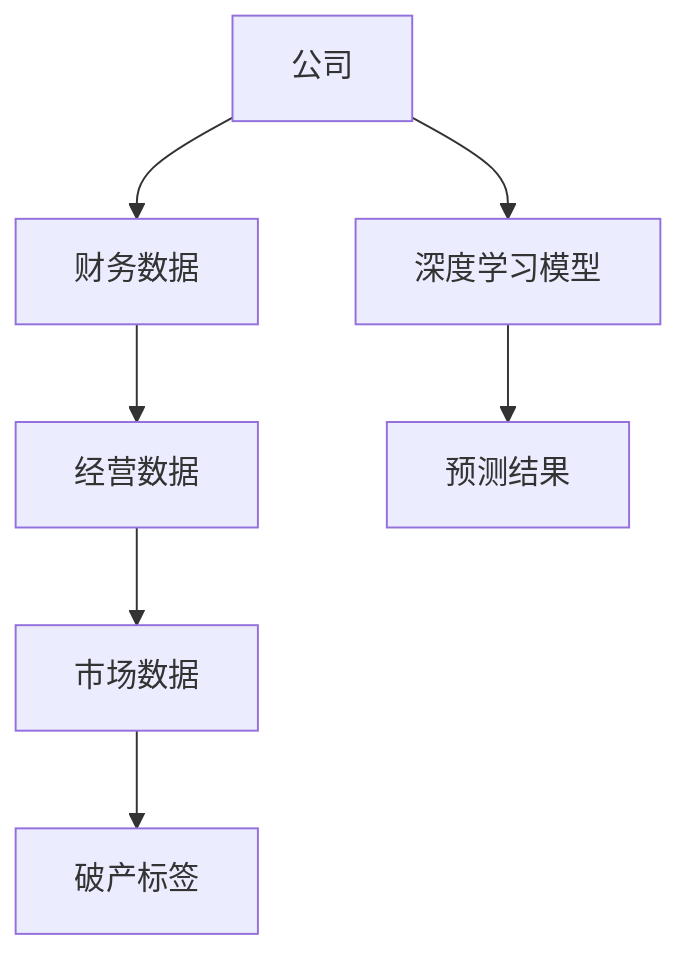
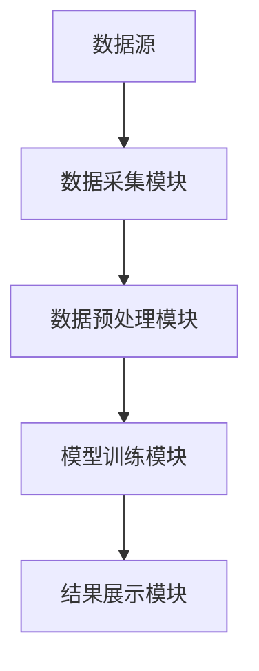
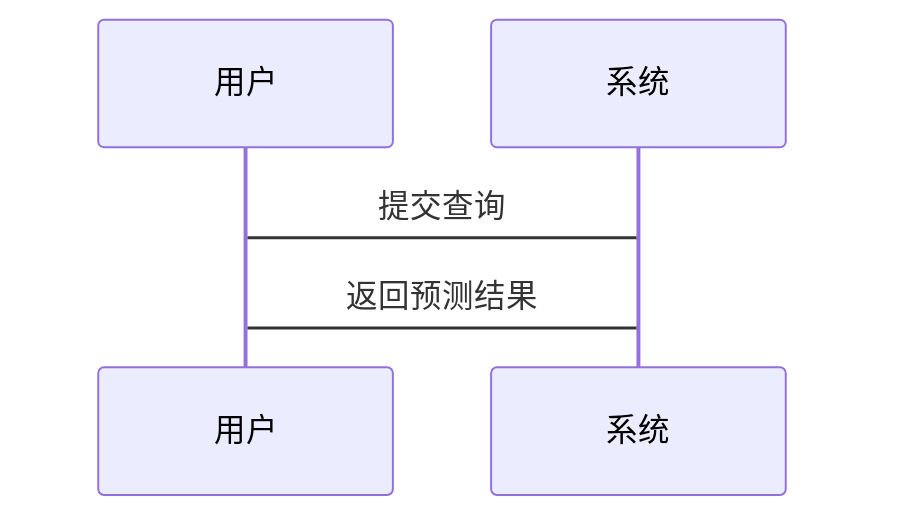

                 


# 深度学习预测公司破产风险

> 关键词：深度学习，公司破产，风险预测，神经网络，金融分析

> 摘要：本文探讨了如何利用深度学习技术预测公司破产风险。通过分析传统方法的局限性，介绍深度学习的优势，详细讲解算法原理，提供系统架构设计和项目实战案例，最后总结最佳实践。

---

## 第一部分: 深度学习预测公司破产风险的背景与概念

### 第1章: 公司破产风险预测的背景与问题描述

#### 1.1 公司破产风险预测的背景

- **破产风险预测的重要性**：企业破产不仅影响自身，还可能导致连锁反应，影响经济稳定。早期预测可以帮助企业及时调整策略，减少损失。
  
- **深度学习在金融领域的应用**：深度学习擅长处理非线性关系，适用于复杂金融数据的分析，如股票价格预测和信用评估。

- **解决方法**：传统方法依赖财务指标，但忽视了市场动态和非结构化数据。深度学习可以整合多源数据，提升预测准确性。

#### 1.2 深度学习在破产预测中的优势

- **特征学习能力**：深度学习自动提取特征，减少人工特征工程的需求。
  
- **处理非线性关系**：能捕捉复杂的市场动态和企业行为模式。

- **高维数据处理**：适合处理财务、市场和经营等多维数据。

#### 1.3 本书的研究目标与范围

- **研究目标**：开发一个基于深度学习的破产预测模型，评估其性能，并提供实际应用建议。
  
- **研究范围**：涵盖数据收集、模型训练、评估和部署。

- **意义与价值**：填补传统方法的不足，提供更准确的预测工具，支持企业决策。

### 第2章: 破产风险预测的核心概念与联系

#### 2.1 核心概念与原理

- **破产预测的定义与分类**：根据时间范围，分为短期和长期预测；根据数据类型，分为结构化和非结构化预测。

- **深度学习的基本原理**：通过多层神经网络，学习数据的高层次特征。

- **破产预测的核心要素**：财务健康状况、市场环境、企业行为等。

#### 2.2 核心概念与联系的对比分析

- **传统统计方法与深度学习对比**：

| 方法       | 优点                           | 缺点                           |
|------------|--------------------------------|--------------------------------|
| 传统统计   | 易解释，计算效率高             | 特征工程复杂，模型能力有限     |
| 深度学习   | 自动特征学习，能力强           | 需大量数据，计算资源消耗大     |

- **不同深度学习模型对比**：

| 模型       | 适合数据类型       | 优缺点                           |
|------------|--------------------|--------------------------------|
| RNN        | 时间序列数据       | 适合序列预测，但训练时间较长     |
| CNN        | 图像数据           | 适合结构化数据，但需要特定架构设计 |
| Transformer | 多模态数据         | 并行计算能力强，效果好           |

- **破产预测与信用评分的联系**：两者都需要分类模型，但破产预测涉及更多财务和市场因素。

#### 2.3 实体关系图与架构



---

## 第二部分: 深度学习算法原理与实现

### 第3章: 研究方法与模型选择

#### 3.1 传统统计模型

- **逻辑回归模型**：适用于二分类问题，输出概率。

- **线性判别分析**：通过线性组合区分类别。

- **随机森林模型**：集成学习，适合高维数据。

#### 3.2 深度学习模型

- **循环神经网络（RNN）**：适合处理时间序列数据，如季度财务报告。

- **卷积神经网络（CNN）**：适合处理结构化数据，提取局部特征。

- **Transformer模型**：采用自注意力机制，处理多模态数据。

#### 3.3 模型选择与优化

- **选择依据**：数据类型、计算资源和预测需求。

- **超参数优化**：使用网格搜索或随机搜索。

- **模型评估指标**：准确率、召回率、F1分数和AUC值。

### 第4章: 深度学习算法的数学模型与公式

#### 4.1 逻辑回归模型

- **概率函数**：$$ P(y=1|x) = \frac{e^{w^T x + b}}{1 + e^{w^T x + b}} $$

- **损失函数**：$$ L = -\sum_{i=1}^{n} [y_i \ln p_i + (1 - y_i) \ln (1 - p_i)] $$

#### 4.2 神经网络模型

- **网络结构**：$$ z = Wx + b $$

- **激活函数**：$$ a = \sigma(z) $$

---

## 第三部分: 系统分析与架构设计

### 第5章: 系统分析与架构设计

#### 5.1 项目背景介绍

- **目标**：构建一个实时破产风险监测系统。

- **关键需求**：数据获取、模型训练、结果展示。

#### 5.2 系统功能设计

- **数据采集模块**：收集财务、市场和经营数据。

- **数据预处理模块**：清洗、标准化和特征提取。

- **模型训练模块**：选择模型，调整参数。

- **结果展示模块**：可视化预测结果。

#### 5.3 系统架构设计



#### 5.4 系统接口设计

- **数据接口**：API获取实时数据。

- **模型接口**：接收输入，返回预测结果。

#### 5.5 系统交互流程图



---

## 第四部分: 项目实战

### 第6章: 项目实战

#### 6.1 环境安装

- **Python环境**：安装Python 3.8及以上。

- **库安装**：安装TensorFlow、Keras、Pandas和Scikit-learn。

#### 6.2 核心代码实现

- **数据预处理**：加载数据，处理缺失值和标准化。

  ```python
  import pandas as pd
  from sklearn.preprocessing import StandardScaler

  data = pd.read_csv('company_data.csv')
  scaler = StandardScaler()
  scaled_data = scaler.fit_transform(data)
  ```

- **模型构建**：定义深度学习模型。

  ```python
  import tensorflow as tf
  from tensorflow.keras import layers

  model = tf.keras.Sequential([
      layers.Dense(64, activation='relu'),
      layers.Dense(1, activation='sigmoid')
  ])
  ```

- **模型训练**：

  ```python
  model.compile(optimizer='adam', loss='binary_crossentropy', metrics=['accuracy'])
  model.fit(scaled_data, labels, epochs=10, batch_size=32)
  ```

- **结果评估**：使用混淆矩阵和分类报告。

  ```python
  from sklearn.metrics import classification_report

  y_pred = model.predict(scaled_data)
  print(classification_report(labels, y_pred.round()))
  ```

#### 6.3 案例分析

- **案例选择**：选择一家公司，分析其财务数据。

- **预测结果**：输出破产概率，解释结果。

- **结果解读**：分析模型预测的准确性，调整参数优化模型。

---

## 第五部分: 最佳实践与小结

### 第7章: 最佳实践与小结

#### 7.1 小结

- 深度学习在破产预测中表现出色，但需要大量数据和计算资源。

#### 7.2 注意事项

- 数据质量至关重要，需清洗和处理。

- 模型选择应根据数据类型和任务需求。

- 避免过拟合，使用交叉验证和正则化。

#### 7.3 拓展阅读

- 推荐学习《深度学习》（Ian Goodfellow）和《Python机器学习》（Aurélien Géron）。

---

## 作者

作者：AI天才研究院/AI Genius Institute & 禅与计算机程序设计艺术/Zen And The Art of Computer Programming

---

这篇文章详细介绍了深度学习在公司破产风险预测中的应用，从背景、算法原理到系统设计和项目实战，提供了全面的指导和实践案例，帮助读者理解和应用这些技术。

