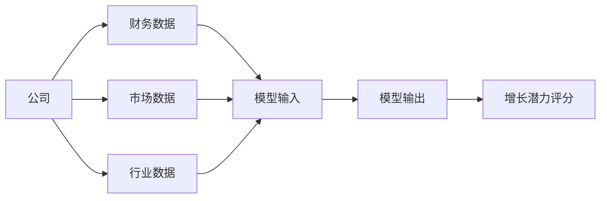
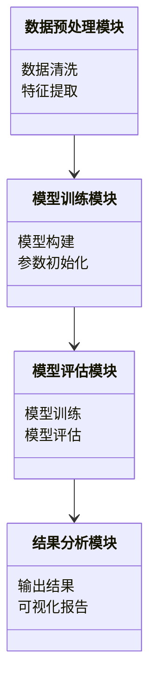
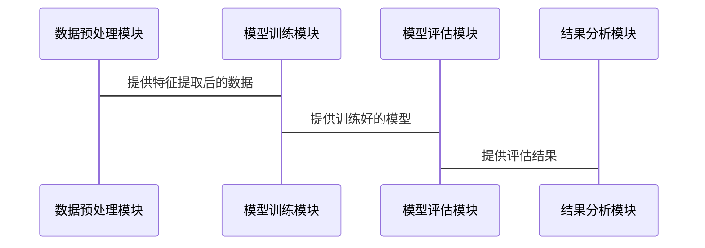

                 


# 深度学习预测公司长期增长潜力

## 关键词
- 深度学习
- 公司增长潜力
- 金融预测
- 时间序列分析
- LSTM
- 机器学习

## 摘要
深度学习作为一种强大的人工智能技术，近年来在金融领域的应用取得了显著成果。本文将深入探讨如何利用深度学习模型预测公司长期增长潜力。通过分析公司财务数据、市场数据和行业数据，结合深度学习算法，如LSTM和Transformer，构建有效的预测模型。文章从背景介绍、核心概念、算法原理、系统设计到实际案例分析，全面解析深度学习在公司增长潜力预测中的应用，为读者提供理论与实践相结合的指导。

---

# 第一部分: 深度学习预测公司长期增长潜力的背景与核心概念

## 第1章: 公司长期增长潜力预测的背景与问题描述

### 1.1 问题背景
#### 1.1.1 公司增长潜力预测的重要性
公司增长潜力是企业价值评估的核心指标之一，它反映了企业在未来一段时间内的盈利能力、市场扩展能力和竞争优势。准确预测公司增长潜力，有助于投资者、企业管理者和分析师做出更明智的决策，例如投资决策、战略规划和风险控制。

#### 1.1.2 深度学习在金融预测中的优势
传统的公司增长潜力预测方法主要依赖财务指标分析和专家经验，但这种方法存在主观性强、数据维度有限、预测精度不足等问题。深度学习通过从海量数据中提取非线性特征，能够捕捉传统方法难以发现的复杂模式，从而提高预测的准确性和可靠性。

#### 1.1.3 当前传统方法的局限性
- 数据维度有限：传统方法主要依赖财务数据，忽略了市场、行业和社会等多方面的影响因素。
- 预测精度不足：传统统计模型难以处理高维、非线性数据，导致预测结果不够准确。
- 人工经验依赖：传统方法 heavily relies on experts' judgment，存在主观性和不确定性。

### 1.2 问题描述
#### 1.2.1 公司增长潜力的定义
公司增长潜力是指公司在未来一定时间内实现收入、利润和市场份额增长的能力。它不仅取决于财务表现，还受到市场环境、行业趋势、管理团队和技术创新等因素的影响。

#### 1.2.2 影响公司增长潜力的关键因素
- 财务数据：收入增长率、净利润率、资产负债率等。
- 市场数据：行业竞争状况、市场需求、政策环境等。
- 公司基本面：管理团队、技术创新、供应链能力等。
- 宏观经济因素：GDP增长率、通货膨胀率、利率等。

#### 1.2.3 深度学习预测的目标与范围
深度学习的目标是通过分析历史数据，预测公司在未来一段时间内的增长潜力评分，并为投资决策提供支持。范围包括数据收集、模型训练、结果分析和可视化。

### 1.3 本章小结
本章介绍了公司增长潜力预测的重要性、深度学习在其中的优势以及传统方法的局限性。通过定义和分析影响增长潜力的关键因素，明确了深度学习预测的目标与范围，为后续章节的分析奠定了基础。

---

## 第2章: 深度学习的核心概念与联系

### 2.1 深度学习的基本原理
#### 2.1.1 神经网络的结构与功能
神经网络是由多个层次构成的人工神经网络，每个节点代表一个神经元，通过权重和激活函数进行信息处理。深度学习通过增加网络的深度，提高了模型的表达能力。

#### 2.1.2 深度学习与传统机器学习的区别
- 数据依赖性：深度学习需要大量数据，传统机器学习对数据量要求较低。
- 特征工程：深度学习可以自动提取特征，传统方法需要人工特征工程。
- 计算资源：深度学习需要高性能计算资源，传统方法计算需求较低。

#### 2.1.3 深度学习的核心算法特点
- 非线性拟合能力
- 自动特征提取
- 高维数据处理能力

### 2.2 公司增长潜力预测的深度学习模型
#### 2.2.1 常见的深度学习模型（如LSTM、CNN等）
- **LSTM（长短期记忆网络）**：适用于时间序列数据，能够捕捉长期依赖关系。
- **CNN（卷积神经网络）**：适用于图像和局部特征提取，但在时间序列预测中的应用较少。
- **Transformer**：基于自注意力机制，适用于全局特征提取，在最新的时间序列预测中表现优异。

#### 2.2.2 模型选择与优化策略
- 模型选择：根据数据类型和预测目标选择合适的模型。
- 超参数优化：通过网格搜索、随机搜索或贝叶斯优化方法调整模型参数。
- 正则化技术：使用Dropout、L1/L2正则化防止过拟合。

#### 2.2.3 深度学习模型的可解释性问题
深度学习模型通常是黑箱模型，缺乏可解释性。为了提高模型的可解释性，可以采用以下方法：
- 使用SHAP值（Shapley Additive exPlanations）分析模型的特征重要性。
- 可视化模型的注意力权重，分析哪些特征对预测结果影响最大。

### 2.3 深度学习与公司增长潜力预测的关系
#### 2.3.1 数据特征与模型性能的关系
模型性能依赖于数据的质量和特征的多样性。高质量的数据和合理的特征工程能够显著提高模型的预测精度。

#### 2.3.2 模型的泛化能力与公司增长预测的准确性
深度学习模型的泛化能力取决于训练数据的多样性和模型的复杂度。过高的模型复杂度可能导致过拟合，降低泛化能力。

#### 2.3.3 深度学习在时间序列预测中的优势
时间序列预测需要捕捉数据中的趋势、周期性和波动性。深度学习模型，尤其是LSTM和Transformer，能够有效地捕捉这些特征。

### 2.4 核心概念关系图
#### 使用 Mermaid 绘制公司增长潜力预测的 ER 实体关系图


---

## 第3章: 深度学习预测公司增长潜力的算法原理

### 3.1 常用深度学习算法介绍
#### 3.1.1 RNN 与 LSTM 网络
RNN（循环神经网络）适用于处理序列数据，但由于梯度消失问题，难以捕捉长期依赖关系。LSTM通过引入记忆单元和门控机制，解决了这一问题。

#### 3.1.2 CNN 在时间序列预测中的应用
CNN通过卷积操作提取局部特征，在某些时间序列预测任务中表现出色，但其性能通常劣于LSTM。

#### 3.1.3 Transformer 模型的最新进展
Transformer基于自注意力机制，能够捕捉全局特征，在最新的时间序列预测中表现优异。

### 3.2 深度学习模型的数学基础
#### 3.2.1 神经网络的数学表示
神经网络的输出可以通过以下公式表示：
$$ y = f(x, w) $$
其中，$x$ 是输入，$w$ 是模型参数，$f$ 是非线性激活函数。

#### 3.2.2 损失函数与优化器
常用的损失函数包括均方误差（MSE）和交叉熵损失。优化器通常选择Adam或SGD。

#### 3.2.3 深度学习模型的训练过程
模型的训练过程包括以下步骤：
1. 数据预处理与特征工程。
2. 模型构建与初始化。
3. 前向传播与损失计算。
4. 反向传播与参数更新。

### 3.3 深度学习模型的训练流程
#### 3.3.1 数据预处理与特征工程
- 数据清洗：处理缺失值、异常值。
- 特征提取：从原始数据中提取有用的特征。
- 数据归一化：将数据标准化或归一化。

#### 3.3.2 模型构建与训练
- 选择合适的模型架构。
- 初始化模型参数。
- 训练模型，调整参数。

#### 3.3.3 模型评估与调优
- 使用验证集评估模型性能。
- 调整超参数，优化模型性能。

### 3.4 使用 Mermaid 绘制深度学习模型训练流程图


---

## 第4章: 深度学习预测公司增长潜力的系统分析与架构设计

### 4.1 系统分析
#### 4.1.1 问题场景介绍
系统需要预测公司的长期增长潜力，输入数据包括财务数据、市场数据和行业数据。

#### 4.1.2 项目目标与范围
项目目标是构建一个深度学习模型，能够准确预测公司增长潜力。范围包括数据收集、模型训练和结果分析。

#### 4.1.3 系统功能设计
- 数据预处理模块：处理输入数据，提取特征。
- 模型训练模块：构建和训练深度学习模型。
- 模型评估模块：评估模型性能，调整参数。
- 结果分析模块：输出增长潜力评分，提供可视化报告。

#### 4.1.4 领域模型（Mermaid 类图）


### 4.2 系统架构设计
#### 4.2.1 系统架构图（Mermaid 架构图）


#### 4.2.2 系统交互图（Mermaid 序列图）


### 4.3 系统接口设计
- 数据接口：与数据源对接，获取财务数据、市场数据和行业数据。
- 模型接口：与训练模块和评估模块对接，传递数据和模型参数。
- 结果接口：与结果分析模块对接，输出预测结果。

---

## 第5章: 深度学习预测公司增长潜力的项目实战

### 5.1 环境安装与配置
- 安装Python、TensorFlow、Keras和相关库。
- 数据集准备：收集财务数据、市场数据和行业数据。

### 5.2 核心系统实现
#### 5.2.1 数据预处理
```python
import pandas as pd
import numpy as np

# 数据清洗
data = pd.read_csv('data.csv')
data = data.dropna()
data = data.drop_duplicates()

# 特征提取
features = data[['收入增长率', '净利润率', '行业指数', '市场指数']]
labels = data['增长潜力评分']

# 数据归一化
from sklearn.preprocessing import StandardScaler
scaler = StandardScaler()
features_scaled = scaler.fit_transform(features)
```

#### 5.2.2 模型训练
```python
from tensorflow.keras import layers
from tensorflow.keras.models import Sequential

model = Sequential()
model.add(layers.LSTM(64, input_shape=(timesteps, features)))
model.add(layers.Dense(1, activation='sigmoid'))

model.compile(optimizer='adam', loss='binary_crossentropy', metrics=['accuracy'])
```

#### 5.2.3 模型评估
```python
from tensorflow.keras.callbacks import EarlyStopping

early_stop = EarlyStopping(monitor='val_loss', patience=10)
model.fit(features_scaled, labels, epochs=100, batch_size=32, validation_split=0.2, callbacks=[early_stop])
```

#### 5.2.4 结果分析
```python
y_pred = model.predict(features_scaled)
from sklearn.metrics import accuracy_score, confusion_matrix
print(accuracy_score(labels, y_pred.round()))
print(confusion_matrix(labels, y_pred.round()))
```

### 5.3 实际案例分析
以苹果公司为例，分析其财务数据、市场数据和行业数据，使用训练好的模型预测其未来三年的增长潜力评分。

### 5.4 代码实现与解读
- 数据预处理部分：展示了如何清洗数据、提取特征和归一化数据。
- 模型训练部分：展示了如何构建LSTM模型并进行训练。
- 模型评估部分：展示了如何评估模型性能并调整参数。

---

## 第6章: 总结与展望

### 6.1 总结
深度学习在公司增长潜力预测中具有显著优势，能够从海量数据中提取非线性特征，提高预测精度。本文通过背景介绍、核心概念、算法原理、系统设计和实际案例分析，全面解析了深度学习在公司增长潜力预测中的应用。

### 6.2 展望
未来，深度学习在公司增长潜力预测中的应用将更加广泛。可能的改进方向包括引入更多类型的数据（如社交媒体数据）、优化模型结构（如更深的Transformer模型）以及提高模型的可解释性。

### 6.3 最佳实践 tips
- 数据质量是模型性能的关键，确保数据的完整性和准确性。
- 模型调优是提高预测精度的重要步骤，建议使用自动化调参工具。
- 结果分析是模型应用的重要环节，建议结合业务背景进行解读。

---

## 作者：AI天才研究院/AI Genius Institute & 禅与计算机程序设计艺术 /Zen And The Art of Computer Programming

---

以上是《深度学习预测公司长期增长潜力》的技术博客文章的完整内容。文章从背景介绍、核心概念、算法原理、系统设计到实际案例分析，全面解析了深度学习在公司增长潜力预测中的应用。希望这篇文章能为读者提供理论与实践相结合的指导，帮助他们在金融领域更好地应用深度学习技术。

