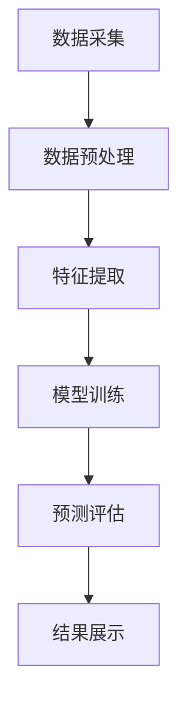
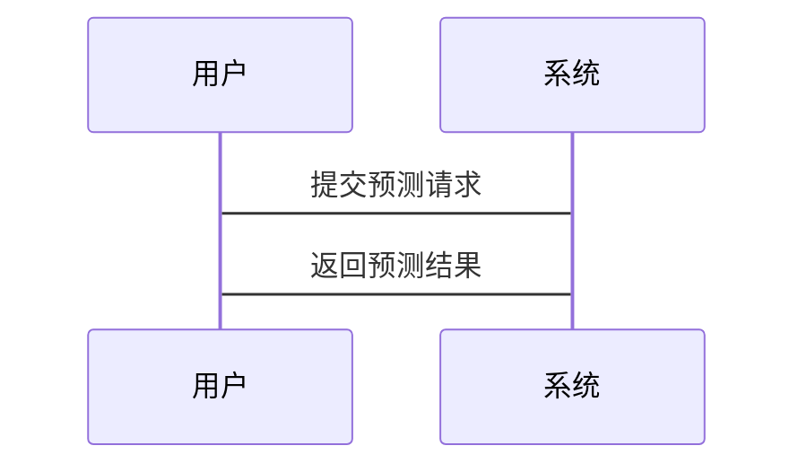

                 


# 深度学习预测公司长期竞争优势

---

## 关键词  
深度学习, 公司竞争优势, 预测模型, 文本分析, 财务数据, 投资决策, 算法优化

---

## 摘要  
随着人工智能技术的快速发展，深度学习在金融领域的应用越来越广泛。本文将深入探讨如何利用深度学习技术预测公司长期竞争优势。通过分析公司的财务数据、市场表现和文本信息，结合深度学习模型，我们可以更准确地预测公司的竞争优势，为投资决策提供有力支持。本文将从深度学习的基本原理、公司竞争优势的定义、模型构建与优化等方面展开讨论，并通过实际案例展示深度学习在预测公司竞争优势中的应用。

---

## 第1章: 深度学习与公司竞争优势概述

### 1.1 深度学习的定义与核心原理  
深度学习是一种人工智能技术，属于机器学习的子领域，其核心是通过多层神经网络来模拟人脑的处理方式。深度学习模型能够从大量数据中自动提取特征，并通过非线性变换捕捉数据中的复杂模式。

#### 1.1.1 深度学习的定义  
深度学习是一种基于人工神经网络的算法，通过多层非线性变换，从输入数据中自动学习特征，从而实现对数据的分类、回归或生成任务。

#### 1.1.2 深度学习的核心原理  
深度学习的核心是通过多层神经网络的非线性变换，逐步提取数据中的高层次特征。其主要特点包括：  
1. **层次化特征提取**：通过多层网络，逐步提取低层次到高层次的特征。  
2. **非线性激活函数**：如ReLU、sigmoid等，用于引入非线性，提高模型的表达能力。  
3. **反向传播与梯度下降**：通过损失函数计算预测值与真实值的差异，并通过反向传播算法调整网络参数，以最小化损失。

#### 1.1.3 深度学习与传统机器学习的对比  
| 特性                | 深度学习                     | 传统机器学习               |  
|---------------------|----------------------------|---------------------------|  
| 特征工程            | 简化，自动提取特征           | 需要手动提取特征           |  
| 模型复杂度          | 高，能够处理复杂模式         | 较低，适合线性问题         |  
| 数据需求            | 需要大量数据                | 数据需求较低              |  
| 应用场景            | 图像识别、自然语言处理、金融预测 | 分类、回归等简单任务       |  

---

### 1.2 公司长期竞争优势的定义与构成  

#### 1.2.1 公司竞争优势的定义  
公司竞争优势是指公司在市场中相对于竞争对手的核心优势，包括技术、成本、品牌、资源、管理等方面。

#### 1.2.2 公司竞争优势的核心要素  
1. **技术优势**：公司在技术研发上的投入和创新能力。  
2. **成本优势**：公司在生产或运营中的成本控制能力。  
3. **品牌优势**：公司品牌的知名度和市场影响力。  
4. **资源优势**：公司拥有的独特资源或战略位置。  
5. **管理优势**：公司的组织架构和管理水平。  

#### 1.2.3 长期竞争优势的特征与边界  
长期竞争优势的特征包括持续性、稳定性、可扩展性。其边界在于公司能否在长期竞争中保持核心优势不被竞争对手超越。

---

### 1.3 深度学习在公司竞争优势分析中的应用前景  

#### 1.3.1 深度学习在金融分析中的潜力  
深度学习可以用于分析公司的财务数据、市场表现、新闻文本等，帮助投资者预测公司的竞争优势。

#### 1.3.2 公司竞争优势预测的挑战与机遇  
挑战包括数据的复杂性、模型的可解释性、计算资源的需求等；机遇则在于深度学习的强大表达能力和自动化特征提取能力。

#### 1.3.3 深度学习在投资决策中的作用  
深度学习可以帮助投资者发现潜在的投资机会，优化投资组合，降低风险。

---

## 第2章: 深度学习模型的核心原理  

### 2.1 深度学习模型的基本结构  

#### 2.1.1 神经网络的基本组成  
神经网络由输入层、隐藏层和输出层组成。输入层接收数据，隐藏层进行特征提取，输出层产生预测结果。

#### 2.1.2 深度学习模型的层次化特征提取能力  
通过多层网络，深度学习模型能够逐步提取低层次到高层次的特征，例如从图像的边缘到整体结构。

---

### 2.2 深度学习的核心算法  

#### 2.2.1 反向传播算法（Backpropagation）  
反向传播算法通过计算损失函数的梯度，更新网络参数以最小化损失。其公式如下：

$$ \frac{\partial L}{\partial w} = \frac{\partial L}{\partial a} \cdot \frac{\partial a}{\partial w} $$

其中，$L$ 是损失函数，$w$ 是权重，$a$ 是激活函数的输出。

#### 2.2.2 梯度下降优化方法（Gradient Descent）  
梯度下降是一种优化算法，通过不断调整参数使损失函数最小化。常用的方法包括随机梯度下降（SGD）、批量梯度下降（BGD）和Adam优化。

---

## 第3章: 深度学习算法原理与数学模型  

### 3.1 循环神经网络（RNN）  

#### 3.1.1 RNN的基本结构与工作原理  
RNN通过循环结构处理序列数据，能够捕捉时间序列中的依赖关系。其基本公式为：

$$ h_t = \text{activation}(W_{hh} h_{t-1} + W_{xh} x_t) $$

其中，$h_t$ 是当前时刻的隐藏状态，$x_t$ 是输入，$W_{hh}$ 和 $W_{xh}$ 是权重矩阵。

#### 3.1.2 长短期记忆网络（LSTM）的改进  
LSTM通过引入记忆单元（Cell）和门控机制（Gate）来解决RNN的梯度消失问题。其核心公式为：

$$ f_t = \sigma(W_f \cdot [h_{t-1}, x_t]) $$  
$$ i_t = \sigma(W_i \cdot [h_{t-1}, x_t]) $$  
$$ c_t = f_t \cdot c_{t-1} + i_t \cdot g(x_t) $$  
$$ h_t = o_t \cdot \tanh(c_t) $$  

其中，$f_t$ 是遗忘门，$i_t$ 是输入门，$o_t$ 是输出门，$\sigma$ 是sigmoid函数。

---

### 3.2 Transformer模型  

#### 3.2.1 Transformer的提出与核心思想  
Transformer由Vaswani等人提出，核心思想是通过自注意力机制（Self-Attention）捕捉序列中的全局依赖关系。

#### 3.2.2 自注意力机制（Self-Attention）的原理  
自注意力机制通过计算输入序列中每个位置与其他位置的相关性，生成权重矩阵：

$$ \text{Attention}(Q, K, V) = \text{softmax}\left(\frac{QK^T}{\sqrt{d_k}}\right)V $$

其中，$Q$ 是查询向量，$K$ 是键向量，$V$ 是值向量，$d_k$ 是向量的维度。

---

## 第4章: 深度学习预测公司竞争优势的系统分析与架构设计  

### 4.1 系统功能设计  
系统功能包括数据采集、特征提取、模型训练、预测评估和结果展示。

#### 4.1.1 数据采集  
从公开的财务报表、新闻、社交媒体等渠道获取公司相关信息。

#### 4.1.2 特征提取  
通过深度学习模型提取文本、财务数据中的特征。

#### 4.1.3 模型训练  
使用深度学习模型训练公司竞争优势预测模型。

#### 4.1.4 预测评估  
通过验证集评估模型的性能，并进行优化。

#### 4.1.5 结果展示  
将预测结果以可视化方式展示，辅助投资者决策。

---

### 4.2 系统架构设计  

#### 4.2.1 系统架构图  


---

### 4.3 系统交互设计  

#### 4.3.1 系统交互序列图  


---

## 第5章: 深度学习预测公司竞争优势的项目实战  

### 5.1 项目环境安装  
安装Python、TensorFlow、Keras等依赖库。

### 5.2 核心代码实现  

#### 5.2.1 数据预处理  
```python
import pandas as pd

# 读取数据
df = pd.read_csv('company_data.csv')
# 数据分割
train_data = df.iloc[:800]
test_data = df.iloc[800:]
```

#### 5.2.2 模型构建  
```python
from tensorflow.keras import layers

model = tf.keras.Sequential([
    layers.Dense(64, activation='relu'),
    layers.Dense(1, activation='sigmoid')
])
model.compile(optimizer='adam', loss='binary_crossentropy', metrics=['accuracy'])
```

#### 5.2.3 模型训练  
```python
model.fit(train_data, train_labels, epochs=10, batch_size=32)
```

---

### 5.3 实际案例分析  
通过实际公司数据，展示深度学习模型在预测公司竞争优势中的应用。

---

## 第6章: 总结与展望  

### 6.1 本章小结  
深度学习在预测公司长期竞争优势中具有巨大潜力，通过分析公司财务数据、市场表现和文本信息，可以为投资者提供有力支持。

### 6.2 未来展望  
未来，深度学习在公司竞争优势预测中的应用将更加广泛，模型的优化和可解释性将是研究重点。

---

## 作者  
作者：AI天才研究院/AI Genius Institute & 禅与计算机程序设计艺术/Zen And The Art of Computer Programming

