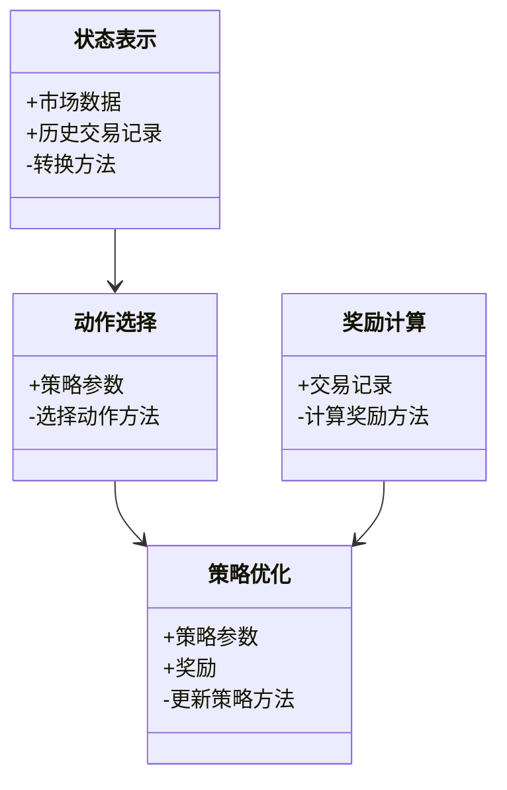

                 


# 深度强化学习优化投资决策

## 关键词：
深度强化学习, 投资决策, 强化学习算法, 数学模型, 系统架构, 项目实战

## 摘要：
本文深入探讨了深度强化学习在投资决策中的应用，从基础概念到高级算法，再到实际项目实现，系统地分析了其优化投资决策的潜力和挑战。通过详细讲解算法原理、数学模型和系统架构，结合实际案例分析，本文旨在为读者提供一个全面的视角，理解如何利用深度强化学习技术提升投资决策的科学性和效率性。

---

## 第一部分: 深度强化学习与投资决策背景介绍

### 第1章: 深度强化学习基本概念

#### 1.1 强化学习的定义与特点
强化学习（Reinforcement Learning, RL）是一种通过智能体与环境交互来学习最优策略的机器学习方法。其核心在于智能体通过试错的方式，通过选择不同的动作来最大化累积的奖励。

**强化学习的核心特点：**
- **环境交互**：智能体在环境中采取动作，观察状态和接收奖励。
- **目标导向**：通过最大化累积奖励，学习最优策略。
- **策略优化**：通过不断更新策略，提高在特定环境中的表现。

**深度强化学习的演变与优势：**
- **深度学习的结合**：将深度学习用于状态表示，提高了处理复杂任务的能力。
- **端到端学习**：可以直接从输入数据到输出动作，无需手动设计特征。

#### 1.2 深度强化学习在投资决策中的应用价值
投资决策涉及复杂多变的市场环境和多样化的决策目标。深度强化学习通过模拟人类投资者的决策过程，能够处理非线性关系和高维数据，帮助投资者做出更优决策。

**具体优势：**
- **处理非线性关系**：深度神经网络能够捕捉数据中的非线性特征，适用于金融市场中复杂的价格走势。
- **动态适应性**：强化学习能够实时更新策略，适应市场变化。
- **多目标优化**：通过设计合适的奖励函数，可以同时优化风险和收益。

### 第2章: 投资决策中的强化学习应用

#### 2.1 投资决策的基本概念
投资决策是指在金融市场中，投资者根据市场信息和自身目标，选择最优的投资组合或交易策略。投资决策的核心在于在不确定性和风险中寻找收益与风险的平衡。

**投资决策的核心要素：**
- **资产选择**：选择投资的资产类别，如股票、债券等。
- **时机选择**：决定买卖时机，以最大化收益。
- **风险控制**：通过分散投资和止损策略，降低投资风险。

#### 2.2 强化学习在投资决策中的应用价值
强化学习通过模拟投资者在不同市场环境下的决策过程，帮助投资者优化交易策略。深度强化学习能够处理高维、非线性的市场数据，捕捉复杂的市场模式。

**具体应用案例：**
- **股票交易策略**：通过强化学习算法，训练智能体在股票市场中进行买卖决策。
- **投资组合优化**：利用强化学习优化资产配置，平衡风险与收益。
- **风险管理**：通过强化学习模型，实时监控市场风险，制定应对策略。

---

## 第二部分: 深度强化学习算法原理

### 第3章: 基础强化学习算法

#### 3.1 Q-learning算法
Q-learning是一种基于价值函数的强化学习算法，通过学习状态-动作值函数（Q值）来优化决策。

**Q-learning的数学模型：**
$$ Q(s, a) = Q(s, a) + \alpha [r + \gamma \max Q(s', a') - Q(s, a)] $$
其中，$\alpha$是学习率，$\gamma$是折扣因子。

**Q-learning的实现步骤：**
1. 初始化Q值表。
2. 环境返回当前状态$s$。
3. 根据策略选择动作$a$。
4. 执行动作，观察新状态$s'$和奖励$r$。
5. 更新Q值表。
6. 重复步骤2-5，直到收敛。

#### 3.2 策略梯度方法
策略梯度（Policy Gradient）是一种直接优化策略参数的强化学习方法，通过最大化期望奖励来更新策略。

**策略梯度的数学模型：**
$$ \nabla \theta \leftarrow \nabla J(\theta) = \mathbb{E}_{s,a} [\nabla \log \pi_\theta(a|s) \cdot Q(s,a)] $$
其中，$J(\theta)$是策略的奖励期望，$\pi_\theta(a|s)$是策略的分布。

### 第4章: 深度强化学习算法

#### 4.1 DQN算法
深度Q网络（DQN）是将深度神经网络应用于Q-learning的一种方法，通过经验回放和目标网络来稳定训练。

**DQN的数学模型：**
- 动作值函数：$Q_\theta(s, a)$
- 经验回放：存储$(s, a, r, s')$样本，随机采样更新。
- 目标网络：通过固定目标网络来减少目标值的变化。

#### 4.2 Actor-Critic方法
Actor-Critic是一种结合策略梯度和价值函数的方法，通过同时学习策略和价值函数来优化决策。

**Actor-Critic的数学模型：**
- 策略网络：$\pi_\theta(a|s)$
- 价值网络：$V_\phi(s)$
- 动作值函数：$Q_\theta(s,a) = V_\phi(s) - V_\phi(s')$

---

## 第三部分: 深度强化学习数学模型

### 第5章: 强化学习数学基础

#### 5.1 状态空间与动作空间
状态空间是智能体所处环境的所有可能状态的集合，动作空间是智能体在每个状态下可以采取的所有动作的集合。

**状态空间与动作空间的关系：**
- 状态空间是环境的描述，动作空间是智能体的选择。
- 动作空间的大小和状态空间的维度直接影响算法的复杂度。

#### 5.2 奖励函数与价值函数
奖励函数定义了智能体在执行某个动作后所获得的奖励，价值函数描述了智能体在某个状态下能够获得的最大期望奖励。

**奖励函数与价值函数的关系：**
- 价值函数是奖励函数的累积期望。
- 奖励函数引导智能体的行为方向，价值函数衡量状态的好坏。

### 第6章: 深度强化学习数学模型

#### 6.1 Q-learning的数学模型
$$ Q(s, a) = Q(s, a) + \alpha [r + \gamma \max Q(s', a') - Q(s, a)] $$
其中，$\alpha$是学习率，$\gamma$是折扣因子。

#### 6.2 DQN的数学模型
- 动作值函数：$Q_\theta(s, a)$
- 经验回放：存储$(s, a, r, s')$样本，随机采样更新。
- 目标网络：通过固定目标网络来减少目标值的变化。

---

## 第四部分: 深度强化学习系统架构

### 第7章: 问题场景介绍

#### 7.1 投资决策问题
在金融市场中，投资者需要根据市场信息和历史数据，做出买卖决策或资产配置。

**投资决策的挑战：**
- 市场数据的复杂性：包括价格、成交量、市场情绪等。
- 非线性关系：价格走势可能受到多种因素的影响。
- 动态变化：市场环境随时可能变化。

#### 7.2 强化学习应用于投资决策的优势
- 能够处理高维、非线性的市场数据。
- 可以实时更新策略，适应市场变化。
- 通过经验回放，可以学习历史数据中的模式。

### 第8章: 系统架构设计

#### 8.1 系统功能设计
- **数据输入**：接收市场数据和历史交易记录。
- **状态表示**：将市场数据转换为状态表示。
- **动作选择**：根据当前状态选择交易动作。
- **奖励计算**：计算交易后的奖励。
- **策略优化**：更新策略参数以提高奖励。

**系统功能设计的类图：**


#### 8.2 系统架构设计
- **数据层**：存储市场数据和历史交易记录。
- **算法层**：实现强化学习算法，包括状态表示、动作选择和奖励计算。
- **接口层**：提供与前端或外部系统的接口。

**系统架构的架构图：**


---

## 第五部分: 深度强化学习项目实战

### 第9章: 环境安装与代码实现

#### 9.1 环境安装
- 安装Python和必要的库：如TensorFlow、Keras、OpenAI Gym。
- 安装Jupyter Notebook用于代码实现和可视化。

#### 9.2 系统核心实现源代码
以下是一个简单的DQN算法实现代码示例：
```python
import numpy as np
import gym
from collections import deque
import random

class DQN:
    def __init__(self, state_space, action_space, lr=0.01, gamma=0.99, epsilon=1.0):
        self.state_space = state_space
        self.action_space = action_space
        self.lr = lr
        self.gamma = gamma
        self.epsilon = epsilon
        self.memory = deque(maxlen=1000)
        self.model = self._build_model()

    def _build_model(self):
        # 简单的神经网络模型
        model = Sequential()
        model.add(Dense(24, input_dim=self.state_space, activation='relu'))
        model.add(Dense(24, activation='relu'))
        model.add(Dense(self.action_space, activation='linear'))
        model.compile(loss='mse', optimizer=Adam(lr=self.lr))
        return model

    def remember(self, state, action, reward, next_state):
        self.memory.append((state, action, reward, next_state))

    def act(self, state):
        if random.random() < self.epsilon:
            return random.randint(0, self.action_space - 1)
        state = np.array(state)
        prediction = self.model.predict(state)
        return np.argmax(prediction[0])

    def replay(self, batch_size):
        if len(self.memory) < batch_size:
            return
        minibatch = random.sample(self.memory, batch_size)
        states = np.array([t[0] for t in minibatch])
        actions = [t[1] for t in minibatch]
        rewards = [t[2] for t in minibatch]
        next_states = np.array([t[3] for t in minibatch])
        targets = []
        for i in range(batch_size):
            targets[i] = rewards[i] + self.gamma * np.max(self.model.predict(next_states[i]))
        targets = np.array(targets)
        self.model.fit(states, targets, epochs=1, verbose=0)
        self.epsilon = max(0.01, self.epsilon * 0.99)
```

#### 9.3 代码应用解读与分析
上述代码实现了一个简单的DQN算法，用于在OpenAI Gym环境中进行强化学习。通过经验回放和神经网络模型，智能体能够学习最优策略。

**关键部分解读：**
- **模型构建**：使用Keras构建了一个简单的神经网络模型。
- **动作选择**：根据当前状态选择动作，探索与利用的平衡。
- **经验回放**：存储经验并随机采样更新模型。
- **策略优化**：通过反向传播更新模型参数，逐步优化策略。

### 第10章: 实际案例分析

#### 10.1 案例分析
以股票交易为例，训练一个DQN算法来选择买卖时机。

**案例分析步骤：**
1. 数据收集：获取历史股票数据。
2. 状态表示：将数据转换为状态特征。
3. 动作选择：选择买卖动作。
4. 环境模拟：模拟交易过程，计算奖励。
5. 策略优化：更新策略参数，提高收益。

#### 10.2 项目小结
通过实际案例分析，展示了深度强化学习在投资决策中的应用潜力。模型能够根据市场数据，学习最优交易策略，提高投资收益。

---

## 第六部分: 深度强化学习优化投资决策的总结与展望

### 第11章: 最佳实践 tips

#### 11.1 小结
深度强化学习在投资决策中的应用前景广阔，但同时也面临许多挑战，如数据质量、模型过拟合和计算效率等。

#### 11.2 注意事项
- 数据质量：确保数据的完整性和准确性。
- 模型设计：合理设计网络结构和超参数。
- 训练策略：优化训练过程，防止过拟合。

#### 11.3 拓展阅读
建议读者进一步阅读相关论文和书籍，深入了解深度强化学习的最新进展和技术细节。

### 第12章: 项目总结

#### 12.1 总结
本文系统地介绍了深度强化学习在投资决策中的应用，从理论基础到实际应用，详细讲解了相关算法和系统架构。通过实际案例分析，展示了深度强化学习在优化投资决策中的潜力和效果。

#### 12.2 展望
未来，随着深度学习和强化学习技术的不断发展，投资决策的智能化和自动化将更加普及。如何在实际应用中克服挑战，进一步提升模型的性能和稳定性，是研究者和实践者需要共同努力的方向。

---

## 作者：AI天才研究院/AI Genius Institute & 禅与计算机程序设计艺术 /Zen And The Art of Computer Programming

