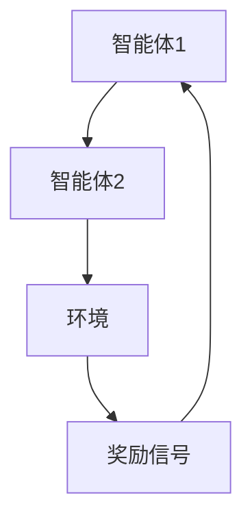
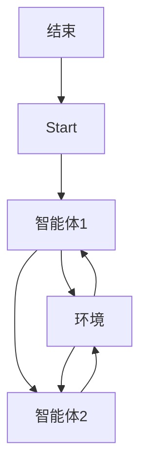

                 


# 深度强化学习在AI Agent协作决策中的应用

## 关键词
- 深度强化学习（Deep Reinforcement Learning）
- AI Agent
- 协作决策
- 多智能体强化学习（Multi-Agent Reinforcement Learning）
- 系统架构设计

## 摘要
深度强化学习（DRL）结合了深度学习和强化学习的优势，为AI Agent的协作决策提供了强大的技术基础。本文系统地介绍了深度强化学习的核心概念、算法原理及其在AI Agent协作决策中的应用场景。通过实际案例分析和系统架构设计，展示了如何利用DRL实现高效、智能的协作决策。最后，本文探讨了DRL在协作决策中的挑战与解决方案，并展望了未来的研究方向。

---

## 第1章: 深度强化学习与AI Agent协作决策的背景介绍

### 1.1 深度强化学习的定义与核心概念
深度强化学习是强化学习与深度学习的结合，利用深度神经网络作为函数近似器，解决复杂决策问题。其核心概念包括：
- **状态空间（State Space）**：环境的当前情况。
- **动作空间（Action Space）**：智能体可执行的动作。
- **奖励机制（Reward Mechanism）**：智能体行为的反馈，指导优化目标。
- **策略（Policy）**：智能体选择动作的规则，分为值函数型和策略型。

### 1.2 AI Agent协作决策的基本概念
AI Agent是具备感知和决策能力的实体，协作决策涉及多个智能体之间的互动与合作。其特点包括：
- **分布式决策**：每个智能体独立决策。
- **全局目标**：协作完成共同任务。
- **动态互动**：智能体之间实时互动，影响决策过程。

### 1.3 深度强化学习在协作决策中的应用背景
深度强化学习在协作决策中的应用背景包括：
- **复杂环境处理**：DRL能够处理高维和复杂的环境信息。
- **动态协作**：智能体之间需要动态调整策略以适应环境变化。
- **高效决策**：通过深度神经网络的非线性表达能力，提升决策效率。

---

## 第2章: 深度强化学习的核心概念与联系

### 2.1 深度强化学习的数学模型
深度强化学习的核心数学模型包括：
- **Q-learning公式**：$Q(s, a) \leftarrow Q(s, a) + \alpha [r + \gamma \max Q(s', a') - Q(s, a)]$。
- **深度Q网络（DQN）**：利用神经网络近似Q值函数，模型结构包括输入层、隐藏层和输出层。

### 2.2 AI Agent协作决策的实体关系图


### 2.3 深度强化学习算法的流程图
```mermaid
graph TD
    Start --> 初始化神经网络
    初始化神经网络 --> 环境状态输入
    环境状态输入 --> 动作选择（ε-greedy策略）
    动作选择 --> 执行动作并观察新状态
    执行动作并观察新状态 --> 计算奖励
    计算奖励 --> 更新Q值
    更新Q值 --> 回忆库存储
    回忆库存储 --> 训练神经网络
    训练神经网络 --> 结束
    结束 --> Start
```

---

## 第3章: 深度强化学习算法的原理与实现

### 3.1 深度Q网络（DQN）的算法流程
深度Q网络的算法流程如下：
1. 环境状态输入到神经网络，预测Q值。
2. 根据ε-greedy策略选择动作，执行动作并观察新状态。
3. 计算奖励并更新Q值。
4. 将经验存储到回忆库中。
5. 训练神经网络，更新权重。

### 3.2 多智能体强化学习的挑战与解决方案
多智能体强化学习的挑战包括：
- **通信与协调**：智能体之间需要有效沟通以避免冲突。
- **学习效率**：多个智能体同时学习可能导致计算开销大。
- **策略一致性**：智能体之间策略的协调需要一致的目标函数。

解决方案包括：
- **分布式强化学习**：每个智能体独立学习，通过环境反馈协调策略。
- **基于图的强化学习**：利用图结构建模智能体之间的关系，提升协作效率。

---

## 第4章: 系统分析与架构设计

### 4.1 系统功能设计
系统功能模型包括：
- **状态感知**：智能体感知环境状态。
- **决策制定**：智能体根据状态选择动作。
- **协作通信**：智能体之间交换信息，协调策略。
- **奖励机制**：智能体根据协作效果获得奖励。

### 4.2 系统架构图


### 4.3 接口设计
系统接口包括：
- **智能体接口**：与环境交互，获取状态和奖励。
- **协作接口**：智能体之间通信，共享信息。
- **环境接口**：提供状态和反馈。

### 4.4 交互序列图


---

## 第5章: 项目实战

### 5.1 环境安装
安装必要的库：
- `pip install gym`
- `pip install tensorflow`

### 5.2 系统核心实现源代码
```python
import gym
import numpy as np
import tensorflow as tf

class DQN:
    def __init__(self, state_space, action_space, learning_rate=0.01, gamma=0.99):
        self.state_space = state_space
        self.action_space = action_space
        self.lr = learning_rate
        self.gamma = gamma
        
        self.model = tf.keras.Sequential([
            tf.keras.layers.Dense(24, input_dim=state_space, activation='relu'),
            tf.keras.layers.Dense(action_space)
        ])
        
        self.optimizer = tf.keras.optimizers.Adam(learning_rate)
    
    def get_action(self, state, epsilon=0.1):
        if np.random.random() < epsilon:
            return np.random.randint(0, self.action_space)
        
        q_values = self.model.predict(np.array([state]))
        return np.argmax(q_values[0])
    
    def update_model(self, state, action, reward, next_state):
        target = reward + self.gamma * np.max(self.model.predict(np.array([next_state])))
        target = np.array([target])
        
        state = np.array([state])
        action_mask = np.zeros((1, self.action_space))
        action_mask[0][action] = 1
        
        with tf.GradientTape() as tape:
            q_values = self.model(state)
            q_action = tf.reduce_sum(q_values * action_mask)
            loss = tf.keras.losses mse(target, q_action)
        
        gradients = tape.gradient(loss, self.model.trainable_weights)
        self.optimizer.apply_gradients(zip(gradients, self.model.trainable_weights))
```

### 5.3 实际案例分析
案例：多智能体协作完成任务。
1. **环境描述**：多个智能体在一个环境中协作完成特定目标。
2. **算法实现**：使用DQN算法实现多智能体协作。
3. **结果分析**：智能体能够通过协作完成任务，奖励逐步增加。

---

## 第6章: 总结与展望

### 6.1 总结
深度强化学习为AI Agent的协作决策提供了强大的技术基础，通过数学模型和算法实现，智能体能够高效地协作完成复杂任务。

### 6.2 展望
未来，深度强化学习在协作决策中的应用将更加广泛，涉及更复杂的环境和任务。同时，如何提升算法效率、优化智能体协作机制是研究的重要方向。

---

## 作者：AI天才研究院/AI Genius Institute & 禅与计算机程序设计艺术 /Zen And The Art of Computer Programming

