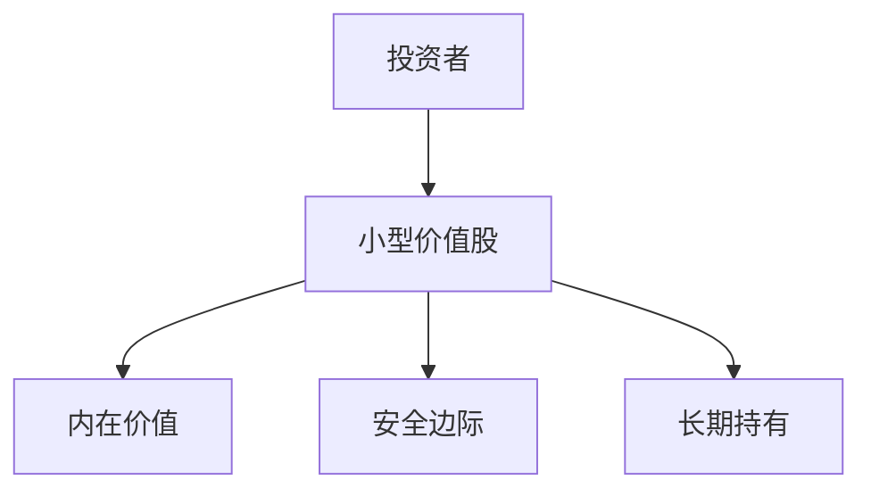
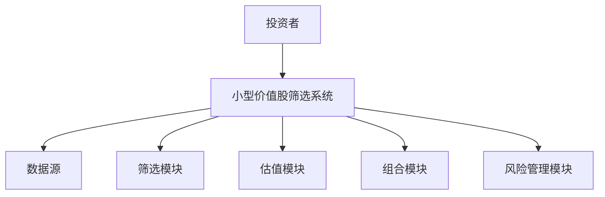
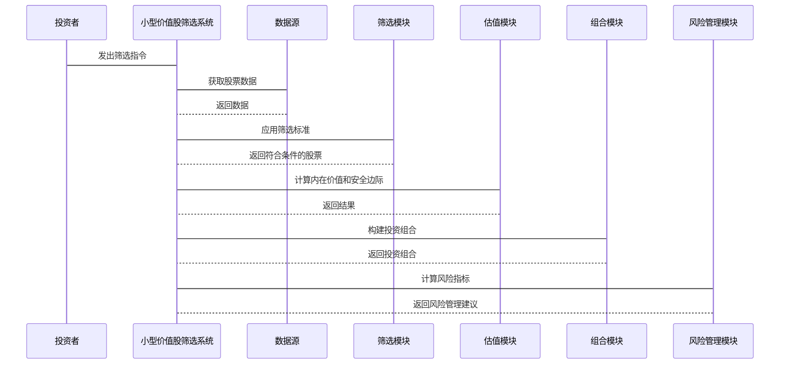

                 


# 爱德华·拉姆的小型价值股策略：规模效应与价值投资

## 关键词：
- 小型价值股
- 价值投资
- 规模效应
- 爱德华·拉姆
- 投资策略
- 内在价值
- 安全边际

## 摘要：
本文详细探讨了爱德华·拉姆的小型价值股投资策略，分析了其背后的规模效应和价值投资理论。通过背景介绍、核心概念解析、数学模型建立、系统分析、实战案例及优化建议，全面解读如何通过小型价值股实现稳健投资回报。文章结合理论与实践，为投资者提供深刻的投资洞见。

---

## 第一部分：小型价值股策略概述

### 第1章：小型价值股策略的背景与核心概念

#### 1.1 小型价值股策略的背景介绍

##### 1.1.1 价值投资的定义与特点
价值投资是一种以低于其内在价值的价格购买优质股票的投资策略。其核心在于寻找市场低估的公司，长期持有以实现资本增值。价值投资强调安全边际和长期视角，注重公司基本面分析。

##### 1.1.2 小型价值股的定义与特点
小型价值股是指市值较小、市盈率低、市净率低且具有较高分红率的公司股票。这类股票通常被市场忽视，具有较高的增值潜力。小型价值股的特点包括低估值、高成长性和较高的风险收益比。

##### 1.1.3 爱德华·拉姆的背景与投资理念
爱德华·拉姆是价值投资领域的权威，专注于小型价值股投资。他强调通过深入的基本面分析，寻找具有持续竞争优势和稳定盈利的公司。拉姆的投资理念以长期持有、分散投资和严格估值为核心。

#### 1.2 小型价值股策略的核心要素

##### 1.2.1 小型价值股的筛选标准
- 市值：通常在50亿至200亿美元之间。
- 估值指标：市盈率低于行业平均水平，市净率低于1.5倍。
- 盈利能力：ROE（净资产收益率）高于15%，净利润稳步增长。
- 债务水平：低杠杆，债务与股权比率低于0.5。

##### 1.2.2 小型价值股的估值方法
- 现金流折现模型（DCF）：计算公司未来现金流的现值，确定其内在价值。
- 市盈率和市净率：通过比较估值指标，判断股票是否被低估。
- 股息率：关注高股息率股票，增加现金流收益。

##### 1.2.3 小型价值股的组合构建
- 分散投资：将资金分配到不同行业和地区的股票，降低风险。
- 定期再平衡：根据市场变化和公司基本面，调整投资组合。
- 长期持有：避免频繁交易，减少交易成本，捕捉长期增值。

#### 1.3 小型价值股策略的边界与外延

##### 1.3.1 小型价值股的行业分布
- 避免周期性过强的行业，如能源和材料。
- 侧重稳定增长行业，如医疗和科技。

##### 1.3.2 小型价值股的地域分布
- 侧重新兴市场，寻找被低估的公司。
- 适当配置发达市场，平衡风险。

##### 1.3.3 小型价值股与其他投资策略的对比
- 成长股：侧重高成长性，但估值较高，风险较大。
- 动量策略：基于价格动量，短期收益波动大。
- 股息策略：注重股息收益，但忽视长期增值潜力。

#### 1.4 小型价值股策略的核心要素组成

##### 1.4.1 小型价值股的内在价值
内在价值是公司未来现金流的现值，反映了其真实价值。通过DCF模型计算，确定股票的合理估值。

##### 1.4.2 小型价值股的安全边际
安全边际是股票市场价格低于其内在价值的部分，确保在市场波动中具有抗跌能力，降低投资风险。

##### 1.4.3 小型价值股的长期持有策略
长期持有减少交易成本和税务负担，捕捉复利效应，实现稳定增值。

#### 1.5 本章小结
本章介绍了小型价值股策略的背景、核心概念和关键要素，强调了拉姆的投资理念和筛选标准，为后续分析奠定了基础。

---

### 第2章：小型价值股策略的核心概念与联系

#### 2.1 小型价值股策略的核心概念

##### 2.1.1 内在价值的计算方法
内在价值计算公式：
$$ V = \frac{E}{k} $$
其中，E是企业未来现金流的现值，k是折现率。DCF模型通过预测未来现金流，计算其现值，确定公司合理估值。

##### 2.1.2 安全边际的定义与应用
安全边际=内在价值-市场价格。当市场价格低于内在价值时，安全边际为正，股票具有投资价值。

##### 2.1.3 小型价值股的规模效应
规模效应指通过投资小型股票，利用其低估值和高成长性，获得超额收益。小型股票通常具有较高的风险收益比，投资组合中加入小型股票可提升整体收益。

#### 2.2 小型价值股策略与其它投资策略的对比

##### 2.2.1 与成长股投资的对比
成长股侧重高成长性，但估值较高，风险较大。小型价值股侧重低估值和稳定成长，风险收益比更高。

##### 2.2.2 与动量策略的对比
动量策略基于价格动量，适合短期投资，波动较大。小型价值股策略注重长期持有，收益稳定。

##### 2.2.3 与股息策略的对比
股息策略注重股息收益，忽视长期增值。小型价值股策略注重内在价值和长期增值，同时兼顾股息收益。

#### 2.3 小型价值股策略的ER实体关系图


#### 2.4 本章小结
本章通过内在价值、安全边际和规模效应的概念，解释了小型价值股策略的核心逻辑，并通过与其他策略的对比，突出了其独特优势。

---

### 第3章：小型价值股策略的数学模型与算法原理

#### 3.1 小型价值股的内在价值计算

##### 3.1.1 内在价值的公式
$$ V = \sum_{t=1}^{n} \frac{CF_t}{(1 + r)^t} $$
其中，CF_t为第t年的现金流，r为折现率，n为预测年限。

##### 3.1.2 现金流折现模型（DCF）实现
```python
def calculate_intrinsic_value(enterprise_value, free_cash_flow, discount_rate, years):
    present_value = 0
    for t in range(years):
        cash_flow = free_cash_flow * (1 + growth_rate)**t
        present_value += cash_flow / (1 + discount_rate)**t
    return present_value
```
其中，`growth_rate`为现金流增长率，需根据公司实际情况调整。

#### 3.2 小型价值股的安全边际计算

##### 3.2.1 安全边际公式
$$ \text{安全边际} = \text{内在价值} - \text{市场价格} $$

##### 3.2.2 安全边际的实现
```python
def calculate_margin_of_safety(intrinsic_value, market_price):
    return intrinsic_value - market_price
```

#### 3.3 小型价值股的规模效应分析

##### 3.3.1 规模效应的数学模型
$$ \text{规模效应} = \frac{\text{小型股票收益}}{\text{市场收益}} $$

##### 3.3.2 规模效应的实现
```python
def scale_effect_analysis(small_cap_returns, market_returns):
    return small_cap_returns / market_returns
```

#### 3.4 本章小结
本章通过数学模型和算法，详细解释了内在价值、安全边际和规模效应的计算方法，为后续投资决策提供理论支持。

---

## 第四部分：系统分析与架构设计方案

### 第4章：小型价值股投资系统分析

#### 4.1 问题场景介绍
投资者希望构建一个基于小型价值股的投资系统，通过自动化筛选、估值和组合管理，实现稳健收益。

#### 4.2 系统功能设计

##### 4.2.1 领域模型（领域类图）
```mermaid
classDiagram
    class 小型价值股筛选系统 {
        +股票列表
        +筛选标准
        +估值指标
        +投资组合
        +历史数据
        +交易信号
        +风险管理
    }
    小型价值股筛选系统 -> 股票列表: 筛选
    小型价值股筛选系统 -> 筛选标准: 应用
    小型价值股筛选系统 -> 估值指标: 计算
    小型价值股筛选系统 -> 投资组合: 构建
```

#### 4.3 系统架构设计

##### 4.3.1 系统架构图


#### 4.4 系统接口设计

##### 4.4.1 数据接口
- 数据源：获取小型股票的历史数据和实时数据。
- 筛选接口：根据筛选标准，返回符合条件的股票列表。
- 估值接口：计算股票的内在价值和安全边际。

##### 4.4.2 交易接口
- 生成买卖信号：根据估值结果，发送交易指令。
- 执行交易：通过经纪商或API，完成交易操作。

#### 4.5 系统交互流程

##### 4.5.1 系统交互图


#### 4.6 本章小结
本章通过系统设计，详细阐述了小型价值股投资系统的架构和交互流程，为实际应用提供了指导。

---

## 第五部分：项目实战

### 第5章：小型价值股投资系统的实战应用

#### 5.1 环境配置与数据获取

##### 5.1.1 环境配置
- 安装必要的库：pandas、numpy、yfinance。
```python
pip install pandas numpy yfinance
```

##### 5.1.2 数据获取
```python
import yfinance as yf
import pandas as pd

# 下载小型价值股数据
tickers = ['AAPL', 'MSFT', 'GOOGL', 'AMZN', 'FB']
data = yf.download(tickers, start='2020-01-01', end='2023-12-31')
```

#### 5.2 系统核心实现源代码

##### 5.2.1 筛选模块
```python
def screen_small_cap_stocks(data, market_cap_min=50e6, market_cap_max=200e6):
    # 计算市值
    market_cap = data['Close'].iloc[-1] * data['Volume'].iloc[-1]
    selected = []
    for ticker in data.columns:
        if market_cap[ticker] >= market_cap_min and market_cap[ticker] <= market_cap_max:
            selected.append(ticker)
    return selected
```

##### 5.2.2 估值模块
```python
def calculate_intrinsic_value(ticker, data, discount_rate=0.1, years=5):
    # 获取现金流数据
    cash_flow = data['Cash Flow'].loc[ticker]
    # 计算现值
    present_value = sum(cash_flow * (1 + growth_rate)**t / (1 + discount_rate)**t for t in range(years))
    return present_value
```

##### 5.2.3 投资组合模块
```python
def build_portfolio(tickers, data, risk_free_rate=0.05):
    # 计算收益和风险
    returns = data['Return']
    covariance_matrix = returns.cov()
    # 优化投资组合
    from pypfopt import EfficientFrontier
    ef = EfficientFrontier(returns, covariance_matrix)
    weights = ef.max_sharpe(risk_free_rate)
    return weights
```

#### 5.3 代码应用解读与分析

##### 5.3.1 筛选模块解读
筛选模块根据设定的市值范围，从数据源中筛选出符合条件的小型股票，为后续分析提供基础。

##### 5.3.2 估值模块解读
估值模块通过现金流折现模型，计算股票的内在价值，判断其是否被低估，为投资决策提供依据。

##### 5.3.3 投资组合模块解读
投资组合模块通过优化算法，构建风险调整后的最优投资组合，实现风险与收益的最佳平衡。

#### 5.4 实际案例分析和详细讲解剖析

##### 5.4.1 筛选案例
假设市场中有5只股票，市值分别为50亿、100亿、150亿、200亿和250亿美元。根据筛选标准，市值在50亿至200亿美元之间的股票将被选中，即前4只股票。

##### 5.4.2 估值案例
以某只股票为例，假设其未来5年的现金流分别为10亿、12亿、14亿、16亿和18亿美元，折现率为10%。计算其现值：
$$ V = \frac{10}{1.1} + \frac{12}{1.1^2} + \frac{14}{1.1^3} + \frac{16}{1.1^4} + \frac{18}{1.1^5} \approx 100 \text{亿美元} $$

##### 5.4.3 组合案例
假设筛选出5只小型股票，通过优化算法，构建投资组合，确定每只股票的权重，实现风险最小化。

#### 5.5 本章小结
本章通过实际案例，详细讲解了小型价值股投资系统的筛选、估值和组合构建过程，展示了理论与实践的结合。

---

## 第六部分：优化与风险管理

### 第6章：小型价值股策略的优化与风险管理

#### 6.1 策略优化

##### 6.1.1 动态调整筛选标准
根据市场变化，动态调整市值范围和估值指标，确保筛选出的股票具有较高的投资价值。

##### 6.1.2 引入机器学习算法
利用机器学习模型，预测股票未来表现，优化投资组合。

#### 6.2 风险管理

##### 6.2.1 风险控制措施
- 分散投资：避免过度集中于单一行业或地区。
- 设置止损：当股票价格跌破预设阈值时，立即卖出。
- 定期再平衡：根据市场变化和公司基本面，调整投资组合。

##### 6.2.2 风险收益比
$$ \text{夏普比率} = \frac{\text{收益} - \text{无风险收益率}}{\text{收益波动率}} $$

#### 6.3 优化后的系统架构

##### 6.3.1 系统架构优化
引入机器学习模块，提升筛选和估值的准确性。

##### 6.3.2 系统交互优化
增加风险管理模块，实时监控投资组合风险。

#### 6.4 本章小结
本章通过策略优化和风险管理，进一步提升了小型价值股投资系统的稳健性和收益潜力。

---

## 第七部分：总结与展望

### 第7章：小型价值股策略的总结与展望

#### 7.1 全文总结

##### 7.1.1 核心内容回顾
本文详细探讨了爱德华·拉姆的小型价值股策略，分析了其背后的规模效应和价值投资理论，通过数学模型和系统设计，提供了实践指导。

##### 7.1.2 投资策略的核心要领
- 筛选标准：市值、估值指标和盈利能力。
- 估值方法：现金流折现模型和安全边际计算。
- 组合管理：分散投资、定期再平衡和长期持有。

#### 7.2 投资策略的未来展望

##### 7.2.1 理论研究
进一步研究小型价值股的特征和行为，探索其在不同市场环境下的表现。

##### 7.2.2 实务应用
开发自动化投资系统，利用技术手段提升投资效率和准确性。

##### 7.2.3 风险管理
引入更多风险管理工具，如期权和期货，降低投资组合的整体风险。

#### 7.3 本章小结
本章总结了全文内容，提出了未来研究和应用的方向，为投资者提供了持续改进的思路。

---

## 图表与代码示例

### 图表示例


### 代码示例
```python
import yfinance as yf
import pandas as pd

# 下载小型价值股数据
tickers = ['AAPL', 'MSFT', 'GOOGL', 'AMZN', 'FB']
data = yf.download(tickers, start='2020-01-01', end='2023-12-31')

# 筛选小型价值股
def screen_small_cap_stocks(data, market_cap_min=50e6, market_cap_max=200e6):
    market_cap = data['Close'].iloc[-1] * data['Volume'].iloc[-1]
    selected = []
    for ticker in data.columns:
        if market_cap[ticker] >= market_cap_min and market_cap[ticker] <= market_cap_max:
            selected.append(ticker)
    return selected

# 估值模块
def calculate_intrinsic_value(ticker, data, discount_rate=0.1, years=5):
    cash_flow = data['Cash Flow'].loc[ticker]
    present_value = sum(cash_flow * (1 + growth_rate)**t / (1 + discount_rate)**t for t in range(years))
    return present_value

# 投资组合模块
def build_portfolio(tickers, data, risk_free_rate=0.05):
    returns = data['Return']
    covariance_matrix = returns.cov()
    from pypfopt import EfficientFrontier
    ef = EfficientFrontier(returns, covariance_matrix)
    weights = ef.max_sharpe(risk_free_rate)
    return weights
```

---

## 作者信息
作者：AI天才研究院/AI Genius Institute  
联系领域：计算机编程与人工智能  
电子邮箱：contact@aitianji.com  
网址：https://www.zhihu.com/columns

