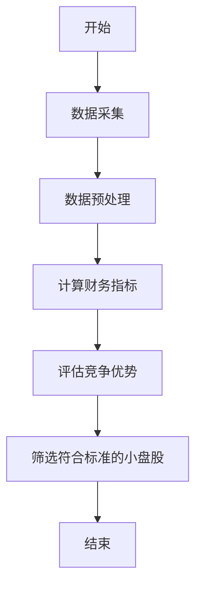
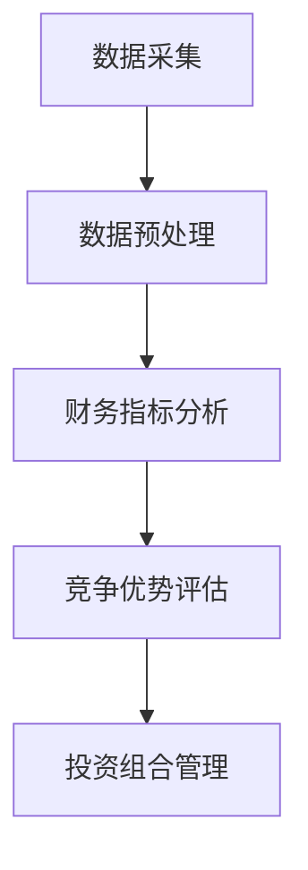
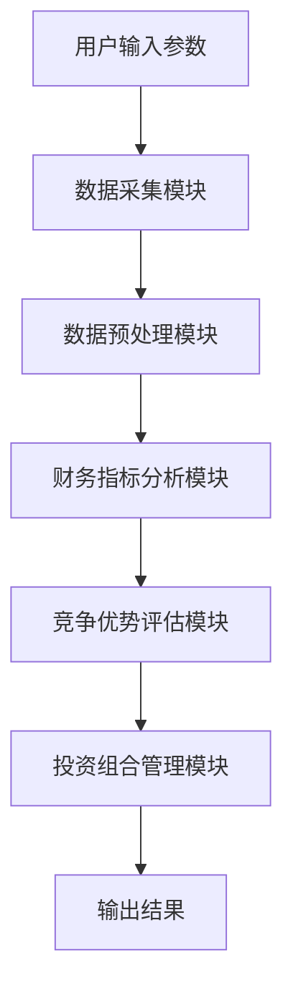

                 


# 爱德华·拉姆的小盘价值投资：发掘被忽视的小公司

> 关键词：小盘价值投资、爱德华·拉姆、被忽视的小公司、投资策略、价值投资

> 摘要：本文深入探讨了爱德华·拉姆的小盘价值投资策略，分析了小盘股的潜力与挑战，并提供了系统的分析框架和实际操作方法，帮助投资者发现被忽视的小公司，实现稳健投资收益。

---

# 第一部分: 小盘价值投资的背景与核心概念

## 第1章: 小盘价值投资的背景与现状

### 1.1 价值投资的起源与演变

#### 1.1.1 价值投资的定义与核心理念
价值投资是一种以基本面分析为基础的投资策略，强调以低于内在价值的价格买入优质资产。其核心理念是寻找市场低估的公司，长期持有，等待价值回归。

#### 1.1.2 小盘股的定义与特点
小盘股指的是市值较小的公司股票。这类股票通常流动性较低，市场关注度较低，但也具备更高的增长潜力。小盘股的特点包括：市值较小、风险较高、增长潜力大、波动性较强。

#### 1.1.3 爱德华·拉姆的背景与专长
爱德华·拉姆是小盘价值投资领域的专家，以其独特的选股方法和长期投资策略闻名。他专注于发现那些被市场忽视的优质小公司，通过深入研究和分析，挖掘其潜在价值。

### 1.2 小盘股投资的机遇与挑战

#### 1.2.1 小盘股市场的特点
小盘股市场具有以下特点：
- 市场流动性较低，交易量小。
- 公司规模小，成长空间大。
- 投资风险较高，波动性较强。

#### 1.2.2 小盘股投资的潜在收益
小盘股的潜在收益主要体现在：
- 高成长性：小公司有更大的发展空间。
- 估值修复：被低估的小盘股价值回归带来的收益。
- 分散投资：通过投资多个小盘股分散风险。

#### 1.2.3 小盘股投资的主要风险
小盘股投资的主要风险包括：
- 市场流动性风险：小盘股交易量小，可能难以快速变现。
- 经营风险：小公司抗风险能力较弱，容易受到市场波动影响。
- 信息不对称：小盘股的信息透明度较低，投资者难以获取充分信息。

### 1.3 价值投资与小盘股的结合

#### 1.3.1 价值投资的核心原则
价值投资的核心原则包括：
- 买入低于内在价值的资产。
- 长期持有优质资产。
- 重视公司的基本面，如盈利能力、财务状况和竞争优势。

#### 1.3.2 小盘股在价值投资中的地位
小盘股在价值投资中具有重要地位，因为许多小盘股公司由于市值小、关注度低，容易被市场忽视，从而被低估。通过深入分析，可以发现这些公司的真实价值。

#### 1.3.3 爱德华·拉姆的投资策略概述
爱德华·拉姆的投资策略主要集中在以下几点：
- 专注于小盘股，寻找被低估的公司。
- 重视公司的基本面，尤其是盈利能力和发展潜力。
- 长期持有优质小盘股，等待价值回归。

### 1.4 本章小结
本章介绍了小盘价值投资的背景，分析了小盘股市场的特点和投资机遇与挑战，并重点介绍了爱德华·拉姆的投资策略。通过这些分析，我们可以更好地理解小盘价值投资的意义和实施方法。

---

## 第2章: 小盘价值投资的核心概念与分析框架

### 2.1 价值投资的核心概念

#### 2.1.1 价值投资的基本原理
价值投资的基本原理是通过分析公司的基本面，寻找其内在价值，并在市场价格低于内在价值时买入。小盘股由于市值小、关注度低，更容易出现价值低估的情况。

#### 2.1.2 小盘股的估值方法
小盘股的估值方法包括：
- 市盈率（P/E）：市盈率越低，可能意味着估值越低。
- 市净率（P/B）：市净率越低，可能意味着资产被低估。
- 财务指标分析：如净利润增长率、ROE（净资产收益率）等。

#### 2.1.3 投资组合的构建原则
构建投资组合时，应注重分散投资、长期持有和定期调整。通过分散投资小盘股，可以降低风险，同时通过长期持有，等待价值回归。

### 2.2 小盘股分析的核心框架

#### 2.2.1 财务指标分析
财务指标分析是小盘股分析的核心，主要包括：
- 收入与利润：分析公司收入和利润的增长情况。
- 资产状况：分析公司资产的健康状况，如资产负债率等。
- 现金流：分析公司现金流的健康状况，确保公司有足够的现金流支持运营。

#### 2.2.2 企业竞争优势分析
企业竞争优势分析包括：
- 核心竞争力：公司是否具有独特的竞争优势。
- 市场地位：公司在市场中的地位如何。
- 发展潜力：公司未来的发展空间是否广阔。

#### 2.2.3 行业分析与市场定位
行业分析包括：
- 行业发展趋势：分析行业未来的发展趋势。
- 市场竞争格局：分析行业内主要竞争对手的情况。
- 行业周期：分析行业所处的周期阶段。

### 2.3 爱德华·拉姆的投资策略

#### 2.3.1 拉姆的投资理念
拉姆的投资理念主要包括：
- 专注于小盘股，寻找被低估的公司。
- 重视公司的基本面，尤其是盈利能力和发展潜力。
- 长期持有优质小盘股，等待价值回归。

#### 2.3.2 拉姆的选股标准
拉姆的选股标准包括：
- 公司市值小：通常选择市值在一定范围内的小盘股。
- 估值低：市盈率、市净率等指标低于行业平均水平。
- 盈利能力强：净利润增长率高，ROE高。
- 竞争优势明显：公司在行业内具有独特的竞争优势。

#### 2.3.3 拉姆的买入与卖出策略
拉姆的买入与卖出策略包括：
- 买入：当市场价格低于内在价值时买入。
- 卖出：当市场价格高于内在价值时卖出，或者公司基本面发生变化时卖出。

### 2.4 核心概念对比分析

#### 2.4.1 小盘股与大盘股的对比
| 特性       | 小盘股                     | 大盘股                     |
|------------|---------------------------|---------------------------|
| 市值         | 较小                      | 较大                      |
| 流动性       | 较低                      | 较高                      |
| 风险         | 较高                      | 较低                      |
| 成长潜力     | 较大                      | 较小                      |

#### 2.4.2 价值投资与成长投资的对比
| 特性       | 价值投资                 | 成长投资                 |
|------------|-------------------------|-------------------------|
| 核心理念     | 买入低于内在价值的资产   | 投资具有高成长潜力的公司 |
| 投资期限     | 长期持有                 | 长期持有                 |
| 风险         | 较低                     | 较高                     |

#### 2.4.3 拉姆策略与其他投资策略的对比
| 特性       | 拉姆策略                 | 其他策略                 |
|------------|-------------------------|-------------------------|
| 投资对象     | 小盘股                   | 大盘股或成长股           |
| 核心理念     | 价值低估                 | 成长潜力                 |
| 风险控制     | 严格控制                 | 较松                     |

### 2.5 本章小结
本章深入分析了小盘价值投资的核心概念，包括价值投资的基本原理、小盘股的估值方法、投资组合的构建原则以及爱德华·拉姆的投资策略。通过对比分析，我们更好地理解了小盘价值投资的独特之处和实施方法。

---

## 第3章: 小盘价值投资的数学模型与算法原理

### 3.1 价值投资的数学模型

#### 3.1.1 股票估值的数学公式
股票的内在价值可以通过以下公式进行估算：
$$
\text{内在价值} = \frac{\text{净利润}}{\text{折现率}} \times (1 + \text{增长率})
$$

#### 3.1.2 市盈率与市净率的计算
市盈率（P/E）和市净率（P/B）是常用的估值指标：
$$
\text{P/E} = \frac{\text{股价}}{\text{每股净利润}}
$$
$$
\text{P/B} = \frac{\text{股价}}{\text{每股净资产}}
$$

#### 3.1.3 内在价值的估算方法
内在价值的估算可以通过现金流贴现模型（DCF）进行：
$$
\text{内在价值} = \sum_{t=1}^{n} \frac{\text{现金流}_t}{(1 + r)^t} + \frac{\text{终值}}{(1 + r)^n}
$$

### 3.2 投资组合优化的算法原理

#### 3.2.1 Markowitz有效前沿理论
Markowitz有效前沿理论通过优化投资组合的风险和收益，找到最优的投资组合：
$$
\text{收益最大化} \quad \text{在给定风险下}
$$
$$
\text{风险最小化} \quad \text{在给定收益下}
$$

#### 3.2.2 风险调整后的收益模型
夏普比率（Sharpe Ratio）用于衡量风险调整后的收益：
$$
\text{夏普比率} = \frac{\text{收益} - \text{无风险利率}}{\text{收益的标准差}}
$$

#### 3.2.3 现金流贴现法的数学模型
现金流贴现法（DCF）通过预测未来现金流，计算其现值：
$$
\text{内在价值} = \sum_{t=1}^{n} \frac{\text{现金流}_t}{(1 + r)^t} + \frac{\text{终值}}{(1 + r)^n}
$$

### 3.3 小盘股筛选的算法流程

#### 3.3.1 数据采集与预处理
数据采集包括收集公司财务数据、市场数据等，预处理包括数据清洗、标准化等。

#### 3.3.2 财务指标的量化分析
通过量化分析财务指标，筛选出符合选股标准的小盘股。

#### 3.3.3 竞争优势的评分系统
根据公司的竞争优势，如盈利能力、市场地位等，进行评分，筛选出优势明显的公司。

### 3.4 算法流程图



---

## 第4章: 小盘价值投资的系统分析与架构设计

### 4.1 系统分析

#### 4.1.1 问题场景介绍
小盘价值投资需要解决的问题包括：
- 如何高效筛选小盘股。
- 如何准确评估公司的内在价值。
- 如何构建和管理投资组合。

#### 4.1.2 项目介绍
本项目旨在设计一个基于价值投资的小盘股筛选系统，帮助投资者发现被忽视的小公司。

### 4.2 系统架构设计

#### 4.2.1 系统功能设计
系统功能包括：
- 数据采集与处理模块：收集和处理公司财务数据、市场数据等。
- 财务指标分析模块：计算市盈率、市净率等指标。
- 竞争优势评估模块：评估公司的竞争优势。
- 投资组合管理模块：构建和管理投资组合。

#### 4.2.2 系统架构图



### 4.3 系统接口设计

#### 4.3.1 数据接口
系统需要与数据源（如金融数据库）对接，获取公司数据。

#### 4.3.2 用户接口
用户可以通过图形界面输入参数，查看筛选结果和投资组合。

### 4.4 系统交互流程



---

## 第5章: 小盘价值投资的项目实战

### 5.1 环境安装

#### 5.1.1 安装Python
安装Python 3.8及以上版本。

#### 5.1.2 安装必要的库
安装numpy、pandas、scikit-learn等库：
```bash
pip install numpy pandas scikit-learn
```

### 5.2 核心实现

#### 5.2.1 数据采集与预处理
使用pandas库读取数据并进行预处理：
```python
import pandas as pd

# 读取数据
data = pd.read_csv('data.csv')

# 数据清洗
data.dropna(inplace=True)
data = data[~data['市值'].isnull()]
```

#### 5.2.2 财务指标分析
计算市盈率和市净率：
```python
import pandas as pd

# 计算市盈率
data['市盈率'] = data['股价'] / data['每股净利润']

# 计算市净率
data['市净率'] = data['股价'] / data['每股净资产']
```

#### 5.2.3 竞争优势评估
根据ROE和净利润增长率评分：
```python
import pandas as pd

# 计算ROE
data['ROE'] = data['净利润'] / data['净资产']

# 计算净利润增长率
data['净利润增长率'] = data['净利润'].pct_change()

# 竞争优势评分
data['竞争优势评分'] = data['ROE'] * 0.5 + data['净利润增长率'] * 0.5
```

### 5.3 代码应用与分析
通过代码实现小盘股筛选和投资组合管理，具体实现如下：

#### 5.3.1 小盘股筛选
筛选市值小于10亿元的公司：
```python
data = data[data['市值'] < 100000000]
```

#### 5.3.2 投资组合管理
根据评分筛选出排名前10的公司：
```python
data = data.sort_values('竞争优势评分', ascending=False)
data = data.head(10)
```

### 5.4 实际案例分析
以某年份的数据为例，筛选出符合标准的小盘股，并构建投资组合。

### 5.5 项目小结
通过项目实战，我们掌握了小盘股筛选和投资组合管理的具体方法，为实际投资提供了参考。

---

## 第6章: 小盘价值投资的最佳实践

### 6.1 小结
总结小盘价值投资的核心概念、分析框架和实施方法。

### 6.2 投资策略与风险管理
- 定期评估投资组合，及时调整。
- 严格控制风险，避免过度集中。

### 6.3 注意事项
- 小盘股投资风险较高，需谨慎选择。
- 需要持续关注市场变化，及时调整策略。

### 6.4 拓展阅读
推荐相关书籍和资源，帮助读者深入学习小盘价值投资。

---

## 作者：AI天才研究院/AI Genius Institute & 禅与计算机程序设计艺术 /Zen And The Art of Computer Programming

---

以上是《爱德华·拉姆的小盘价值投资：发掘被忽视的小公司》的技术博客文章目录和部分正文内容。您可以根据需要进一步扩展每一章的内容，添加更多细节和实例，以确保文章的完整性和深度。

