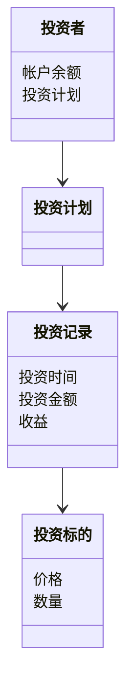
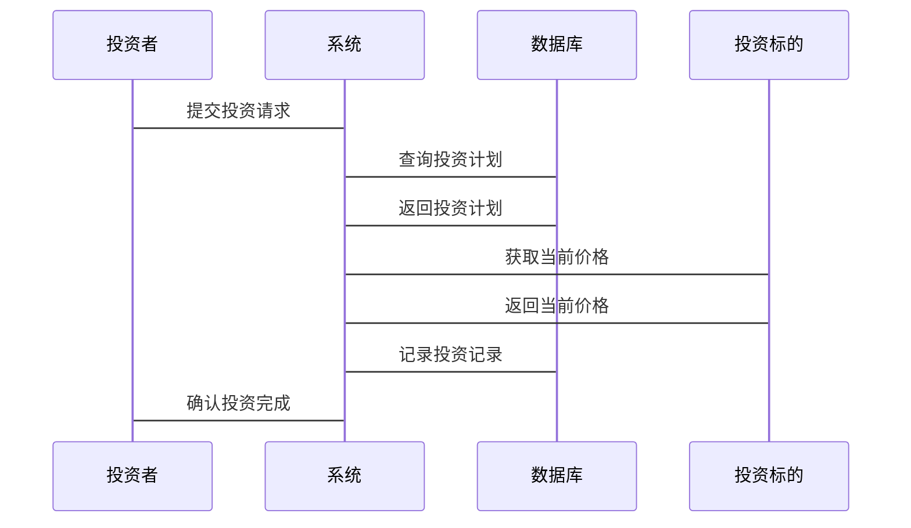

                 


# 爱德华·索普的定期不定额投资法

> 关键词：定期不定额投资法，爱德华·索普，投资策略，数学模型，系统设计

> 摘要：本文详细介绍了爱德华·索普提出的定期不定额投资法，从其背景、核心概念、算法原理、系统设计到项目实战，层层剖析，结合数学模型和系统架构，全面阐述了这一投资策略的优势和实现方法。

---

## 第一部分：爱德华·索普定期不定额投资法的背景与核心概念

### 第1章：爱德华·索普投资理论的起源与核心思想

#### 1.1 爱德华·索普的学术背景与投资理念
爱德华·索普（Edward Thorp）是20世纪著名的数学家和投资理论家，他在概率论和随机过程领域有着深厚的造诣。索普的投资理念基于数学模型和统计分析，强调通过科学的方法降低投资风险，提高收益。

##### 1.1.1 爱德华·索普的学术成就
索普在数学和统计学领域有着卓越的贡献，他将这些理论应用到投资领域，提出了许多创新的投资策略。他的学术背景为他提出定期不定额投资法奠定了坚实的基础。

##### 1.1.2 索普投资理论的核心思想
索普的核心思想是通过分散投资和定期投资来降低市场波动带来的风险。他认为，市场是不确定的，但通过科学的投资策略，可以最大限度地降低风险并实现长期稳定的收益。

##### 1.1.3 索普投资法的哲学基础
索普的投资哲学强调长期性和纪律性。他认为，市场波动是不可避免的，但通过定期投资和分散投资，可以避免短期波动的影响，实现长期的财富积累。

#### 1.2 定期不定额投资法的基本概念
定期不定额投资法是一种投资策略，强调定期投入固定金额，无论市场环境如何。这种方法通过分散投资时间和金额，降低市场波动对投资组合的影响。

##### 1.2.1 投资法的定义与特点
定期不定额投资法的核心是定期定额投资，即在固定的间隔时间内，以固定金额投资于特定资产。这种方法通过分批投资，降低市场波动对投资组合的影响。

##### 1.2.2 投资法的核心要素
- **时间间隔**：定期投资的时间间隔，如每月、每季度或每年。
- **投资金额**：每次投资的固定金额。
- **投资标的**：选择的投资资产，如股票、债券或指数基金。
- **风险控制**：通过分散投资和定期调整投资组合，降低风险。

##### 1.2.3 投资法与传统投资策略的对比
传统的投资策略通常基于市场预测和短期交易，而定期不定额投资法则强调纪律性和长期性。通过比较两种策略，可以更好地理解定期不定额投资法的优势。

---

### 第2章：定期不定额投资法的核心原理与应用

#### 2.1 定期不定额投资法的原理
定期不定额投资法通过分散投资时间和金额，降低市场波动对投资组合的影响。这种方法的核心在于通过时间的分散和金额的固定，避免因市场波动而造成的大额损失。

##### 2.1.1 投资金额的分配策略
- **均匀分配**：将资金均匀分配到固定的间隔时间内，每次投资固定金额。
- **动态调整**：根据市场情况动态调整每次投资的金额，但保持时间间隔不变。

##### 2.1.2 投资时间的选择策略
- **固定间隔**：选择固定的间隔时间进行投资，如每月一次。
- **动态间隔**：根据市场波动调整投资时间间隔。

##### 2.1.3 投资标的的选择策略
- **分散投资**：将资金分配到不同的资产类别，如股票、债券、房地产等，以降低风险。
- **集中投资**：将资金集中投资于少数优质资产，以提高收益。

#### 2.2 定期不定额投资法的数学模型
定期不定额投资法的核心在于其数学模型，通过数学公式计算投资收益和风险。

##### 2.2.1 投资收益的数学表达式
$$ R = \frac{A}{P} \times r $$
其中，\( R \) 表示收益，\( A \) 表示投资金额，\( P \) 表示投资价格，\( r \) 表示收益率。

##### 2.2.2 投资风险的数学模型
$$ \sigma = \sqrt{\frac{1}{n}\sum_{i=1}^{n}(x_i - \mu)^2} $$
其中，\( \sigma \) 表示标准差，\( x_i \) 表示每次投资的收益，\( \mu \) 表示平均收益。

##### 2.2.3 投资组合优化的数学公式
$$ \max \mu \quad \text{subject to} \quad \sigma \leq \sigma_{\text{max}} $$
其中，\( \mu \) 表示投资组合的平均收益，\( \sigma \) 表示投资组合的风险，\( \sigma_{\text{max}} \) 表示可接受的最大风险。

---

## 第三部分：定期不定额投资法的系统设计与实现

### 第3章：系统分析与架构设计方案

#### 3.1 问题场景介绍
定期不定额投资法的应用需要一个高效的系统来实现投资策略的执行和管理。

##### 3.1.1 投资者需求
投资者需要一个能够自动执行定期不定额投资的系统，同时能够实时监控投资组合的表现。

##### 3.1.2 系统功能需求
- **自动投资**：根据设定的时间间隔和金额自动执行投资。
- **风险监控**：实时监控投资组合的风险，及时发出预警。
- **收益计算**：计算投资收益，并生成报告。

#### 3.2 系统功能设计
##### 3.2.1 领域模型


##### 3.2.2 系统架构设计


##### 3.2.3 系统接口设计
- **API 接口**
  - `POST /investment`：提交投资请求。
  - `GET /portfolio`：获取投资组合信息。
  - `GET /risk`：获取投资风险评估。

##### 3.2.4 系统交互设计


---

### 第4章：项目实战

#### 4.1 环境安装
- **Python 环境**：安装 Python 3.x 及以上版本。
- **依赖库安装**：安装 `numpy`, `pandas`, `matplotlib` 等库。

#### 4.2 核心代码实现
##### 4.2.1 投资计划生成
```python
import numpy as np
import pandas as pd
import matplotlib.pyplot as plt

def generate_investment_plan(start_date, end_date, amount, frequency):
    dates = pd.date_range(start=start_date, end=end_date, freq=frequency)
    return dates, [amount] * len(dates)
```

##### 4.2.2 投资记录生成
```python
def execute_investment(dates, amounts, investment_target):
    records = []
    for date, amount in zip(dates, amounts):
        price = investment_target.get_price(date)
        quantity = amount / price
        records.append((date, amount, quantity))
    return records
```

##### 4.2.3 投资收益计算
```python
def calculate_returns(records):
    returns = []
    for i in range(1, len(records)):
        prev_amount = records[i-1][1]
        current_amount = records[i][1]
        returns.append((records[i][0], current_amount - prev_amount))
    return returns
```

##### 4.2.4 风险评估
```python
def calculate_variance(returns):
    mean_return = np.mean(returns)
    variance = np.mean((r - mean_return)**2 for r in returns)
    return variance
```

---

### 第5章：最佳实践与总结

#### 5.1 投资法的优势
- **分散风险**：通过定期不定额投资，降低了市场波动对投资组合的影响。
- **纪律性**：定期投资强制投资者坚持长期投资，避免情绪化决策。
- **简单易行**：不需要频繁监控市场，适合长期投资者。

#### 5.2 实际操作中的注意事项
- **选择合适的资产**：根据自身的风险承受能力和投资目标选择合适的资产。
- **保持纪律性**：定期不定额投资需要长期坚持，不能随意中断。
- **定期调整**：根据市场变化和个人财务状况，适当调整投资计划。

#### 5.3 拓展阅读
- 《The Intelligent Investor》：本杰明·格雷厄姆的投资理念。
- 《The Mathematics of Financial Markets》：数学在金融市场中的应用。

---

## 作者：AI天才研究院/AI Genius Institute & 禅与计算机程序设计艺术/Zen And The Art of Computer Programming

---

本文通过详细分析爱德华·索普的定期不定额投资法，从理论到实践，全面阐述了这一投资策略的优势和实现方法。通过数学模型、系统设计和项目实战，帮助读者更好地理解和应用这一投资策略。

