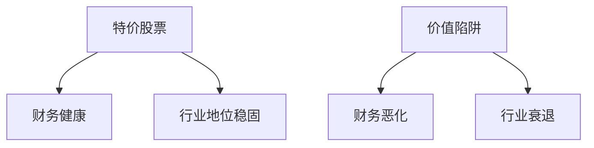
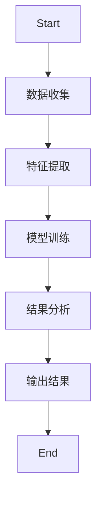
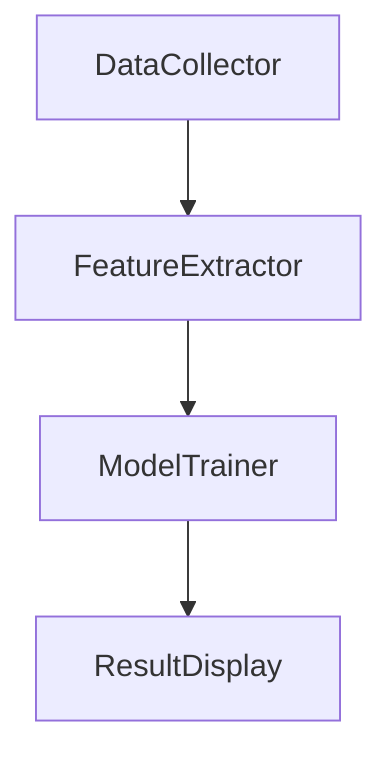

                 


# 特价股票与价值陷阱的区分方法

> 关键词：特价股票、价值陷阱、投资策略、股票分析、风险管理

> 摘要：本文详细探讨了特价股票和价值陷阱的区分方法，通过分析它们的核心概念、属性对比、算法原理、系统设计和实际案例，帮助投资者识别真正的投资机会，避免价值陷阱。文章结合技术语言和专业分析，提供了从理论到实践的全面指导。

---

## 第1章：引言

### 1.1 特价股票与价值陷阱的基本概念

#### 1.1.1 特价股票的定义
特价股票指的是那些市场价格低于其内在价值的股票，通常出现在市场低估或公司暂时遇到困境时。这类股票具有较高的投资潜力，因为它们的价格可能在未来恢复其真实价值。

#### 1.1.2 价值陷阱的定义
价值陷阱是指那些看似便宜，但实际上存在严重问题（如财务困境、管理问题或行业衰退）的股票。投资者如果误将价值陷阱误认为特价股票，可能会遭受重大损失。

#### 1.1.3 两者的区别与联系
特价股票和价值陷阱都可能价格低廉，但前者具有成长潜力，而后者存在根本性的问题，无法恢复。

### 1.2 区分的重要性

#### 1.2.1 投资者为何需要区分
投资者需要区分特价股票和价值陷阱，以避免重大损失，并抓住真正的投资机会。

#### 1.2.2 区分对投资决策的影响
准确区分可以提高投资决策的质量，降低风险，提升投资回报。

#### 1.2.3 如何避免价值陷阱
通过深入分析公司的财务状况、行业地位和管理团队，投资者可以避免掉进价值陷阱。

---

## 第2章：核心概念与联系

### 2.1 特价股票与价值陷阱的属性对比

| 属性          | 特价股票                | 价值陷阱                |
|---------------|-------------------------|-------------------------|
| 财务状况       | 财务健康，可能暂时低估   | 财务恶化，问题严重       |
| 市场表现       | 可能短期低迷，长期上升   | 长期低迷，难以恢复       |
| 行业地位       | 行业地位稳固             | 行业衰退或竞争力不足     |
| 管理团队       | 管理团队能力强           | 管理团队存在问题         |

### 2.2 特价股票与价值陷阱的对比分析

#### 2.2.1 对比表格
如上表所示，特价股票和价值陷阱在多个方面存在显著差异。

#### 2.2.2 对比图示


---

## 第3章：算法原理讲解

### 3.1 数据收集与特征提取

#### 3.1.1 数据来源
从股票数据库获取历史价格、财务数据、行业指标等。

#### 3.1.2 特征选择
选择关键特征，如市盈率、市净率、ROE（净资产收益率）等。

### 3.2 算法流程图



### 3.3 数学模型与公式

#### 3.3.1 线性回归模型
$$ y = \beta_0 + \beta_1x + \epsilon $$
其中，$y$是目标变量，$x$是自变量，$\beta$是回归系数，$\epsilon$是误差项。

#### 3.3.2 决策树模型
使用决策树进行分类，判断股票是特价股票还是价值陷阱。

### 3.4 代码实现

```python
import pandas as pd
from sklearn.tree import DecisionTreeClassifier
from sklearn.metrics import accuracy_score

# 数据加载与预处理
data = pd.read_csv('stocks.csv')
features = data[['市盈率', '市净率', 'ROE']]
labels = data['分类']

# 模型训练
model = DecisionTreeClassifier()
model.fit(features, labels)

# 预测与评估
predictions = model.predict(features)
print("准确率：", accuracy_score(labels, predictions))
```

---

## 第4章：系统分析与架构设计

### 4.1 系统功能设计

#### 4.1.1 功能模块
- 数据采集模块：从数据库获取股票数据。
- 特征提取模块：提取关键特征。
- 模型训练模块：训练分类模型。
- 结果展示模块：输出结果。

#### 4.1.2 功能流程图


### 4.2 系统架构设计

#### 4.2.1 架构图


---

## 第5章：项目实战

### 5.1 环境安装

#### 5.1.1 安装依赖
```bash
pip install pandas scikit-learn
```

### 5.2 核心实现

#### 5.2.1 数据预处理
```python
import pandas as pd

data = pd.read_csv('stocks.csv')
data.dropna(inplace=True)
```

#### 5.2.2 模型实现
```python
from sklearn.tree import DecisionTreeClassifier

model = DecisionTreeClassifier()
model.fit(X_train, y_train)
```

### 5.3 案例分析

#### 5.3.1 数据分析
分析某公司股票数据，判断其是否为特价股票。

#### 5.3.2 结果解读
根据模型预测结果，判断股票类型。

---

## 第6章：风险管理

### 6.1 风险管理策略

#### 6.1.1 分散投资
避免将所有资金投入单一股票。

#### 6.1.2 设置止损
设定止损点，防止亏损过大。

### 6.2 风险模型

#### 6.2.1 风险评估公式
$$ \text{风险值} = \sum (\text{概率} \times \text{损失}) $$

---

## 第7章：结论与展望

### 7.1 结论

通过系统分析和实际案例，投资者可以有效区分特价股票和价值陷阱，提升投资决策的质量。

### 7.2 未来展望

未来的研究可以进一步优化算法，结合更多特征，提高区分的准确性。

---

作者：AI天才研究院/AI Genius Institute & 禅与计算机程序设计艺术 /Zen And The Art of Computer Programming

