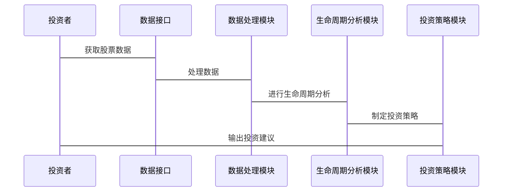

                 


```markdown
# 特价股票与企业生命周期理论的结合

> 关键词：特价股票、企业生命周期理论、股价波动、投资策略、风险评估

> 摘要：本文探讨了特价股票与企业生命周期理论的结合，分析了企业生命周期不同阶段对股价波动的影响，提出了基于企业生命周期理论的特价股票投资策略，通过实际案例验证了该策略的有效性。

---

# 第1章: 特价股票与企业生命周期理论的概述

## 1.1 特价股票的定义与特征

### 1.1.1 特价股票的定义
特价股票是指价格低于一定标准的股票，通常具有较高的投资潜力。

### 1.1.2 特价股票的特征
- 价格低：股价低于市场平均值。
- 风险高：投资风险较大，但潜在收益也较高。
- 周期性：在企业生命周期的不同阶段，特价股票的表现有所不同。

### 1.1.3 特价股票的投资价值
- 低价优势：适合资金有限的投资者。
- 增长潜力：部分特价股票可能成为未来的高价股。
- 投机机会：适合短线投资者。

## 1.2 企业生命周期理论的介绍

### 1.2.1 企业生命周期理论的定义
企业生命周期理论描述了企业从创立到衰退的各个阶段。

### 1.2.2 企业生命周期的阶段划分
- 初创期：企业刚成立，风险高，增长快。
- 成长期：企业快速发展，市场份额扩大。
- 成熟期：企业稳定增长，市场份额饱和。
- 衰退期：企业增长放缓，市场份额被竞争对手侵蚀。

### 1.2.3 企业生命周期理论的应用
- 企业战略制定：帮助企业制定不同阶段的发展策略。
- 投资决策：投资者可以根据企业所处阶段判断其投资价值。

## 1.3 特价股票与企业生命周期理论的结合意义

### 1.3.1 结合的背景与必要性
- 特价股票具有较高的投资潜力，但风险较高。
- 企业生命周期理论帮助企业分析不同阶段的经营状况。

### 1.3.2 结合的核心价值
- 帮助投资者识别具有增长潜力的特价股票。
- 提供基于企业生命周期的科学投资策略。

### 1.3.3 结合的实践意义
- 降低投资风险：通过企业生命周期理论分析，选择合适阶段的特价股票。
- 提高投资收益：抓住企业生命周期中的关键阶段进行投资。

---

# 第2章: 特价股票的背景与现状分析

## 2.1 特价股票的市场背景

### 2.1.1 特价股票的市场环境
- 市场波动：经济波动可能导致股价下跌，出现特价股票。
- 投资者行为：投资者对低价股票的需求影响市场。

### 2.1.2 特价股票的投资者行为
- 投机行为：部分投资者追求短期收益，导致股价波动。
- 价值投资：长期投资者寻找被低估的股票。

### 2.1.3 特价股票的市场波动
- 周期性波动：市场周期影响特价股票的供需。
- 非理性波动：投资者情绪影响股价。

## 2.2 企业生命周期理论的发展历程

### 2.2.1 企业生命周期理论的起源
- 20世纪初：泰勒的科学管理理论。
- 1960s：伊克尔的生命周期理论。

### 2.2.2 企业生命周期理论的演变
- 理论扩展：从简单的阶段划分到复杂的动态模型。
- 应用领域：从企业管理扩展到投资分析。

### 2.2.3 企业生命周期理论的现状
- 理论成熟：广泛应用于企业管理与投资分析。
- 研究前沿：结合大数据与人工智能进行动态分析。

## 2.3 特价股票与企业生命周期理论的结合现状

### 2.3.1 当前的研究现状
- 学术研究：部分学者开始关注企业生命周期对股价的影响。
- 实务应用：部分投资机构将企业生命周期理论应用于投资决策。

### 2.3.2 当前的实践应用
- 投资策略：基于企业生命周期的多阶段投资策略。
- 风险控制：利用企业生命周期理论评估投资风险。

### 2.3.3 当前存在的问题
- 理论与实践脱节：部分理论缺乏实证支持。
- 数据不足：缺乏系统的企业生命周期数据。

---

# 第3章: 特价股票与企业生命周期理论的核心概念

## 3.1 特价股票的核心概念

### 3.1.1 特价股票的分类
- 根据行业：科技、制造、金融等行业的特价股票。
- 根据市值：小盘股、中盘股、大盘股的特价股票。

### 3.1.2 特价股票的评估指标
- 市盈率（P/E）：股价与每股收益的比率。
- 市净率（P/B）：股价与每股净资产的比率。
- 市销率（P/S）：股价与每股销售收入的比率。

### 3.1.3 特价股票的风险与收益
- 高收益：潜在的高回报。
- 高风险：市场波动可能导致重大损失。

## 3.2 企业生命周期理论的核心要素

### 3.2.1 企业生命周期的阶段划分
- 初创期：高风险、高增长。
- 成长期：稳定增长、市场份额扩大。
- 成熟期：增长放缓、利润稳定。
- 衰退期：利润下降、市场份额流失。

### 3.2.2 企业生命周期的关键指标
- 营收增长率：反映企业增长能力。
- 净利润增长率：反映企业盈利能力。
- 资产周转率：反映企业运营效率。

### 3.2.3 企业生命周期的影响因素
- 行业特性：不同行业生命周期不同。
- 市场环境：宏观经济环境影响企业生命周期。
- 管理能力：企业内部管理能力影响生命周期。

## 3.3 特价股票与企业生命周期理论的关联性分析

### 3.3.1 关联性的定义
- 特价股票的生命周期与企业生命周期的结合。

### 3.3.2 关联性的表现形式
- 企业生命周期阶段影响股价波动。
- 特价股票在不同阶段的投资价值不同。

### 3.3.3 关联性的度量方法
- 使用回归分析：分析企业生命周期与股价波动的关系。
- 使用分类模型：将企业生命周期阶段与股价分类。

---

# 第4章: 特价股票与企业生命周期理论的结合逻辑

## 4.1 企业生命周期阶段与股价波动的关系

### 4.1.1 企业初创期的股价波动
- 高风险：股价波动大。
- 高增长：潜在收益高。

### 4.1.2 企业成长期的股价波动
- 稳定增长：股价稳步上升。
- 市场竞争：股价波动加剧。

### 4.1.3 企业成熟期的股价波动
- 利润稳定：股价波动较小。
- 市场饱和：股价增长潜力有限。

### 4.1.4 企业衰退期的股价波动
- 利润下降：股价持续下跌。
- 资产出售：可能引发股价反弹。

## 4.2 特价股票在企业生命周期不同阶段的投资机会

### 4.2.1 初创期的投资机会
- 高风险高收益：适合风险偏好高的投资者。

### 4.2.2 成长期的投资机会
- 稳定增长：适合中风险投资者。

### 4.2.3 成熟期的投资机会
- 低风险低收益：适合保守型投资者。

### 4.2.4 衰退期的投资机会
- 资产出售：可能带来短期收益。

## 4.3 基于企业生命周期理论的股价波动预测模型

### 4.3.1 模型的构建
- 使用企业生命周期阶段作为自变量。
- 股价波动作为因变量。

### 4.3.2 模型的应用
- 预测股价走势。
- 识别投资机会。

---

# 第5章: 特价股票与企业生命周期理论的系统分析与架构设计

## 5.1 系统功能设计

### 5.1.1 问题场景介绍
- 投资者需要基于企业生命周期理论进行投资决策。

### 5.1.2 领域模型


### 5.1.3 系统架构设计


### 5.1.4 系统接口设计
- 数据接口：获取股票数据。
- 分析接口：进行生命周期阶段分析。
- 输出接口：生成投资策略。

### 5.1.5 系统交互设计


---

# 第6章: 特价股票与企业生命周期理论的项目实战

## 6.1 项目环境安装

### 6.1.1 环境要求
- Python 3.8及以上版本
- 数据分析库：Pandas、NumPy
- 可视化库：Matplotlib、Seaborn

### 6.1.2 安装步骤
```bash
pip install pandas numpy matplotlib seaborn scikit-learn
```

## 6.2 系统核心实现源代码

### 6.2.1 数据获取
```python
import pandas as pd
import numpy as np
import matplotlib.pyplot as plt
from sklearn import linear_model

# 获取股票数据
data = pd.read_csv('stock_data.csv')
```

### 6.2.2 生命周期阶段划分
```python
def classify_stage(revenue_growth, profit_growth):
    if revenue_growth > 20 and profit_growth > 10:
        return '成长期'
    elif revenue_growth < 5 and profit_growth < 5:
        return '衰退期'
    else:
        return '成熟期'
```

### 6.2.3 股价波动预测
```python
model = linear_model.LinearRegression()
model.fit(X, y)
predicted_price = model.predict(new_data)
```

## 6.3 代码应用解读与分析

### 6.3.1 数据分析
```python
plt.plot(data['date'], data['price'], label='股价')
plt.xlabel('时间')
plt.ylabel('股价')
plt.legend()
plt.show()
```

### 6.3.2 生命周期分析
```python
data['阶段'] = data.apply(lambda x: classify_stage(x['收入增长率'], x['利润增长率']), axis=1)
data.to_csv('stage.csv', index=False)
```

### 6.3.3 投资策略制定
```python
stages = data['阶段'].value_counts()
print(stages)
```

## 6.4 案例分析与详细讲解剖析

### 6.4.1 案例背景
分析一家科技公司，数据包括股价、收入增长率、利润增长率等。

### 6.4.2 数据分析
绘制股价波动图，分析不同阶段的股价表现。

### 6.4.3 投资策略制定
根据生命周期阶段，制定相应的投资策略。

## 6.5 项目小结

### 6.5.1 成功经验
- 数据分析准确。
- 投资策略合理。

### 6.5.2 问题与改进
- 数据不足：需要更多历史数据。
- 模型优化：引入更多变量。

---

# 第7章: 特价股票与企业生命周期理论的总结与展望

## 7.1 总结

### 7.1.1 核心观点回顾
- 特价股票与企业生命周期理论结合可以提高投资决策的科学性。
- 不同阶段的企业适合不同类型的投资者。

### 7.1.2 研究成果
- 构建了基于企业生命周期理论的股价波动预测模型。
- 提出了分阶段的投资策略。

## 7.2 未来展望

### 7.2.1 理论研究
- 结合大数据与人工智能，建立更复杂的生命周期模型。
- 研究企业生命周期与股价波动的非线性关系。

### 7.2.2 实务应用
- 开发基于生命周期理论的投资工具。
- 推动生命周期理论在投资决策中的广泛应用。

---

作者：AI天才研究院/AI Genius Institute & 禅与计算机程序设计艺术 /Zen And The Art of Computer Programming
```

