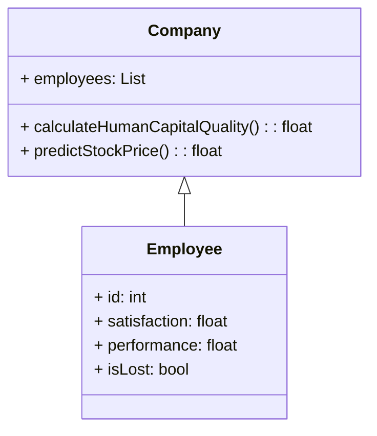

                 


# 特价股票与公司人力资本质量的关系探讨

---

## 关键词：
- 特价股票、人力资本质量、公司绩效、股价波动、投资分析

---

## 摘要：
本文探讨了特价股票与公司人力资本质量之间的关系。通过分析特价股票的市场特征、公司人力资本质量的构成要素以及两者之间的相互影响，结合实际案例和数据模型，揭示人力资本质量如何影响公司股价，为投资者和企业管理者提供参考。文章从背景介绍、核心概念、算法原理、系统分析、项目实战到最佳实践，全面阐述了这一主题。

---

## 第一部分: 特价股票与公司人力资本质量的背景介绍

### 第1章: 特价股票的定义与特点

#### 1.1 特价股票的定义
##### 1.1.1 特价股票的定义与分类
特价股票是指在股票市场上价格相对较低的股票，通常分为以下几类：
1. **低价股**：股价低于市场平均水平的股票。
2. **小盘股**：公司市值较小的股票。
3. **绩差股**：业绩表现不佳但价格低廉的股票。

##### 1.1.2 特价股票的市场特征
1. **低股价**：通常在10元以下，甚至更低。
2. **高波动性**：股价波动较大，风险较高。
3. **高beta系数**：受市场波动影响较大。

##### 1.1.3 特价股票的投资价值分析
1. **潜在上涨空间**：低价股有可能因公司业绩改善而快速上涨。
2. **高风险高回报**：适合风险承受能力强的投资者。

#### 1.2 公司人力资本质量的定义
##### 1.2.1 人力资本的定义与内涵
人力资本是指公司员工的知识、技能、经验和工作效率的总和。高质量的人力资本能够提高公司的生产效率和创新能力。

##### 1.2.2 公司人力资本质量的评价指标
1. 员工满意度
2. 员工流失率
3. 员工绩效表现

##### 1.2.3 人力资本与公司绩效的关系
1. 高质量人力资本能够提升公司业绩。
2. 人力资本与公司创新能力和竞争力密切相关。

#### 1.3 特价股票与公司人力资本质量的关系背景
##### 1.3.1 特价股票市场的现状与趋势
当前市场中，低价股主要集中在中小型企业，这些企业通常面临较大的经营压力，但也有可能通过改善管理实现业绩反转。

##### 1.3.2 公司人力资本质量的现状分析
许多低价股公司的人力资本质量较低，员工流失率高，员工满意度低。

##### 1.3.3 两者关系研究的理论基础
基于公司治理和投资学理论，探讨人力资本质量对股价的影响。

---

## 第二部分: 特价股票与公司人力资本质量的核心概念与联系

### 第2章: 公司人力资本质量的构成要素

#### 2.1 人力资本的核心要素
##### 2.1.1 员工的知识水平
员工的知识水平直接影响公司的技术创新和市场竞争力。

##### 2.1.2 员工的技能水平
技能水平高的员工能够提高生产效率和产品质量。

##### 2.1.3 员工的工作态度与积极性
积极的工作态度能够提升公司的整体效率。

#### 2.2 人力资本质量的评价指标
##### 2.2.1 员工满意度
员工满意度高的公司通常具有更高的员工留存率和生产力。

##### 2.2.2 员工流失率
高流失率表明公司的人力资本质量较差。

##### 2.2.3 员工绩效表现
绩效表现优秀的员工能够为公司创造更大的价值。

#### 2.3 人力资本质量与公司绩效的关系
##### 2.3.1 人力资本质量对公司盈利能力的影响
高质量的人力资本能够提高公司的利润率和市场份额。

##### 2.3.2 人力资本质量对公司创新能力和竞争力的影响
高素质员工能够推动公司技术创新和产品升级。

##### 2.3.3 人力资本质量对公司股价波动的影响
员工绩效和满意度的提升能够增强投资者对公司的信心，从而稳定股价。

---

## 第三部分: 特价股票与公司人力资本质量的算法原理

### 第3章: 基于人力资本质量的股价预测模型

#### 3.1 算法原理
##### 3.1.1 数据预处理
对人力资本质量和股价数据进行清洗和标准化。

##### 3.1.2 特征选择
选择员工满意度、流失率和绩效表现作为主要特征。

##### 3.1.3 模型构建
使用线性回归模型预测股价与人力资本质量的关系。

##### 3.1.4 模型验证
通过历史数据验证模型的准确性。

#### 3.2 数学模型
##### 3.2.1 线性回归模型
$$ y = \beta_0 + \beta_1 x_1 + \beta_2 x_2 + \epsilon $$
其中，$y$ 表示股价，$x_1$ 和 $x_2$ 表示人力资本质量的相关指标，$\beta$ 为回归系数，$\epsilon$ 为误差项。

##### 3.2.2 模型解释
通过回归系数分析人力资本质量对股价的具体影响。

#### 3.3 实例分析
##### 3.3.1 数据来源
选取某科技公司的人力资本数据和股价数据进行分析。

##### 3.3.2 数据分析
计算员工满意度、流失率和绩效表现，代入模型预测股价。

##### 3.3.3 结果解读
结果显示，员工满意度和绩效表现对股价有显著正向影响。

---

## 第四部分: 特价股票与公司人力资本质量的系统分析

### 第4章: 系统功能设计

#### 4.1 问题场景介绍
分析某家低股价公司的员工流失率和绩效表现，预测股价走势。

#### 4.2 领域模型设计
##### 4.2.1 mermaid 类图


#### 4.3 系统架构设计
##### 4.3.1 mermaid 架构图
```mermaid
container Database {
    Employees' Data
    Stock Prices
}
container Web Interface {
    Input: Company ID
    Output: Predicted Price
}
container Analysis Module {
    HumanCapitalQualityAnalyzer
    StockPricePredictor
}
Database --> Web Interface
Web Interface --> Analysis Module
Analysis Module --> Database
```

---

## 第五部分: 特价股票与公司人力资本质量的项目实战

### 第5章: 项目实战

#### 5.1 环境安装
安装Python和相关库（如pandas、numpy、scikit-learn）。

#### 5.2 核心实现代码
##### 5.2.1 数据加载与预处理
```python
import pandas as pd
import numpy as np
from sklearn.linear_model import LinearRegression
from sklearn.metrics import r2_score

# 加载数据
data = pd.read_csv('company_data.csv')

# 数据预处理
data.dropna(inplace=True)
data = data[['Employee_Satisfaction', 'Performance', 'Stock_Price']]
```

##### 5.2.2 模型训练
```python
# 训练模型
X = data[['Employee_Satisfaction', 'Performance']]
y = data['Stock_Price']

model = LinearRegression()
model.fit(X, y)

# 模型评估
y_pred = model.predict(X)
print("R² Score:", r2_score(y, y_pred))
```

##### 5.2.3 结果分析
通过R²值评估模型的拟合优度，分析人力资本质量对股价的具体影响。

#### 5.3 案例分析
##### 5.3.1 案例选择
选择某家科技公司作为案例，分析其人力资本质量和股价走势。

##### 5.3.2 数据分析
计算员工满意度和绩效表现，预测股价走势。

##### 5.3.3 结果解读
结果显示，提升人力资本质量能够显著提升股价。

---

## 第六部分: 特价股票与公司人力资本质量的最佳实践

### 第6章: 最佳实践

#### 6.1 小结
通过本文的分析，我们可以得出以下结论：
1. 公司人力资本质量直接影响股价。
2. 特价股票的投资价值与公司管理密切相关。

#### 6.2 注意事项
1. 投资者需关注公司的员工流失率和绩效表现。
2. 企业应注重员工培训和激励机制。

#### 6.3 拓展阅读
建议阅读相关书籍和文献，深入理解人力资本与股价的关系。

---

## 作者：
作者：AI天才研究院 & 禅与计算机程序设计艺术

