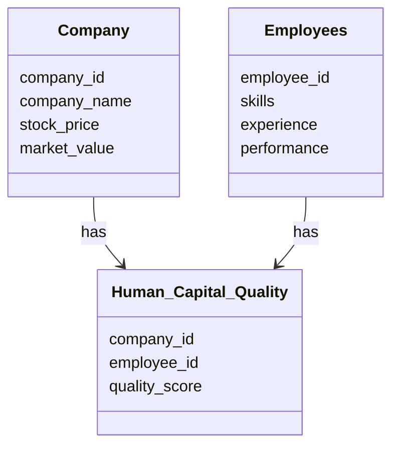

                 


# 特价股票与公司人力资本质量的关联分析

## 关键词：特价股票、人力资本质量、关联分析、统计回归、公司绩效

## 摘要：本文通过分析特价股票与公司人力资本质量之间的关联性，探讨了人力资本质量对股价波动的影响。结合统计回归模型和ER图，本文揭示了两者之间的内在联系，并提出了提升公司人力资本质量以优化股价的策略。

---

# 第1章: 特价股票与公司人力资本质量的背景介绍

## 1.1 特价股票的定义与特点

### 1.1.1 特价股票的定义
特价股票是指价格相对较低的股票，通常具有较高的投资潜力。这类股票可能来自财务状况不佳或处于成长期的公司，但具有较高的增长空间。

### 1.1.2 特价股票的核心特点
- 价格低廉，适合小额投资。
- 高增长潜力，可能因公司改善而股价上涨。
- 风险较高，需谨慎选择。

### 1.1.3 特价股票的市场表现与投资价值
特价股票在市场波动时可能更具吸引力，但需关注公司基本面。

## 1.2 公司人力资本质量的定义与构成

### 1.2.1 人力资本的定义
人力资本是指员工的知识、技能和经验的总和，是公司竞争力的重要组成部分。

### 1.2.2 人力资本质量的核心要素
- 员工技能：员工的专业能力和技术熟练度。
- 员工经验：工作经验的丰富程度。
- 员工绩效：员工的工作成果和效率。

### 1.2.3 人力资本质量的评价指标
- 员工培训投入：公司对员工培训的资源和时间。
- 员工满意度：员工对工作环境和待遇的满意度。
- 员工流失率：员工的稳定性和忠诚度。

## 1.3 特价股票与公司人力资本质量的关联性

### 1.3.1 关联性的背景与问题背景
- 特价股票的价格波动可能受公司内部管理的影响。
- 人力资本质量高的公司通常更具竞争力，可能推动股价上升。

### 1.3.2 关联性问题的描述与解决思路
- 描述：分析人力资本质量与股价之间的关系。
- 解决思路：通过统计分析和回归模型，量化人力资本对股价的影响。

### 1.3.3 关联性研究的边界与外延
- 研究边界：限于公司内部因素，不考虑宏观经济因素。
- 研究外延：探讨人力资本如何通过绩效影响股价。

### 1.3.4 关联性研究的核心概念结构与要素组成
- 核心概念：人力资本质量、股价波动。
- 关联机制：人力资本→公司绩效→股价波动。

## 1.4 本章小结
本章介绍了特价股票和人力资本质量的定义及特点，并提出了两者关联性的研究框架。

---

# 第2章: 特价股票与公司人力资本质量的核心概念与联系

## 2.1 特价股票与公司人力资本质量的核心概念原理

### 2.1.1 特价股票的核心原理
- 低价吸引投资者。
- 公司基本面改善推动股价上涨。

### 2.1.2 公司人力资本质量的核心原理
- 高质量人力资本提升公司绩效。
- 绩效提升推动股价上涨。

### 2.1.3 两者关联的核心机制
- 人力资本→公司绩效→股价波动。

## 2.2 特价股票与公司人力资本质量的属性特征对比

| 属性         | 特价股票             | 人力资本质量       |
|--------------|----------------------|---------------------|
| 核心要素     | 股价、公司基本面      | 员工技能、经验、绩效 |
| 影响因素     | 市场需求、公司业绩    | 培训、管理、薪酬     |
| 目标         | 投资收益             | 提升公司竞争力       |

## 2.3 特价股票与公司人力资本质量的ER实体关系图

```mermaid
er
    Company {
        company_id
        company_name
        stock_price
        market_value
    }
    Employees {
        employee_id
        skills
        experience
        performance
    }
    Human_Capital_Quality {
        company_id
        employee_id
        quality_score
    }
    defines
        Company - Human_Capital_Quality: company_employee
        Employees - Human_Capital_Quality: employee_id
```

---

# 第3章: 特价股票与公司人力资本质量的算法原理讲解

## 3.1 统计回归模型

### 3.1.1 回归分析的基本原理
回归分析通过建立因变量（股价）和自变量（人力资本质量）之间的关系模型，量化自变量对因变量的影响。

### 3.1.2 线性回归模型
模型：$$y = \beta_0 + \beta_1x_1 + \beta_2x_2 + \epsilon$$
- y：股价
- x1, x2：人力资本质量指标
- β：回归系数
- ε：误差项

### 3.1.3 回归模型的实现步骤
1. 数据收集：收集公司股价和人力资本数据。
2. 数据预处理：清洗数据，处理缺失值。
3. 模型构建：选择合适的人力资本指标作为自变量。
4. 模型训练：使用最小二乘法估计回归系数。
5. 模型验证：检验模型的显著性和拟合度。

### 3.1.4 Python代码实现

```python
import pandas as pd
import numpy as np
from sklearn.linear_model import LinearRegression
from sklearn.metrics import r2_score

# 数据预处理
data = pd.read_csv('company_data.csv')
data = data.dropna()

# 特征选择
X = data[['employee_skill', 'employee_experience', 'employee_performance']]
y = data['stock_price']

# 模型训练
model = LinearRegression()
model.fit(X, y)

# 模型验证
y_pred = model.predict(X)
r2 = r2_score(y, y_pred)
print(f'R-squared: {r2}')
print(f'回归系数: {model.coef_}')
print(f'截距: {model.intercept_}')
```

## 3.2 回归模型的数学公式

### 3.2.1 单变量回归
$$y = \beta_0 + \beta_1x + \epsilon$$

### 3.2.2 多变量回归
$$y = \beta_0 + \beta_1x_1 + \beta_2x_2 + \beta_3x_3 + \epsilon$$

### 3.2.3 回归系数的解释
- β系数：衡量自变量对因变量的影响程度。
- 正系数：自变量增加，因变量增加。

## 3.3 回归模型的验证与优化

### 3.3.1 模型显著性检验
- F检验：检验回归模型的显著性。
- p值：小于0.05表示显著。

### 3.3.2 模型拟合度
- R-squared：模型解释因变量的百分比。

### 3.3.3 模型优化
- 增加或删除变量。
- 检查多重共线性。

---

# 第4章: 特价股票与公司人力资本质量的系统分析与架构设计

## 4.1 系统背景介绍

### 4.1.1 项目背景
研究人力资本质量对股价的影响，帮助投资者做出更明智的投资决策。

## 4.2 领域模型设计



## 4.3 系统架构设计

### 4.3.1 系统架构图


### 4.3.2 系统功能模块
- 数据采集模块：收集公司和员工数据。
- 数据分析模块：进行回归分析。
- 可视化模块：展示结果。

---

# 第5章: 特价股票与公司人力资本质量的项目实战

## 5.1 项目环境安装

### 5.1.1 安装Python环境
安装Python和必要的库（pandas, numpy, scikit-learn）。

## 5.2 系统核心实现源代码

```python
import pandas as pd
import numpy as np
from sklearn.linear_model import LinearRegression
from sklearn.metrics import r2_score

# 数据预处理
data = pd.read_csv('company_data.csv')
data = data.dropna()

# 特征选择
X = data[['employee_skill', 'employee_experience', 'employee_performance']]
y = data['stock_price']

# 模型训练
model = LinearRegression()
model.fit(X, y)

# 模型验证
y_pred = model.predict(X)
r2 = r2_score(y, y_pred)
print(f'R-squared: {r2}')
print(f'回归系数: {model.coef_}')
print(f'截距: {model.intercept_}')
```

## 5.3 代码应用解读与分析

### 5.3.1 数据预处理
处理缺失值和异常值，确保数据质量。

### 5.3.2 模型训练
使用线性回归模型，训练数据并预测股价。

### 5.3.3 结果分析
- R-squared值：模型的解释能力。
- 回归系数：人力资本对股价的影响程度。

## 5.4 实际案例分析

### 5.4.1 案例背景
某公司人力资本质量高，股价表现稳定。

### 5.4.2 数据分析
通过回归模型，发现人力资本质量与股价呈正相关。

### 5.4.3 结果解读
高质量人力资本显著提升公司股价表现。

## 5.5 项目小结
项目成功建立人力资本与股价的回归模型，为投资决策提供依据。

---

# 第6章: 特价股票与公司人力资本质量的最佳实践

## 6.1 小结

### 6.1.1 核心观点总结
- 人力资本质量对股价有显著影响。
- 提升人力资本质量有助于优化股价表现。

## 6.2 注意事项

### 6.2.1 数据质量
确保数据准确性和完整性。

### 6.2.2 模型局限性
回归模型假设线性关系，可能存在误差。

### 6.2.3 投资风险
股价受多种因素影响，投资需谨慎。

## 6.3 拓展阅读

### 6.3.1 相关书籍
- 《股票投资实战技巧》
- 《人力资本管理》

### 6.3.2 相关文章
- 人力资本对股价的影响研究。
- 统计回归在股票分析中的应用。

---

# 作者：AI天才研究院/AI Genius Institute & 禅与计算机程序设计艺术 /Zen And The Art of Computer Programming

---

感谢您的阅读！希望本文能为您提供有价值的信息和启发。如需进一步探讨或获取代码，请随时联系。

