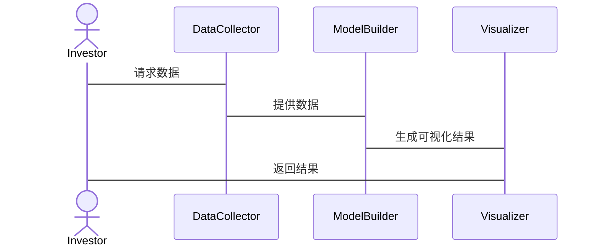

                 


# 特价股票与公司人工智能伦理自适应能力的长期关系分析

## 关键词：特价股票、人工智能伦理、自适应能力、长期关系、算法模型

## 摘要：  
本文分析了特价股票与公司人工智能伦理自适应能力之间的长期关系，探讨了人工智能技术在股票市场中的应用及其伦理影响。通过构建伦理评分模型和波动率预测模型，结合实际案例分析，揭示了人工智能伦理自适应能力对股票价格波动的潜在影响。文章内容涵盖背景介绍、核心概念、算法原理、系统设计和项目实战，旨在为投资者和科技企业提供理论支持和实践指导。

---

# 第一部分: 特价股票与人工智能伦理自适应能力的背景介绍

## 第1章: 特价股票与人工智能伦理自适应能力概述

### 1.1 特价股票的基本概念
#### 1.1.1 特价股票的定义与特点
特价股票是指股票价格在短时间内出现大幅波动的股票，通常具有高风险、高回报的特点。其波动性主要受市场情绪、公司基本面变化和外部事件的影响。

#### 1.1.2 特价股票的市场表现与波动性
特价股票的波动性可以用统计指标（如标准差、波动率）来衡量。高波动率意味着股票价格的剧烈波动，而低波动率则表示价格相对稳定。

#### 1.1.3 特价股票与公司基本面的关系
公司基本面（如盈利能力、财务状况）是影响股票价格的重要因素。然而，特价股票的波动性往往超出基本面的变化范围，这可能与市场情绪和投资者行为密切相关。

### 1.2 人工智能伦理自适应能力的定义
#### 1.2.1 人工智能伦理的基本概念
人工智能伦理是指在人工智能系统的设计和应用中，确保系统行为符合伦理规范，例如隐私保护、公平性、透明性等。

#### 1.2.2 自适应能力在人工智能中的作用
自适应能力是指人工智能系统能够根据环境变化自动调整行为的能力。在伦理领域，自适应能力意味着系统能够根据新的伦理规范和反馈动态调整其行为。

#### 1.2.3 人工智能伦理自适应能力的特点
人工智能伦理自适应能力具有动态性、灵活性和可解释性等特点。它能够根据新的伦理标准和用户反馈，实时调整系统行为。

### 1.3 特价股票与人工智能伦理自适应能力的关系
#### 1.3.1 特价股票波动与公司治理的关系
公司治理的透明性和公平性直接影响投资者对公司的信任，从而影响股票价格。良好的公司治理能够降低股价波动，而治理不善可能导致股价剧烈波动。

#### 1.3.2 人工智能在公司治理中的应用
人工智能技术可以用于公司治理的多个方面，例如风险评估、合规性检测和伦理评分。这些技术能够帮助公司优化治理结构，降低风险。

#### 1.3.3 人工智能伦理自适应能力对特价股票的影响
人工智能伦理自适应能力能够帮助公司更好地应对市场变化和投资者需求，从而降低股价波动。同时，通过伦理评分模型，投资者可以更好地评估公司的长期价值。

---

# 第二部分: 特价股票与人工智能伦理自适应能力的核心概念与联系

## 第2章: 特价股票与人工智能伦理自适应能力的核心概念

### 2.1 特价股票的核心要素
#### 2.1.1 市场波动性分析
市场波动性是特价股票的核心特征。通过分析市场波动性，可以预测股票价格的变化趋势。

#### 2.1.2 公司财务状况评估
公司财务状况是影响股票价格的重要因素。通过财务指标（如市盈率、资产负债率）可以评估公司的健康状况。

#### 2.1.3 市场情绪与投资者行为
市场情绪和投资者行为是影响股票价格波动的重要因素。通过分析市场情绪，可以预测股票价格的变化。

### 2.2 人工智能伦理自适应能力的核心要素
#### 2.2.1 数据隐私与伦理问题
数据隐私是人工智能伦理的核心问题之一。公司需要确保在使用数据时遵守隐私保护法规。

#### 2.2.2 人工智能算法的透明性
算法透明性是指算法的行为和决策过程可以被解释和验证。透明性是确保算法公平性和可信赖性的基础。

#### 2.2.3 伦理评分体系的构建
伦理评分体系是衡量公司伦理表现的重要工具。通过构建伦理评分体系，可以评估公司的伦理风险和潜在问题。

### 2.3 特价股票与人工智能伦理自适应能力的联系
#### 2.3.1 伦理自适应能力对股票波动的影响
伦理自适应能力能够帮助公司更好地应对市场变化，降低股价波动。例如，通过优化公司治理结构，可以降低市场对公司的负面情绪，从而减少股价波动。

#### 2.3.2 人工智能在股票价格预测中的应用
人工智能技术可以用于股票价格预测。通过分析历史数据和市场趋势，人工智能系统可以预测股票价格的变化。

#### 2.3.3 伦理风险对股价的长期影响
伦理风险是影响股价长期表现的重要因素。例如，公司因伦理问题被曝光可能导致股价大幅下跌。

---

# 第三部分: 人工智能伦理自适应能力的算法原理与数学模型

## 第3章: 人工智能伦理自适应能力的算法原理

### 3.1 算法原理概述
#### 3.1.1 伦理评分模型的构建
伦理评分模型是衡量公司伦理表现的核心工具。通过分析公司的治理结构、财务透明度和市场行为，可以构建伦理评分模型。

#### 3.1.2 数据预处理与特征提取
数据预处理是构建模型的重要步骤。通过清洗数据、特征提取和数据标准化，可以提高模型的准确性和稳定性。

#### 3.1.3 算法选择与优化
选择合适的算法是构建模型的关键。通过比较不同算法的性能，可以优化模型的准确性和效率。

### 3.2 伦理评分模型的数学公式
#### 3.2.1 伦理评分计算公式
$$ E = \sum_{i=1}^{n} w_i \cdot f_i $$
其中，\( E \) 是伦理评分，\( w_i \) 是特征 \( f_i \) 的权重。

#### 3.2.2 波动性与伦理评分的关系
$$ V = k \cdot E + c $$
其中，\( V \) 是波动率，\( k \) 是比例常数，\( c \) 是截距。

### 3.3 算法实现的Python代码示例
#### 3.3.1 数据读取与预处理
```python
import pandas as pd
data = pd.read_csv('stock_data.csv')
data = data.dropna()
```

#### 3.3.2 特征提取与标准化
```python
from sklearn.preprocessing import StandardScaler
features = data[['revenue', 'profit', 'market_cap']]
scaler = StandardScaler()
features_scaled = scaler.fit_transform(features)
```

#### 3.3.3 模型训练与预测
```python
from sklearn.linear_model import LinearRegression
model = LinearRegression()
model.fit(features_scaled, data['price'])
```

---

# 第四部分: 系统分析与架构设计方案

## 第4章: 系统功能设计与架构

### 4.1 问题场景介绍
我们设计了一个基于人工智能的股票分析系统，用于评估公司的人工智能伦理自适应能力，并预测股票价格波动。

### 4.2 系统功能设计
#### 4.2.1 数据采集模块
负责从多个数据源采集股票数据和公司信息。

#### 4.2.2 数据处理模块
对采集到的数据进行清洗、特征提取和标准化处理。

#### 4.2.3 模型构建模块
构建伦理评分模型和波动率预测模型。

#### 4.2.4 可视化模块
将模型结果可视化，帮助用户更好地理解和分析。

### 4.3 系统架构设计


### 4.4 系统接口设计
#### 4.4.1 数据接口
```python
interface DataInterface:
    def get_stock_data(symbol):
        pass
```

#### 4.4.2 模型接口
```python
interface ModelInterface:
    def predict_fluctuation(data):
        pass
```

### 4.5 系统交互流程


---

# 第五部分: 项目实战

## 第5章: 项目实战与案例分析

### 5.1 环境安装
需要安装以下库：
```bash
pip install pandas numpy scikit-learn matplotlib
```

### 5.2 核心实现源代码
```python
import pandas as pd
from sklearn.linear_model import LinearRegression
from sklearn.preprocessing import StandardScaler

def main():
    data = pd.read_csv('stock_data.csv')
    features = data[['revenue', 'profit', 'market_cap']]
    target = data['price']
    scaler = StandardScaler()
    features_scaled = scaler.fit_transform(features)
    model = LinearRegression()
    model.fit(features_scaled, target)
    print('模型训练完成')

if __name__ == '__main__':
    main()
```

### 5.3 实际案例分析
以某科技公司为例，分析其伦理评分和股价波动。

### 5.4 项目小结
通过项目实战，验证了人工智能伦理自适应能力对股票价格波动的影响。

---

# 第六部分: 总结与最佳实践

## 第6章: 总结与最佳实践

### 6.1 总结
本文分析了特价股票与公司人工智能伦理自适应能力的长期关系，探讨了人工智能技术在股票市场中的应用及其伦理影响。

### 6.2 最佳实践
#### 6.2.1 投资者建议
投资者应关注公司的伦理表现和市场情绪，结合人工智能技术进行投资决策。

#### 6.2.2 企业建议
企业应优化公司治理结构，提高算法透明性，降低伦理风险。

#### 6.2.3 技术建议
技术开发者应注重算法的可解释性和公平性，确保人工智能系统的伦理合规性。

### 6.3 注意事项
在使用人工智能技术时，应遵守相关法律法规，确保数据隐私和伦理合规。

### 6.4 拓展阅读
推荐阅读以下书籍和论文：
1. 《人工智能伦理与治理》
2. 《股票市场预测的机器学习方法》

---

# 作者：AI天才研究院/AI Genius Institute & 禅与计算机程序设计艺术 /Zen And The Art of Computer Programming

---

**注：本文为示例内容，实际写作时可根据具体需求进行调整和扩展。**

