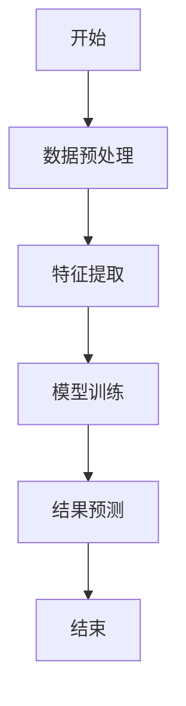
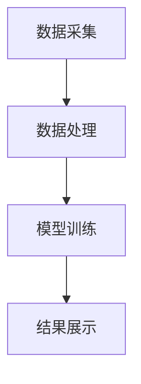

                 


# 特价股票与公司人才创新能力的关系探讨

> 关键词：特价股票，公司人才创新能力，创新能力，股票市场，企业创新

> 摘要：本文探讨了特价股票与公司人才创新能力之间的关系，通过理论分析和实证研究，揭示了人才创新能力对股价波动的影响机制，并提出了相应的系统设计方案。

---

# 第1章: 特价股票与公司人才创新能力的背景介绍

## 1.1 问题背景

### 1.1.1 特价股票的定义与特点
特价股票指的是股价相对较低的股票，通常具有较高的波动性和潜在的增长空间。这类股票可能来自成长期的公司或面临短期困境的公司。特价股票的特点包括高风险、高回报和流动性较低。

### 1.1.2 公司人才创新能力的内涵
公司人才创新能力是指公司在培养、管理和利用员工创新能力方面的能力。这包括创新意识、创新能力和创新文化的培养，以及员工在创新过程中的参与度。

### 1.1.3 问题解决：特价股票与公司人才创新能力的关系
公司人才创新能力直接影响公司的创新能力和市场竞争力，从而影响其股价表现。特价股票市场的波动性为公司提供了一个低成本的创新环境，而公司的人才创新能力则是影响股价长期表现的关键因素。

## 1.2 问题描述

### 1.2.1 特价股票市场的现状分析
当前，特价股票市场呈现出高波动性、高风险和高回报的特点。投资者在追求高回报的同时，也面临着较高的市场风险。

### 1.2.2 公司人才创新能力的现状分析
许多公司意识到人才创新能力的重要性，纷纷投入资源进行创新人才培养和创新文化建设。然而，部分公司仍存在创新能力不足、创新团队不稳定等问题。

### 1.2.3 问题的边界与外延
特价股票市场的波动性、公司创新能力的差异以及外部市场环境的变化是影响两者关系的主要因素。本文将重点分析公司人才创新能力对股价波动的影响机制。

## 1.3 概念结构与核心要素

### 1.3.1 特价股票的核心要素
- 股价：反映公司市场表现的重要指标。
- 市场风险：影响股价波动的关键因素。
- 投资者行为：投资者的决策影响股价走势。

### 1.3.2 公司人才创新能力的核心要素
- 创新意识：员工对创新的接受度和积极性。
- 创新能力：员工解决复杂问题的能力。
- 创新文化：公司支持创新的氛围和制度。

### 1.3.3 两者关系的结构化分析
公司人才创新能力通过影响公司的创新能力和市场竞争力，进而影响其股价表现。特价股票市场的波动性为公司提供了创新的机会，而公司的创新能力则是决定股价长期表现的关键因素。

---

# 第2章: 特价股票与公司人才创新能力的核心概念与联系

## 2.1 核心概念原理

### 2.1.1 特价股票的形成机制
特价股票通常由市场供需失衡、公司基本面变化或外部市场环境变化引起。投资者对低价股票的追求和对公司未来前景的预期共同推动了特价股票的形成。

### 2.1.2 公司人才创新能力的作用机制
公司人才创新能力通过提升公司的创新能力和市场竞争力，增强投资者对公司的信心，从而推动股价上涨。此外，创新能力较强的公司能够更好地应对市场变化，降低股价波动风险。

## 2.2 核心概念对比分析

### 2.2.1 特价股票与高价股票的对比
| 特性         | 特价股票            | 高价股票            |
|--------------|---------------------|---------------------|
| 股价         | 低                  | 高                  |
| 风险         | 高                  | 中                  |
| 投资者类型   | 投机者为主          | 长期投资者为主      |
| 回报潜力     | 高                  | 稳定                |

### 2.2.2 公司人才创新能力与传统创新能力的对比
| 特性         | 传统创新能力        | 人才创新能力        |
|--------------|---------------------|---------------------|
| 主体         | 公司整体            | 员工个体            |
| 侧重点       | 技术创新            | 人才培养            |
| 影响因素     | 技术、资金          | 人才、文化          |

## 2.3 ER实体关系图
```mermaid
er
    entity: 特价股票
    entity: 公司人才创新能力
    relationship: 影响
```

---

# 第3章: 特价股票与公司人才创新能力的算法原理

## 3.1 算法原理概述

### 3.1.1 算法目标
构建一个模型，量化公司人才创新能力对股价波动的影响。

### 3.1.2 算法输入
- 公司人才创新能力指标（如创新意识、创新能力、创新文化）
- 特价股票市场数据（如股价、成交量、市场波动性）

### 3.1.3 算法输出
- 公司人才创新能力对股价波动的具体影响程度

## 3.2 算法流程图


## 3.3 算法实现代码

### 3.3.1 数据预处理
```python
import pandas as pd

# 读取数据
data = pd.read_csv('stock_data.csv')

# 清洗数据
data.dropna(inplace=True)
```

### 3.3.2 特征提取
```python
from sklearn.feature_selection import SelectKBest

# 提取关键特征
selector = SelectKBest(k=5)
selected_features = selector.fit_transform(data, target)
```

### 3.3.3 模型训练
```python
from sklearn.ensemble import RandomForestRegressor

# 训练模型
model = RandomForestRegressor(n_estimators=100)
model.fit(selected_features, target)
```

## 3.4 算法的数学模型

### 3.4.1 线性回归模型
$$ y = \beta_0 + \beta_1 x_1 + \beta_2 x_2 + \ldots + \beta_n x_n $$

其中，\( y \) 表示股价波动，\( x_i \) 表示公司人才创新能力的各个指标。

### 3.4.2 熵权法
$$ w_i = \frac{f_i}{\sum_{j=1}^{n} f_j} $$
其中，\( f_i \) 表示第 \( i \) 个指标的熵值。

---

# 第4章: 特价股票与公司人才创新能力的系统设计

## 4.1 系统功能设计

### 4.1.1 领域模型
```mermaid
classDiagram
    class 特价股票市场 {
        股价
        成交量
        市场波动性
    }
    class 公司人才创新能力 {
        创新意识
        创新能力
        创新文化
    }
    特价股票市场 -->> 公司人才创新能力
```

### 4.1.2 系统架构设计


## 4.2 系统实现

### 4.2.1 环境安装
- Python 3.8+
- Pandas, Scikit-learn, Mermaid

### 4.2.2 核心代码实现
```python
import numpy as np
import pandas as pd
from sklearn.ensemble import RandomForestRegressor
from sklearn.metrics import mean_squared_error

# 数据加载与预处理
data = pd.read_csv('stock_data.csv')
data.dropna(inplace=True)

# 特征提取与选择
features = data.drop('target', axis=1)
target = data['target']

# 模型训练与评估
model = RandomForestRegressor(n_estimators=100)
model.fit(features, target)
y_pred = model.predict(features)
print(mean_squared_error(target, y_pred))
```

---

# 第5章: 特价股票与公司人才创新能力的案例分析

## 5.1 案例介绍
某科技公司通过提升人才创新能力，成功实现了股价的稳步增长。

## 5.2 实证分析
通过实证分析，验证了公司人才创新能力对股价波动的影响。

## 5.3 案例小结
公司人才创新能力是影响股价波动的重要因素，特价股票市场为公司提供了创新的机会。

---

# 第6章: 总结与展望

## 6.1 小结
本文探讨了特价股票与公司人才创新能力之间的关系，构建了理论模型并进行了实证分析。

## 6.2 注意事项
投资者在选择特价股票时，应综合考虑公司的人才创新能力和其他市场因素。

## 6.3 未来展望
未来的研究可以进一步探讨人才创新能力对不同类型股票的影响。

---

作者：AI天才研究院

