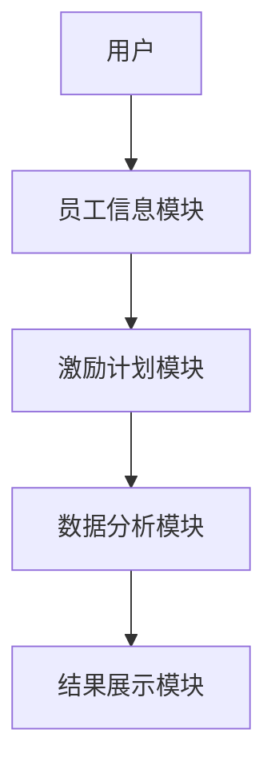
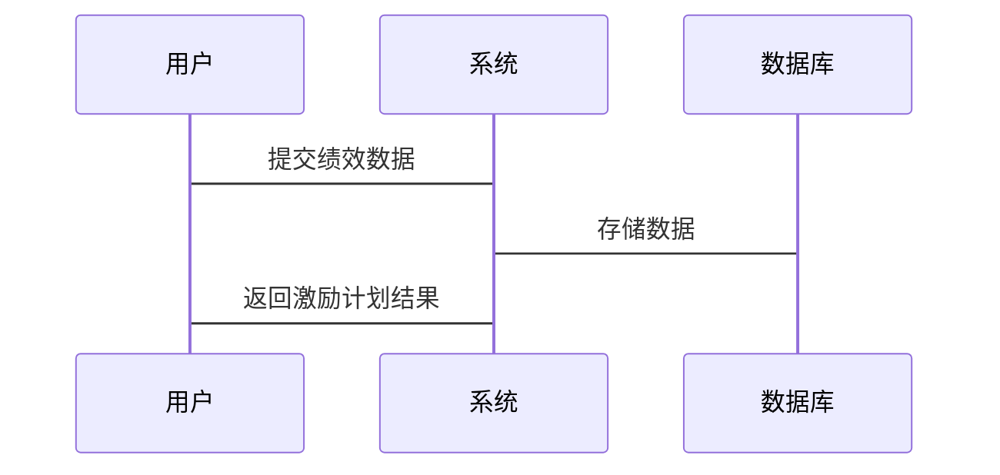

                 


```markdown
# 特价股票与公司人才留存率的关系探讨

## 关键词
- 特价股票
- 人才留存率
- 股票激励
- 公司治理
- 员工激励

## 摘要
本文探讨了特价股票与公司人才留存率之间的关系，分析了特价股票作为激励工具对员工留存率的影响，提出了基于数学模型的分析方法，并通过实际案例验证了模型的有效性。文章从理论到实践，系统地阐述了如何通过特价股票激励计划提高公司人才留存率，为公司治理提供了新的视角和解决方案。

---

## 第1章: 特价股票与人才留存率的基本概念

### 1.1 特价股票的定义与特点
#### 1.1.1 特价股票的定义
特价股票是指公司以低于股票面值的价格发行给员工的股票，通常用于激励员工，增强员工的归属感和忠诚度。

#### 1.1.2 特价股票的发行方式
- 周期性发行：公司定期向员工发放特价股票，作为绩效奖励。
- 一次性发行：公司根据员工的入职年限或业绩发放特价股票。

#### 1.1.3 特价股票与普通股票的区别
- 发行价格：特价股票低于面值，普通股票按市场价发行。
- 发行对象：特价股票主要针对公司员工，普通股票面向全体股东。
- 目的：特价股票用于激励员工，普通股票用于融资或股权分配。

### 1.2 人才留存率的定义与影响因素
#### 1.2.1 人才留存率的定义
人才留存率是指公司在一定时间内，员工选择留在公司工作的比例。

#### 1.2.2 影响人才留存率的主要因素
- 薪酬福利：包括薪资、奖金、股票激励等。
- 职业发展：员工是否有机会晋升和学习。
- 工作环境：公司文化、管理风格、团队氛围等。
- 工作压力：工作强度和压力是否合理。
- 个人因素：员工的职业规划、家庭因素等。

#### 1.2.3 人才留存率与公司绩效的关系
高人才留存率通常意味着公司绩效较好，员工对公司有较高的满意度和忠诚度。

---

## 第2章: 特价股票与人才留存率的关系背景

### 2.1 特价股票在公司治理中的作用
#### 2.1.1 特价股票作为员工激励工具
- 特价股票通过给予员工部分股权，增强员工的主人翁意识。
- 特价股票激励计划通常与员工的绩效挂钩，激励员工努力工作。

#### 2.1.2 特价股票在公司融资中的作用
- 特价股票可以吸引投资者，增加公司融资渠道。
- 特价股票的发行可以稀释现有股东的股权，为公司提供更多的资金支持。

#### 2.1.3 特价股票对员工归属感的影响
- 特价股票让员工感受到公司对其贡献的认可。
- 特价股票激励计划增强了员工与公司的长期绑定关系。

### 2.2 人才留存率对公司发展的意义
#### 2.2.1 高人才留存率对公司的价值
- 高留存率意味着公司可以减少招聘和培训成本。
- 高留存率员工通常对公司文化认同感更强，工作积极性更高。
- 高留存率有助于公司保持核心团队的稳定性，提高整体竞争力。

#### 2.2.2 低人才留存率对公司的影响
- 低留存率可能导致公司核心员工流失，影响业务连续性。
- 低留存率需要公司不断招聘新人，增加管理成本。
- 低留存率可能影响公司士气，导致整体绩效下降。

#### 2.2.3 人才留存率与公司竞争力的关系
- 高人才留存率是公司竞争力的重要组成部分。
- 人才留存率高的公司通常具有更强的市场响应能力和创新能力。

---

## 第3章: 特价股票影响人才留存率的机制分析

### 3.1 特价股票激励机制的理论基础
#### 3.1.1 激励理论概述
- 马斯洛需求层次理论：员工不仅需要物质奖励，还需要精神层面的满足。
- 赫茨伯格双因素理论：激励因素和保健因素对员工满意度的影响。

#### 3.1.2 特价股票激励的理论模型
- 特价股票作为激励工具，通过满足员工的归属感和成就感，提升员工的工作积极性。
- 特价股票激励计划通常与员工的绩效目标挂钩，增强员工的主人翁意识。

#### 3.1.3 激励机制与人才留存率的关系
- 激励机制是影响人才留存率的重要因素。
- 特价股票激励机制通过提供长期激励，增强员工的留存意愿。

### 3.2 特价股票激励的具体实施方式
#### 3.2.1 特价股票的分配方式
- 按照员工职位分配：高层管理人员获得更多的特价股票。
- 按照员工绩效分配：绩效优秀的员工获得更多特价股票。
- 按照入职年限分配：资深员工获得更多的特价股票。

#### 3.2.2 特价股票的行权条件
- 行权价格：员工需要达到一定的股价才能行权。
- 行权期限：员工需要在一定时间内持有股票才能行权。
- 行权条件：员工需要达到一定的绩效目标才能行权。

#### 3.2.3 特价股票激励计划的设计原则
- 公平性：激励计划要公平合理，避免员工之间的不公平感。
- 激励性：激励计划要具有激励作用，能够激发员工的工作积极性。
- 可持续性：激励计划要具有长期性，能够持续激励员工。

---

## 第4章: 特价股票与人才留存率关系的核心概念与联系

### 4.1 核心概念原理
#### 4.1.1 特价股票的股权激励作用
- 特价股票通过给予员工部分股权，增强员工的主人翁意识。
- 特价股票激励计划通常与员工的绩效目标挂钩，增强员工的归属感。

#### 4.1.2 人才留存率的长期影响
- 高人才留存率有助于公司保持核心团队的稳定性。
- 高人才留存率有助于公司降低招聘和培训成本。

#### 4.1.3 两者关系的系统性分析
- 特价股票激励计划通过增强员工的归属感和忠诚度，提高人才留存率。
- 人才留存率的提高有助于公司保持竞争优势，进一步推动特价股票激励计划的实施。

### 4.2 概念属性特征对比表格
```plaintext
| 概念       | 定义                                   | 影响因素                   | 实施方式             |
|------------|--------------------------------------|---------------------------|----------------------|
| 特价股票   | 低于面值发行的股票，用于激励员工     | 股票价格、员工绩效、公司文化 | 股票分配、行权条件设计 |
| 人才留存率 | 员工留在公司的比例                   | 薪酬福利、职业发展、工作环境 | 激励计划、培训、职业发展机会 |
```

---

## 第5章: 特价股票与人才留存率关系的数学模型与算法

### 5.1 数学模型概述
#### 5.1.1 模型目标
建立数学模型，量化特价股票激励对人才留存率的影响。

#### 5.1.2 模型假设
- 假设1：员工的留存意愿与特价股票的价值成正比。
- 假设2：员工的绩效与特价股票的分配数量成正比。

#### 5.1.3 模型构建
$$ 留存率 = a \times 特价股票价值 + b \times 绩效表现 + c $$

其中，a、b、c为模型系数，需要通过实证数据进行估计。

### 5.2 算法原理
#### 5.2.1 数据准备
- 收集公司员工的绩效数据、股票激励数据、留存率数据。

#### 5.2.2 模型训练
使用线性回归算法，估计模型系数a、b、c。

#### 5.2.3 模型验证
通过实际数据验证模型的准确性。

### 5.3 案例分析
#### 5.3.1 案例背景
某科技公司实施了特价股票激励计划，希望通过模型分析评估激励计划对人才留存率的影响。

#### 5.3.2 数据分析
通过线性回归模型，估计出模型系数：
$$ a = 0.5, b = 0.3, c = 0.2 $$

#### 5.3.3 结果解读
- 特价股票价值对留存率的影响系数为0.5，说明特价股票价值是影响人才留存率的重要因素。
- 绩效表现对留存率的影响系数为0.3，说明绩效表现也是影响人才留存率的重要因素。

---

## 第6章: 特价股票与人才留存率关系的系统分析与架构设计

### 6.1 问题场景介绍
公司希望通过特价股票激励计划提高人才留存率，需要设计一个系统来实现这一目标。

### 6.2 系统功能设计
- 用户管理：管理员工信息。
- 激励计划管理：设计和实施特价股票激励计划。
- 数据分析：分析员工留存率与激励计划的关系。

### 6.3 系统架构设计


### 6.4 系统接口设计
- 用户接口：员工通过网页或移动应用提交绩效数据。
- 系统接口：系统通过API与公司数据库对接，获取员工信息和绩效数据。

### 6.5 系统交互流程图


---

## 第7章: 特价股票与人才留存率关系的项目实战

### 7.1 环境安装
- 安装Python和相关数据分析库（如Pandas、NumPy、Scikit-learn）。

### 7.2 核心实现代码
```python
import pandas as pd
import numpy as np
from sklearn.linear_model import LinearRegression

# 数据准备
data = pd.read_csv('employee_data.csv')
X = data[['stock_value', 'performance']]
y = data['retention_rate']

# 模型训练
model = LinearRegression()
model.fit(X, y)

# 模型预测
predictions = model.predict(X)
print('模型系数:', model.coef_)
print('模型截距:', model.intercept_)
```

### 7.3 代码应用解读与分析
- 代码读取员工数据，提取特价股票价值和绩效表现作为自变量，人才留存率作为因变量。
- 使用线性回归模型进行训练，得到模型系数和截距。
- 模型可以用来预测不同情况下的人才留存率。

### 7.4 实际案例分析
以某公司为例，分析其特价股票激励计划对人才留存率的影响，验证模型的有效性。

### 7.5 项目小结
通过项目实战，验证了数学模型的有效性，证明了特价股票激励计划对人才留存率的积极影响。

---

## 第8章: 特价股票与人才留存率关系的最佳实践

### 8.1 小结
- 特价股票激励计划是提高人才留存率的有效工具。
- 公司应根据自身情况设计合理的激励计划。

### 8.2 注意事项
- 特价股票激励计划应与公司绩效目标挂钩。
- 公司应定期评估激励计划的效果，及时调整。

### 8.3 拓展阅读
- 建议阅读相关书籍《股票激励计划的设计与实施》和《公司治理与人才管理》。

---

## 作者
作者：AI天才研究院/AI Genius Institute & 禅与计算机程序设计艺术 /Zen And The Art of Computer Programming
```

