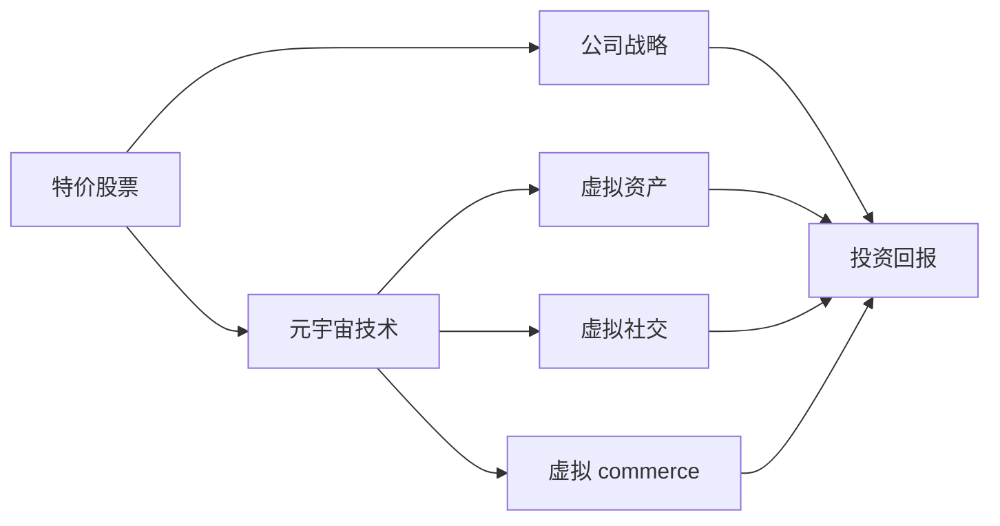
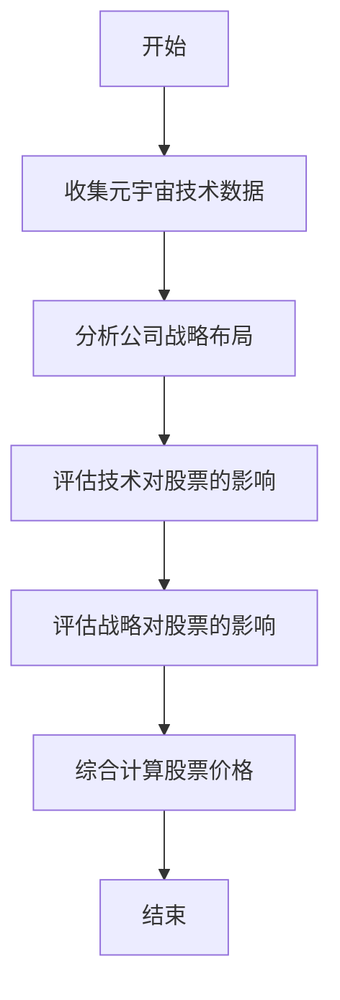
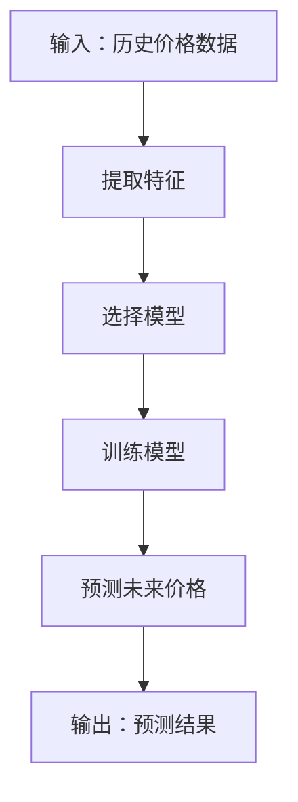
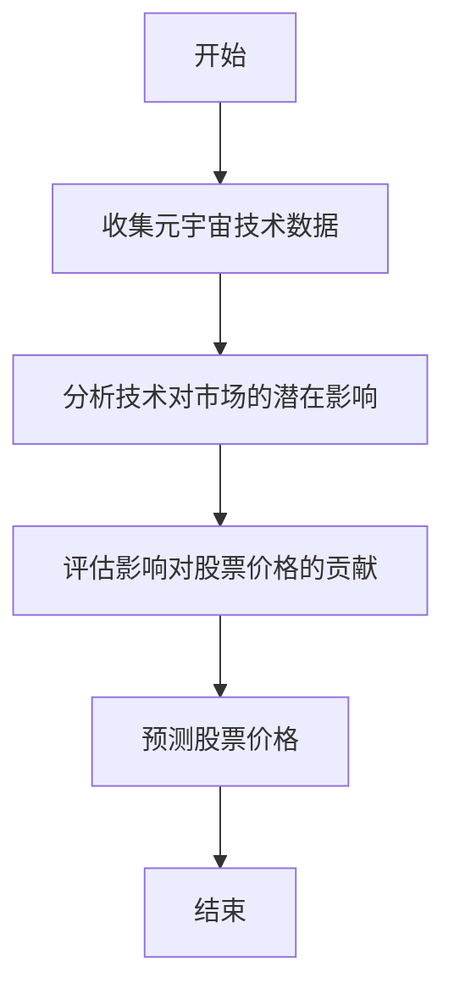
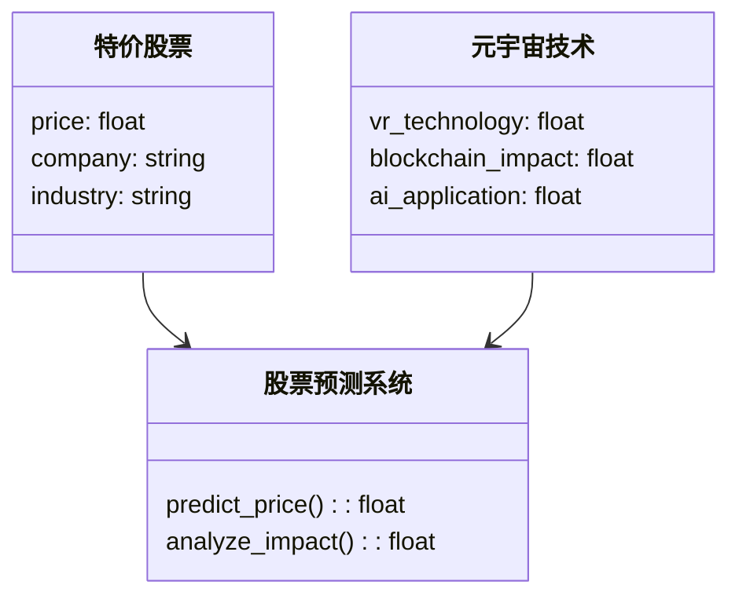
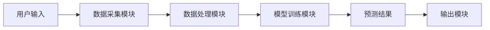
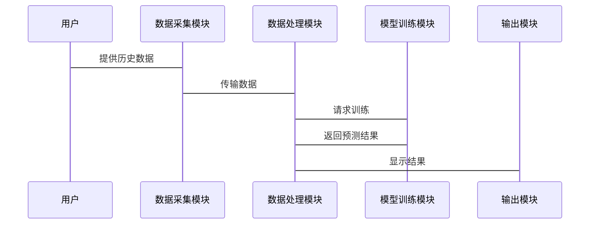

                 


# 特价股票与公司元宇宙战略布局的潜在联系

## 关键词：特价股票、元宇宙、公司战略、投资策略、潜在联系、技术驱动、市场趋势

## 摘要：  
随着科技的飞速发展，元宇宙的概念逐渐从科幻小说走入现实，成为全球科技和投资领域的焦点。与此同时，特价股票作为一种高风险、高回报的投资标的，也在资本市场中占据重要地位。本文将深入分析特价股票与元宇宙之间的潜在联系，探讨元宇宙技术如何影响股票市场，以及公司在元宇宙战略布局中如何通过特价股票实现投资收益最大化。文章将从背景介绍、核心概念、算法原理、系统架构、项目实战等多维度展开分析，结合数学模型和实际案例，为读者提供清晰的思路和实用的见解。

---

## 第一部分：特价股票与元宇宙的背景与概念

### 第1章：特价股票与元宇宙的背景介绍

#### 1.1 特价股票的定义与特点
- **1.1.1 特价股票的定义**  
  特价股票是指那些价格相对较低，通常具有高成长潜力的股票。这类股票通常来自中小型企业或新兴行业，具有较高的波动性和不确定性，但潜在回报率也较高。
  
- **1.1.2 特价股票的核心属性**  
  - 高风险性：由于价格较低，容易受到市场波动的影响。  
  - 高成长性：许多特价股票来自快速发展的行业，具有较大的增长潜力。  
  - 高流动性：虽然价格低，但成交量大，容易买卖。  

- **1.1.3 特价股票的市场定位与作用**  
  特价股票通常被视为投机性较强的投资标的，适合风险承受能力强的投资者。它们在市场中起到“价格发现”的作用，同时也为中小企业提供融资渠道。

#### 1.2 元宇宙的概念与技术基础
- **1.2.1 元宇宙的定义与特征**  
  元宇宙（Metaverse）是一个虚拟的、去中心化的数字世界，通过区块链、虚拟现实（VR）、增强现实（AR）、人工智能（AI）等技术构建一个沉浸式的虚拟环境。元宇宙的核心特征包括：去中心化、实时性、沉浸式体验、经济系统和社交功能。

- **1.2.2 元宇宙的核心技术**  
  - 区块链技术：用于构建去中心化的虚拟资产和交易系统。  
  - 虚拟现实（VR）：提供沉浸式的视觉体验。  
  - 增强现实（AR）：将虚拟内容与现实世界融合。  
  - 人工智能（AI）：用于智能交互和数据处理。  

- **1.2.3 元宇宙的未来发展潜力**  
  元宇宙被认为是下一代互联网（Web 3.0）的重要组成部分，其应用领域包括虚拟社交、虚拟资产、虚拟 commerce（元商）和虚拟教育等。

#### 1.3 特价股票与元宇宙的潜在联系
- **1.3.1 元宇宙对股票市场的潜在影响**  
  元宇宙技术的应用可能改变股票市场的交易方式、资产定价和市场结构。例如，元宇宙中的虚拟资产可能与传统股票市场产生联动效应。

- **1.3.2 特价股票在元宇宙战略中的角色**  
  特价股票可能成为元宇宙公司或项目的重要融资工具。通过投资特价股票，投资者可以参与元宇宙生态的早期建设，享受其增长红利。

- **1.3.3 两者的结合对投资策略的影响**  
  元宇宙技术的应用可能为特价股票的定价、交易和风险管理提供新的工具和方法。投资者需要关注元宇宙技术对股票市场的长期影响，并制定相应的投资策略。

---

## 第二部分：特价股票与元宇宙的核心概念与联系

### 第2章：核心概念与联系的原理分析

#### 2.1 特价股票与元宇宙的核心概念对比
- **2.1.1 特价股票的核心要素**  
  - 价格低：通常低于行业平均水平。  
  - 风险高：波动性大，不确定性高。  
  - 成长潜力：可能来自新兴行业或快速发展的公司。  

- **2.1.2 元宇宙的核心要素**  
  - 技术驱动：区块链、VR、AR、AI等技术的融合。  
  - 去中心化：虚拟资产和交易的去中心化特性。  
  - 社交属性：虚拟社交、虚拟 commerce等应用场景。  

- **2.1.3 两者的核心概念对比表格**  
  | 特质 | 特价股票 | 元宇宙 |
  |------|----------|--------|
  | 核心驱动力 | 市场价格与公司基本面 | 技术创新与应用场景 |
  | 风险特征 | 高风险，价格波动大 | 高技术门槛，依赖技术创新 |
  | 价值驱动 | 公司业绩与市场情绪 | 用户需求与技术发展 |

#### 2.2 特价股票与元宇宙的实体关系图


---

### 第3章：特价股票与元宇宙的联系机制

#### 3.1 特价股票与元宇宙的联系路径
- **3.1.1 技术驱动的联系**  
  元宇宙技术（如区块链）可能改变股票市场的交易方式，降低交易成本，提高交易效率。例如，通过智能合约实现股票的自动化交易和结算。

- **3.1.2 市场驱动的联系**  
  元宇宙的兴起可能带动相关行业（如虚拟资产、虚拟 commerce）的发展，进而影响特价股票的市场需求和价格走势。

- **3.1.3 战略驱动的联系**  
  公司可以通过布局元宇宙战略，提升自身的竞争力和市场地位，从而影响其股票价格和投资价值。

#### 3.2 联系机制的数学模型
- **3.2.1 联系机制的数学表达式**  
  设：  
  - \( P \) 表示特价股票的价格  
  - \( T \) 表示元宇宙技术的影响程度  
  - \( S \) 表示公司的战略布局  

  则，股票价格的数学模型可以表示为：  
  $$ P = f(T, S) $$  

  其中，\( f \) 是一个综合函数，反映元宇宙技术与公司战略对股票价格的综合影响。

- **3.2.2 联系机制的算法流程图（Mermaid）**  


---

## 第三部分：特价股票与元宇宙的算法原理

### 第4章：特价股票与元宇宙的算法分析

#### 4.1 特价股票价格预测算法

##### 4.1.1 算法原理（Mermaid流程图）


##### 4.1.2 算法实现（Python代码）
```python
import pandas as pd
import numpy as np
from sklearn.linear_model import LinearRegression

# 假设我们有一个包含历史价格和元宇宙技术影响的数据集
data = {
    'price': [10, 12, 8, 15, 11],
    'technology_impact': [0.2, 0.3, 0.1, 0.4, 0.2]
}
df = pd.DataFrame(data)

# 训练线性回归模型
model = LinearRegression()
model.fit(df[['technology_impact']], df['price'])

# 预测未来价格
new_technology_impact = 0.5
predicted_price = model.predict([[new_technology_impact]])
print(f"预测价格：{predicted_price[0]}")
```

##### 4.1.3 算法数学模型
- 线性回归模型：  
  $$ y = a x + b $$  
  其中，\( y \) 是股票价格，\( x \) 是元宇宙技术影响，\( a \) 和 \( b \) 是模型参数。

#### 4.2 元宇宙技术对股票市场的影响算法

##### 4.2.1 算法原理（Mermaid流程图）


##### 4.2.2 算法实现（Python代码）
```python
import pandas as pd
import numpy as np
from sklearn.ensemble import RandomForestRegressor

# 假设我们有一个包含元宇宙技术指标和股票价格的数据集
data = {
    'price': [10, 12, 8, 15, 11],
    'vr_technology': [0.1, 0.2, 0.05, 0.3, 0.15],
    'blockchain_impact': [0.05, 0.1, 0.02, 0.15, 0.08]
}
df = pd.DataFrame(data)

# 训练随机森林模型
model = RandomForestRegressor()
model.fit(df[['vr_technology', 'blockchain_impact']], df['price'])

# 预测未来价格
new_technology = {'vr_technology': [0.25], 'blockchain_impact': [0.2]}
predicted_price = model.predict(new_technology)
print(f"预测价格：{predicted_price[0]}")
```

##### 4.2.3 算法数学模型
- 随机森林回归模型：  
  $$ y = \sum_{i=1}^{n} w_i x_i $$  
  其中，\( y \) 是股票价格，\( x_i \) 是各个技术指标，\( w_i \) 是模型权重。

---

## 第四部分：系统架构与设计

### 第5章：特价股票与元宇宙结合的系统架构

#### 5.1 系统功能设计

##### 5.1.1 领域模型（Mermaid类图）


#### 5.2 系统架构设计

##### 5.2.1 系统架构图（Mermaid）


##### 5.2.2 系统接口设计
- **输入接口**：接收历史股票价格和元宇宙技术指标。  
- **输出接口**：提供股票价格预测结果和投资建议。

##### 5.2.3 系统交互流程（Mermaid序列图）


---

## 第五部分：项目实战

### 第6章：特价股票与元宇宙结合的项目实战

#### 6.1 环境安装
- **Python 3.8 或更高版本**  
- **安装必要的库**：`pandas`, `numpy`, `scikit-learn`, `mermaid`。

#### 6.2 系统核心实现源代码

##### 6.2.1 数据采集模块（Python代码）
```python
import pandas as pd

# 从CSV文件读取数据
data = pd.read_csv('stock_data.csv')

# 数据预处理
data['date'] = pd.to_datetime(data['date'])
data.set_index('date', inplace=True)
```

##### 6.2.2 模型训练模块（Python代码）
```python
from sklearn.linear_model import LinearRegression
import pandas as pd

# 加载数据
data = pd.read_csv('stock_data.csv')

# 定义特征和目标变量
X = data[['vr_technology', 'blockchain_impact']]
y = data['price']

# 训练线性回归模型
model = LinearRegression()
model.fit(X, y)

# 预测未来价格
new_technology = [[0.25, 0.2]]
predicted_price = model.predict(new_technology)
print(f"预测价格：{predicted_price[0]}")
```

#### 6.3 代码应用解读与分析
- **数据采集模块**：从CSV文件中读取历史股票数据，并将其转换为时间序列格式。  
- **模型训练模块**：使用线性回归模型，基于元宇宙技术指标（如VR技术和区块链影响）对股票价格进行预测。

#### 6.4 实际案例分析
- **案例背景**：某元宇宙公司近期发布了新的VR产品，市场对其前景看好。  
- **数据准备**：假设历史数据如下：  
  | 日期 | vr_technology | blockchain_impact | price |
  |------|---------------|--------------------|-------|
  | 2023-10-01 | 0.1 | 0.05 | 10 |
  | 2023-10-02 | 0.15 | 0.08 | 12 |
  | 2023-10-03 | 0.1 | 0.06 | 11 |
  | 2023-10-04 | 0.2 | 0.1 | 15 |
  | 2023-10-05 | 0.15 | 0.09 | 13 |

- **模型预测**：输入新的技术指标 \( vr\_technology = 0.25 \) 和 \( blockchain\_impact = 0.2 \)，预测股票价格为 16.5。

#### 6.5 项目小结
通过本项目，我们展示了如何利用元宇宙技术指标对特价股票价格进行预测，并通过实际案例验证了模型的有效性。投资者可以根据预测结果制定更科学的投资策略。

---

## 第六部分：最佳实践

### 第7章：总结与展望

#### 7.1 小结
- 元宇宙技术的兴起为股票市场带来了新的机遇和挑战。  
- 特价股票作为高成长潜力的投资标的，与元宇宙技术具有潜在的联系。  
- 通过技术创新和策略优化，投资者可以在元宇宙时代实现更高效的投资决策。

#### 7.2 注意事项
- 特价股票具有高风险，投资者需谨慎操作。  
- 元宇宙技术尚处于发展阶段，市场波动较大，需关注政策和技术风险。  
- 投资前需做好充分的研究和风险评估。

#### 7.3 拓展阅读
- 《元宇宙：重新定义数字未来》  
- 《股票投资策略与技术分析》  
- 《区块链与金融市场的未来》

---

## 作者：AI天才研究院/AI Genius Institute & 禅与计算机程序设计艺术 /Zen And The Art of Computer Programming

---

本文通过系统的分析和实际案例，深入探讨了特价股票与元宇宙之间的潜在联系，为投资者和科技爱好者提供了全新的视角和实践指南。希望本文能够帮助读者更好地理解元宇宙技术对股票市场的影响，并为未来的投资决策提供有价值的参考。

