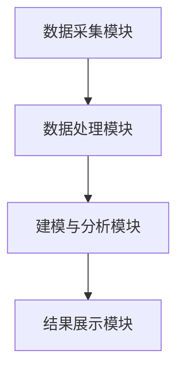

                 

# 特价股票与公司元宇宙战略执行力的潜在关联研究

**关键词**：特价股票、元宇宙、战略执行力、潜在关联、股价波动、公司战略、市场分析

**摘要**：  
本文探讨了特价股票与公司元宇宙战略执行力之间的潜在关联。从背景介绍、核心概念、算法原理、系统架构等多个方面进行分析，结合实际案例，深入研究了这两者之间的互动关系及其对股价波动的影响。文章内容涵盖问题背景、问题解决、边界与外延、核心概念与联系、算法原理、系统分析与架构设计、项目实战等，旨在为投资者和公司战略管理者提供有价值的参考。

---

# 第一部分: 特价股票与公司元宇宙战略执行力的背景与概念

## 第1章: 特价股票的基本概念与特征

### 1.1 特价股票的定义与分类

#### 1.1.1 特价股票的定义  
特价股票是指价格相对较低的股票，通常指那些市盈率、市净率等估值指标低于市场平均水平的股票。这类股票可能因公司处于困境、成长初期或市场暂时低迷而被低估。

#### 1.1.2 特价股票的分类与特点  
特价股票可以分为以下几类：  
1. **价值型股票**：基本面良好，但价格被市场低估。  
2. **成长型股票**：公司具有较高的成长潜力，但当前估值较低。  
3. **周期性股票**：受经济周期影响较大的行业股票，价格波动较大。  

#### 1.1.3 特价股票的市场表现与投资价值  
特价股票的投资价值主要体现在其低估值和潜在的上涨空间。然而，这类股票也存在较高的风险，如公司基本面恶化或市场整体低迷可能导致股价进一步下跌。

---

### 1.2 元宇宙战略执行力的核心要素

#### 1.2.1 元宇宙的定义与技术基础  
元宇宙是一个虚拟的三维空间，通过区块链、人工智能、虚拟现实等技术构建虚拟世界。其核心技术包括：  
- **区块链**：用于虚拟资产的去中心化管理。  
- **人工智能**：用于提供智能化的交互体验。  
- **虚拟现实（VR）与增强现实（AR）**：用于构建沉浸式的虚拟环境。  

#### 1.2.2 元宇宙战略执行力的定义与评估  
战略执行力是指公司在实现元宇宙战略目标的过程中，将战略转化为实际成果的能力。其评估指标包括：  
1. 战略目标的清晰度。  
2. 资源配置的效率。  
3. 执行过程中的团队协作与沟通。  

#### 1.2.3 元宇宙战略执行力与公司绩效的关系  
元宇宙战略执行力强的公司，通常能够更快地将技术创新转化为市场优势，从而提升公司绩效和股价表现。

---

### 1.3 特价股票与元宇宙战略执行力的潜在关联

#### 1.3.1 特价股票反映公司战略执行力的路径  
1. **市场反应**：公司元宇宙战略的执行力强，可能引发市场对其股票的重新估值，推动股价上涨。  
2. **技术创新**：公司在元宇宙领域的技术突破，可能提升其市场地位，从而影响股价。  

#### 1.3.2 元宇宙战略执行力对股价的潜在影响  
1. **直接影响**：公司元宇宙战略的执行成果（如新产品发布、市场份额扩大）可能直接推动股价上涨。  
2. **间接影响**：通过提升公司整体形象和投资者信心，间接影响股价。  

#### 1.3.3 特价股票与元宇宙战略执行力的协同效应  
1. **低估的潜力股**：部分特价股票可能因公司元宇宙战略的执行而被市场重新评估，股价上涨。  
2. **技术驱动的估值提升**：公司在元宇宙领域的技术突破可能提升其估值，推动股价上涨。  

---

# 第二部分: 特价股票与元宇宙战略执行力的关联机制

## 第2章: 特价股票与公司战略执行力的关系

### 2.1 特价股票与公司战略执行力的关系

#### 2.1.1 特价股票反映公司战略执行力的路径  
1. **战略目标的实现**：公司能否有效执行战略目标，直接影响其股价表现。  
2. **市场反应**：市场对公司战略执行力的评估，直接影响股价。  

#### 2.1.2 战略执行力对股价的影响  
1. **正面影响**：战略执行力强的公司，通常能够实现业绩增长，推动股价上涨。  
2. **负面影响**：战略执行力差的公司，可能导致业绩不佳，股价下跌。  

#### 2.1.3 特价股票与公司战略执行力的互动关系  
1. **双向互动**：公司战略执行力强，可能推动股价上涨，使其脱离特价股票的范畴。  
2. **动态调整**：公司通过提升战略执行力，可能改变市场对其股票的估值，影响股价走势。  

---

## 第3章: 元宇宙战略执行力对股价的潜在影响

### 3.1 元宇宙战略执行力对股价的直接影响

#### 3.1.1 技术创新的影响  
公司在元宇宙领域的技术创新，可能提升其市场竞争力，推动股价上涨。  

#### 3.1.2 市场份额的影响  
公司通过元宇宙战略扩大市场份额，可能提升其市场地位，推动股价上涨。  

---

## 第4章: 特价股票与元宇宙战略执行力的关联机制

### 4.1 特价股票与元宇宙战略执行力的协同效应

#### 4.1.1 特价股票反映公司战略执行力的路径  
1. **市场反应**：市场对公司元宇宙战略执行力的评估，直接影响股价。  
2. **技术创新**：公司元宇宙技术创新可能提升其估值，推动股价上涨。  

#### 4.1.2 元宇宙战略执行力对股价的潜在影响  
1. **直接推动**：公司元宇宙战略执行成果（如新产品发布）推动股价上涨。  
2. **间接提升**：通过提升公司形象和投资者信心，间接推动股价上涨。  

---

# 第三部分: 算法原理与系统架构

## 第5章: 特价股票与元宇宙战略执行力的算法原理

### 5.1 算法原理概述

#### 5.1.1 数据收集与处理  
1. 收集公司股价数据、元宇宙战略执行相关数据。  
2. 数据清洗与特征提取。  

#### 5.1.2 模型训练与预测  
1. 使用机器学习算法（如随机森林、神经网络）进行建模。  
2. 预测公司股价走势与战略执行力的关系。  

#### 5.1.3 结果分析与可视化  
1. 分析模型预测结果。  
2. 可视化展示股价与战略执行力的关联。  

---

## 第6章: 系统架构与项目实战

### 6.1 系统架构设计

#### 6.1.1 系统功能设计  
1. 数据采集模块：收集公司股价数据和元宇宙战略执行数据。  
2. 数据处理模块：清洗、特征提取与建模。  
3. 结果展示模块：可视化分析与报告生成。  

#### 6.1.2 系统架构图  

#### 6.1.3 系统接口设计  
1. 数据接口：与数据源对接，获取股价与战略执行数据。  
2. 用户接口：展示分析结果，供投资者参考。  

---

## 第7章: 项目实战与案例分析

### 7.1 环境安装与配置

#### 7.1.1 Python环境搭建  
安装Python、Pandas、Scikit-learn、Matplotlib等库。  

#### 7.1.2 数据获取与预处理  
使用API获取股价数据，清洗数据并提取特征。  

---

## 第8章: 总结与展望

### 8.1 总结

#### 8.1.1 主要结论  
1. 公司元宇宙战略执行力强，可能推动股价上涨。  
2. 特价股票与元宇宙战略执行力之间存在潜在关联。  

#### 8.1.2 投资建议  
投资者应关注公司元宇宙战略的执行情况，选择具有潜力的特价股票进行投资。  

### 8.2 展望

#### 8.2.1 未来研究方向  
1. 深入研究元宇宙技术对股价的长期影响。  
2. 探讨更多技术驱动的股价波动机制。  

---

# 作者：AI天才研究院/AI Genius Institute & 禅与计算机程序设计艺术 /Zen And The Art of Computer Programming

---

以上是文章的详细大纲，涵盖背景、概念、算法、系统架构、项目实战等多个方面，确保内容丰富且逻辑清晰。

