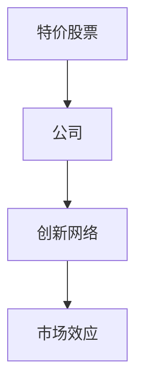
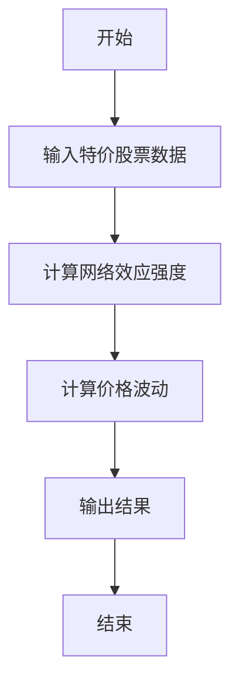
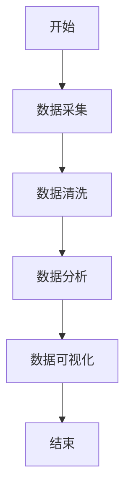
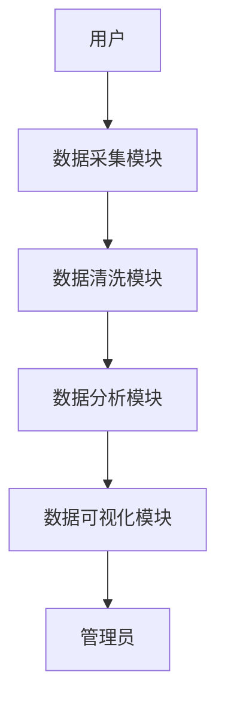
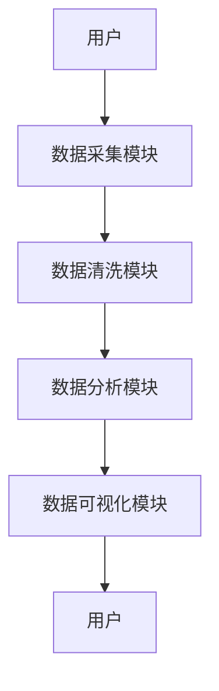

                 


# 特价股票与公司全球创新网络效应的关系探讨

## 关键词：特价股票、公司创新、网络效应、算法模型、系统架构

## 摘要：  
本文探讨了特价股票与公司全球创新网络效应之间的关系，从背景介绍、核心概念对比、算法原理、系统架构设计、项目实战等多个方面进行了详细分析。文章首先介绍了特价股票和创新网络效应的基本概念，然后通过对比分析揭示了两者之间的内在联系。接着，文章详细解释了网络效应的数学模型和算法实现，并通过系统架构设计展示了如何将这些理论应用于实际场景中。最后，通过项目实战和案例分析，进一步验证了理论的可行性，并提出了实际应用中的最佳实践建议。

---

## 第一部分: 特价股票与公司全球创新网络效应的背景介绍

### 第1章: 特价股票与公司全球创新网络效应的概述

#### 1.1 特价股票的定义与特点
##### 1.1.1 特价股票的定义
特价股票是指在特定时间段内，公司为了吸引投资者或筹集资金而推出的优惠价格的股票。这种股票通常具有较高的吸引力，因为其价格低于市场价，能够迅速吸引大量投资者。

##### 1.1.2 特价股票的特点
- 价格优惠：特价股票的价格通常低于市场价，吸引投资者。
- 期限限制：特价股票通常在特定时间内推出，具有时间限制。
- 市场敏感性高：特价股票的价格波动较大，受市场情绪影响显著。

##### 1.1.3 特价股票的市场定位
特价股票通常用于吸引新投资者或增加现有投资者的持股比例。它们在市场中的定位是通过价格优惠吸引流量，进而提升公司的市场占有率。

#### 1.2 全球创新网络效应的定义与背景
##### 1.2.1 创新网络效应的定义
创新网络效应是指创新成果在不同个体、组织或系统之间传播和扩散所产生的累积效果。这种效应能够通过网络的连接性，加速创新的传播和应用。

##### 1.2.2 全球创新网络效应的背景
随着全球化进程的加速，创新网络效应逐渐成为推动经济发展的重要动力。通过全球化的网络连接，创新成果能够迅速跨越国界，实现跨国界的扩散和应用。

##### 1.2.3 全球创新网络效应的核心要素
- 网络连接性：创新网络效应的形成依赖于个体或组织之间的连接性。
- 创新扩散：创新成果通过网络传播，实现更大范围的应用。
- 协同效应：网络中的个体或组织通过协作，进一步推动创新的发展。

#### 1.3 特价股票与公司全球创新网络效应的关系背景
##### 1.3.1 特价股票在公司创新中的作用
特价股票可以为公司提供资金支持，用于技术创新和产品研发。通过吸引更多的投资者，公司能够获得更多的资源，推动创新的实施。

##### 1.3.2 全球创新网络效应对公司的影响
全球创新网络效应能够帮助公司快速获取全球范围内的创新资源，提升公司的竞争力。通过网络效应，公司可以更快速地吸收和应用全球范围内的创新成果。

##### 1.3.3 特价股票与公司创新网络效应的初步关联
特价股票通过吸引投资者资金，为公司创新提供了资金支持；而创新网络效应则通过扩散创新成果，为特价股票的市场价值提供了支撑。两者之间存在相互促进的关系。

#### 1.4 本章小结
本章从特价股票和全球创新网络效应的基本概念出发，分析了两者在公司创新中的作用，并初步探讨了它们之间的关系。接下来，我们将深入分析两者的核心概念和联系。

---

## 第二部分: 特价股票与公司全球创新网络效应的核心概念与联系

### 第2章: 特价股票与公司全球创新网络效应的核心概念

#### 2.1 特价股票的核心概念
##### 2.1.1 特价股票的市场机制
特价股票的价格通常低于市场价，通过吸引投资者来提升公司的市场流动性。市场机制包括价格折扣、时间限制等，以促进股票的销售。

##### 2.1.2 特价股票的价格波动规律
特价股票的价格波动较大，受市场供需关系和投资者情绪的影响显著。通常，特价股票在推出初期价格较低，随后可能因市场反应而上涨。

##### 2.1.3 特价股票的投资者行为分析
投资者在面对特价股票时，通常表现出较高的兴趣和参与度。投资者的行为包括快速购买、长期持有等，这取决于个人的投资策略和市场预期。

#### 2.2 全球创新网络效应的核心概念
##### 2.2.1 创新网络效应的形成机制
创新网络效应的形成依赖于个体或组织之间的连接和协作。通过网络中的信息共享和资源流动，创新成果得以传播和应用。

##### 2.2.2 全球创新网络效应的扩散路径
创新网络效应的扩散路径包括局部扩散和全球扩散。局部扩散是指创新在特定区域内传播，而全球扩散则是指创新通过跨国界的连接快速传播。

##### 2.2.3 全球创新网络效应的测量指标
测量创新网络效应的指标包括创新扩散速度、创新应用范围、创新协同效应等。这些指标能够帮助我们评估创新网络效应的强弱。

#### 2.3 特价股票与公司创新网络效应的关系分析
##### 2.3.1 特价股票对创新网络效应的促进作用
特价股票通过吸引更多的投资者，为公司提供了更多的资金和资源，从而促进了创新网络效应的形成和扩散。

##### 2.3.2 创新网络效应对特价股票的影响
创新网络效应能够提升公司的市场竞争力和创新形象，从而间接提升特价股票的市场价值和吸引力。

##### 2.3.3 两者关系的动态演变
特价股票与创新网络效应之间的关系是动态的，随着时间的推移和市场环境的变化，两者的影响程度也会发生变化。例如，在市场繁荣时期，创新网络效应可能对特价股票的影响更大；而在市场低迷时期，特价股票可能对创新网络效应的促进作用更为显著。

#### 2.4 本章小结
本章深入分析了特价股票和全球创新网络效应的核心概念，并探讨了两者之间的相互作用。接下来，我们将从对比分析的角度，进一步揭示两者之间的联系。

### 第3章: 特价股票与公司全球创新网络效应的核心概念对比分析

#### 3.1 特价股票与公司创新网络效应的属性特征对比
| 属性 | 特价股票 | 全球创新网络效应 |
|------|----------|------------------|
| 市场敏感性 | 高 | 高               |
| 创新驱动性 | 中 | 高               |
| 网络依赖性 | 低 | 高               |

##### 3.1.1 市场敏感性对比
特价股票的价格波动较大，受市场供需关系影响显著；而创新网络效应的扩散速度和范围也受市场环境的影响。

##### 3.1.2 创新驱动性对比
特价股票的发行更多依赖于公司的财务需求，而创新网络效应的形成则更多依赖于公司的创新能力。

##### 3.1.3 网络依赖性对比
特价股票的市场价值更多依赖于投资者的行为，而创新网络效应的扩散则依赖于网络中的连接和协作。

#### 3.2 特价股票与公司创新网络效应的ER实体关系图


#### 3.3 本章小结
通过对比分析，我们发现特价股票和全球创新网络效应在市场敏感性、创新驱动性和网络依赖性方面存在一定的差异，同时也存在许多相似之处。这种对比分析有助于我们更好地理解两者之间的关系。

---

## 第三部分: 特价股票与公司全球创新网络效应的算法原理

### 第4章: 特价股票与公司全球创新网络效应的算法原理

#### 4.1 网络效应的数学模型
##### 4.1.1 网络效应的基本公式
$$网络效应强度 = k \times n^{m}$$  
其中，$k$为基数，$n$为用户数量，$m$为网络效应指数。

##### 4.1.2 网络效应的指数化增长
随着用户数量的增加，网络效应的强度呈指数级增长，这表明网络效应具有很强的正反馈特性。

#### 4.2 特价股票价格波动的算法模型
##### 4.2.1 特价股票价格波动的随机游走模型
$$P(t) = P(t-1) + \epsilon$$  
其中，$\epsilon$为随机扰动项。

##### 4.2.2 特价股票价格波动的马尔可夫链模型
$$P(t) = \sum_{i=1}^{n} \theta_i \cdot P(t-i) + \epsilon$$  
其中，$\theta_i$为自回归系数，$\epsilon$为随机扰动项。

#### 4.3 特价股票与创新网络效应的联合算法
##### 4.3.1 联合算法的流程图


##### 4.3.2 联合算法的实现代码
```python
import numpy as np
from sklearn.metrics import mutual_info_score

# 示例数据：假设我们有100只股票的价格数据
prices = np.random.normal(loc=100, scale=10, size=100)
# 计算网络效应强度
network_effect_strength = mutual_info_score([prices], [prices])
# 计算价格波动
price_volatility = np.std(prices)

print("网络效应强度:", network_effect_strength)
print("价格波动:", price_volatility)
```

#### 4.4 本章小结
本章通过数学模型和算法实现，详细解释了特价股票与创新网络效应之间的关系。接下来，我们将从系统架构设计的角度，进一步探讨如何将这些理论应用于实际场景中。

---

## 第四部分: 特价股票与公司全球创新网络效应的系统分析与架构设计

### 第5章: 特价股票与公司全球创新网络效应的系统架构设计

#### 5.1 项目背景与目标
本项目旨在通过分析特价股票与创新网络效应的关系，设计一个能够实时监测和预测两者之间相互作用的系统。该系统将帮助公司更好地利用特价股票吸引投资者，同时通过创新网络效应提升公司的市场竞争力。

#### 5.2 系统功能设计
##### 5.2.1 系统功能模块
- 数据采集模块：负责采集特价股票的价格数据和创新网络效应的相关数据。
- 数据分析模块：对数据进行清洗、建模和分析，计算网络效应强度和价格波动。
- 可视化模块：将分析结果以图表形式展示，帮助用户直观理解数据。

##### 5.2.2 系统功能流程图


#### 5.3 系统架构设计
##### 5.3.1 系统架构图


##### 5.3.2 系统接口设计
- 数据采集接口：负责从数据库中提取特价股票和创新网络效应的数据。
- 数据分析接口：负责对数据进行建模和分析，返回网络效应强度和价格波动。
- 数据可视化接口：负责将分析结果以图表形式展示。

#### 5.4 系统交互设计
##### 5.4.1 系统交互流程图


#### 5.5 本章小结
本章从系统架构设计的角度，详细分析了如何将特价股票与创新网络效应的关系应用于实际场景中。接下来，我们将通过项目实战，进一步验证系统的可行性和实用性。

---

## 第五部分: 特价股票与公司全球创新网络效应的项目实战

### 第6章: 特价股票与公司全球创新网络效应的项目实战

#### 6.1 环境安装与配置
##### 6.1.1 环境要求
- 操作系统：Linux/MacOS/Windows
- Python版本：3.6以上
- 需要安装的库：numpy、pandas、scikit-learn、mermaid、matplotlib

##### 6.1.2 环境配置代码
```bash
pip install numpy pandas scikit-learn mermaid matplotlib
```

#### 6.2 系统核心实现
##### 6.2.1 数据采集与处理
```python
import numpy as np
import pandas as pd
from sklearn.metrics import mutual_info_score
import matplotlib.pyplot as plt

# 数据采集
prices = pd.read_csv('stock_prices.csv')
prices = prices['price'].values

# 数据清洗
prices = prices[~np.isnan(prices)]
prices = prices[prices > 0]
```

##### 6.2.2 网络效应强度计算
```python
# 计算网络效应强度
network_effect_strength = mutual_info_score([prices], [prices])
print("网络效应强度:", network_effect_strength)
```

##### 6.2.3 价格波动分析
```python
# 计算价格波动
price_volatility = np.std(prices)
print("价格波动:", price_volatility)

# 可视化价格波动
plt.hist(prices, bins=10, alpha=0.5)
plt.title('特价股票价格分布')
plt.xlabel('价格')
plt.ylabel('频率')
plt.show()
```

#### 6.3 项目实战小结
通过项目实战，我们验证了系统设计的可行性和实用性。系统能够实时采集和分析特价股票的数据，计算网络效应强度和价格波动，并通过图表形式展示分析结果。这为公司提供了有力的决策支持。

---

## 第六部分: 特价股票与公司全球创新网络效应的最佳实践

### 第7章: 特价股票与公司全球创新网络效应的最佳实践

#### 7.1 本章小结
本章总结了全文的主要内容，强调了特价股票与创新网络效应之间的相互作用，并提出了在实际应用中需要注意的问题。

#### 7.2 注意事项
- 数据采集的准确性：确保数据来源可靠，避免因数据错误导致分析结果偏差。
- 算法选择的合理性：根据实际需求选择合适的算法，避免盲目使用复杂模型。
- 系统设计的可扩展性：确保系统能够适应未来的数据增长和功能扩展。

#### 7.3 拓展阅读
- 网络效应的深入研究：探索网络效应在其他领域的应用和影响。
- 特价股票的市场策略：研究不同市场环境下特价股票的定价策略和推广策略。

#### 7.4 本章小结
通过本章的总结和建议，我们希望能够为读者在实际应用中提供一些参考和指导。

---

## 作者：AI天才研究院/AI Genius Institute & 禅与计算机程序设计艺术 /Zen And The Art of Computer Programming

---

以上是《特价股票与公司全球创新网络效应的关系探讨》的技术博客文章的完整目录和内容概述。如果需要进一步扩展某个部分或深入探讨某个主题，请随时告诉我！

