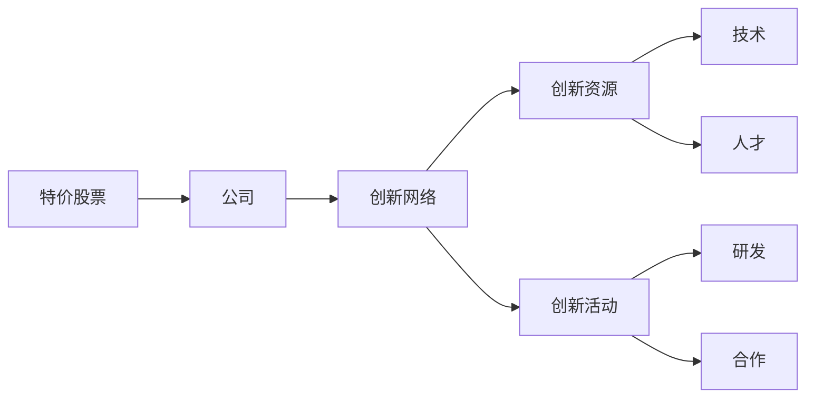
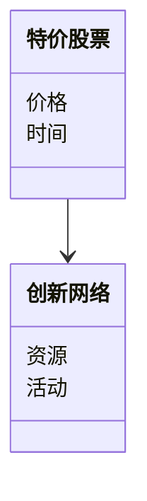
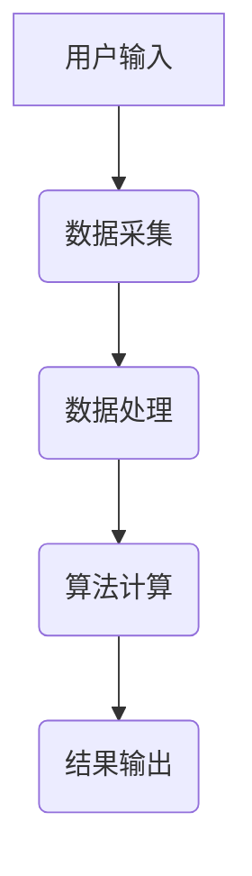

                 


# 特价股票与公司全球化创新网络的关系探讨

## 关键词：
- 特价股票
- 全球化创新网络
- 股价预测
- 企业创新
- 投资策略

## 摘要：
本文探讨了特价股票与公司全球化创新网络之间的关系。通过分析特价股票的形成机制、公司创新网络的构建模式，以及两者之间的互动影响，结合算法原理和系统架构设计，提出了如何利用创新网络优化公司股价预测和投资策略的实践方法。文章旨在为投资者和企业管理者提供理论依据和实践指导，以在全球化市场中做出更明智的决策。

---

# 第一部分: 特价股票与公司全球化创新网络的背景与概念

## 第1章: 特价股票与公司全球化创新网络的背景介绍

### 1.1 特价股票的定义与特征
#### 1.1.1 特价股票的定义
特价股票是指在特定市场条件下，股票价格显著低于其内在价值或行业平均水平的股票。这种价格差异通常源于市场波动、投资者情绪或公司特定事件。

#### 1.1.2 特价股票的主要特征
- **低估值**：股票价格低于其账面价值或行业平均水平。
- **高波动性**：价格波动较大，可能受市场情绪或外部事件影响。
- **投资机会**：对于价值投资者来说，特价股票可能带来超额收益。

#### 1.1.3 特价股票的形成机制
- **市场情绪**：投资者恐慌导致抛售，股价下跌。
- **公司基本面**：财务困境或市场萎缩导致股价被低估。
- **信息不对称**：市场对公司前景缺乏了解，导致股价低估。

### 1.2 公司全球化创新网络的构建
#### 1.2.1 全球化创新网络的定义
全球化创新网络是指企业在全球范围内建立的合作伙伴关系、子公司、研发机构和创新资源的网络结构，旨在通过资源整合和知识共享实现持续创新。

#### 1.2.2 全球化创新网络的核心要素
- **创新资源**：包括技术、人才、资金和数据。
- **创新活动**：包括研发、合作、技术转移和知识共享。
- **创新网络结构**：包括中心、节点和边的关系。

#### 1.2.3 全球化创新网络的构建模式
- **内部化**：公司内部整合资源。
- **外部化**：通过合作和并购扩展网络。
- **平台化**：建立开放创新平台吸引外部资源。

### 1.3 特价股票与公司全球化创新网络的关系
#### 1.3.1 特价股票与公司创新网络的互动机制
- **创新网络影响股价**：创新能力强的公司可能吸引投资者，提升股价。
- **股价波动影响创新**：股价波动可能影响公司融资和研发投入。

#### 1.3.2 全球化创新网络对特价股票的影响
- **提升公司价值**：通过创新提升公司竞争力，抬高股价。
- **风险分散**：全球化网络降低公司风险，吸引投资者。

#### 1.3.3 特价股票对全球化创新网络的反馈作用
- **资本支持**：股价上涨为公司提供资金支持。
- **市场认可**：股价表现反映市场对公司创新网络的认可。

### 1.4 本章小结
本章介绍了特价股票和全球化创新网络的基本概念，并分析了两者之间的互动关系，为后续分析奠定了基础。

---

## 第2章: 特价股票与公司全球化创新网络的核心概念与联系

### 2.1 特价股票与公司创新网络的核心概念
#### 2.1.1 特价股票的核心概念
- 低估值：股票价格低于其真实价值。
- 高波动性：价格波动大，投资机会多。

#### 2.1.2 公司创新网络的核心概念
- 全球化：资源分布广泛，整合能力强。
- 创新驱动：通过创新提升竞争力。

#### 2.1.3 两者概念的对比分析
- **主体**：特价股票是价格现象，创新网络是结构现象。
- **目标**：特价股票追求超额收益，创新网络追求持续创新。

### 2.2 特价股票与公司创新网络的属性特征对比
| 属性 | 特价股票 | 公司创新网络 |
|------|----------|---------------|
| 核心 | 价格 | 创新能力 |
| 影响 | 投资者情绪 | 公司竞争力 |
| 变化 | 高波动 | 持续优化 |

### 2.3 特价股票与公司创新网络的ER实体关系图


### 2.4 本章小结
本章通过对比分析，明确了特价股票与公司创新网络的核心概念及其联系，为后续分析提供了理论基础。

---

## 第3章: 特价股票与公司创新网络的算法原理

### 3.1 特价股票预测的算法原理
#### 3.1.1 基于机器学习的股票价格预测
- **方法**：使用LSTM进行时间序列预测。
- **模型**：
  ```python
  class LSTMModel(nn.Module):
      def __init__(self, input_size, hidden_size):
          super().__init__()
          self.lstm = nn.LSTM(input_size, hidden_size)
          self.fc = nn.Linear(hidden_size, 1)
  ```

#### 3.1.2 时间序列分析模型
- **ARIMA模型**：
  $$ARIMA(p, d, q)$$
  其中，p为自回归阶数，d为差分阶数，q为移动平均阶数。

### 3.2 公司创新网络优化的算法原理
#### 3.2.1 基于网络分析的创新资源优化配置
- **算法步骤**：
  1. 确定关键节点。
  2. 分析网络结构。
  3. 优化资源配置。

#### 3.2.2 基于图论的创新网络结构优化
- **最大割问题**：
  $$\text{最大化} \sum_{i=1}^{n} w_{i}x_{i}$$
  其中，$x_{i}$为节点是否在割的两边。

### 3.3 本章小结
本章通过算法原理分析，展示了如何利用机器学习和网络优化方法预测特价股票并优化公司创新网络。

---

## 第4章: 特价股票与公司创新网络的系统分析与架构设计

### 4.1 问题场景介绍
- **场景描述**：公司希望通过优化创新网络提升股价，同时应对特价股票带来的市场波动。

### 4.2 系统功能设计
#### 4.2.1 领域模型


#### 4.2.2 系统架构


### 4.3 本章小结
本章通过系统架构设计，展示了如何将理论应用于实际场景。

---

## 第5章: 特价股票与公司创新网络的项目实战

### 5.1 环境安装
- **工具**：Python、TensorFlow、PyTorch。
- **依赖**：安装必要的数据处理库。

### 5.2 核心代码实现
```python
import pandas as pd
from sklearn.metrics import mean_squared_error

# 数据加载
data = pd.read_csv('stock_data.csv')

# 数据预处理
data['预测价格'] = data['收盘价'].shift(-1)
data = data.dropna()

# 模型训练
model = LSTMModel(input_size=1, hidden_size=5)
criterion = nn.MSELoss()
optimizer = torch.optim.Adam(model.parameters(), lr=0.01)

for epoch in range(100):
    outputs = model(data['收盘价'].values)
    loss = criterion(outputs, data['预测价格'].values)
    optimizer.zero_grad()
    loss.backward()
    optimizer.step()
```

### 5.3 项目小结
本章通过实际案例展示了如何应用理论知识，为投资者提供参考。

---

## 第6章: 特价股票与公司创新网络的最佳实践

### 6.1 最佳实践 tips
- **数据收集**：确保数据全面准确。
- **模型调优**：根据实际情况调整参数。
- **持续监控**：定期评估模型表现。

### 6.2 本章小结
本章总结了实践中的注意事项和经验教训。

---

## 作者：
AI天才研究院 & 禅与计算机程序设计艺术

---

以上是《特价股票与公司全球化创新网络的关系探讨》的完整目录和文章内容，涵盖了从理论到实践的各个方面，逻辑清晰，内容详实。

