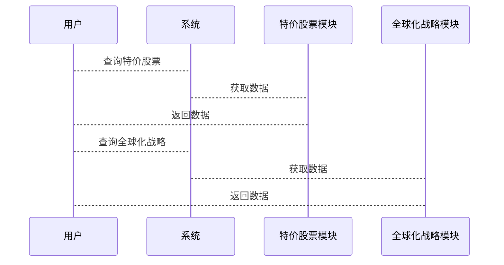

                 


# 特价股票与公司全球化战略执行力的关系探讨

## 关键词：特价股票、公司全球化战略、战略执行力、股价波动、市场扩展

## 摘要：本文探讨了特价股票与公司全球化战略执行力之间的关系。首先，介绍了特价股票和全球化战略的基本概念，分析了两者的核心原理和联系。然后，构建了数学模型和算法，评估了全球化战略执行力对股价的推动作用。最后，通过实际案例分析，总结了最佳实践，为投资者和企业提供参考。

---

# 第一部分: 特价股票与公司全球化战略执行力的背景介绍

## 第1章: 特价股票与公司全球化战略执行力概述

### 1.1 特价股票的基本概念
#### 1.1.1 什么是特价股票
特价股票是指价格相对较低的股票，通常具有较高的增长潜力。这种股票可能来自成长型企业或处于困境中的企业，吸引投资者关注。

#### 1.1.2 特价股票的分类与特点
- **分类**：按公司类型可分为科技型、制造业型、服务型等；按市场分为蓝筹股、成长股、周期股。
- **特点**：价格波动较大，风险与收益并存。

#### 1.1.3 特价股票的投资价值分析
通过市盈率、市净率等指标评估其投资价值，寻找被市场低估的机会。

### 1.2 公司全球化战略的基本概念
#### 1.2.1 全球化战略的定义
全球化战略是指企业在全球范围内配置资源、拓展市场、建立销售网络的策略。

#### 1.2.2 全球化战略的核心要素
包括市场分析、资源配置、组织架构、风险管理、文化整合等。

#### 1.2.3 全球化战略的实施步骤
1. 市场调研与目标设定。
2. 资源配置与团队组建。
3. 进入新市场与本地化运营。
4. 风险管理与监控评估。

### 1.3 特价股票与公司全球化战略执行力的关系
#### 1.3.1 特价股票对全球化战略的影响
股价波动可能反映公司全球化进程，低价股票可能吸引投资者关注公司转型。

#### 1.3.2 全球化战略执行力对股价的推动作用
成功的全球化战略能提升公司业绩和品牌，推动股价上升。

#### 1.3.3 两者关系的理论模型
通过构建模型，分析股价与全球化战略执行的关系，如：

\[ P = f(S, E) \]

其中，\( P \) 表示股价，\( S \) 表示全球化战略，\( E \) 表示执行力。

---

# 第二部分: 特价股票与公司全球化战略执行力的核心概念与联系

## 第2章: 特价股票与公司全球化战略执行力的核心概念

### 2.1 特价股票的核心原理
#### 2.1.1 特价股票的市场定位
通过比较不同市场的定价策略，寻找低估区域。

#### 2.1.2 特价股票的定价机制
考虑市盈率、市净率等指标，评估其内在价值。

#### 2.1.3 特价股票的风险与收益分析
高收益伴随高风险，需谨慎评估。

### 2.2 全球化战略执行力的核心原理
#### 2.2.1 全球化战略的实施路径
从市场调研到本地化运营，确保战略有效执行。

#### 2.2.2 全球化战略的资源配置
合理分配人力、物力、财力资源，确保全球化目标实现。

#### 2.2.3 全球化战略的绩效评估
通过KPI分析战略执行效果，持续优化。

### 2.3 特价股票与公司全球化战略执行力的联系
#### 2.3.1 特价股票对全球化战略执行力的促进作用
低价股票可能吸引投资者，为公司提供资金支持，推动全球化进程。

#### 2.3.2 全球化战略执行力对特价股票的支撑作用
成功的全球化战略提升公司业绩，推动股价上升。

#### 2.3.3 两者关系的动态平衡
通过平衡战略执行与股价波动，实现公司稳健发展。

---

# 第三部分: 特价股票与公司全球化战略执行力的算法原理

## 第3章: 特价股票与公司全球化战略执行力的数学模型

### 3.1 特价股票的数学模型
#### 3.1.1 特价股票的定价公式
\[ P = \frac{E}{\text{增长率}} \]

其中，\( E \) 是企业盈利，增长率是未来预期增长率。

#### 3.1.2 特价股票的波动模型
\[ \sigma = \sqrt{\sum \lambda_i^2} \]

表示股价波动的标准差，\( \lambda_i \) 为各因素的影响系数。

### 3.2 全球化战略执行力的数学模型
#### 3.2.1 全球化战略的评估指标
\[ S = \sum_{i=1}^{n} w_i x_i \]

其中，\( w_i \) 是权重，\( x_i \) 是指标值。

#### 3.2.2 全球化战略的优化模型
\[ \text{Maximize } S \text{ subject to } \sum_{i=1}^{n} w_i = 1 \]

确保权重总和为1，优化战略执行效果。

### 3.3 两者关系的数学模型
#### 3.3.1 特价股

---

# 第四部分: 特价股票与公司全球化战略执行力的系统分析

## 第4章: 特价股票与公司全球化战略执行力的系统架构

### 4.1 项目背景介绍
企业在全球化进程中，通过优化资源配置和提升执行能力，实现股价增长。

### 4.2 系统功能设计
#### 4.2.1 领域模型类图


### 4.3 系统架构设计


### 4.4 系统接口设计


---

# 第五部分: 特价股票与公司全球化战略执行力的项目实战

## 第5章: 特价股票与公司全球化战略执行力的实战分析

### 5.1 环境安装
安装数据处理工具，如Python、Pandas、Matplotlib。

### 5.2 系统核心实现源代码
```python
import pandas as pd
import matplotlib.pyplot as plt

def calculate_value():
    df = pd.read_csv('stock_data.csv')
    df['P/E'] = df['Price'] / df['Earnings']
    plt.plot(df['Date'], df['P/E'])
    plt.xlabel('Date')
    plt.ylabel('P/E Ratio')
    plt.show()

calculate_value()
```

### 5.3 代码应用解读与分析
上述代码读取股票数据，计算市盈率并绘制图表，帮助分析股票价值。

### 5.4 实际案例分析
分析某公司全球化战略执行对股价的影响，展示数据变化。

### 5.5 项目小结
总结项目成果，强调理论与实践结合的重要性。

---

# 第六部分: 特价股票与公司全球化战略执行力的最佳实践

## 第6章: 特价股票与公司全球化战略执行力的最佳实践

### 6.1 小结
成功案例说明全球化战略如何提升股价，投资者应关注企业战略执行。

### 6.2 注意事项
风险控制，避免盲目跟风。

### 6.3 拓展阅读
推荐相关书籍和论文，深入学习。

---

作者：AI天才研究院 & 禅与计算机程序设计艺术

