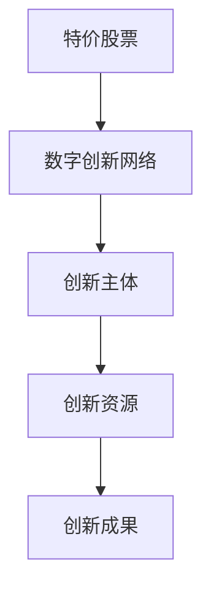
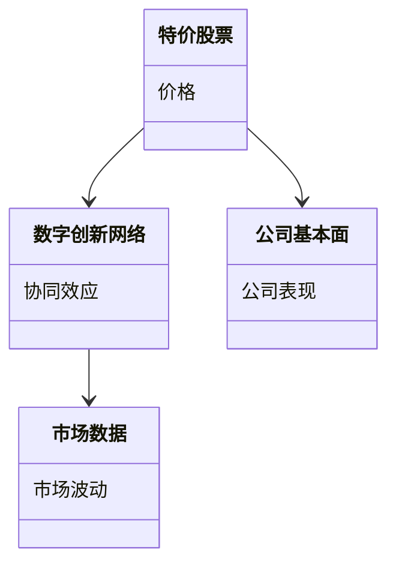

                 


# 特价股票与公司全球数字创新网络桥接作用的关系探讨

> **关键词**：特价股票，数字创新网络，桥接作用，协同效应，创新扩散
> 
> **摘要**：本文探讨了特价股票与公司全球数字创新网络之间的关系，分析了特价股票在数字创新网络中的作用及其对创新扩散的影响。文章从理论基础、核心概念、算法原理、系统架构设计、项目实战等多方面展开，结合实际案例和数学模型，深入剖析了特价股票与数字创新网络的协同效应，并提出了相应的优化策略。

---

## 第一部分: 特价股票与公司全球数字创新网络桥接作用的背景介绍

### 第1章: 特价股票与数字创新网络的定义与背景

#### 1.1 特价股票的定义与特点
##### 1.1.1 特价股票的定义
特价股票是指股票价格低于其面值（通常为每股1元）的股票。这种股票通常出现在公司面临财务困境、市场低迷或大股东减持等情况时，通过低价发行或折价交易吸引投资者。

##### 1.1.2 特价股票的特点
- **低价格**：特价股票的价格通常远低于市场平均水平，具有较高的吸引力。
- **高风险**：由于价格低廉，往往伴随着较高的市场波动性和投资风险。
- **投资机会**：对于风险承受能力强的投资者来说，特价股票可能隐藏着较高的回报潜力。

##### 1.1.3 特价股票的市场机制
- **市场供需**：特价股票的供需关系受市场整体环境和公司基本面的影响。
- **价格波动**：由于信息不对称和市场情绪的影响，特价股票的价格波动较大。
- **投资者行为**：投资者对特价股票的买卖行为直接影响其价格走势。

#### 1.2 全球数字创新网络的定义与特点
##### 1.2.1 数字创新网络的定义
数字创新网络是指由技术公司、研究机构、 startups、投资者和行业专家等组成的全球性网络，通过共享资源、知识和技术，推动数字化创新。

##### 1.2.2 数字创新网络的核心要素
- **创新主体**：包括技术公司、研究机构、 startups 等。
- **创新资源**：包括资金、技术、数据、人才等。
- **创新成果**：包括新技术、新产品、新服务等。

##### 1.2.3 数字创新网络的全球化特征
- **跨地域合作**：数字创新网络通常跨越国界，形成全球化的创新生态系统。
- **技术协同**：不同地区的技术优势互补，推动全球技术创新。
- **信息共享**：通过数字化手段，实现创新资源的高效共享。

#### 1.3 特价股票与数字创新网络的关联性
##### 1.3.1 特价股票在数字创新网络中的作用
- **融资渠道**：特价股票为技术公司提供了低成本的融资渠道。
- **市场关注**：特价股票的波动可能反映市场对技术创新的关注。
- **投资机会**：投资者通过投资特价股票间接支持技术创新。

##### 1.3.2 数字创新网络对特价股票的影响
- **技术创新推动股价**：技术创新可能提升公司股价，间接影响特价股票的价格。
- **网络协同效应**：数字创新网络的协同效应可能降低公司的运营成本，进而影响股票价格。
- **市场信息传播**：数字创新网络的信息传播可能影响特价股票的市场情绪。

##### 1.3.3 特价股票与数字创新网络的协同效应
- **技术创新与资本结合**：数字创新网络为特价股票提供技术创新的土壤，而特价股票为技术创新提供资本支持。
- **风险分担与收益共享**：通过数字创新网络，投资者和技术创新主体共同分担风险，共享收益。

---

### 第2章: 特价股票与数字创新网络的理论基础

#### 2.1 特价股票的市场理论
##### 2.1.1 市场供需理论
市场供需理论认为，特价股票的价格由市场供需关系决定。当需求超过供给时，价格可能上升；反之，供给超过需求时，价格可能下降。

##### 2.1.2 价格形成机制
特价股票的价格形成机制受到市场情绪、公司基本面、宏观经济环境等多种因素的影响。

##### 2.1.3 风险与收益的平衡
特价股票的投资风险较高，但潜在收益也较大。投资者需要在风险与收益之间找到平衡点。

#### 2.2 数字创新网络的理论框架
##### 2.2.1 数字创新网络的构建原理
数字创新网络的构建依赖于技术创新、资源共享和协同合作。通过数字化技术，创新主体可以实现资源的高效配置和知识的快速传播。

##### 2.2.2 创新扩散理论
创新扩散理论认为，技术创新通过数字创新网络在全球范围内扩散，推动技术的广泛应用和经济的持续增长。

##### 2.2.3 网络协同效应
网络协同效应是指数字创新网络中各主体之间的协同合作，通过资源共享、知识交流和技术互补，实现整体效益的最大化。

#### 2.3 特价股票与数字创新网络的理论模型
##### 2.3.1 模型构建的基本思路
通过构建数学模型，分析特价股票价格与数字创新网络之间的影响关系。

##### 2.3.2 模型的核心假设
- 数字创新网络的协同效应会影响公司的市场表现。
- 特价股票的价格波动与数字创新网络的信息传播密切相关。

##### 2.3.3 模型的验证方法
通过实证分析，验证模型的假设是否成立。

---

## 第二部分: 特价股票与数字创新网络桥接作用的核心概念与联系

### 第3章: 特价股票与数字创新网络的核心概念分析

#### 3.1 特价股票的核心概念
##### 3.1.1 特价股票的市场定位
特价股票通常定位为高风险、高潜力的投资品种，适合风险承受能力强的投资者。

##### 3.1.2 特价股票的风险评估
投资者需要对公司的基本面、行业环境和市场风险进行综合评估。

##### 3.1.3 特价股票的投资策略
投资者可以通过长期持有、价值投资等方式，降低投资风险，提高投资收益。

#### 3.2 数字创新网络的核心概念
##### 3.2.1 创新网络的结构特征
数字创新网络的结构特征包括网络的密度、中心性、模块化等，反映了网络中各主体的连接方式和协作程度。

##### 3.2.2 创新网络的动态演变
数字创新网络是一个动态演变的过程，随着技术进步和市场需求的变化，网络结构和功能也在不断调整。

##### 3.2.3 创新网络的协同机制
协同机制包括资源共享、知识交流、技术互补等，通过协同机制实现创新网络的整体效益最大化。

#### 3.3 特价股票与数字创新网络的关联性分析
##### 3.3.1 关联性的理论基础
通过创新扩散理论和网络协同效应，分析特价股票与数字创新网络之间的关联性。

##### 3.3.2 关联性的实践案例
以某技术公司为例，分析其通过数字创新网络实现技术创新，并通过特价股票融资支持创新活动的案例。

##### 3.3.3 关联性的量化指标
通过相关性分析、回归分析等方法，量化特价股票价格与数字创新网络之间的关联性。

---

### 第4章: 特价股票与数字创新网络的关系模型

#### 4.1 特价股票与数字创新网络的关系属性对比
##### 4.1.1 关联性强度
通过相关性分析，量化特价股票价格与数字创新网络之间的关联强度。

##### 4.1.2 影响方向
分析数字创新网络对特价股票价格的影响方向和程度。

##### 4.1.3 作用范围
探讨数字创新网络对特价股票的影响范围，包括局部市场和全球市场。

#### 4.2 特价股票与数字创新网络的关系模型
##### 4.2.1 模型构建的逻辑
通过数学建模，分析特价股票价格与数字创新网络之间的相互作用关系。

##### 4.2.2 模型的数学表达
$$ P = \beta_1 X + \beta_2 Y + \epsilon $$
其中，P为特价股票价格，X为数字创新网络的协同效应，Y为市场整体波动，$\epsilon$为误差项。

##### 4.2.3 模型的验证方法
通过实证分析和回归分析，验证模型的假设和参数是否显著。

#### 4.3 特价股票与数字创新网络的实体关系图


---

## 第三部分: 特价股票与数字创新网络桥接作用的算法原理

### 第5章: 特价股票与数字创新网络桥接作用的算法原理

#### 5.1 算法原理概述
通过算法分析，量化特价股票价格与数字创新网络之间的关系，优化投资策略。

#### 5.2 算法的数学模型
$$ P = \alpha X + \beta Y + \gamma Z + \epsilon $$
其中，P为特价股票价格，X为数字创新网络的协同效应，Y为市场整体波动，Z为公司基本面，$\epsilon$为误差项。

#### 5.3 算法的实现步骤
1. 数据收集：收集特价股票价格、数字创新网络数据、市场数据等。
2. 数据预处理：对数据进行清洗、标准化和特征提取。
3. 模型训练：使用回归分析等方法训练模型。
4. 模型验证：通过交叉验证等方法验证模型的准确性。
5. 结果分析：分析模型结果，优化投资策略。

#### 5.4 算法的代码实现
```python
import pandas as pd
import numpy as np
from sklearn.linear_model import LinearRegression
from sklearn.metrics import r2_score

# 数据预处理
data = pd.read_csv('data.csv')
X = data[['X', 'Y', 'Z']]
y = data['P']

# 模型训练
model = LinearRegression()
model.fit(X, y)

# 模型验证
y_pred = model.predict(X)
r2 = r2_score(y, y_pred)
print(f"R² = {r2}")
```

---

## 第六章: 系统分析与架构设计方案

### 6.1 系统分析
#### 6.1.1 问题场景介绍
通过构建一个数字创新网络，分析特价股票价格的变化，优化投资策略。

#### 6.1.2 项目介绍
项目目标：通过数字创新网络分析，优化特价股票投资策略。

### 6.2 系统架构设计
#### 6.2.1 领域模型


#### 6.2.2 系统架构设计


---

## 第七章: 项目实战

### 7.1 环境安装
安装 Python 和相关库：
```bash
pip install pandas numpy scikit-learn
```

### 7.2 系统核心实现源代码
```python
import pandas as pd
import numpy as np
from sklearn.linear_model import LinearRegression
from sklearn.metrics import r2_score

# 数据预处理
data = pd.read_csv('data.csv')
X = data[['X', 'Y', 'Z']]
y = data['P']

# 模型训练
model = LinearRegression()
model.fit(X, y)

# 模型验证
y_pred = model.predict(X)
r2 = r2_score(y, y_pred)
print(f"R² = {r2}")
```

### 7.3 代码应用解读与分析
通过代码实现模型训练和验证，分析特价股票价格与数字创新网络之间的关系。

### 7.4 实际案例分析
以某技术公司为例，分析其通过数字创新网络实现技术创新，并通过特价股票融资支持创新活动的案例。

### 7.5 项目小结
通过项目实战，验证了模型的准确性，优化了投资策略。

---

## 第八章: 总结与展望

### 8.1 总结
本文探讨了特价股票与数字创新网络之间的关系，分析了其协同效应和优化策略。

### 8.2 注意事项
投资者在进行特价股票投资时，需注意市场风险和公司基本面。

### 8.3 拓展阅读
建议进一步研究数字创新网络的协同机制和技术创新的扩散路径。

---

## 作者：AI天才研究院/AI Genius Institute & 禅与计算机程序设计艺术 /Zen And The Art of Computer Programming

