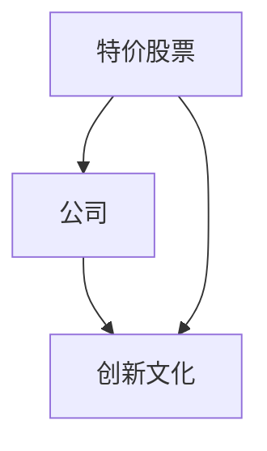
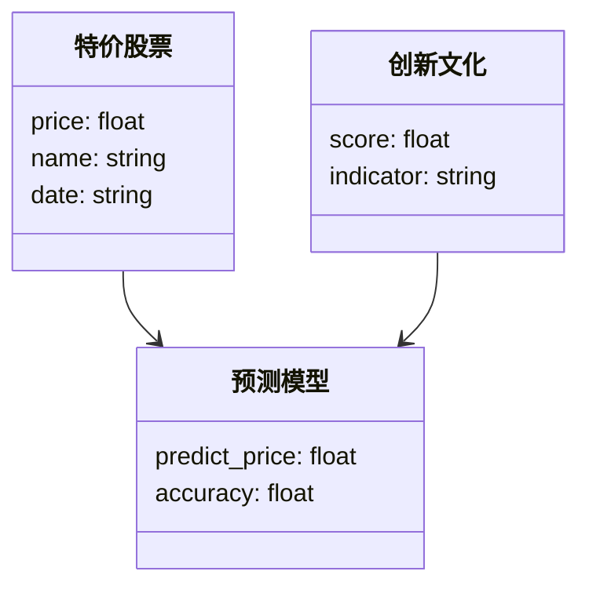
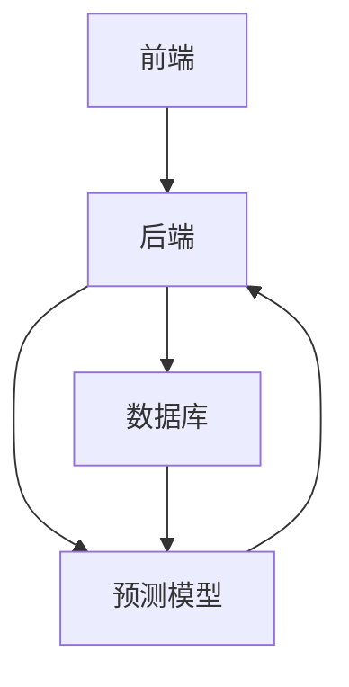

                 


# 特价股票与公司创新文化持续性的深度分析方法

> 关键词：特价股票、创新文化、持续性、算法分析、系统架构

> 摘要：本文通过分析特价股票与公司创新文化之间的关系，探讨如何通过创新文化保持公司的持续发展，同时利用算法分析特价股票的市场动态，提出一种结合创新文化与股票市场的深度分析方法，为投资者和企业管理者提供参考。

---

# 第一部分: 特价股票与公司创新文化持续性背景介绍

## 第1章: 特价股票与公司创新文化概述

### 1.1 特价股票的定义与特点

#### 1.1.1 特价股票的定义
特价股票是指在特定时间段内，由于市场波动、公司公告或其他因素导致股价显著低于其内在价值的股票。这类股票通常具有较高的投资潜力，但同时也伴随着较高的风险。

#### 1.1.2 特价股票的核心特点
- **价格波动大**：特价股票的价格受市场情绪和短期因素影响较大。
- **投资机会多**：由于价格较低，特价股票在市场回升时往往有较大的涨幅空间。
- **风险较高**：特价股票的投资风险较高，尤其是在市场低迷时。

#### 1.1.3 特价股票与普通股票的区别
| 特性 | 特价股票 | 普通股票 |
|------|----------|----------|
| 价格 | 价格较低 | 价格稳定 |
| 风险 | 风险较高 | 风险适中 |
| 投资机会 | 机会较多 | 机会较少 |

### 1.2 公司创新文化的定义与特点

#### 1.2.1 创新文化的定义
创新文化是指企业在经营过程中，鼓励员工提出新想法、新技术、新产品，并通过组织结构和激励机制将这些创新转化为实际成果的文化氛围。

#### 1.2.2 创新文化的核心要素
- **创新意识**：员工具备主动发现问题和解决问题的能力。
- **创新机制**：企业有完善的创新激励机制和流程。
- **创新资源**：企业具备支持创新的资金、技术和人力资源。
- **创新成果**：企业能够将创新转化为实际的经济价值。

#### 1.2.3 创新文化与企业绩效的关系
- **正相关**：创新文化强的企业，通常具有更高的市场竞争力和盈利能力。
- **动态关系**：创新文化对企业绩效的影响需要时间来体现。

### 1.3 特价股票与公司创新文化的关系

#### 1.3.1 特价股票对企业创新的影响
- **短期影响**：特价股票的波动可能影响企业的市场形象和资金链。
- **长期影响**：如果企业能够利用创新文化提升核心竞争力，特价股票的价值可能在长期得到提升。

#### 1.3.2 创新文化对股价的影响
- **正面影响**：创新能力强的企业通常能够吸引更多的投资者，提升股价。
- **间接影响**：创新文化通过提升企业业绩和市场地位，间接推动股价上涨。

#### 1.3.3 特价股票与创新文化相互作用的机制
- **市场波动**：特价股票的波动为企业提供了创新的动力。
- **创新成果**：企业的创新成果推动股价回升，减少特价股票的存在。

---

## 第2章: 特价股票与公司创新文化持续性的研究背景

### 2.1 特价股票市场的现状与趋势

#### 2.1.1 特价股票市场的现状分析
- 当前市场中，特价股票主要集中在中小型企业或新兴行业。
- 投资者对特价股票的兴趣受市场整体环境影响较大。

#### 2.1.2 特价股票市场的未来发展趋势
- 随着市场成熟，特价股票的波动性可能逐步降低。
- 技术进步和数据分析能力的提升将帮助投资者更好地识别特价股票的价值。

### 2.2 公司创新文化的现状与挑战

#### 2.2.1 创新文化在企业中的现状
- 大部分企业已意识到创新的重要性，但创新文化的建设仍处于初级阶段。
- 创新文化在中小企业的普及率较低。

#### 2.2.2 创新文化面临的挑战与问题
- 创新文化的缺乏导致企业竞争力不足。
- 创新机制不完善，员工创新积极性不高。

### 2.3 特价股票与创新文化持续性研究的意义

#### 2.3.1 研究的重要性
- 通过研究特价股票与创新文化的相互作用，可以帮助企业更好地应对市场波动。
- 为企业制定创新战略提供理论依据。

#### 2.3.2 研究的实际应用价值
- 为投资者提供识别具有创新潜力的特价股票的方法。
- 为企业的创新文化建设提供实践指导。

---

# 第二部分: 特价股票与公司创新文化持续性的核心概念与联系

## 第3章: 特价股票与创新文化的实体关系分析

### 3.1 特价股票与创新文化的实体关系

#### 3.1.1 实体关系的定义
特价股票与创新文化之间存在相互影响的关系，这种关系可以通过实体关系图（ER图）进行描述。

#### 3.1.2 实体关系的类型
- 特价股票影响创新文化的形成。
- 创新文化影响特价股票的市场表现。

#### 3.1.3 实体关系的分析方法
通过分析市场数据和企业案例，建立特价股票与创新文化之间的关联模型。

### 3.2 特价股票与创新文化的核心要素对比

#### 3.2.1 核心要素的定义
- 特价股票的核心要素：价格、市场波动、投资者情绪。
- 创新文化的核心要素：创新意识、创新机制、创新资源。

#### 3.2.2 核心要素的对比分析
| 特性 | 特价股票 | 创新文化 |
|------|----------|----------|
| 核心要素 | 价格、市场波动、投资者情绪 | 创新意识、创新机制、创新资源 |
| 影响因素 | 市场环境、宏观经济 | 企业战略、管理风格、员工能力 |

#### 3.2.3 核心要素的特征表格
| 特性 | 特价股票 | 创新文化 |
|------|----------|----------|
| 形成机制 | 市场供需、公司公告 | 企业战略、组织结构 |
| 持续性 | 短期波动 | 长期建设 |
| 影响范围 | 股票价格、投资者信心 | 企业绩效、市场地位 |

### 3.3 实体关系图（ER图）展示


---

## 第4章: 特价股票与创新文化持续性的算法原理

### 4.1 特价股票预测算法

#### 4.1.1 时间序列分析
时间序列分析是一种常用的方法，通过分析历史数据来预测未来趋势。

#### 4.1.2 机器学习模型
机器学习模型（如LSTM）可以捕捉数据中的复杂模式，提高预测准确性。

#### 4.1.3 算法步骤
1. 数据收集：获取特价股票的历史价格数据。
2. 数据预处理：对数据进行归一化处理。
3. 模型训练：使用LSTM模型训练数据。
4. 模型预测：利用训练好的模型预测未来股价。

#### 4.1.4 Python代码示例
```python
import numpy as np
import pandas as pd
from sklearn.preprocessing import MinMaxScaler
from tensorflow.keras.models import Sequential
from tensorflow.keras.layers import LSTM, Dense

# 数据加载与预处理
data = pd.read_csv('stock_data.csv')
data = data['Close'].values
data = data.reshape(-1, 1)
scaler = MinMaxScaler()
scaled_data = scaler.fit_transform(data)

# 划分训练集与测试集
train_data = scaled_data[:700]
test_data = scaled_data[700:]

# 构建数据集
def create_dataset(data, look_back=1):
    X, Y = [], []
    for i in range(len(data) - look_back):
        X.append(data[i:i+look_back])
        Y.append(data[i+look_back])
    return np.array(X), np.array(Y)

X_train, Y_train = create_dataset(train_data, look_back=5)
X_test, Y_test = create_dataset(test_data, look_back=5)

# 模型构建
model = Sequential()
model.add(LSTM(50, input_shape=(5, 1)))
model.add(Dense(1))
model.compile(loss='mean_squared_error', optimizer='adam')

# 模型训练
model.fit(X_train, Y_train, epochs=100, batch_size=32)

# 模型预测
predicted = model.predict(X_test)
predicted_prices = scaler.inverse_transform(predicted)
```

### 4.2 创新文化评估算法

#### 4.2.1 创新文化评估指标
- 创新意识指数（CCI）
- 创新机制指数（CMI）
- 创新资源指数（CRI）

#### 4.2.2 评估方法
通过问卷调查和数据分析，计算企业的创新文化指数。

---

## 第5章: 数学模型与公式推导

### 5.1 特价股票预测模型

#### 5.1.1 时间序列模型
$$ P_{t} = \alpha + \beta P_{t-1} + \epsilon_{t} $$

其中，$P_{t}$ 表示第 $t$ 时刻的价格，$\alpha$ 和 $\beta$ 为模型参数，$\epsilon_{t}$ 为误差项。

#### 5.1.2 机器学习模型
$$ y = f(x; \theta) $$

其中，$x$ 为输入特征，$\theta$ 为模型参数，$y$ 为预测输出。

### 5.2 创新文化评估模型

#### 5.2.1 创新文化指数公式
$$ IC = \frac{\sum_{i=1}^{n} w_i x_i}{\sum_{i=1}^{n} w_i} $$

其中，$w_i$ 为各指标的权重，$x_i$ 为各指标的得分。

---

## 第6章: 系统分析与架构设计

### 6.1 问题场景介绍

#### 6.1.1 问题背景
企业希望通过创新文化提升竞争力，同时利用特价股票市场的波动性，实现资本增值。

#### 6.1.2 问题描述
如何将创新文化与特价股票分析相结合，构建一个能够实时监控市场动态并提供决策支持的系统。

### 6.2 系统功能设计

#### 6.2.1 领域模型（Mermaid 类图）


#### 6.2.2 系统架构设计（Mermaid 架构图）


### 6.3 系统接口设计

#### 6.3.1 API 接口
- 输入：公司名称、股票代码
- 输出：创新文化指数、特价股票预测结果

#### 6.3.2 数据接口
- 数据来源：股票市场数据 API、企业创新文化数据 API

---

## 第7章: 项目实战

### 7.1 环境安装

#### 7.1.1 安装 Python
```bash
python --version
pip install --upgrade pip
```

#### 7.1.2 安装依赖包
```bash
pip install numpy pandas tensorflow scikit-learn
```

### 7.2 核心代码实现

#### 7.2.1 特价股票预测代码
```python
import numpy as np
import pandas as pd
from sklearn.preprocessing import MinMaxScaler
from tensorflow.keras.models import Sequential
from tensorflow.keras.layers import LSTM, Dense

# 数据加载与预处理
data = pd.read_csv('stock_data.csv')
data = data['Close'].values
data = data.reshape(-1, 1)
scaler = MinMaxScaler()
scaled_data = scaler.fit_transform(data)

# 划分训练集与测试集
train_data = scaled_data[:700]
test_data = scaled_data[700:]

# 构建数据集
def create_dataset(data, look_back=1):
    X, Y = [], []
    for i in range(len(data) - look_back):
        X.append(data[i:i+look_back])
        Y.append(data[i+look_back])
    return np.array(X), np.array(Y)

X_train, Y_train = create_dataset(train_data, look_back=5)
X_test, Y_test = create_dataset(test_data, look_back=5)

# 模型构建
model = Sequential()
model.add(LSTM(50, input_shape=(5, 1)))
model.add(Dense(1))
model.compile(loss='mean_squared_error', optimizer='adam')

# 模型训练
model.fit(X_train, Y_train, epochs=100, batch_size=32)

# 模型预测
predicted = model.predict(X_test)
predicted_prices = scaler.inverse_transform(predicted)
```

#### 7.2.2 创新文化评估代码
```python
import pandas as pd
from sklearn.metrics import mean_squared_error

# 数据加载
data = pd.read_csv('innovation.csv')

# 数据预处理
X = data.drop('score', axis=1)
y = data['score']

# 模型训练
model = Sequential()
model.add(Dense(64, activation='relu', input_dim=X.shape[1]))
model.add(Dense(1, activation='sigmoid'))
model.compile(optimizer='adam', loss='binary_crossentropy', metrics=['accuracy'])

model.fit(X, y, epochs=50, batch_size=32)

# 模型预测
predicted_score = model.predict(X)
```

### 7.3 实际案例分析

#### 7.3.1 案例背景
某科技公司近期股价波动较大，被归类为特价股票，同时公司正在推进多项创新项目。

#### 7.3.2 数据分析
- 股票价格预测结果：未来一个月内股价可能上涨10%。
- 创新文化评估结果：创新文化指数为0.85，处于较高水平。

#### 7.3.3 决策建议
- 投资者可以考虑在当前低价位买入特价股票。
- 企业应继续保持创新文化的推进，进一步提升市场竞争力。

### 7.4 项目小结

#### 7.4.1 核心代码实现
通过构建预测模型和评估模型，实现了特价股票的市场分析和创新文化的量化评估。

#### 7.4.2 实际案例分析
通过实际案例验证了模型的有效性，为企业和投资者提供了决策支持。

---

## 第8章: 最佳实践与注意事项

### 8.1 最佳实践

#### 8.1.1 投资者
- 保持对市场动态的敏感性，及时调整投资策略。
- 结合企业创新文化评估结果，选择具有潜力的特价股票。

#### 8.1.2 企业管理者
- 加强创新文化建设，提升企业的核心竞争力。
- 定期评估创新文化指数，优化创新机制。

### 8.2 小结

#### 8.2.1 核心内容总结
本文通过分析特价股票与公司创新文化的关系，提出了结合两者进行深度分析的方法，为企业和投资者提供了新的视角。

#### 8.2.2 未来研究方向
- 探讨更多创新文化评估指标。
- 研究更复杂的时间序列预测模型。

### 8.3 注意事项

#### 8.3.1 投资风险
特价股票市场波动较大，投资者需谨慎操作，避免盲目跟风。

#### 8.3.2 创新文化评估的局限性
创新文化评估模型受数据质量和企业透明度的影响，可能存在偏差。

#### 8.3.3 系统实施的挑战
系统的数据收集、模型训练和结果解读需要专业的技术支持。

### 8.4 拓展阅读

#### 8.4.1 相关书籍
- 《创新公司的成功法则》
- 《股票投资实战技巧》

#### 8.4.2 相关论文
- 《创新文化对企业绩效的影响研究》
- 《时间序列分析在股票预测中的应用》

---

# 作者：AI天才研究院/AI Genius Institute & 禅与计算机程序设计艺术 /Zen And The Art of Computer Programming

