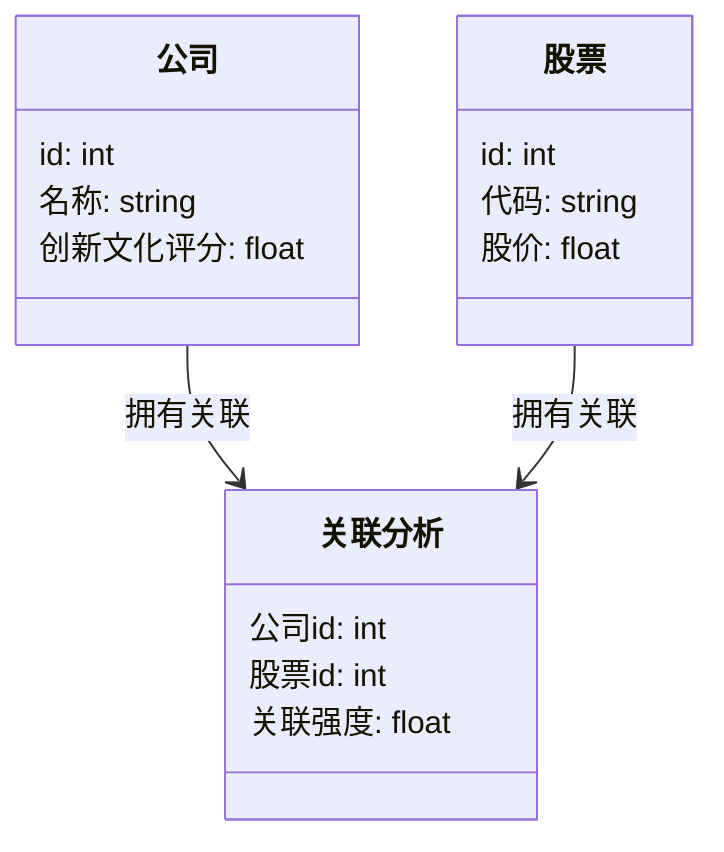

                 


# 特价股票与公司创新文化的潜在关联研究

## 关键词
- 特价股票、公司创新文化、潜在关联、量化分析、创新文化影响

## 摘要
本文探讨了特价股票与公司创新文化之间的潜在关联，从背景介绍、核心概念分析到算法原理、数学模型构建，再到系统分析与架构设计，最后通过项目实战进行深入研究。文章详细分析了特价股票和创新文化的定义、特征及其相互影响，提出了量化分析的方法和系统设计的框架，旨在为投资者和企业管理者提供理论支持和实践指导。

---

# 第一部分：特价股票与公司创新文化的背景介绍

## 第1章：特价股票与创新文化的定义与特征

### 1.1 特价股票的定义与特征
- 1.1.1 特价股票的定义：指股价低于市场平均值的股票，通常流动性较低，风险较高。
- 1.1.2 特价股票的市场特征：低估值、高波动性、潜在增长机会。
- 1.1.3 特价股票的投资价值：可能被市场低估，具备反弹或增长潜力。

### 1.2 创新文化的定义与特征
- 1.2.1 创新文化的定义：一种鼓励创新、开放沟通和风险承担的企业文化。
- 1.2.2 创新文化的构成要素：开放性、风险承担、知识共享、创新激励。
- 1.2.3 创新文化对企业的影响：提高竞争力、促进产品和服务创新、增强员工积极性。

### 1.3 特价股票与创新文化之间的关联性
- 1.3.1 特价股票与公司治理的关系：良好的公司治理可能提升股价，反之可能导致股价低估。
- 1.3.2 创新文化对股价的影响：创新能力强的企业可能具备更高的增长潜力，从而影响股价。
- 1.3.3 特价股票与创新文化的潜在关联：创新文化可能影响公司的长期价值，从而影响股价表现。

---

# 第二部分：特价股票与创新文化的核心概念与联系

## 第2章：特价股票与创新文化的关联分析

### 2.1 特价股票与创新文化的核心要素
- 2.1.1 特价股票的核心要素：低估值、高风险、潜在增长。
- 2.1.2 创新文化的核心要素：开放性、创新激励、知识共享。
- 2.1.3 两者的核心联系：创新能力强的企业可能具备更高的长期增长潜力，从而影响股价表现。

### 2.2 特价股票与创新文化的对比分析
- 2.2.1 特价股票与创新文化的特征对比：
  | 特征       | 特价股票                     | 创新文化                     |
  |------------|------------------------------|------------------------------|
  | 定义       | 低估值的股票                 | 鼓励创新的企业文化           |
  | 影响因素   | 市场供需、公司业绩           | 公司管理、员工创新           |
  | 关联性     | 可能受公司治理和创新能力影响 | 直接影响公司竞争力和增长潜力 |

- 2.2.2 特价股票与创新文化的影响因素对比：
  | 影响因素   | 特价股票                     | 创新文化                     |
  |------------|------------------------------|------------------------------|
  | 市场因素   | 市场供需、宏观经济            | 企业战略、管理风格           |
  | 公司因素   | 财务状况、盈利能力           | 创新能力、员工积极性         |

- 2.2.3 特价股票与创新文化的关联性对比：
  | 关联性     | 特价股票                     | 创新文化                     |
  |------------|------------------------------|------------------------------|
  | 直接影响   | 股价波动                     | 公司竞争力                   |
  | 间接影响   | 公司治理、长期增长           | 员工创新、产品创新           |

### 2.3 特价股票与创新文化的ER实体关系图
```mermaid
erDiagram
    company[公司] {
        key: id
        string: 公司名称
        string: 公司代码
        float: 股价
        bool: 是否创新文化
    }
    stock[股票] {
        key: id
        string: 股票代码
        float: 股票价格
        date: 交易日期
    }
    relation[关联] {
        company_id: 公司ID
        stock_id: 股票ID
        strength: 关联强度
    }
    company --> relation: 拥有
    stock --> relation: 属于
```

---

# 第三部分：特价股票与创新文化关联的算法原理

## 第3章：特价股票与创新文化关联的算法分析

### 3.1 数据采集与预处理
- 3.1.1 数据来源与采集方法：
  - 数据来源：股票市场数据（如历史股价、交易量）和公司治理数据（如创新文化评分）。
  - 数据采集方法：爬取金融数据平台、API接口调用。

- 3.1.2 数据清洗与预处理：
  ```python
  # 示例代码：数据清洗
  import pandas as pd

  df = pd.read_csv('stock_data.csv')
  df.dropna(inplace=True)  # 删除缺失值
  df['股价'] = df['股价'].astype(float)  # 转换数据类型
  ```

### 3.2 特征提取与分析
- 3.2.1 特价股票的特征提取：
  - 股价低于市场平均值的股票。
  - 公司市值、市盈率、市净率等指标。

- 3.2.2 创新文化的特征提取：
  - 公司研发投入占比、创新专利数量、员工创新指数。

### 3.3 模型构建与分析
- 3.3.1 回归模型构建：
  ```python
  # 示例代码：线性回归模型
  from sklearn.linear_model import LinearRegression
  import numpy as np

  X = df[['研发投入占比', '创新专利数量']]
  y = df['股价']

  model = LinearRegression()
  model.fit(X, y)
  ```

- 3.3.2 模型评估：
  - R平方值：$$R^2 = \sum\frac{(y_i - \bar{y})^2}{(y_i - \bar{y})^2 + \epsilon}$$
  - 回归系数解释：$$y = \beta_0 + \beta_1x_1 + \beta_2x_2 + \epsilon$$

---

## 第4章：数学模型与公式推导

### 4.1 特价股票与创新文化的量化模型
- 4.1.1 回归分析模型：
  $$y = \beta_0 + \beta_1x_1 + \beta_2x_2 + \epsilon$$
  其中，$y$ 为股价，$x_1$ 和 $x_2$ 为创新文化相关指标。

### 4.2 模型应用与案例分析
- 4.2.1 案例分析：
  某公司创新文化评分高，研发投入占比大，预测其股价可能上涨。

---

# 第四部分：系统分析与架构设计

## 第5章：系统设计与架构

### 5.1 项目背景与目标
- 目标：构建一个量化分析系统，研究特价股票与创新文化的关联性。

### 5.2 系统功能设计


### 5.3 系统架构设计


---

## 第6章：项目实战与总结

### 6.1 项目环境配置
- 环境：Python 3.8、Jupyter Notebook、Pandas、Scikit-learn。

### 6.2 核心代码实现
```python
# 示例代码：系统核心实现
import pandas as pd
from sklearn.linear_model import LinearRegression

# 数据加载
df = pd.read_csv('data.csv')

# 数据预处理
df.dropna(inplace=True)
df['创新文化评分'] = df['创新文化评分'].astype(float)

# 特征选择
X = df[['研发投入占比', '创新专利数量']]
y = df['股价']

# 模型训练
model = LinearRegression()
model.fit(X, y)

# 模型预测
predictions = model.predict(X)
print('预测值:', predictions)
```

### 6.3 案例分析与总结
- 案例分析：某公司创新文化评分高，但股价较低，可能成为特价股票。
- 总结：创新文化可能影响股价，但需结合其他因素进行综合分析。

---

## 第7章：最佳实践与扩展阅读

### 7.1 最佳实践
- 数据清洗的重要性：确保数据质量。
- 模型选择：根据数据特点选择合适的算法。

### 7.2 小结
本文通过量化分析的方法，探讨了特价股票与公司创新文化之间的潜在关联，提出了系统设计和项目实现的框架。

### 7.3 注意事项
- 数据的准确性和完整性。
- 模型的局限性：可能存在过拟合或欠拟合问题。

### 7.4 拓展阅读
- 推荐阅读相关领域的书籍和论文，深入研究创新文化与股价的关联性。

---

# 作者：AI天才研究院/AI Genius Institute & 禅与计算机程序设计艺术/Zen And The Art of Computer Programming

---

**本文通过系统性地分析特价股票与公司创新文化的潜在关联，结合量化分析方法和系统设计框架，为投资者和企业管理者提供了理论支持和实践指导。**

