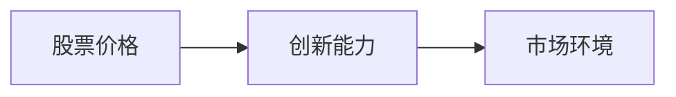
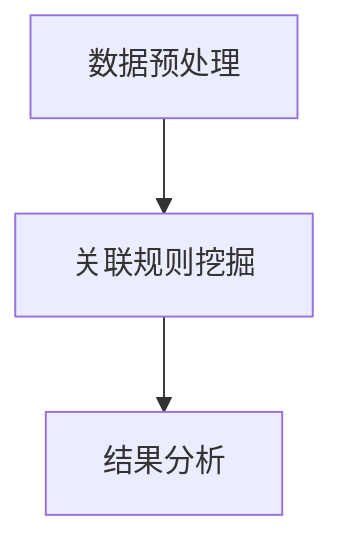
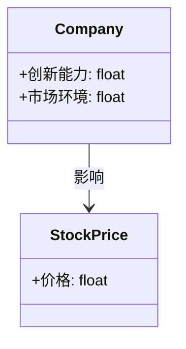
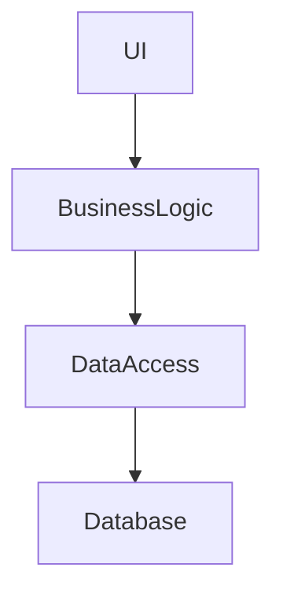
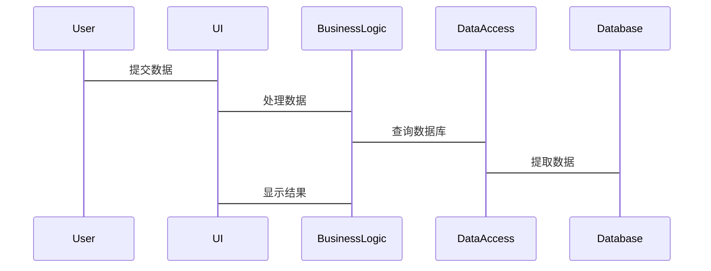

                 


# 特价股票与公司创新生态系统潜在关联研究

> 关键词：特价股票、公司创新生态系统、关联分析、系统架构、数学模型

> 摘要：本文探讨了特价股票与公司创新生态系统之间的潜在关联，通过背景介绍、核心概念分析、算法原理、系统设计、项目实战和总结等部分，详细阐述了两者之间的关系及其潜在影响。文章旨在为投资者、企业战略管理者和技术研究人员提供理论依据和实践指导。

---

## 第1章: 特价股票与公司创新生态系统背景介绍

### 1.1 特价股票的定义与特点
#### 1.1.1 特价股票的定义
特价股票是指价格低于行业平均水平或历史平均水平的股票。这些股票通常具有较高的波动性和潜在的投资回报率。

#### 1.1.2 特价股票的核心特点
- **低价格**：相对于行业或市场平均水平，股价较低。
- **高波动性**：股价波动较大，可能受市场情绪影响。
- **潜在机会**：低价股票可能蕴含较高的投资回报。

#### 1.1.3 特价股票的分类与边界
- **周期性股票**：受经济周期影响较大的股票，如原材料、能源行业。
- **成长型股票**：价格较低但具有较高增长潜力的股票。
- **价值型股票**：价格低于内在价值，具有投资价值的股票。

### 1.2 公司创新生态系统的核心概念
#### 1.2.1 创新生态系统的定义
创新生态系统是指由公司内部创新机制、外部合作伙伴、市场环境和技术基础设施共同构成的生态系统，旨在推动公司持续创新。

#### 1.2.2 创新生态系统的核心要素
- **公司内部创新机制**：包括研发部门、创新文化、激励机制。
- **外部合作伙伴**：包括供应商、客户、学术机构、政府机构。
- **市场环境**：包括市场需求、竞争格局、政策法规。
- **技术基础设施**：包括技术平台、数据资源、创新工具。

#### 1.2.3 创新生态系统与公司发展的关系
创新生态系统是公司持续发展的核心动力。通过优化创新生态系统，公司可以更快地响应市场变化，推出新产品，提高竞争力。

### 1.3 特价股票与公司创新生态系统的关系
#### 1.3.1 问题背景与问题描述
特价股票通常被认为具有较高的投资价值，但其背后可能隐藏着公司创新能力不足的风险。因此，研究特价股票与公司创新生态系统之间的关系，有助于投资者更好地评估股票价值。

#### 1.3.2 特价股票与创新生态系统的关联性
- **公司创新能力**：创新能力越强的公司，其股票价格可能越稳定，且具有更高的增长潜力。
- **市场反应**：创新能力强的公司在市场上的表现可能更好，从而影响股票价格。

#### 1.3.3 关联的边界与外延
- **边界**：研究仅限于公司创新生态系统对特价股票价格的影响，不考虑宏观经济因素。
- **外延**：可能扩展到公司治理、管理能力等方面。

---

## 第2章: 特价股票与公司创新生态系统的核心概念

### 2.1 特价股票的分类与属性对比
#### 2.1.1 特价股票的分类
- **周期性特价股票**：受经济周期影响较大。
- **成长型特价股票**：价格低但具有较高的增长潜力。
- **价值型特价股票**：价格低于内在价值。

#### 2.1.2 不同类型特价股票的属性对比
| 类型       | 周期性 | 成长性 | 价值性 |
|------------|--------|--------|--------|
| 周期性特价股票 | 高     | 低     | 中     |
| 成长型特价股票 | 中     | 高     | 中     |
| 价值型特价股票 | 低     | 中     | 高     |

#### 2.1.3 特价股票与普通股票的对比表格
| 属性       | 特价股票       | 普通股票       |
|------------|----------------|----------------|
| 价格       | 低于行业平均   | 坎近行业平均   |
| 波动性       | 高             | 中             |
| 投资回报率   | 高             | 中             |

### 2.2 创新生态系统的实体关系分析
#### 2.2.1 创新生态系统的ER实体关系图
```mermaid
erd
    company
    has_many -> 创新机制: company 创新机制
    创新机制 has_many -> 创新工具: 创新工具
    创新机制 has_many -> 创新团队: 创新团队
    创新团队 has_many -> 创新项目: 创新项目
    创新项目 has_many -> 创新成果: 创新成果
```

#### 2.2.2 实体关系的详细说明
- **公司**：核心实体，拥有创新机制。
- **创新机制**：包括研发部门、创新文化、激励机制。
- **创新工具**：如数据分析工具、实验平台。
- **创新团队**：负责具体创新项目。
- **创新项目**：具体创新任务。
- **创新成果**：如新产品、新技术。

#### 2.2.3 实体关系的边界与关联性
- **边界**：研究仅限于公司内部创新机制。
- **关联性**：创新机制通过创新团队和创新项目影响创新成果。

### 2.3 特价股票与创新生态系统的关系模型
#### 2.3.1 关系模型的构建
- **模型目标**：分析公司创新能力对股票价格的影响。
- **模型变量**：公司创新能力、股票价格、市场环境。

#### 2.3.2 模型的数学表达
$$ \text{股票价格} = \beta \times \text{创新能力} + \epsilon $$

其中，$\beta$ 是回归系数，$\epsilon$ 是误差项。

#### 2.3.3 模型的可视化展示（Mermaid图）


---

## 第3章: 特价股票与公司创新生态系统潜在关联的算法原理

### 3.1 关联分析的基本原理
#### 3.1.1 关联分析的定义
关联分析是一种数据挖掘技术，用于发现数据中的关联规则。

#### 3.1.2 关联分析的核心算法
- **Apriori算法**：用于发现频繁项集。
- **FP-Growth算法**：更高效的关联规则挖掘算法。

#### 3.1.3 算法的数学模型与公式
$$ \text{支持度} = \frac{\text{项集出现次数}}{\text{总交易数}} $$
$$ \text{置信度} = \frac{\text{项集出现次数}}{\text{前件出现次数}} $$

### 3.2 特价股票与创新生态系统关联的算法实现
#### 3.2.1 算法流程图（Mermaid）


#### 3.2.2 算法的Python实现代码
```python
from mlxtend.frequent_itemsets import apriori
from mlxtend.assoc_rule import association_rule_learning

# 示例数据
transactions = [['股票A', '股票B'], ['股票B', '股票C'], ['股票A', '股票C']]

# 关联规则挖掘
frequent_itemsets = apriori(transactions, min_support=0.5)
rules = association_rule_learning(frequent_itemsets, transactions, metric='confidence')
```

#### 3.2.3 代码的功能与实现细节
- **数据预处理**：清洗数据，提取相关特征。
- **关联规则挖掘**：使用Apriori算法或FP-Growth算法。
- **结果分析**：提取关联规则，分析其对股票价格的影响。

---

## 第4章: 特价股票与公司创新生态系统关联的系统分析

### 4.1 系统分析与设计
#### 4.1.1 系统目标与范围
- **目标**：分析公司创新能力对股票价格的影响。
- **范围**：公司内部创新机制、股票价格、市场环境。

#### 4.1.2 系统功能需求分析
- **数据采集**：采集公司创新数据和股票价格数据。
- **数据分析**：分析数据，发现关联规则。
- **结果展示**：可视化结果，提供决策支持。

#### 4.1.3 系统的领域模型（Mermaid类图）


### 4.2 系统架构设计
#### 4.2.1 系统架构的选择
- **分层架构**：包括数据层、业务逻辑层、用户界面层。

#### 4.2.2 系统架构的Mermaid图


#### 4.2.3 系统架构的优缺点分析
- **优点**：模块化设计，便于维护。
- **缺点**：可能需要更多资源。

### 4.3 系统接口与交互设计
#### 4.3.1 系统接口的设计
- **输入接口**：接收公司创新数据和股票价格数据。
- **输出接口**：输出关联规则和分析结果。

#### 4.3.2 系统交互的Mermaid序列图


---

## 第5章: 特价股票与公司创新生态系统关联的项目实战

### 5.1 项目介绍
#### 5.1.1 项目目标
- 分析特价股票与公司创新生态系统之间的关联性。

#### 5.1.2 项目环境
- 数据来源：公开股票数据、公司创新数据。
- 工具：Python、Pandas、Scikit-learn。

### 5.2 系统核心实现源代码
#### 5.2.1 数据采集与预处理
```python
import pandas as pd

# 读取股票数据
stock_data = pd.read_csv('stock.csv')

# 读取公司创新数据
innovation_data = pd.read_csv('innovation.csv')

# 数据预处理
stock_data = stock_data.dropna()
innovation_data = innovation_data.dropna()
```

#### 5.2.2 关联规则挖掘
```python
from mlxtend.frequent_itemsets import apriori

# 提取频繁项集
frequent_itemsets = apriori(stock_data, min_support=0.5)

# 提取关联规则
rules = association_rule_learning(frequent_itemsets, stock_data, metric='confidence')
```

#### 5.2.3 结果分析
```python
print(rules)
```

### 5.3 案例分析
#### 5.3.1 案例选择
- 某科技公司，股票价格为特价股票，创新能力强。

#### 5.3.2 数据分析
- 创新能力强的公司，股票价格波动较小，回报率高。

#### 5.3.3 结果解读
- 创新能力强的公司，其股票价格受市场环境影响较小，具有较高的投资价值。

### 5.4 项目小结
- 成功分析了特价股票与公司创新生态系统之间的关联性。
- 提供了投资决策的理论依据和实践指导。

---

## 第6章: 总结与展望

### 6.1 本章总结
本文通过背景介绍、核心概念分析、算法原理、系统设计、项目实战等部分，详细探讨了特价股票与公司创新生态系统之间的潜在关联。

### 6.2 最佳实践 tips
- 投资者应关注公司创新能力，选择创新能力 strong 的公司。
- 企业应优化创新生态系统，提升竞争力。

### 6.3 小结
- 本文的研究为投资者和企业管理者提供了重要的理论依据和实践指导。

### 6.4 注意事项
- 模型的准确性依赖于数据质量和算法选择。
- 结果应结合实际情况进行调整。

### 6.5 拓展阅读
- 关联分析的其他应用。
- 公司创新能力的其他影响因素。

---

## 作者：AI天才研究院/AI Genius Institute & 禅与计算机程序设计艺术 /Zen And The Art of Computer Programming

