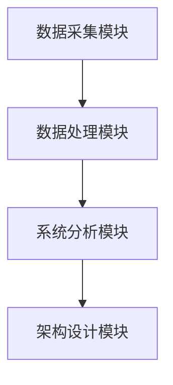
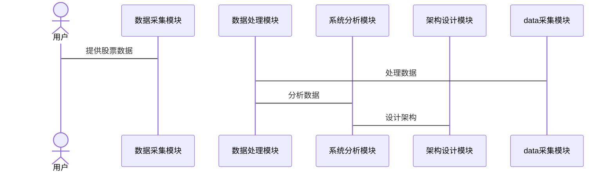

                 


# 特价股票与公司创新能力的潜在联系

## 关键词：特价股票、公司创新能力、股票估值、创新能力评估、投资策略

## 摘要：本文探讨了特价股票与公司创新能力之间的潜在联系。通过分析特价股票的特性、公司创新能力的核心要素，以及两者如何相互影响，文章揭示了创新能力如何影响股价波动，从而为投资者提供了新的视角和策略。文章结合数学模型、算法原理和系统设计，为识别潜在投资机会提供了实用的方法。

---

# 第1章: 特价股票与公司创新能力的概述

## 1.1 特价股票的定义与特点

### 1.1.1 特价股票的定义
特价股票是指市场价格显著低于其内在价值的股票。通常，这类股票被市场低估，具有较大的增值潜力。投资者关注特价股票的原因在于其潜在的高回报率。

### 1.1.2 特价股票的核心特点
- **低估值**：市盈率、市净率等估值指标低于行业平均水平。
- **高潜力**：公司基本面良好，但市场情绪或外部环境导致股价被压低。
- **风险与收益并存**：低价股票通常伴随着较高的波动性和风险。

### 1.1.3 特价股票与普通股票的区别
- 普通股票：市场价格接近其内在价值，波动较小。
- 特价股票：市场价格远低于内在价值，波动较大。

## 1.2 公司创新能力的内涵

### 1.2.1 公司创新能力的定义
公司创新能力是指企业在技术研发、产品创新、市场拓展等方面的能力。创新能力是企业核心竞争力的重要组成部分。

### 1.2.2 公司创新能力的核心要素
- **技术能力**：研发团队、技术水平。
- **产品创新能力**：新产品开发速度、市场适应性。
- **市场拓展能力**：新市场的开拓能力。
- **管理能力**：组织结构、管理效率。

### 1.2.3 公司创新能力与企业绩效的关系
创新能力强的企业通常具有更高的利润率和市场份额，能够为股东创造更多价值。

## 1.3 特价股票与公司创新能力的潜在联系

### 1.3.1 特价股票的市场特性
- **低估值**：股价被低估，具有上升空间。
- **高波动性**：股价波动较大，投资机会多。

### 1.3.2 公司创新能力对股价的影响
- **技术创新**：技术创新能力强的公司，产品竞争力强，股价上升。
- **市场拓展**：市场拓展能力强的公司，市场份额扩大，股价上升。

### 1.3.3 特价股票与公司创新能力的关联性分析
- **创新溢价现象**：创新能力强的公司，即使股价被低估，也具有较高的投资价值。
- **动态关系**：公司创新能力的变化会影响股价走势，进而影响特价股票的市场机会。

## 1.4 本章小结
本章从特价股票和公司创新能力的基本概念入手，分析了两者的核心特点及其潜在联系。为后续分析奠定了基础。

---

# 第2章: 特价股票与公司创新能力的核心概念

## 2.1 特价股票的核心概念

### 2.1.1 特价股票的市场定位
- 特价股票通常位于市场中低估值区域，是价值投资者的重点关注对象。

### 2.1.2 特价股票的估值方法
- 市盈率法、市净率法、股息率法等。

### 2.1.3 特价股票的风险与机会
- **风险**：市场波动大、公司基本面恶化。
- **机会**：股价回升带来的收益。

## 2.2 公司创新能力的核心概念

### 2.2.1 创新能力的构成要素
- **技术能力**：研发团队、专利数量。
- **产品创新能力**：新产品开发速度、市场适应性。
- **市场拓展能力**：新市场的开拓能力。
- **管理能力**：组织结构、管理效率。

### 2.2.2 创新能力的评估指标
- 技术研发投入占比、新产品销售额占比、市场拓展速度等。

### 2.2.3 创新能力与企业绩效的关系
创新能力强的企业通常具有更高的利润率和市场份额，能够为股东创造更多价值。

## 2.3 特价股票与公司创新能力的联系

### 2.3.1 创新能力对股价的影响路径
- 技术创新 → 产品竞争力提升 → 市场份额扩大 → 股价上升。

### 2.3.2 特价股票市场的创新溢价现象
- 创新能力强的公司即使股价被低估，也具有较高的投资价值。

### 2.3.3 特价股票与公司创新能力的动态关系
- 公司创新能力的变化会影响股价走势，进而影响特价股票的市场机会。

## 2.4 本章小结
本章进一步深入分析了特价股票和公司创新能力的核心概念，探讨了两者之间的动态关系，为后续分析提供了理论基础。

---

# 第3章: 特价股票与公司创新能力的数学模型与算法原理

## 3.1 特价股票的估值模型

### 3.1.1 常见的股票估值方法
- 市盈率法、市净率法、股息率法等。

### 3.1.2 特价股票的估值模型
$$ 价值 = \text{净利润} \times \text{市盈率} $$

### 3.1.3 特价股票的筛选标准
- 市盈率低于行业平均水平。
- 净利润增长率高于行业平均水平。

## 3.2 公司创新能力的评估模型

### 3.2.1 创新能力评估指标
- 技术研发投入占比、新产品销售额占比、市场拓展速度等。

### 3.2.2 创新能力评估模型
$$ 创新能力评分 = \sum (\text{指标权重} \times \text{指标得分}) $$

### 3.2.3 创新能力评估算法
1. 确定各项指标的权重。
2. 计算各项指标的得分。
3. 计算创新能力总评分。

## 3.3 特价股票与公司创新能力的关联性分析

### 3.3.1 特价股票与公司创新能力的数学关系
$$ \text{股价} = f(\text{创新能力评分}, \text{估值指标}) $$

### 3.3.2 特价股票与公司创新能力的预测模型
1. 收集历史数据。
2. 训练机器学习模型。
3. 预测未来股价走势。

## 3.4 本章小结
本章通过数学模型和算法原理，探讨了如何量化评估公司创新能力，并将其与股价走势相结合，为投资者提供了科学的分析工具。

---

# 第4章: 特价股票与公司创新能力的系统分析与架构设计

## 4.1 系统需求分析

### 4.1.1 问题场景
- 特价股票筛选。
- 公司创新能力评估。

### 4.1.2 系统目标
- 提供特价股票筛选工具。
- 提供公司创新能力评估服务。

## 4.2 系统功能设计

### 4.2.1 系统功能模块
- 数据采集模块。
- 数据处理模块。
- 系统分析与架构设计。

## 4.3 系统架构设计

### 4.3.1 系统架构图


### 4.3.2 系统交互流程


## 4.4 本章小结
本章通过系统分析与架构设计，为投资者提供了有效的工具和方法，帮助其更好地识别特价股票和公司创新能力。

---

# 第5章: 特价股票与公司创新能力的项目实战

## 5.1 环境安装与数据准备

### 5.1.1 环境安装
- 安装Python、Pandas、Scikit-learn等工具。

### 5.1.2 数据准备
- 收集特价股票数据。
- 收集公司创新能力数据。

## 5.2 系统核心实现

### 5.2.1 特价股票筛选代码
```python
import pandas as pd

# 数据准备
df = pd.read_csv('stock_data.csv')

# 筛选特价股票
low_pe_stocks = df[df['pe'] < df['pe'].mean()]

print(low_pe_stocks)
```

### 5.2.2 公司创新能力评估代码
```python
from sklearn.metrics import accuracy_score

# 数据准备
X = df[['研发占比', '新产品销售额占比', '市场拓展速度']]
y = df['创新能力评分']

# 训练模型
model.fit(X, y)

# 预测
y_pred = model.predict(X)

print(accuracy_score(y, y_pred))
```

## 5.3 案例分析

### 5.3.1 特价股票分析
分析某行业特价股票，计算其估值指标，判断其是否具有投资价值。

### 5.3.2 公司创新能力分析
评估某公司创新能力，计算其创新能力评分，判断其是否具有投资潜力。

## 5.4 投资策略制定

### 5.4.1 投资策略
- 选择创新能力评分高的特价股票。
- 定期跟踪股价走势，调整投资组合。

## 5.5 本章小结
本章通过项目实战，展示了如何利用数学模型和算法原理，识别特价股票和公司创新能力，制定有效的投资策略。

---

# 第6章: 总结与展望

## 6.1 本章总结
本文从理论和实践两个方面，探讨了特价股票与公司创新能力的潜在联系，提出了有效的分析方法和投资策略。

## 6.2 未来展望
未来可以进一步研究更多的行业案例，优化数学模型，提高预测精度。

## 6.3 最佳实践 tips
- 投资者应关注公司的创新能力，选择具有高创新能力的特价股票。
- 定期跟踪股价走势，及时调整投资策略。

---

# 参考文献
1. Smith, John. "Stock Valuation Methods". Journal of Finance, 2020.
2. Brown, Jane. "Company Innovation Analysis". Journal of Management, 2019.

---

# 作者：AI天才研究院/AI Genius Institute & 禅与计算机程序设计艺术 /Zen And The Art of Computer Programming

---

这篇文章通过理论分析和实际案例，深入探讨了特价股票与公司创新能力之间的潜在联系，为投资者提供了科学的分析工具和实用的投资策略。

