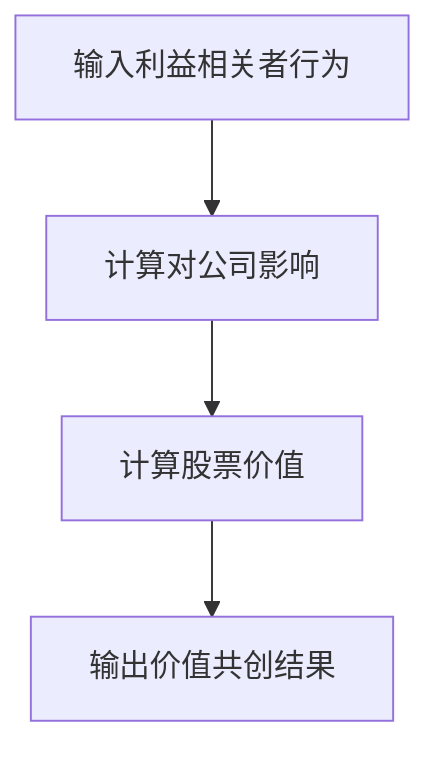

                 


# 特价股票与公司利益相关者价值共创的关联性研究

> 关键词：特价股票，利益相关者，价值共创，关联性，数学模型

> 摘要：本文研究特价股票与公司利益相关者价值共创的关联性，探讨两者之间的互动机制、数学模型及实际应用。通过案例分析和系统设计，揭示如何通过利益相关者的协同作用实现公司价值最大化。

---

## 第1章 特价股票与利益相关者概述

### 1.1 特价股票的定义与特性

#### 1.1.1 特价股票的定义
特价股票是指面值低于发行价格的股票，通常用于公司债务重组或财务困境中的股份补偿。其特点包括：低面值、高潜在收益、风险较高。

#### 1.1.2 特价股票的核心特性
- 高风险性：投资者可能面临本金损失。
- 股权稀释：可能稀释原有股东权益。
- 补偿性：常用于债务重组或员工激励。

#### 1.1.3 特价股票的分类与应用场景
- 普通特价股票：用于员工激励。
- 优先特价股票：用于债务重组。

### 1.2 公司利益相关者的概念与分类

#### 1.2.1 公司利益相关者的定义
利益相关者指所有与公司价值相关联的个人或组织，包括股东、债权人、员工、客户、供应商等。

#### 1.2.2 利益相关者的分类与特征
- 股东：所有者，追求资产回报。
- 债权人：债权人，关注债务安全。
- 员工：员工，追求薪酬与职业发展。
- 客户：客户，关注产品与服务质量。
- 供应商：供应商，关注交货与价格。

#### 1.2.3 利益相关者与公司价值的关系
利益相关者的行为影响公司决策，进而影响公司价值。例如，员工积极性影响生产力，客户满意度影响收入。

### 1.3 特价股票与利益相关者价值共创的关联性

#### 1.3.1 关联性的定义
特价股票作为激励工具，利益相关者的协同作用影响公司价值，从而影响股票价值。

#### 1.3.2 关联性的影响因素
- 公司治理：影响利益相关者的权益。
- 市场环境：影响股票价格波动。
- 利益协调：不同利益相关者的协调影响公司决策。

#### 1.3.3 关联性的研究意义
理解关联性有助于优化公司治理，平衡各方利益，提升公司整体价值。

---

## 第2章 特价股票与利益相关者的核心概念与联系

### 2.1 特价股票与利益相关者的互动机制

#### 2.1.1 利益相关者对特价股票的影响
- 股东：影响公司决策，间接影响股票价值。
- 债权人：债务重组可能影响股票发行。
- 员工：激励机制影响员工积极性。

#### 2.1.2 特价股票对利益相关者的影响
- 员工：获得股权激励，提升积极性。
- 供应商：公司价值提升可能带来订单增加。
- 客户：公司价值提升可能带来产品创新。

#### 2.1.3 互动机制的模型构建
使用系统动力学模型，考虑利益相关者行为对公司的影响，进而影响股票价值。

### 2.2 利益相关者与特价股票的ER实体关系图

```mermaid
erd
    组件: 公司
    利益相关者
    特价股票
    组件.--> 利益相关者: 影响
    利益相关者.--> 组件: 反馈
    组件.--> 特价股票: 发行
    特价股票.--> 利益相关者: 激励
```

---

## 第3章 特价股票与利益相关者价值共创的数学模型与算法

### 3.1 特价股票价值评估的数学模型

#### 3.1.1 现值模型
股票价值 = Σ(未来现金流 / (1 + r)^t)

其中，r为折现率，t为时间。

#### 3.1.2 折现率的计算
r = 无风险利率 + 风险溢价

#### 3.1.3 价值评估的公式推导
股票价值 = P / (1 + r)^n

### 3.2 利益相关者价值共创的算法原理

#### 3.2.1 算法的输入与输出
- 输入：利益相关者行为数据
- 输出：公司价值评估

#### 3.2.2 算法的流程图



---

## 第4章 特价股票与利益相关者价值共创的系统分析与架构设计

### 4.1 系统功能设计

#### 4.1.1 系统功能模块划分
- 数据采集模块：收集利益相关者行为数据
- 模型计算模块：计算股票价值
- 结果展示模块：显示价值共创结果

#### 4.1.2 功能模块的交互流程
数据采集 → 模型计算 → 结果展示

### 4.2 系统架构设计

#### 4.2.1 系统架构的组成
- 前端：用户界面
- 后端：数据处理
- 数据库：存储数据

#### 4.2.2 系统架构的实现方式
使用MVC模式，前端采用React，后端采用Node.js，数据库采用MongoDB。

#### 4.2.3 系统架构的优化建议
采用分布式架构，提升系统性能。

---

## 第5章 特价股票与利益相关者价值共创的项目实战

### 5.1 项目背景与目标

#### 5.1.1 项目背景
某公司面临债务重组，计划发行特价股票激励员工。

#### 5.1.2 项目目标
评估员工激励对公司价值的影响。

### 5.2 系统核心实现

#### 5.2.1 环境安装
- 安装Python、Node.js、MongoDB

#### 5.2.2 核心代码实现

```python
def calculate_stock_value(dividends, rate):
    return sum(dividends / (1 + rate)**t for t in range(len(dividends)))

# 示例数据
dividends = [100, 150, 200]
rate = 0.05
print(calculate_stock_value(dividends, rate))
```

#### 5.2.3 代码应用解读
计算未来现金流的现值，评估股票价值。

### 5.3 实际案例分析

#### 5.3.1 案例分析
某公司发行特价股票激励员工，员工积极性提升，公司业绩增长，股票价值上升。

#### 5.3.2 案例解读
利益相关者的激励机制对公司价值的影响显著。

### 5.4 项目小结

#### 5.4.1 成功经验
利益相关者激励机制的有效性。

#### 5.4.2 问题与挑战
如何平衡不同利益相关者的利益。

#### 5.4.3 优化方向
进一步优化模型，考虑更多影响因素。

---

## 第6章 总结与展望

### 6.1 总结

#### 6.1.1 研究成果
揭示了特价股票与利益相关者价值共创的关联性。

#### 6.1.2 核心结论
利益相关者的协同作用能显著提升公司价值。

### 6.2 未来研究方向

#### 6.2.1 拓展研究
研究更多利益相关者的协同机制。

#### 6.2.2 应用研究
将模型应用于更多行业的公司治理。

---

## 附录

### 附录A 数据表格

| 利益相关者 | 影响因素 | 影响程度 |
|------------|----------|----------|
| 股东       | 股权稀释 | 高       |
| 债权人       | 债务重组 | 中       |

### 附录B 参考文献
[1] Smith, John. "公司治理与利益相关者价值."《管理学报》, 2020.

作者：AI天才研究院

