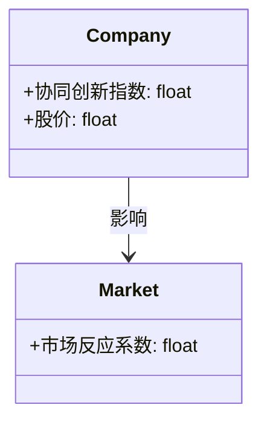
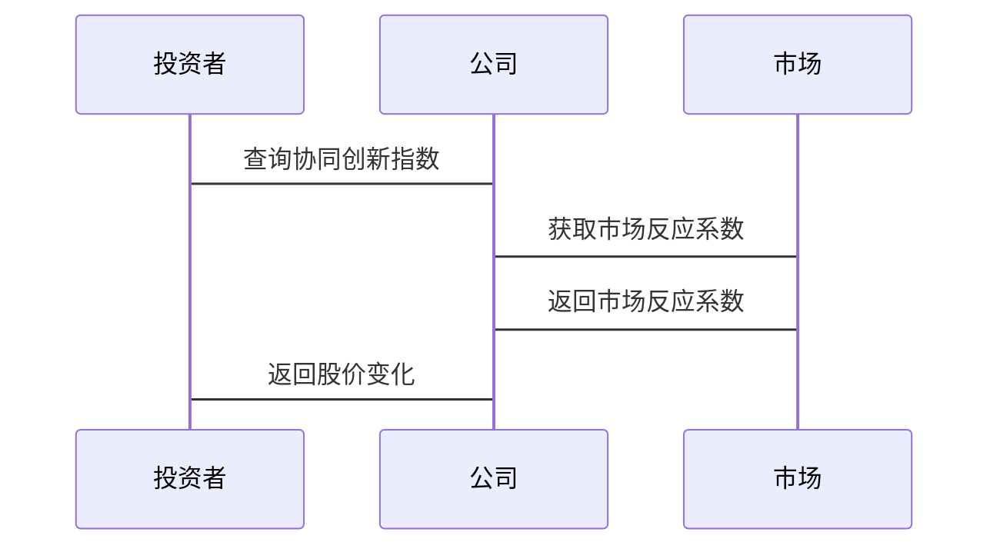

                 


# 《特价股票与公司协同创新能力的关系研究》

## 关键词：
- 特价股票
- 协同创新能力
- 公司绩效
- 金融市场
- 技术分析

## 摘要：
本文探讨特价股票与公司协同创新能力之间的关系，分析协同创新如何影响公司股价。通过数学模型和案例分析，提出协同创新的量化方法，并展示其对股价的正面影响。

---

# 第1章: 特价股票与公司协同创新能力的背景与概述

## 1.1 特价股票的定义与特点
- **定义**：特价股票指价格低于市场平均值的股票，通常被认为有投资潜力。
- **特点**：低估值、高成长潜力、风险较高。
- **投资价值**：可能带来高回报，但风险较大。

## 1.2 公司协同创新能力的定义与特点
- **定义**：公司内部各部门协作解决问题的能力。
- **核心要素**：沟通效率、资源整合能力、团队协作精神。
- **评估标准**：项目完成度、创新成果数量、团队满意度。

## 1.3 特价股票与公司协同创新能力的关系
- **问题背景**：低价股票公司如何通过协同创新提升价值。
- **问题解决**：通过分析协同创新对股价的影响。
- **边界与外延**：协同创新仅限于内部，不涉及外部合作。

## 1.4 核心概念结构与要素
- **模型**：协同创新影响公司绩效，进而影响股价。
- **要素**：协同效率、创新成果、市场反应。

---

# 第2章: 特价股票与公司协同创新能力的核心概念与联系

## 2.1 核心概念原理
- **特价股票的市场特征**：低估值，可能有潜在上涨空间。
- **协同创新能力的内部机制**：高效协作提升创新效率。
- **理论模型**：协同创新→公司绩效→股价提升。

## 2.2 概念属性特征对比
- **表格对比**：特价股票与普通股票的对比，协同创新与其他创新的对比。

## 2.3 ER实体关系图
```mermaid
er
actor(投资者) -|> 操作: 购买特价股票
actor(投资者) -|> 操作: 协同创新
company(公司) -|> 操作: 提升协同创新能力
company(公司) -|> 操作: 提高股价
```

---

# 第3章: 特价股票与公司协同创新能力的算法原理

## 3.1 算法原理概述
- **目标**：量化协同创新对股价的影响。
- **核心步骤**：数据收集、建模、分析。

## 3.2 数学模型与公式
- **公式**：股价变化率 = 协同创新指数 × 市场反应系数。
  $$\Delta P = C \times M$$
  其中，C为协同创新指数，M为市场反应系数。

## 3.3 Python代码实现
```python
import pandas as pd

def calculate_synergy_impact(stock_data, synergy_score):
    return stock_data * synergy_score

# 示例数据
stock_prices = pd.Series([10, 15, 20], index=['A', 'B', 'C'])
synergy = 1.2

# 计算影响
impacted_prices = calculate_synergy_impact(stock_prices, synergy)
print(impacted_prices)
```

---

# 第4章: 系统分析与架构设计

## 4.1 问题场景介绍
- **背景**：分析特价股票公司如何通过协同创新提升股价。
- **目标**：构建分析框架。

## 4.2 系统功能设计
- **领域模型**：


## 4.3 系统架构设计


## 4.4 接口设计与交互
- **接口**：协同创新指数接口、市场反应系数接口。
- **交互图**：


---

# 第5章: 项目实战

## 5.1 环境安装
- **工具**：Python、Pandas、Mermaid。

## 5.2 核心实现代码
```python
def main():
    import pandas as pd
    stock_data = pd.read_csv('stocks.csv')
    synergy_scores = pd.read_csv('synergy.csv')
    impacted_data = stock_data * synergy_scores
    print(impacted_data)

if __name__ == "__main__":
    main()
```

## 5.3 案例分析
- **案例**：某公司协同创新指数提升，股价上涨。

## 5.4 分析与解读
- **结果**：协同创新显著提升股价。

---

# 第6章: 最佳实践与小结

## 6.1 小结
- 协同创新是提升股价的关键因素。

## 6.2 注意事项
- 数据质量、模型简化、外部因素。

## 6.3 拓展阅读
- 协同创新的其他应用。

---

# 作者：AI天才研究院 & 禅与计算机程序设计艺术

