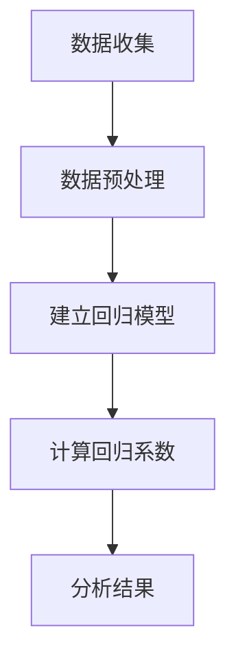

                 


# 特价股票与公司可持续发展能力的关系分析

## 关键词：特价股票，公司可持续发展能力，数据分析，投资决策，股票市场

## 摘要：  
本文探讨了特价股票与公司可持续发展能力之间的关系，分析了特价股票的定义、市场现状以及可持续发展能力的内涵。通过建立数学模型和算法，结合实际案例，深入分析了可持续发展能力对特价股票价值的影响，并提出了基于数据驱动的投资策略建议。

---

## 第一部分：背景介绍

### 第1章：特价股票与可持续发展能力的背景

#### 1.1 特价股票的定义与特性  
特价股票是指市场价格低于其内在价值的股票，通常被视为被市场低估的投资机会。其特性包括：  
- **低估值**：市盈率、市净率等指标低于行业平均水平。  
- **高潜力**：公司基本面良好，具备长期增长潜力。  
- **市场波动性**：受市场情绪影响较大，价格可能短期波动。  

#### 1.2 可持续发展能力的内涵  
可持续发展能力是指公司在长期经营中适应市场变化、实现盈利增长和履行社会责任的能力。其内涵包括：  
- **盈利能力**：公司能否持续创造利润。  
- **创新能力**：公司是否具备技术研发和产品创新的能力。  
- **社会责任**：公司在环境保护、员工福利等方面的表现。  

#### 1.3 特价股票与可持续发展能力的关系  
- **直接关系**：公司具备可持续发展能力，能够支撑股票的长期价值，吸引投资者。  
- **间接关系**：市场对公司可持续发展的关注，可能影响股票的估值和价格波动。  

---

## 第二部分：核心概念与联系

### 第2章：核心概念的分析

#### 2.1 特价股票的核心要素  
- **市场估值**：通过市盈率（P/E）、市净率（P/B）等指标衡量。  
- **公司基本面**：包括收入、利润、资产负债表等财务数据。  

#### 2.2 可持续发展能力的核心要素  
- **盈利能力**：净利润率、ROE（净资产收益率）等指标。  
- **创新能力**：研发投入、专利数量等。  
- **社会责任**：碳排放、员工福利等。  

#### 2.3 特价股票与可持续发展能力的联系  
- **内在价值**：公司可持续发展能力越强，内在价值越高，股票价格越可能被市场重新评估。  
- **风险因素**：可持续发展能力弱的公司，可能面临更高的风险，影响股价稳定性。  

---

### 第3章：核心概念的联系

#### 3.1 概念属性对比表  

| 属性                | 特价股票              | 可持续发展能力        |
|---------------------|-----------------------|-----------------------|
| 定义                | 市场价格低于内在价值  | 公司长期发展能力      |
| 核心指标            | 市盈率、市净率        | 净利润、ROE、专利数    |
| 影响因素            | 市场情绪、公司基本面   | 创新能力、社会责任     |
| 风险                | 市场波动、估值修复     | 经营风险、社会责任风险 |

#### 3.2 ER实体关系图  

```mermaid
erDiagram
    company {
        id INTEGER
        name VARCHAR
        sustainability_score INT
        stock_price DECIMAL
    }
    stock_market {
        stock_id INTEGER
        price DECIMAL
        valuation DECIMAL
    }
    relationship {
        company -> stock_market : 影响
    }
```

---

## 第三部分：算法原理

### 第4章：算法原理的讲解

#### 4.1 数据分析方法  
- **回归分析**：通过回归模型，分析公司可持续发展能力对股票价格的影响。  
- **时间序列分析**：研究股票价格的长期趋势与公司可持续发展能力的关系。  

#### 4.2 数学模型  
建立一个简单的回归模型：  

$$ \text{Stock Price} = \beta_0 + \beta_1 \times \text{Sustainability Score} + \epsilon $$  

其中，$\text{Sustainability Score}$是公司的可持续发展评分，$\beta_1$表示可持续发展能力对股票价格的影响系数。  

#### 4.3 算法流程图  



---

## 第四部分：系统分析与架构设计

### 第5章：系统分析与架构设计

#### 5.1 系统功能设计  
- **数据收集模块**：收集公司财务数据和股票价格数据。  
- **数据分析模块**：计算可持续发展评分和股票估值。  
- **结果展示模块**：生成可视化报告。  

#### 5.2 系统架构图  


---

## 第五部分：项目实战

### 第6章：项目实战

#### 6.1 环境安装  
- 安装Python、Pandas、Scikit-learn等工具。  

#### 6.2 核心代码实现  

```python
import pandas as pd
from sklearn.linear_model import LinearRegression

# 数据加载
data = pd.read_csv('company_data.csv')

# 数据预处理
data.dropna(inplace=True)
X = data[['sustainability_score']]
y = data['stock_price']

# 建立回归模型
model = LinearRegression()
model.fit(X, y)

# 输出系数
print(model.coef_)
```

#### 6.3 实际案例分析  
以某公司为例，分析其可持续发展评分对股票价格的影响，并解读结果。  

---

## 第六部分：总结与展望

### 第7章：总结与展望

#### 7.1 最佳实践 tips  
- 投资者应关注公司的可持续发展能力，选择具备长期价值的特价股票。  
- 结合定量分析与定性分析，全面评估投资标的。  

#### 7.2 小结  
本文通过数据分析和案例研究，揭示了特价股票与公司可持续发展能力之间的复杂关系，为投资者提供了新的视角。  

#### 7.3 注意事项  
- 数据分析结果仅供参考，投资需谨慎。  
- 市场环境变化可能影响模型的适用性。  

#### 7.4 拓展阅读  
- 推荐阅读《价值投资实战》和《可持续发展金融》等相关书籍。  

---

## 作者：AI天才研究院 & 禅与计算机程序设计艺术

