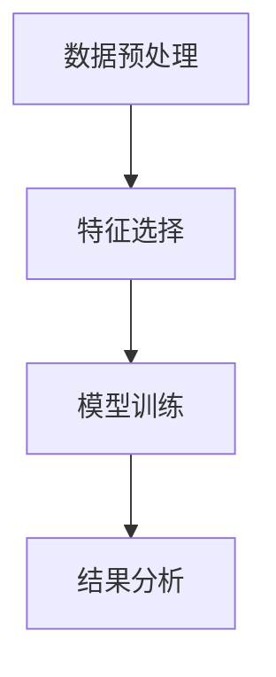
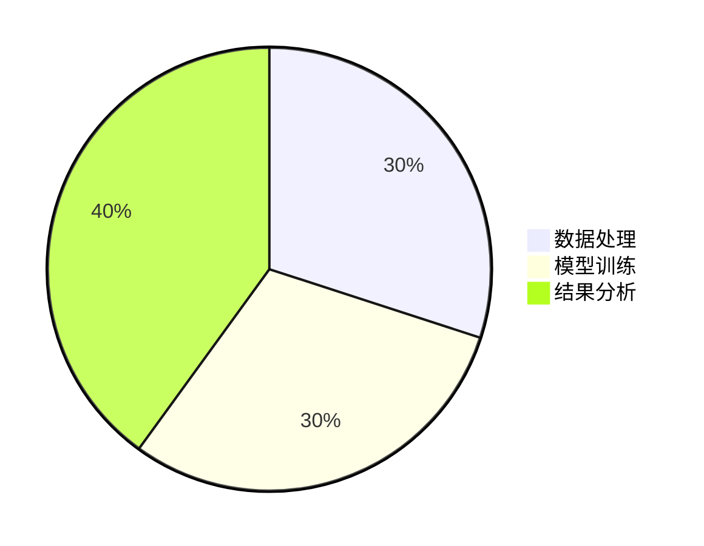

                 


# 特价股票与公司可持续发展能力的关联

> 关键词：特价股票，公司可持续发展，财务健康，市场竞争力，风险管理

> 摘要：本文探讨了特价股票与公司可持续发展能力之间的关联，分析了特价股票的定义、特征，公司可持续发展能力的核心要素，以及两者之间的关系。通过构建数学模型和算法，提出了评估公司可持续发展能力的方法，并结合实际案例，展示了如何从特价股票中发现具有可持续发展能力的公司。

---

## 第一部分：背景与概念

### 第1章：特价股票的定义与特征

#### 1.1 特价股票的定义
- **定义**：特价股票是指价格低于行业平均水平或历史平均水平的股票，通常被认为具有较高的投资潜力，但也伴随着较高的风险。
- **分类**：
  - 周期性股票：受经济周期影响较大的股票，如能源、材料等行业的股票。
  - 价值型股票：市场价格低于其内在价值的股票，通常被认为被市场低估。
- **市场表现特征**：
  - 低估值：市盈率（P/E）和市净率（P/B）通常低于行业平均水平。
  - 高波动性：价格波动较大，容易受市场情绪影响。
  - 低流动性：部分特价股票的交易量可能较低，导致流动性风险。

#### 1.2 特价股票的投资风险与机会
- **风险**：
  - 市场风险：宏观经济波动可能导致股票价格进一步下跌。
  - 财务风险：部分公司可能面临财务困境，导致股价持续低迷。
- **机会**：
  - 价值回归：部分特价股票可能因市场低估而被重新发现，股价回升。
  - 投资机会：投资者可以通过深入分析发现具有潜力的公司。

---

### 第2章：公司可持续发展能力的内涵

#### 2.1 可持续发展能力的核心要素
- **财务健康状况**：
  - 利润能力：净利润率、毛利率等指标。
  - 资产状况：资产负债率、流动资产比例等。
  - 现金流：经营活动现金流是否健康。
- **管理能力与战略规划**：
  - 高管团队：管理团队的经验和能力。
  - 战略目标：公司未来发展的明确性和可行性。
- **市场竞争力与创新能力**：
  - 市场份额：公司在行业中的地位。
  - 产品创新：公司的研发能力和新产品推出速度。

#### 2.2 可持续发展能力对公司的意义
- 提升公司抗风险能力。
- 为投资者提供长期价值。
- 促进公司在市场中的长期竞争力。

---

### 第3章：特价股票与公司可持续发展能力的关联性

#### 3.1 特价股票反映的公司基本面
- 低估值：公司可能因市场误解或短期问题导致股价被低估。
- 财务健康：部分特价股票公司可能隐藏着良好的财务状况。

#### 3.2 可持续发展能力对股价的影响
- 公司的可持续发展能力越强，投资者对其信心越足，股价越可能回升。

#### 3.3 特价股票市场的周期性特征
- 在市场低迷时，特价股票数量增加；在市场复苏时，部分特价股票可能价值回归。

---

## 第二部分：核心概念与联系

### 第4章：特价股票与公司可持续发展能力的属性特征对比

#### 4.1 特价股票的属性特征对比表

| 特性                | 特价股票特征             |
|---------------------|--------------------------|
| 估值                | 低估值                   |
| 风险                | 高风险                   |
| 流动性              | 低流动性                 |

#### 4.2 可持续发展能力的属性特征对比表

| 特性                | 可持续发展能力特征       |
|---------------------|--------------------------|
| 财务健康            | 高利润率、低负债         |
| 管理能力            | 经验丰富的高管           |
| 创新能力            | 高研发投入、新产品       |

---

### 第5章：特价股票与公司可持续发展能力的ER实体关系图

```mermaid
erd
actor Investor;
entity Stock {
  key id: StockID
  name: StockName
  price: StockPrice
  valuation: MarketValuation
}
entity Company {
  key id: CompanyID
  name: CompanyName
  revenue: CompanyRevenue
  profit: CompanyProfit
  sustainability: CompanySustainabilityScore
}
```

---

## 第三部分：算法原理与数学模型

### 第6章：特价股票与公司可持续发展能力的算法原理

#### 6.1 算法原理概述
- **数据预处理**：清洗数据，提取关键财务指标。
- **特征选择**：选择与可持续发展能力相关的特征。
- **模型训练**：使用回归分析或聚类分析。
- **结果分析**：验证模型的准确性和稳定性。

#### 6.2 使用回归分析的流程图



### 第7章：数学模型与公式

#### 7.1 特价股票评估模型
$$ \text{SustainabilityScore} = \alpha \times \text{Profitability} + \beta \times \text{ManagementScore} + \gamma \times \text{创新能力} $$

其中，$\alpha + \beta + \gamma = 1$。

---

## 第四部分：系统分析与设计

### 第8章：系统架构设计

#### 8.1 系统架构图



---

## 第五部分：项目实战

### 第9章：环境安装与代码实现

#### 9.1 环境安装
- Python 3.8+
- Scikit-learn、Pandas、NumPy

#### 9.2 核心代码实现

```python
import pandas as pd
from sklearn.linear_model import LinearRegression

# 加载数据
data = pd.read_csv('stock_data.csv')

# 特征选择
features = ['revenue', 'profit', 'management_score', 'innovation_score']
target = 'sustainability_score'

# 模型训练
model = LinearRegression()
model.fit(data[features], data[target])

# 预测结果
predictions = model.predict(data[features])
```

---

## 第六部分：总结与展望

### 第10章：总结

- 特价股票与公司可持续发展能力密切相关。
- 通过数学模型和算法，可以有效评估公司的可持续发展能力。

### 第11章：注意事项与风险提示

- 投资者需谨慎评估公司基本面。
- 特价股票市场存在较高的波动性和风险。

---

## 作者：AI天才研究院 & 禅与计算机程序设计艺术

---

通过以上结构，文章将详细探讨特价股票与公司可持续发展能力的关联，从理论到实践，为投资者提供有价值的参考。

