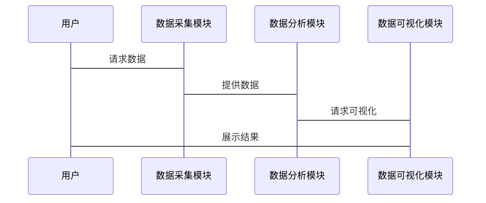

                 


# 特价股票与公司品牌价值的长期关系

**关键词：** 特价股票、公司品牌价值、长期关系、投资策略、市场分析

**摘要：** 本文探讨了特价股票与公司品牌价值之间的长期关系，通过建立数学模型和系统架构，分析了品牌价值对股票价格的影响，以及如何利用这些关系制定有效的投资策略。文章结合案例分析和项目实战，为读者提供了深入的见解和实用的指导。

---

## 第一部分: 特价股票与公司品牌价值的背景与概念

### 第1章: 特价股票的定义与特征
#### 1.1 特价股票的定义
特价股票是指市场价格低于其内在价值的股票，通常被认为是被市场低估的投资机会。这种股票可能因为市场波动、公司短期问题或市场情绪不佳而导致价格下跌，但其内在价值仍然具备吸引力。

#### 1.2 特价股票的特征
- **低市盈率（P/E比率）**：市盈率低于行业平均水平，表明股票价格相对于盈利较低。
- **低市净率（P/B比率）**：市净率低于1，表明股价低于每股净资产。
- **高股息率**：公司可能因为股价下跌而提供较高的股息收益率。
- **高内在价值**：尽管股价较低，但公司 fundamentals（基本面）良好，未来增长潜力大。

#### 1.3 特价股票的分类
- **周期性股票**：受经济周期影响较大的行业（如能源、材料）的股票可能在特定周期内成为特价股票。
- **成长型股票**：基本面良好，但暂时被市场低估的成长型企业。
- **价值型股票**：通常属于价值投资范畴，价格低于内在价值。

### 第2章: 公司品牌价值的定义与评估方法
#### 2.1 公司品牌价值的定义
公司品牌价值是指公司在市场上的声誉和影响力，是消费者、投资者和合作伙伴对公司的信任和认可的量化表现。品牌价值不仅包括商标本身的价值，还包括公司形象、产品质量、服务和创新能力等多方面的因素。

#### 2.2 公司品牌价值的评估方法
- **品牌价值评估模型**：如Interbrand的品牌价值评估模型，考虑收入、利润、品牌贡献等多因素。
- **市场法**：通过市场交易数据和可比公司分析来估算品牌价值。
- **收益法**：基于未来现金流的折现值来评估品牌价值。

#### 2.3 公司品牌价值的影响因素
- **产品质量**：产品的优良性直接影响品牌价值。
- **品牌认知度**：品牌在市场上的知名度和声誉。
- **创新能力**：公司的技术创新能力影响品牌竞争力。
- **财务状况**：公司的财务健康状况直接影响投资者对品牌的信心。

### 第3章: 特价股票与公司品牌价值的关系
#### 3.1 特价股票与公司品牌价值的相互作用
- **品牌价值影响股票价格**：高品牌价值的公司通常能获得更高的股价溢价。
- **股价波动影响品牌认知**：股价下跌可能导致品牌受损，反之亦然。

#### 3.2 特价股票对品牌价值的长期影响
- **品牌价值恢复**：当股价回升，品牌价值可能随之恢复甚至提升。
- **市场机会**：特价股票可能为投资者提供低价买入高价值品牌的机会，从而在长期实现收益。

#### 3.3 品牌价值对特价股票的长期影响
- **品牌溢价效应**：高品牌价值的公司即使股价被低估，长期来看，其品牌溢价效应可能使得股价回升。
- **投资信心**：高品牌价值的公司更容易获得投资者的信任，从而在市场波动中表现出更强的抗跌性。

---

## 第二部分: 特价股票与公司品牌价值的模型与分析

### 第4章: 特价股票与品牌价值的数学模型
#### 4.1 特价股票与品牌价值的关系模型
建立一个回归模型，将公司品牌价值与股票价格相关联。模型可以表示为：
$$
\text{Brand Value} = \beta_0 + \beta_1 \times \text{Stock Price} + \epsilon
$$
其中，$\beta_1$ 是股票价格对品牌价值的影响系数，$\epsilon$ 是误差项。

#### 4.2 品牌价值对股票价格的影响公式
通过分析历史数据，可以得出品牌价值对股票价格的回归方程：
$$
\text{Stock Price} = \alpha_0 + \alpha_1 \times \text{Brand Value} + \delta
$$
其中，$\alpha_1$ 是品牌价值对股票价格的影响系数，$\delta$ 是误差项。

#### 4.3 特价股票对品牌价值的回归分析
使用统计软件（如Python的scikit-learn库）进行回归分析，得出特价股票对品牌价值的具体影响。

---

## 第三部分: 特价股票与公司品牌价值的系统分析与架构设计

### 第5章: 系统分析与架构设计方案
#### 5.1 问题场景介绍
构建一个系统，用于分析特价股票与公司品牌价值之间的关系，包括数据采集、分析、预测和可视化。

#### 5.2 项目介绍
本项目旨在通过数据驱动的方法，分析特价股票与品牌价值的关系，为投资者提供决策支持。

#### 5.3 系统功能设计
- 数据采集模块：收集公司财务数据、股价数据和品牌价值评估数据。
- 数据分析模块：使用回归分析和时间序列分析模型进行数据分析。
- 数据预测模块：基于模型预测未来股价和品牌价值的变化。
- 数据可视化模块：将分析结果以图表形式展示。

#### 5.4 系统架构设计
使用Mermaid图展示系统架构：


#### 5.5 系统接口设计
- 数据接口：从数据库或API获取数据。
- 分析接口：调用回归分析和时间序列分析函数。
- 可视化接口：生成图表并展示结果。

#### 5.6 系统交互设计
使用Mermaid图展示系统交互：


---

## 第四部分: 特价股票与公司品牌价值的项目实战

### 第6章: 项目实战
#### 6.1 环境安装
安装必要的工具和库，如Python、scikit-learn、pandas、numpy和Matplotlib。

#### 6.2 系统核心实现
实现数据采集、分析和预测功能，代码示例如下：
```python
import pandas as pd
from sklearn.linear_model import LinearRegression

# 数据加载
data = pd.read_csv('brand_value.csv')

# 模型训练
model = LinearRegression()
model.fit(data[['stock_price']], data['brand_value'])

# 预测
predicted_brand_value = model.predict([[new_stock_price]])
```

#### 6.3 代码应用解读与分析
解释代码的功能和实现细节，分析模型的准确性。

#### 6.4 实际案例分析
选择具体公司（如苹果、谷歌）进行案例分析，展示模型的应用效果。

#### 6.5 结果分析与经验总结
分析预测结果，总结经验教训，提出改进建议。

---

## 第五部分: 总结与展望

### 第7章: 总结
总结全文内容，强调特价股票与品牌价值之间的长期关系，以及通过系统分析和数学模型制定投资策略的重要性。

### 第8章: 投资建议与注意事项
- **长期投资**：关注公司的基本面和品牌价值，避免短期波动影响决策。
- **风险管理**：合理分散投资，降低市场波动带来的风险。
- **持续学习**：关注市场动态和公司新闻，及时调整投资策略。

### 第9章: 未来研究方向
- 深化模型研究，引入机器学习算法提高预测精度。
- 扩展数据来源，增加更多影响因素。
- 研究全球市场中特价股票与品牌价值的关系。

---

**作者：AI天才研究院/AI Genius Institute & 禅与计算机程序设计艺术 /Zen And The Art of Computer Programming**

---

以上是《特价股票与公司品牌价值的长期关系》的完整目录大纲和文章内容，希望对您有所帮助！

