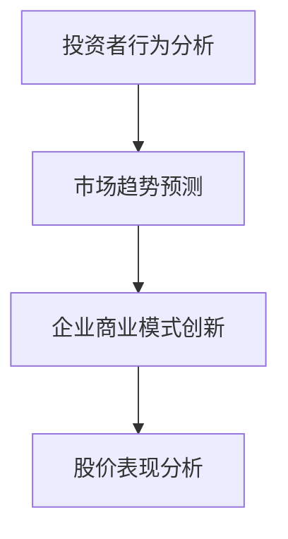

                 


# 特价股票与公司商业模式创新的关联性研究

> 关键词：特价股票，商业模式创新，关联性分析，市场趋势，企业转型

> 摘要：本文探讨了特价股票与公司商业模式创新之间的关联性，通过分析市场趋势、投资者行为和企业策略，揭示了如何通过商业模式创新应对特价股票市场的挑战，并提供实际案例和系统设计建议，为企业的可持续发展提供指导。

---

## 第1章: 特价股票的定义与市场现状

### 1.1 特价股票的定义

#### 1.1.1 特价股票的定义与分类
特价股票是指价格低于某一特定阈值的股票，通常指价格低于5元人民币的A股。根据市场表现，特价股票可以分为以下几类：
1. **低价蓝筹股**：价格低但公司规模大、业绩稳定的股票。
2. **低价成长股**：价格低但具有高增长潜力的股票。
3. **低价概念股**：价格低但受市场热点概念影响的股票。

#### 1.1.2 特价股票的市场现状分析
近年来，中国股市中特价股票数量显著增加，主要原因是市场波动加剧、投资者偏好变化以及经济下行压力。根据2023年数据，A股市场中有超过30%的股票价格低于5元，其中不乏一些业绩优良的公司。

#### 1.1.3 特价股票的投资者行为分析
投资者在面对特价股票时，通常表现出以下特征：
- **风险偏好较高**：投资者愿意承担更高风险以获取超额收益。
- **投资周期较短**：许多投资者短线交易，追求快速获利。
- **关注市场热点**：投资者倾向于关注政策、行业动态等外部因素。

### 1.2 商业模式创新的定义与重要性

#### 1.2.1 商业模式创新的定义
商业模式创新是指企业通过改变其收入来源、成本结构或价值传递方式，以创造新的价值主张。常见的创新模式包括订阅制、平台化、数据变现等。

#### 1.2.2 商业模式创新的重要性
在竞争激烈的市场环境中，商业模式创新是企业保持竞争优势的关键。通过创新，企业可以更好地满足客户需求，降低运营成本，并开拓新的收入来源。

---

## 第2章: 特价股票与商业模式创新的核心概念

### 2.1 特价股票的市场特征

#### 2.1.1 特价股票的市场波动性
特价股票价格波动较大，受市场情绪影响显著。例如，2023年某公司因政策利好，股价从2元迅速拉升至5元，吸引了大量投资者。

#### 2.1.2 特价股票的流动性风险
部分特价股票交易量小，流动性差，导致买卖价差较大，影响投资者的操作。

### 2.2 商业模式创新的核心要素

#### 2.2.1 价值主张
价值主张是商业模式的核心，企业需要明确为客户创造的独特价值。例如，某科技公司通过SaaS模式提供云服务，为客户创造高效的数据管理解决方案。

#### 2.2.2 收入来源
收入来源的多样化是商业模式创新的重要体现。例如，通过广告、订阅、增值服务等多渠道收入，降低对单一来源的依赖。

---

## 第3章: 特价股票与商业模式创新的关联性分析

### 3.1 特价股票市场的特点

#### 3.1.1 市场波动与投资者行为
特价股票市场的波动性较高，投资者行为受市场情绪影响较大。例如，市场上涨时，投资者倾向于追涨；市场下跌时，投资者倾向于抛售。

#### 3.1.2 市场参与者的多样性
特价股票市场参与者包括散户、机构投资者和游资，不同参与者的行为模式不同，影响市场走势。

### 3.2 商业模式创新与市场环境的关系

#### 3.2.1 市场环境对企业商业模式的影响
经济下行压力下，企业需要通过商业模式创新应对市场需求变化。例如，某公司从传统零售转向线上销售，通过电商平台降低运营成本。

#### 3.2.2 技术进步与商业模式创新
技术创新是推动商业模式创新的重要动力。例如，移动支付技术的发展推动了第三方支付平台的兴起。

---

## 第4章: 通过商业模式创新应对特价股票市场的挑战

### 4.1 商业模式创新的策略

#### 4.1.1 优化收入结构
通过多元化收入来源降低对特价股票市场的依赖。例如，通过会员制、增值服务等增加收入。

#### 4.1.2 提高运营效率
利用技术创新降低运营成本，提高效率。例如，通过自动化系统优化供应链管理。

### 4.2 案例分析

#### 4.2.1 某公司的成功转型
某公司通过从传统制造向智能制造转型，提升了生产效率和产品质量，增强了市场竞争力。

---

## 第5章: 系统分析与架构设计

### 5.1 系统分析框架

#### 5.1.1 问题场景介绍
通过系统分析框架，我们可以更好地理解特价股票与商业模式创新之间的关系。例如，分析某公司的商业模式创新如何影响其股价表现。

#### 5.1.2 系统功能设计
系统功能设计包括数据采集、分析、预测等模块，帮助投资者和企业管理者做出决策。

### 5.2 系统架构设计

#### 5.2.1 系统架构图
使用mermaid绘制系统架构图，展示各模块之间的关系。



#### 5.2.2 接口设计
系统需要与数据源、用户界面、第三方服务等进行交互，设计清晰的接口规范。

---

## 第6章: 项目实战

### 6.1 环境安装

#### 6.1.1 数据库安装
使用MySQL或MongoDB存储股票数据和商业模式创新案例。

#### 6.1.2 开发工具安装
安装Python、Jupyter Notebook、Pandas等工具，用于数据处理和分析。

### 6.2 核心代码实现

#### 6.2.1 数据采集
编写代码从财经网站获取特价股票数据。

```python
import pandas as pd
import requests

url = "http://example.com/stock_data"
response = requests.get(url)
data = response.json()
df = pd.DataFrame(data)
```

#### 6.2.2 模型构建
使用机器学习模型预测股价走势。

```python
from sklearn.linear_model import LinearRegression

model = LinearRegression()
model.fit(X, y)
predictions = model.predict(X_test)
```

### 6.3 案例分析

#### 6.3.1 某公司案例
分析某公司通过商业模式创新提升股价的具体案例，展示数据和模型的应用。

---

## 第7章: 结论与展望

### 7.1 研究结论
本文通过分析特价股票与商业模式创新的关联性，揭示了商业模式创新在应对市场挑战中的重要性。

### 7.2 未来研究方向
未来可以进一步研究技术进步对商业模式创新的影响，以及如何利用大数据和人工智能优化商业模式。

---

## 作者：AI天才研究院/AI Genius Institute & 禅与计算机程序设计艺术 /Zen And The Art of Computer Programming

---

以上是《特价股票与公司商业模式创新的关联性研究》的技术博客文章的详细内容，涵盖从背景介绍到系统设计的各个方面，旨在为读者提供全面而深入的分析和指导。

