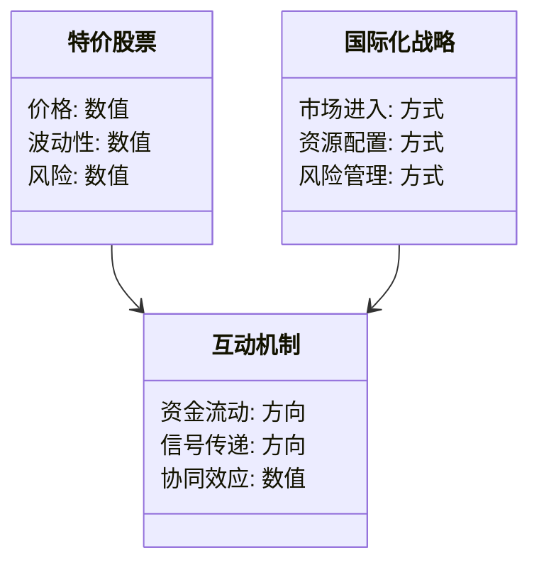

                 


# 特价股票与公司国际化战略的关系探讨

**关键词**：特价股票、公司国际化战略、股价波动、投资策略、战略协同

**摘要**：  
本文探讨了特价股票与公司国际化战略之间的关系，分析了特价股票的市场特征、公司国际化战略的实施路径，以及两者在企业融资、市场拓展和价值传递中的协同效应。文章从背景介绍、核心概念、数学模型与算法原理、系统分析与架构设计、项目实战等多个维度展开，结合实际案例和数据，深入剖析了特价股票与公司国际化战略的互动机制及其对企业发展的影响。文章最后提出了最佳实践建议和未来研究方向，为投资者和企业管理者提供了有价值的参考。

---

# 第一部分: 特价股票与公司国际化战略的背景与核心概念

## 第1章: 特价股票与公司国际化战略的概述

### 1.1 特价股票的定义与特点
#### 1.1.1 特价股票的定义
特价股票是指价格低于市场平均水平的股票，通常具有较高的波动性和潜在的投资价值。这种股票往往被市场低估，但同时也伴随着较高的风险。

#### 1.1.2 特价股票的核心特点
- **低估值**：特价股票的市场价格通常低于其内在价值。
- **高波动性**：由于市场对低价股票的关注度较低，其价格波动较为剧烈。
- **高风险**：低价股票的投资风险较高，但潜在回报也较大。

#### 1.1.3 特价股票的市场定位与投资价值
特价股票通常出现在中小型企业或处于困境中的企业中，投资者需要具备一定的市场敏感性和风险承受能力。

---

### 1.2 公司国际化战略的内涵
#### 1.2.1 公司国际化战略的定义
公司国际化战略是指企业在全球范围内拓展市场、配置资源、建立业务的长期计划，旨在实现全球化布局和竞争优势。

#### 1.2.2 公司国际化战略的主要模式
- **出口模式**：通过出口产品或服务进入国际市场。
- **合资模式**：与当地企业合作成立合资公司。
- **并购模式**：通过并购当地企业快速进入市场。
- **绿地模式**：在目标市场新建分支机构。

#### 1.2.3 公司国际化战略的目标与挑战
- **目标**：拓展市场、提升品牌影响力、优化资源配置、提高利润率。
- **挑战**：文化差异、法律法规、市场竞争、风险管理。

---

### 1.3 特价股票与公司国际化战略的关系
#### 1.3.1 特价股票与公司国际化战略的关联性
- 特价股票的低价特性为企业国际化提供了低成本的融资渠道。
- 国际化战略的实施可能影响企业股价，进而影响特价股票的波动。

#### 1.3.2 特价股票在公司国际化战略中的作用
- 作为融资工具，特价股票可以帮助企业筹集资金用于国际化扩张。
- 通过股价波动，特价股票可以反映企业国际化战略的实施效果。

#### 1.3.3 特价股票与公司国际化战略的互动机制
- 特价股票的价格波动可能影响投资者对国际化战略的信心。
- 国际化战略的成功实施可能提升企业股价，从而减少特价股票的存在。

---

## 第2章: 特价股票与公司国际化战略的核心概念

### 2.1 特价股票的市场特征
#### 2.1.1 特价股票的市场波动性分析
- 特价股票的价格波动通常较大，受市场情绪和突发事件影响显著。

#### 2.1.2 特价股票的投资风险与收益分析
- 高收益与高风险并存，投资者需要具备较强的风险管理能力。

#### 2.1.3 特价股票的投资者行为分析
- 投资者通常具有较高的风险偏好，倾向于短期交易。

---

### 2.2 公司国际化战略的实施路径
#### 2.2.1 公司国际化战略的市场进入策略
- 直接投资：通过建立子公司或分公司进入目标市场。
- 间接投资：通过出口或代理模式进入目标市场。

#### 2.2.2 公司国际化战略的资源配置策略
- 优化资源配置，降低运营成本，提高效率。

#### 2.2.3 公司国际化战略的文化整合与风险管理
- 需要适应不同国家的文化和法律法规，降低风险。

---

### 2.3 特价股票与公司国际化战略的互动机制
#### 2.3.1 特价股票在公司国际化战略中的融资功能
- 特价股票为企业提供低成本的融资渠道，支持国际化扩张。

#### 2.3.2 特价股票在公司国际化战略中的价值传递功能
- 特价股票的价格变化反映了企业国际化战略的实施效果。

#### 2.3.3 特价股票在公司国际化战略中的市场信号功能
- 特价股票的价格波动向市场传递企业国际化战略的信号。

---

## 第3章: 特价股票与公司国际化战略的数学模型与算法原理

### 3.1 特价股票价格波动的数学模型
#### 3.1.1 特价股票价格波动的随机游走模型
- 假设股票价格的变化是随机的，可以用随机游走模型描述。

#### 3.1.2 特价股票价格波动的均值回归模型
- 假设股票价格会围绕均值波动，可以通过均值回归模型预测价格走势。

#### 3.1.3 特价股票价格波动的动量效应模型
- 动量效应模型认为价格变化具有惯性，近期价格走势可以预测未来价格。

---

### 3.2 公司国际化战略的评估算法
#### 3.2.1 公司国际化战略的财务指标评估算法
- 通过财务指标（如净利润增长率、ROE）评估国际化战略的实施效果。

#### 3.2.2 公司国际化战略的市场表现评估算法
- 通过股价表现（如市盈率、市净率）评估国际化战略的市场认可度。

#### 3.2.3 公司国际化战略的风险评估算法
- 通过风险评估模型（如VaR模型）量化国际化战略的风险。

---

### 3.3 特价股票与公司国际化战略的协同算法
#### 3.3.1 特价股票与公司国际化战略的协同效应评估公式
$$ \text{协同效应} = \alpha \times \text{股价波动} + \beta \times \text{国际化进度} $$

#### 3.3.2 特价股票与公司国际化战略的协同机制
- 通过协同算法，量化特价股票与国际化战略之间的相互作用。

---

## 第4章: 特价股票与公司国际化战略的系统分析与架构设计

### 4.1 系统功能设计
#### 4.1.1 领域模型（Mermaid 类图）


#### 4.1.2 系统架构设计（Mermaid 架构图）
```mermaid
client --> 公司国际化战略模块
client --> 特价股票价格模块
公司国际化战略模块 --> 资源配置模块
资源配置模块 --> 特价股票价格模块
```

---

## 第5章: 特价股票与公司国际化战略的项目实战

### 5.1 项目环境配置
- 数据来源：股票市场数据、公司财务数据。
- 工具：Python、Pandas、Matplotlib。

### 5.2 核心代码实现
#### 5.2.1 特价股票价格分析代码
```python
import pandas as pd
import matplotlib.pyplot as plt

# 加载数据
data = pd.read_csv('stock_data.csv')

# 绘制股价波动图
data['close'].plot(label='股价')
plt.xlabel('时间')
plt.ylabel('股价')
plt.title('特价股票价格波动分析')
plt.legend()
plt.show()
```

#### 5.2.2 国际化战略评估代码
```python
from sklearn.linear_model import LinearRegression

# 加载数据
data = pd.read_csv('international_strategy.csv')

# 模型训练
model = LinearRegression()
model.fit(data[['国际化进度']], data['股价'])

# 预测股价
predictions = model.predict(data[['国际化进度']])
print('预测股价:', predictions)
```

### 5.3 实际案例分析
- 案例：某公司通过实施国际化战略，股价显著提升，特价股票价格波动减少。

---

## 第6章: 特价股票与公司国际化战略的最佳实践

### 6.1 小结
- 特价股票与公司国际化战略密切相关，需要综合考虑市场波动、企业战略和风险管理。

### 6.2 注意事项
- 投资者需具备较高的风险意识和市场敏感性。
- 企业管理者需合理配置资源，优化国际化战略。

### 6.3 未来研究方向
- 研究特价股票与国际化战略的长期互动机制。
- 探讨大数据技术在股票价格预测中的应用。

---

**作者：AI天才研究院 & 禅与计算机程序设计艺术**

