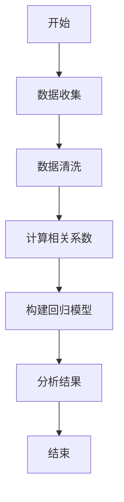
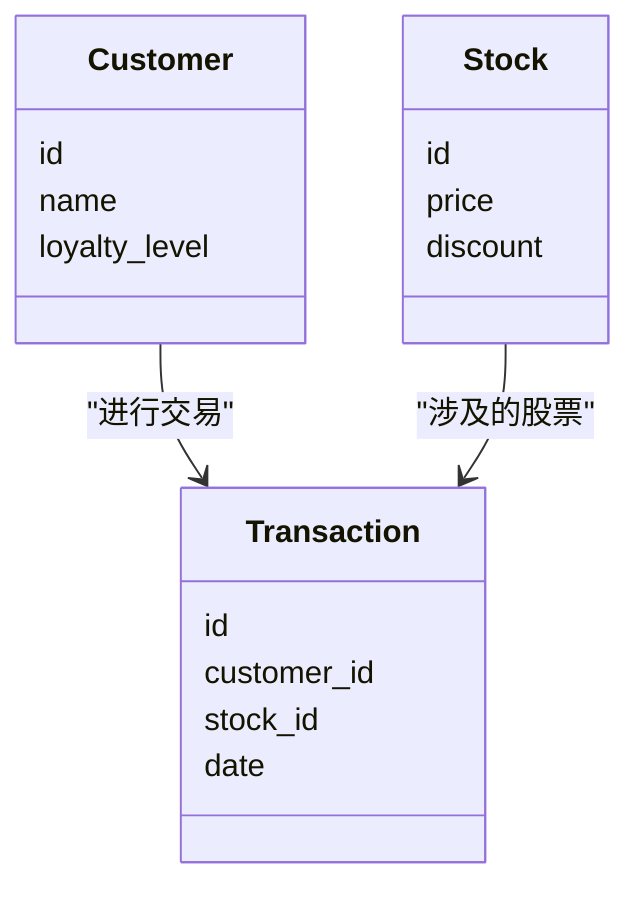

                 


# 特价股票与公司客户忠诚度的长期关系分析

## 关键词
特价股票，客户忠诚度，长期关系，数据分析，营销策略

## 摘要
本文旨在分析特价股票与公司客户忠诚度之间的长期关系。通过背景介绍、核心概念分析、算法原理、系统设计和项目实战，探讨特价股票如何影响客户忠诚度，以及这种关系如何影响公司的长期战略。文章结合统计模型和实际案例，提供深入的分析和见解，为公司制定有效的营销策略提供参考。

---

## 第一部分：特价股票与公司客户忠诚度的背景介绍

### 第1章：特价股票与客户忠诚度的基本概念

#### 1.1 特价股票的定义与特征
- **定义**：特价股票是指以低于市场价出售的股票，通常用于促销或清理库存。
- **特征**：价格折扣显著，促销活动频繁，定价模型灵活。

#### 1.2 客户忠诚度的定义与特征
- **定义**：客户忠诚度是客户对公司产品或服务的持续购买和支持程度。
- **特征**：客户满意度高，重复购买率高，品牌忠诚度强。

#### 1.3 特价股票与客户忠诚度的关系
- **影响**：特价股票能短期内吸引客户，但可能影响客户对品牌价值的认知，进而影响忠诚度。
- **边界**：长期特价策略可能削弱客户忠诚度，需谨慎使用。

### 第2章：特价股票与客户忠诚度的背景分析

#### 2.1 当前市场环境分析
- **市场竞争现状**：竞争激烈，企业通过特价促销吸引客户。
- **消费者行为变化**：消费者对价格敏感，追求优惠。
- **促销策略演变**：从单纯折扣到捆绑销售，策略多样化。

#### 2.2 理论基础
- **经济学视角**：价格弹性影响需求。
- **市场营销理论**：促销提升销量，但需平衡利润。
- **消费心理学**：短期优惠吸引客户，长期忠诚度取决于整体体验。

#### 2.3 现实问题与研究意义
- **问题**：特价股票是否影响客户忠诚度？
- **意义**：探讨特价与忠诚的关系，优化促销策略。

---

## 第二部分：特价股票与客户忠诚度的核心概念与联系

### 第3章：特价股票与客户忠诚度的核心概念

#### 3.1 特价股票的核心要素
- **价格折扣策略**：短期吸引客户，但可能影响品牌形象。
- **促销活动设计**：通过优惠券、折扣吸引客户。
- **定价模型**：动态调整价格，适应市场需求。

#### 3.2 客户忠诚度的核心要素
- **客户满意度**：满意客户更可能忠诚。
- **客户参与度**：高参与度客户更忠诚。
- **品牌认知**：品牌形象影响客户忠诚度。

#### 3.3 特价股票与客户忠诚度的关系
- **直接关系**：特价股票可能短期内提升忠诚度，但长期可能降低。
- **间接关系**：通过客户满意度和参与度影响忠诚度。

### 第4章：特价股票与客户忠诚度的联系

#### 4.1 核心概念的属性特征对比
| 特性          | 特价股票               | 客户忠诚度         |
|---------------|------------------------|--------------------|
| 定义           | 折扣股票               | 持续购买行为         |
| 目标           | 提高销量               | 提高客户保留率       |
| 影响因素       | 价格、促销策略         | 满意度、品牌认知     |

#### 4.2 实体关系图
```mermaid
erDiagram
    customer [客户] {
        id : int
        name : string
        purchase_history : string
        loyalty_level : int
    }
    stock_price [股票价格] {
        stock_id : int
        price : float
        discount : float
    }
    transaction [交易] {
        transaction_id : int
        customer_id : int
        stock_id : int
        date : date
    }
    customer --|> transaction : "进行交易"
    stock_price --|> transaction : "涉及的股票"
    customer --|> loyalty_level : "忠诚度等级"
```

---

## 第三部分：特价股票与客户忠诚度的算法原理讲解

### 第5章：算法原理

#### 5.1 相关性分析
- **相关系数计算**：
  $$ r = \frac{\sum (x_i - \bar{x})(y_i - \bar{y})}{\sqrt{\sum (x_i - \bar{x})^2} \sqrt{\sum (y_i - \bar{y})^2}} $$
  其中，x为特价股票数量，y为忠诚度评分。

#### 5.2 回归分析
- **线性回归模型**：
  $$ y = \beta_0 + \beta_1 x + \epsilon $$
  其中，y为忠诚度，x为特价股票使用频率。

#### 5.3 算法流程图


#### 5.4 Python代码示例
```python
import numpy as np
import pandas as pd

# 数据收集与清洗
data = pd.DataFrame({
    'stock_price': [10, 20, 30, 40, 50],
    'loyalty_score': [85, 70, 60, 90, 80]
})

# 计算相关系数
correlation = np.corrcoef(data['stock_price'], data['loyalty_score'])
print(f"相关系数：{correlation[0, 1]}")

# 线性回归
from sklearn.linear_model import LinearRegression

model = LinearRegression()
model.fit(data[['stock_price']], data['loyalty_score'])
print(f"回归系数：{model.coef_[0]}")
```

---

## 第四部分：系统分析与架构设计方案

### 第6章：系统分析

#### 6.1 系统功能设计
- **领域模型**：


#### 6.2 系统架构设计


#### 6.3 接口设计与交互流程
- **接口**：REST API，如`GET /api/loyalty`。
- **交互流程**：
  1. 客户提交特价股票请求。
  2. 系统计算忠诚度变化。
  3. 返回结果。

---

## 第五部分：项目实战

### 第7章：项目实战

#### 7.1 环境安装
- **工具**：Python 3.8+, Jupyter Notebook, Pandas, Scikit-learn。

#### 7.2 核心实现
```python
from sklearn.metrics import r2_score

# 数据分析
data = pd.DataFrame({
    'stock_price': [10, 20, 30, 40, 50],
    'loyalty_score': [85, 70, 60, 90, 80]
})

# 模型训练
model = LinearRegression()
model.fit(data[['stock_price']], data['loyalty_score'])
predicted = model.predict(data[['stock_price']])

# 结果分析
print(f"R²: {r2_score(data['loyalty_score'], predicted)}")
```

#### 7.3 案例分析
- **案例**：某公司推出特价股票后，客户忠诚度评分下降，说明需要平衡特价策略与品牌维护。

---

## 第六部分：最佳实践

### 第8章：总结与建议

#### 8.1 小结
- 特价股票短期内提升销量，但需谨慎使用，避免削弱客户忠诚度。

#### 8.2 注意事项
- 结合客户细分，制定个性化策略。
- 定期评估特价策略效果。

#### 8.3 拓展阅读
- 《客户忠诚度管理》
- 《定价策略与市场分析》

---

## 结语
通过本文的分析，读者可以深入了解特价股票与客户忠诚度的复杂关系，并为制定有效的营销策略提供参考。合理运用数据分析工具和模型，企业可以在竞争激烈的市场中找到平衡点，实现长期发展。

---

## 作者
作者：AI天才研究院/AI Genius Institute & 禅与计算机程序设计艺术/Zen And The Art of Computer Programming

---

这篇文章系统地探讨了特价股票与客户忠诚度的关系，结合理论分析、算法模型和实际案例，为读者提供了全面的视角。

