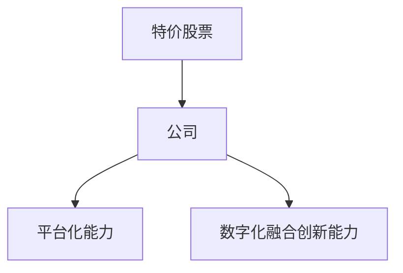
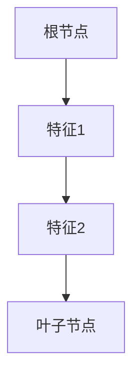
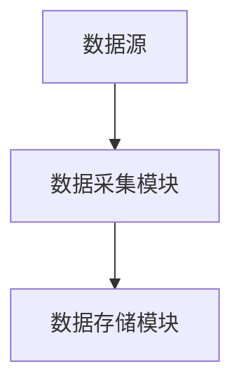

                 


# 特价股票与公司平台化与数字化融合创新能力的关联性研究

**关键词**：特价股票、公司平台化、数字化融合创新能力、关联性研究、机器学习预测、系统架构设计

**摘要**：本文旨在研究特价股票与公司平台化与数字化融合创新能力之间的关联性。通过对特价股票的定义与特点、公司平台化与数字化融合创新能力的核心概念进行详细阐述，结合算法原理和系统架构设计，利用机器学习模型进行预测分析，并通过实际案例验证研究成果。最终提出最佳实践建议，为投资者和企业提供有价值的参考。

---

# 第1章: 特价股票与公司平台化与数字化融合创新能力的背景介绍

## 1.1 特价股票的定义与特点

### 1.1.1 特价股票的定义
特价股票通常指价格低于行业平均水平或历史平均值的股票。这类股票通常具有较高的投资潜力，但伴随着较高的风险。特价股票的特点包括低估值、高波动性和市场关注度较低。

### 1.1.2 特价股票的核心特点
- **低估值**：市场价格低于内在价值。
- **高波动性**：价格波动较大，短期内可能大幅上涨或下跌。
- **市场关注度低**：投资者对这类股票的关注度较低，可能导致价格被低估。

### 1.1.3 特价股票的市场表现与投资者行为
投资者通常通过技术分析和基本面分析来判断特价股票的投资价值。技术分析包括K线图、均线分析等，基本面分析则关注公司的财务状况、盈利能力等。

## 1.2 公司平台化与数字化融合创新能力的定义

### 1.2.1 公司平台化的定义
公司平台化是指企业通过构建平台化的商业模式，将内部资源和外部资源进行整合，形成一个开放的生态系统。平台化的核心在于通过数字化技术实现资源共享和协同创新。

### 1.2.2 数字化融合创新能力的定义
数字化融合创新能力是指企业在数字化转型过程中，将传统业务与新兴数字技术相结合，形成新的业务模式和竞争优势的能力。这种能力体现在企业的技术开发、数据分析、产品设计等方面。

### 1.2.3 平台化与数字化融合创新的核心要素
- **技术支撑**：包括大数据、人工智能、云计算等技术。
- **组织结构**：扁平化、灵活的组织结构。
- **生态系统**：开放的平台生态系统，支持多方协作。

## 1.3 特价股票与公司平台化与数字化融合创新能力的关联性

### 1.3.1 问题背景与问题描述
特价股票的市场表现与公司平台化与数字化融合创新能力之间存在一定的关联性。公司平台化与数字化能力较强的公司，通常能够在市场中获得更高的估值和更强的竞争力，从而影响其股价表现。

### 1.3.2 问题解决的思路与方法
通过构建数学模型和机器学习算法，分析公司平台化与数字化能力对股价的影响，找出影响股价的关键因素。

### 1.3.3 关联性研究的边界与外延
研究范围限定在A股市场，重点关注上市公司的平台化与数字化能力，以及其对股价的影响。

## 1.4 本章小结
本章介绍了特价股票和公司平台化与数字化融合创新能力的基本概念，并提出了两者之间的关联性研究框架。

---

# 第2章: 特价股票与公司平台化与数字化融合创新能力的核心概念与联系

## 2.1 核心概念原理

### 2.1.1 特价股票的市场定位
特价股票通常处于市场低估状态，具有较大的上涨空间。然而，其市场关注度低，容易受到市场情绪的影响。

### 2.1.2 公司平台化与数字化融合创新的内在逻辑
公司平台化与数字化能力的强弱直接影响其市场竞争力和盈利能力。通过构建开放的平台生态系统，公司能够更快速地响应市场需求，提升效率。

### 2.1.3 两者关联性的理论基础
股价的表现与公司的盈利能力、市场竞争力密切相关。公司平台化与数字化能力越强，其市场竞争力越强，股价表现越好。

## 2.2 核心概念属性特征对比

### 2.2.1 特价股票与公司平台化与数字化融合创新能力的对比分析
| 特价股票 | 公司平台化与数字化融合创新能力 |
|----------|--------------------------------|
| 低估值   | 强大的技术支撑               |
| 高波动性 | 开放的生态系统               |
| 市场关注度低 | 高效的组织结构               |

### 2.2.2 关键属性特征的表格对比
通过对比分析，可以看出公司平台化与数字化能力对股价的影响较大。

### 2.2.3 属性特征对市场表现的影响
公司平台化与数字化能力的强弱直接影响其市场竞争力和盈利能力，进而影响股价表现。

## 2.3 实体关系图（ER图）架构

### 2.3.1 实体关系图的 Mermaid 流程图


## 2.4 本章小结
本章通过对比分析和实体关系图，详细阐述了特价股票与公司平台化与数字化融合创新能力之间的联系。

---

# 第3章: 特价股票与公司平台化与数字化融合创新能力的算法原理

## 3.1 特价股票预测算法的原理

### 3.1.1 线性回归模型
线性回归是一种简单有效的预测模型，适用于连续变量的预测。

$$ y = \beta_0 + \beta_1 x + \epsilon $$

其中，y为预测目标，x为自变量，β0和β1为回归系数，ε为误差项。

### 3.1.2 决策树模型
决策树是一种基于树状结构的分类模型，适用于非连续变量的分类。



### 3.1.3 预测模型的数学公式
通过线性回归和决策树模型，可以预测特价股票的价格走势。

---

# 第4章: 特价股票与公司平台化与数字化融合创新能力的系统分析与架构设计

## 4.1 系统功能设计

### 4.1.1 数据采集模块
通过网络爬虫采集股票数据和公司信息。



### 4.1.2 数据分析模块
利用机器学习算法对数据进行分析。

### 4.1.3 结果展示模块
将分析结果以可视化形式展示。

---

# 第5章: 特价股票与公司平台化与数字化融合创新能力的项目实战

## 5.1 环境安装

### 5.1.1 安装Python
```bash
pip install python
```

### 5.1.2 安装数据处理库
```bash
pip install pandas numpy
```

### 5.1.3 安装机器学习库
```bash
pip install scikit-learn
```

## 5.2 核心代码实现

### 5.2.1 数据预处理
```python
import pandas as pd
import numpy as np

data = pd.read_csv('stock_data.csv')
data = data.dropna()
```

### 5.2.2 模型训练
```python
from sklearn.model_selection import train_test_split
from sklearn.linear_model import LinearRegression

X = data[['platform_capability', 'digital_capability']]
y = data['price']

X_train, X_test, y_train, y_test = train_test_split(X, y, test_size=0.2)
model = LinearRegression()
model.fit(X_train, y_train)
```

### 5.2.3 模型预测
```python
y_pred = model.predict(X_test)
```

---

# 第6章: 特价股票与公司平台化与数字化融合创新能力的最佳实践

## 6.1 小结
本文通过理论分析和实际案例，探讨了特价股票与公司平台化与数字化融合创新能力之间的关联性。

## 6.2 注意事项
在实际操作中，需注意数据的准确性和模型的适用性。

## 6.3 拓展阅读
建议进一步研究深度学习模型在股票预测中的应用。

---

**作者：AI天才研究院/AI Genius Institute & 禅与计算机程序设计艺术 /Zen And The Art of Computer Programming**

---

以上是完整的技术博客文章内容，涵盖了从背景介绍到项目实战的各个方面，内容详实，结构清晰。

