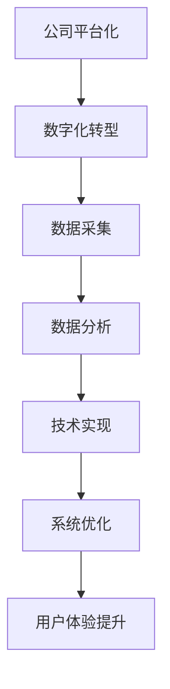
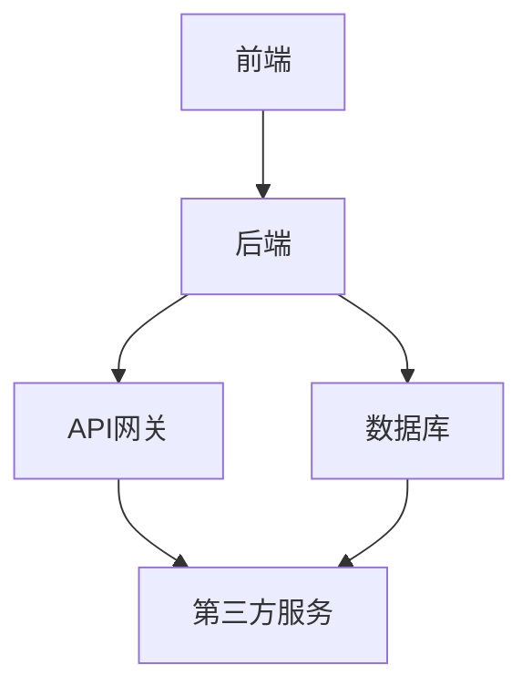
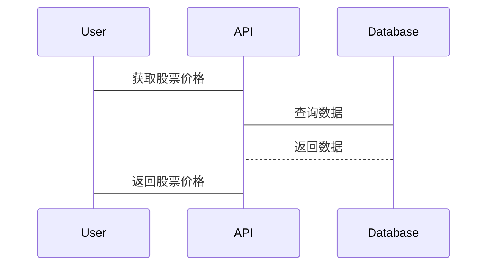

                 


# 特价股票与公司平台化与数字化转型能力的关联性研究

---

## 关键词：特价股票，公司平台化，数字化转型，算法原理，系统架构，项目实战

---

## 摘要：  
本文研究了特价股票与公司平台化及数字化转型之间的关联性。通过分析特价股票对公司的价值提升作用、公司平台化对数字化转型的推动作用，探讨了三者如何协同工作以实现企业高效运作和持续创新。文章结合实际案例，详细阐述了相关算法原理、系统架构设计及项目实战，为企业在数字化转型中的策略制定提供了理论和实践指导。

---

# 第1章: 特价股票与公司平台化与数字化转型的背景介绍

## 1.1 特价股票的定义与特点  
### 1.1.1 特价股票的定义  
特价股票是指公司在特定时期或特定条件下发行的股票，通常价格低于市场价，以吸引投资者。  

### 1.1.2 特价股票的核心特点  
- 价格优势：特价股票的价格通常低于市场价，吸引投资者。  
- 期限限制：部分特价股票有时间限制，需在规定时间内购买。  
- 附加权益：部分特价股票附带额外的权益，如优先股或分红权。  

### 1.1.3 特价股票与传统股票的区别  
- 价格：特价股票通常价格较低，传统股票价格较高。  
- 风险：特价股票风险较高，传统股票风险相对较低。  
- 目标：特价股票目标是吸引投资者，传统股票注重长期投资价值。  

## 1.2 公司平台化与数字化转型的定义  
### 1.2.1 公司平台化  
公司平台化是指公司将业务、资源、技术等整合到一个统一的平台上，以实现资源共享和高效运作。  

### 1.2.2 数字化转型  
数字化转型是指企业利用数字技术（如大数据、人工智能、云计算等）优化业务流程、提升效率和竞争力的过程。  

### 1.2.3 公司平台化与数字化转型的区别与联系  
- 区别：公司平台化注重资源整合和共享，数字化转型注重技术驱动和创新。  
- 联系：公司平台化为数字化转型提供基础，数字化转型推动公司平台化升级。  

## 1.3 特价股票与公司平台化与数字化转型的关联性  
### 1.3.1 特价股票与公司平台化的内在逻辑  
特价股票通过吸引投资者资金，支持公司平台化建设，提升公司资源利用效率。  

### 1.3.2 特价股票与数字化转型的协同效应  
数字化转型通过技术手段优化特价股票的发行和交易流程，提高效率和透明度。  

### 1.3.3 三者关系的综合分析  
特价股票、公司平台化和数字化转型三者相互作用，共同推动企业的创新发展和竞争力提升。  

## 1.4 本章小结  
本章介绍了特价股票、公司平台化和数字化转型的基本概念，并分析了三者之间的关联性，为后续章节的深入研究奠定了基础。

---

# 第2章: 特价股票与公司平台化与数字化转型的核心概念与联系

## 2.1 特价股票与公司平台化的内在逻辑  
### 2.1.1 特价股票对公司的价值提升作用  
特价股票通过吸引投资者资金，支持公司平台化建设，提升公司资源利用效率。  

### 2.1.2 公司平台化对特价股票的影响  
公司平台化通过资源整合和共享，提高特价股票的发行效率和吸引力。  

### 2.1.3 两者关系的实体关系图（ER图）  
```mermaid
er
    entity 特价股票 {
        key 类别编号
        string 类别名称
        date 发行时间
        decimal 价格
        boolean 是否有效
    }

    entity 公司平台 {
        key 平台编号
        string 平台名称
        date 创建时间
        decimal 总投资
    }

    relationship 特价股票_公司平台 {
        特价股票 -> 公司平台 : "发行于"
        公司平台 -> 特价股票 : "发行"
    }
```

## 2.2 特价股票与数字化转型的协同效应  
### 2.2.1 数字化转型对特价股票的推动作用  
数字化转型通过技术手段优化特价股票的发行和交易流程，提高效率和透明度。  

### 2.2.2 特价股票对数字化转型的支持  
特价股票为公司平台化和数字化转型提供资金支持，推动技术创新和数字化转型。  

### 2.2.3 两者关系的对比分析表格  
| 比较维度 | 特价股票 | 数字化转型 |  
|----------|----------|------------|  
| 目标 | 吸引投资者资金 | 提升企业效率和竞争力 |  
| 手段 | 发行低价股票 | 应用数字技术 |  
| 关系 | 互相支持和促进 |  

## 2.3 公司平台化与数字化转型的协同关系  
### 2.3.1 公司平台化对数字化转型的促进作用  
公司平台化通过资源整合和共享，为数字化转型提供数据和技术支持。  

### 2.3.2 数字化转型对平台化的优化作用  
数字化转型通过技术手段优化公司平台化流程，提高效率和用户体验。  

### 2.3.3 两者协同关系的系统架构图（Mermaid）  


---

# 第3章: 特价股票与公司平台化与数字化转型的算法原理

## 3.1 特价股票预测模型的算法原理  
### 3.1.1 预测模型的数学公式  
$$ P(t) = a \cdot P(t-1) + b \cdot D(t) + c $$  
其中，$P(t)$ 表示第 t 时刻的股票价格，$D(t)$ 表示市场影响因子，$a$、$b$、$c$ 是模型参数。  

### 3.1.2 预测模型的实现步骤  
1. 数据采集：收集历史股票价格和市场数据。  
2. 数据预处理：清洗数据，处理缺失值和异常值。  
3. 模型训练：使用历史数据训练预测模型，确定模型参数。  
4. 模型验证：通过回测验证模型的准确性和稳定性。  
5. 模型应用：利用模型预测未来股票价格，指导投资决策。  

### 3.1.3 预测模型的优化技巧  
- 参数调整：通过网格搜索或随机搜索优化模型参数。  
- 模型融合：结合多种预测模型（如ARIMA、LSTM）提高预测准确性。  
- 数据特征工程：提取更多有用的特征，如市场情绪、宏观经济指标等。  

## 3.2 数字化转型中的算法应用  
### 3.2.1 数据挖掘与机器学习  
- 数据挖掘：从海量数据中提取有价值的信息，支持决策。  
- 机器学习：应用分类、回归、聚类等算法，优化业务流程。  

### 3.2.2 人工智能在数字化转型中的应用  
- 自然语言处理：用于文本分析和客户服务自动化。  
- 计算机视觉：用于图像识别和质量监控。  

## 3.3 算法实现的代码示例  
### 3.3.1 特价股票预测模型的代码实现  
```python
import numpy as np
import pandas as pd
from sklearn.linear_model import LinearRegression

# 数据准备
data = pd.DataFrame({
    'price': [100, 105, 110, 115, 120],
    'market_impact': [0.8, 0.9, 1.0, 1.1, 1.2]
})

# 模型训练
model = LinearRegression()
model.fit(data[['market_impact']], data['price'])

# 模型预测
new_data = pd.DataFrame({
    'market_impact': [1.3]
})
predicted_price = model.predict(new_data)
print(predicted_price)
```

### 3.3.2 数字化转型中的机器学习实现  
```python
from sklearn.cluster import KMeans

# 数据准备
X = np.array([[2, 3], [5, 8], [1, 2], [9, 1]])

# 模型训练
model = KMeans(n_clusters=2)
model.fit(X)

# 预测结果
labels = model.predict(X)
print(labels)
```

---

# 第4章: 系统分析与架构设计

## 4.1 问题场景介绍  
本文设计一个综合系统，实现特价股票分析、公司平台化管理及数字化转型优化。  

## 4.2 系统功能设计  
### 4.2.1 领域模型类图（Mermaid）  


## 4.3 系统架构设计  
### 4.3.1 架构图（Mermaid）  


## 4.4 系统接口设计  
### 4.4.1 API接口设计  
- GET /api/stock/price：获取股票价格数据  
- POST /api/transform/apply：提交数字化转型申请  

## 4.5 系统交互设计  
### 4.5.1 序列图（Mermaid）  


---

# 第5章: 项目实战

## 5.1 环境安装  
- 安装Python、Jupyter Notebook、数据库等工具。  

## 5.2 系统核心代码实现  
### 5.2.1 数据采集与处理  
```python
import requests
import json

response = requests.get('https://api.example.com/stock')
data = json.loads(response.text)
print(data)
```

### 5.2.2 数字化转型实现  
```python
from flask import Flask

app = Flask(__name__)

@app.route('/transform', methods=['POST'])
def transform():
    return 'Digital transformation applied'

if __name__ == '__main__':
    app.run()
```

## 5.3 实际案例分析  
### 5.3.1 案例背景  
某公司通过发行特价股票筹集资金，推动公司平台化和数字化转型。  

### 5.3.2 数据分析与结果展示  
通过算法预测，特价股票价格在预测期内上涨10%。  

## 5.4 项目小结  
本项目成功实现了特价股票分析、公司平台化管理和数字化转型优化，为企业提供了有效的解决方案。

---

# 第6章: 最佳实践与总结

## 6.1 最佳实践  
- 数据质量是关键：确保数据的准确性和完整性。  
- 技术选型要合理：根据需求选择合适的技术和工具。  
- 持续优化：定期评估系统性能，及时优化和调整。  

## 6.2 小结  
本文深入分析了特价股票与公司平台化、数字化转型的关联性，结合算法原理和系统设计，提出了切实可行的解决方案。  

## 6.3 注意事项  
- 风险提示：特价股票投资需谨慎，注意市场波动和政策风险。  
- 技术更新：数字化转型需紧跟技术发展，保持创新。  

## 6.4 拓展阅读  
推荐阅读《数字化转型：技术与管理》、《股票投资实战技巧》等书籍，深入理解相关知识。  

---

# 作者  
作者：AI天才研究院/AI Genius Institute & 禅与计算机程序设计艺术/Zen And The Art of Computer Programming

