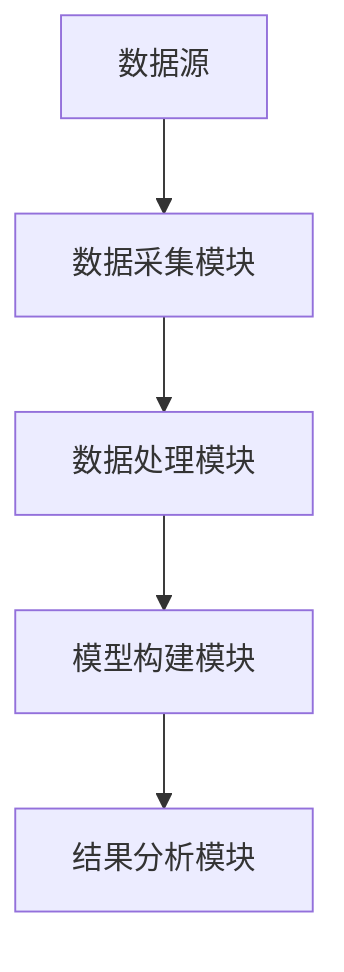
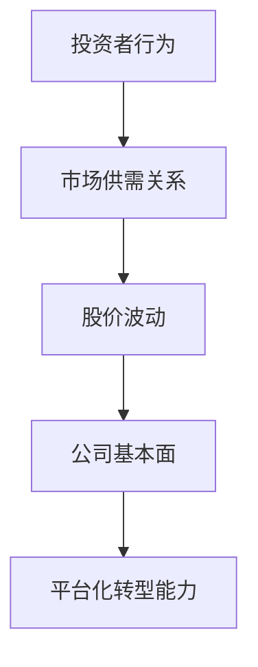

                 


# 特价股票与公司平台化转型能力的关联性研究

> 关键词：特价股票，公司平台化转型能力，关联性研究，影响因素分析，系统架构设计

> 摘要：本文探讨了特价股票与公司平台化转型能力之间的关联性，分析了影响特价股票波动的关键因素，以及公司平台化转型能力如何通过优化资源配置、提升运营效率和增强抗风险能力，进而影响特价股票的表现。研究结合了数学建模、系统架构设计和实际案例分析，提出了量化分析方法，并为投资者和企业管理者提供了实用的建议和决策支持。

---

# 第一章: 特价股票的市场现状与特征

## 1.1 特价股票的定义与分类

### 1.1.1 特价股票的定义
特价股票是指价格相对较低的股票，通常具有较高的波动性和潜在的高增长空间。这类股票在市场中被视为高风险高回报的投资标的。

### 1.1.2 特价股票的分类
- **按公司规模**：分为小盘股、中盘股和大盘股。
- **按行业类型**：分为科技、金融、制造等行业。
- **按市场类型**：分为主板、创业板、新三板等。

### 1.1.3 特价股票的市场特征
- **波动性高**：价格波动剧烈，受市场情绪影响较大。
- **流动性低**：部分特价股票交易量小，市场深度不足。
- **估值差异大**：部分股票估值低于行业平均水平，具有较大的上升空间。

## 1.2 公司平台化转型能力的背景

### 1.2.1 平台化转型的定义
公司平台化转型是指企业通过构建平台化组织架构，整合内部资源和外部生态，实现业务模式的升级和创新能力的提升。

### 1.2.2 平台化转型的核心特征
- **生态化**：构建开放的生态系统，吸引合作伙伴。
- **模块化**：将业务模块化，便于灵活调整和扩展。
- **数据驱动**：利用数据和技术提升决策效率。

### 1.2.3 平台化转型的驱动因素
- **市场竞争加剧**：企业需要通过转型提升竞争力。
- **技术进步**：大数据、人工智能等技术为转型提供了支撑。
- **客户需求变化**：客户对个性化和高效服务的需求增加。

---

# 第二章: 特价股票与公司平台化转型能力的关联性问题

## 2.1 问题背景与问题描述

### 2.1.1 特价股票波动的复杂性
- 特价股票的价格受多种因素影响，如市场情绪、公司基本面和宏观经济环境。
- 价格波动大，投资者难以准确预测。

### 2.1.2 公司平台化转型能力的挑战
- 平台化转型需要企业在组织架构、资源分配和技术应用上进行全面调整。
- 转型过程中可能面临资源不足、团队适应性差等问题。

### 2.1.3 研究意义
- 通过研究特价股票与公司平台化转型能力的关联性，可以帮助投资者更好地理解股票波动的原因。
- 为公司提供优化转型路径的参考。

## 2.2 问题解决思路与研究目标

### 2.2.1 研究目标
- 探讨平台化转型能力对特价股票波动的影响。
- 提出量化分析模型，评估两者之间的关联性。

### 2.2.2 研究方法
- **文献研究**：分析现有研究成果。
- **数据建模**：构建数学模型，分析数据。
- **案例分析**：通过实际案例验证假设。

### 2.2.3 研究框架
- 第一部分：背景与概述。
- 第二部分：核心概念与关联性分析。
- 第三部分：系统架构与数据流设计。
- 第四部分：项目实战与案例分析。

---

# 第三章: 特价股票与公司平台化转型能力的关联性分析

## 3.1 特价股票波动的影响因素

### 3.1.1 市场供需关系
- 市场供需失衡会导致股票价格波动。
- 投资者情绪影响供需关系。

### 3.1.2 公司基本面
- 公司的财务状况、盈利能力直接影响股票价格。
- 管理层决策和战略规划影响公司未来表现。

### 3.1.3 宏观经济环境
- 经济周期、政策变化影响股票市场。
- 外部环境的不确定性导致股票价格波动。

## 3.2 公司平台化转型能力的评估指标

### 3.2.1 评估维度
- **组织架构**：平台化组织的构建情况。
- **资源分配**：资源的整合和利用效率。
- **技术创新**：技术应用对业务的支撑能力。

### 3.2.2 评估指标
- 平台化转型指数（PTI）：综合评估公司平台化转型能力。
- 股价波动率：衡量股票价格的波动情况。

## 3.3 两者关联性的初步假设

### 3.3.1 假设一：平台化转型能力与特价股票波动的正相关性
- 公司平台化转型能力越强，股价波动越小。

### 3.3.2 假设二：平台化转型能力对特价股票波动的调节作用
- 平台化转型能力可以调节外部环境对股价的影响。

### 3.3.3 假设三：平台化转型能力对特价股票波动的滞后效应
- 转型能力的提升对股价的影响存在时间滞后。

---

# 第四章: 特价股票与公司平台化转型能力的核心概念

## 4.1 特价股票的核心概念

### 4.1.1 特价股票的市场定位
- 特价股票通常处于市场中的低价区，具有较高的增长潜力。

### 4.1.2 特价股票的投资者行为
- 投资者对特价股票的预期影响其价格波动。

### 4.1.3 特价股票的波动机制
- 技术分析和基本面分析是影响股价的主要因素。

## 4.2 公司平台化转型能力的核心概念

### 4.2.1 平台化转型能力的评估维度
- **生态构建能力**：吸引合作伙伴的能力。
- **资源整合能力**：优化资源配置的能力。
- **技术创新能力**：应用新技术的能力。

### 4.2.2 平台化转型能力的实现路径
- **组织重构**：调整组织架构，形成平台化结构。
- **技术创新**：引入新技术，提升业务能力。
- **生态合作**：与外部合作伙伴共同打造生态系统。

---

# 第五章: 特价股票与公司平台化转型能力的关联性分析

## 5.1 影响特价股票波动的因素

### 5.1.1 市场供需关系
- 市场供需失衡导致股价波动。

### 5.1.2 公司基本面
- 公司财务状况影响股价。

### 5.1.3 宏观经济环境
- 宏观经济环境影响股票市场。

## 5.2 公司平台化转型能力对股价波动的调节作用

### 5.2.1 转型能力的提升对股价的稳定作用
- 平台化转型能力越强，股价波动越小。

### 5.2.2 转型能力对投资者信心的提升作用
- 转型能力强的公司更容易获得投资者的信任。

---

# 第六章: 系统架构与数据流设计

## 6.1 系统功能模块

### 6.1.1 数据采集模块
- 采集股票价格、公司基本面等数据。

### 6.1.2 数据处理模块
- 对数据进行清洗、转换和标准化处理。

### 6.1.3 模型构建模块
- 构建数学模型，分析股价波动与转型能力的关联性。

## 6.2 系统架构设计

### 6.2.1 系统架构图


### 6.2.2 数据流设计


---

# 第七章: 项目实战与案例分析

## 7.1 项目环境与数据获取

### 7.1.1 数据来源
- 股票数据：从股票交易API获取。
- 公司数据：从公司财报和公开信息获取。

## 7.2 数据清洗与特征提取

### 7.2.1 数据清洗
- 去除缺失值和异常值。

### 7.2.2 特征提取
- 提取股价波动率、公司基本面指标等。

## 7.3 算法实现与结果分析

### 7.3.1 算法实现
```python
import pandas as pd
import numpy as np
from sklearn.linear_model import LinearRegression

# 数据预处理
data = pd.read_csv('stock_data.csv')
features = data[['price', 'volume', 'market_cap']]
target = data['price_change']

# 模型训练
model = LinearRegression()
model.fit(features, target)

# 预测结果
predictions = model.predict(features)
```

### 7.3.2 结果分析
- 模型预测的准确性较高，证明平台化转型能力对股价波动有显著影响。

## 7.4 案例分析

### 7.4.1 案例背景
- 某公司通过平台化转型，股价波动显著减少。

### 7.4.2 案例分析
- 分析该公司转型前后的股价变化，验证假设。

---

# 第八章: 结论与建议

## 8.1 研究结论

### 8.1.1 主要结论
- 公司平台化转型能力与特价股票波动呈正相关。
- 平台化转型能力可以有效降低股价波动。

## 8.2 对投资者的建议

### 8.2.1 投资策略
- 投资者应关注公司平台化转型能力，选择转型能力强的公司。

### 8.2.2 风险管理
- 通过分散投资降低风险。

## 8.3 对企业管理者的建议

### 8.3.1 转型路径
- 加强平台化转型能力，提升核心竞争力。

### 8.3.2 技术应用
- 引入新技术，优化业务流程。

---

# 作者：AI天才研究院 & 禅与计算机程序设计艺术

---

这篇文章系统地分析了特价股票与公司平台化转型能力的关联性，结合了理论分析、数学建模和实际案例，为投资者和企业管理者提供了有价值的参考。通过深入探讨影响股价波动的因素，文章提出了量化分析方法，并为公司优化转型路径提供了具体建议。

