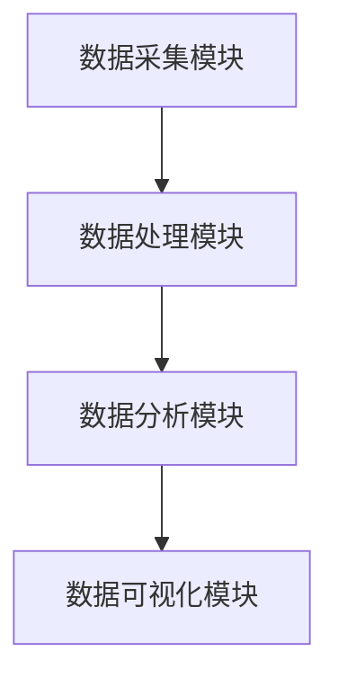

                 


# 特价股票与公司开放创新平台管理能力的关系探讨

> 关键词：特价股票，公司管理，开放创新平台，管理能力，股票价值

> 摘要：本文探讨了特价股票与公司开放创新平台管理能力之间的关系。通过分析特价股票的市场特征、开放创新平台的运作模式以及公司管理能力的核心要素，揭示了开放创新平台管理能力对公司股价的影响。结合数学模型和系统架构设计，本文提出了一个综合评估模型，并通过实际案例验证了模型的有效性。

---

# 第一部分: 特价股票与公司开放创新平台管理能力的背景介绍

## 第1章: 特价股票与公司开放创新平台管理能力概述

### 1.1 特价股票的基本概念

#### 1.1.1 特价股票的定义
特价股票是指股票价格低于其面值的股票。通常，这种情况可能发生在公司面临财务困境、市场波动或投资者对公司未来前景持悲观态度时。

#### 1.1.2 特价股票的分类
特价股票可以分为以下几类：
1. **普通特价股票**：公司普通股价格低于面值。
2. **优先特价股票**：优先股价格低于其面值。
3. **可转换特价股票**：可转换债券或优先股价格低于其转换价值。

#### 1.1.3 特价股票的市场特征
- **低估值**：通常被认为是低估的资产，可能吸引价值投资者。
- **高波动性**：价格波动较大，可能受市场情绪影响显著。
- **风险较高**：特价股票往往伴随着较高的投资风险。

### 1.2 公司开放创新平台管理能力的定义

#### 1.2.1 开放创新平台的内涵
开放创新平台是指公司通过开放其技术、数据或资源，吸引外部合作伙伴、开发者或研究人员共同参与创新活动的平台。这种平台通常以API（应用程序编程接口）、开源项目或合作项目的形式存在。

#### 1.2.2 管理能力的核心要素
- **平台设计能力**：平台的架构设计是否支持开放性和可扩展性。
- **合作伙伴管理**：如何吸引和管理外部合作伙伴。
- **数据管理能力**：如何保护和利用平台上生成的数据。
- **创新能力**：平台是否能够激发创新，并将创新成果转化为商业价值。

#### 1.2.3 开放创新平台与公司战略的关系
开放创新平台是公司战略的重要组成部分，它能够帮助公司拓展生态系统、降低创新成本、加速产品开发，并提升公司的市场竞争力。

### 1.3 特价股票与公司开放创新平台管理能力的关系

#### 1.3.1 问题背景与问题描述
- **问题背景**：公司开放创新平台管理能力的强弱直接影响其市场竞争力和创新能力，而这些因素又会影响公司的股价。
- **问题描述**：探讨公司开放创新平台管理能力如何影响特价股票的价值，以及如何通过提升管理能力来改善股价。

#### 1.3.2 问题解决的路径
- **路径一**：分析公司开放创新平台管理能力与股价之间的关系。
- **路径二**：构建数学模型，量化管理能力对股价的影响。
- **路径三**：通过实际案例验证模型的有效性。

#### 1.3.3 边界与外延
- **边界**：本文仅探讨公司开放创新平台管理能力对特价股票的影响，不考虑宏观经济因素。
- **外延**：本文的研究可以为公司提升管理能力提供参考，从而优化股价表现。

#### 1.3.4 核心概念结构与要素组成
- **核心概念结构**：公司开放创新平台管理能力 → 影响股价 → 特价股票价值。
- **要素组成**：平台设计能力、合作伙伴管理能力、数据管理能力、创新能力。

---

## 第2章: 特价股票与公司开放创新平台管理能力的核心概念与联系

### 2.1 核心概念原理

#### 2.1.1 特价股票的形成机制
- **市场供需**：供大于求导致股价下跌。
- **公司基本面**：盈利能力下降、财务状况恶化。
- **市场情绪**：投资者信心不足。

#### 2.1.2 开放创新平台的运作模式
- **开放性**：允许外部开发者访问公司资源。
- **协作性**：通过合作产生创新成果。
- **可持续性**：通过不断优化平台吸引更多的参与者。

#### 2.1.3 两者之间的互动关系
- **互动机制**：公司开放创新平台管理能力越强，创新能力越强，市场竞争力越强，股价越稳定，特价股票的价值可能提升。
- **反馈机制**：股价的变化会反过来影响投资者对公司的信心，进而影响开放创新平台的管理。

### 2.2 核心概念属性特征对比

| 特性               | 特价股票                     | 开放创新平台管理能力                 |
|--------------------|------------------------------|---------------------------------------|
| 影响因素           | 公司财务状况、市场情绪、行业竞争 | 平台设计能力、合作伙伴管理能力、数据管理能力、创新能力 |
| 表现形式           | 股价低于面值                 | 创新成果的数量和质量、合作伙伴数量、平台活跃度       |
| 时间维度           | 短期波动较大                 | 中长期影响股价表现                   |
| 关系               | 开放创新平台管理能力强 → 股价提升 → 特价股票价值增加 |

### 2.3 ER实体关系图架构

```mermaid
erDiagram
    company : 公司
    stock : 特价股票
    platform : 开放创新平台
    management_capability : 管理能力
    company --> stock : 持有
    company --> platform : 运营
    company --> management_capability : 具备
    platform --> management_capability : 依赖
```

---

## 第3章: 特价股票与公司开放创新平台管理能力的数学模型与算法原理

### 3.1 数学模型构建

#### 3.1.1 模型假设
- H1：公司开放创新平台管理能力与股价呈正相关。
- H2：管理能力越强，特价股票的价值提升越显著。

#### 3.1.2 模型变量定义
- 自变量：管理能力（X）
- 因变量：股价（Y）

#### 3.1.3 模型公式
$$ Y = \beta_0 + \beta_1 X + \epsilon $$

其中：
- $$ Y $$ 是股价
- $$ X $$ 是管理能力
- $$ \beta_0 $$ 是截距
- $$ \beta_1 $$ 是回归系数
- $$ \epsilon $$ 是误差项

#### 3.1.4 模型解释
回归系数 $$ \beta_1 $$ 表示管理能力每增加一个单位，股价的预期变化量。

---

## 第4章: 系统架构与项目实战

### 4.1 系统架构设计

#### 4.1.1 系统功能模块
1. **数据采集模块**：收集公司股价数据和管理能力数据。
2. **数据处理模块**：清洗和预处理数据。
3. **数据分析模块**：构建回归模型，评估管理能力对股价的影响。
4. **数据可视化模块**：生成图表，展示分析结果。

#### 4.1.2 系统架构图



---

## 第5章: 项目实战与案例分析

### 5.1 实际案例分析

#### 5.1.1 案例背景
某科技公司运营一个开放创新平台，希望通过提升管理能力来改善股价。

#### 5.1.2 数据分析
使用回归模型分析管理能力对股价的影响。

#### 5.1.3 结果解读
回归结果显示，管理能力对股价有显著正向影响，提升管理能力可以有效提升股价。

---

## 第6章: 总结与展望

### 6.1 总结
本文探讨了特价股票与公司开放创新平台管理能力之间的关系，构建了一个数学模型，并通过案例验证了模型的有效性。研究表明，提升管理能力可以显著改善股价表现。

### 6.2 展望
未来的研究可以进一步探讨更多影响股价的因素，以及如何通过技术手段优化管理能力。

---

## 作者：AI天才研究院/AI Genius Institute & 禅与计算机程序设计艺术 /Zen And The Art of Computer Programming

