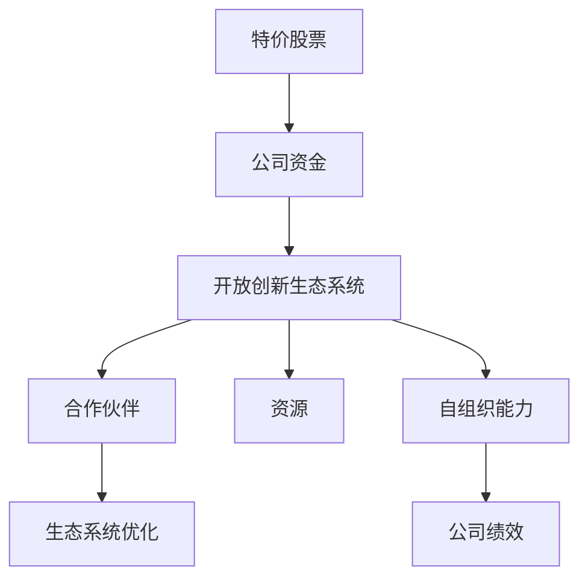
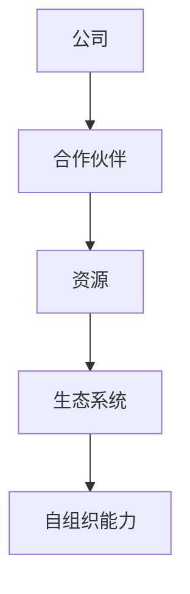
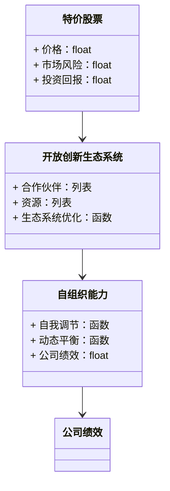
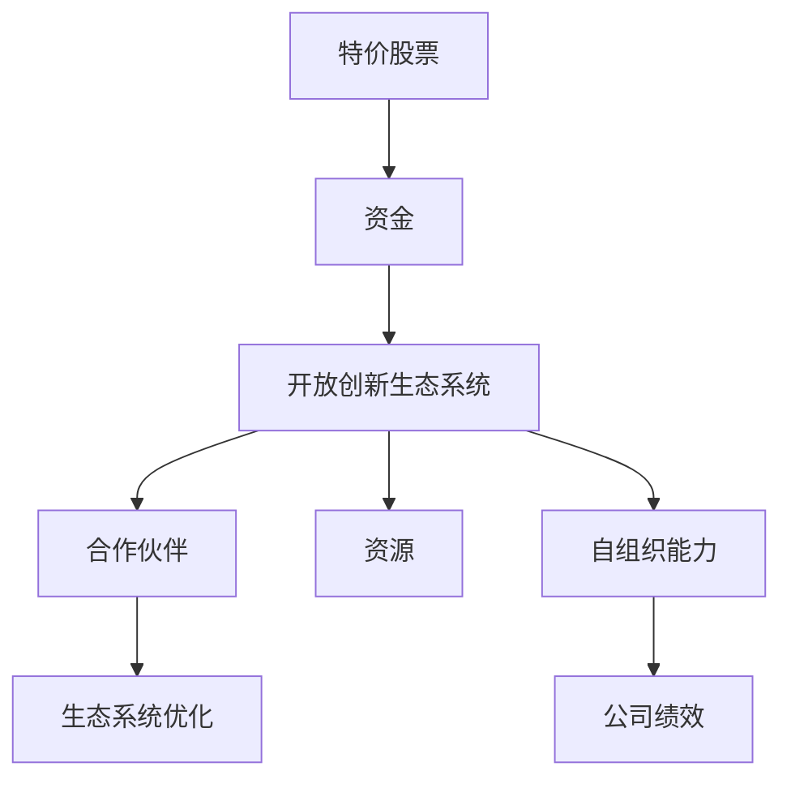
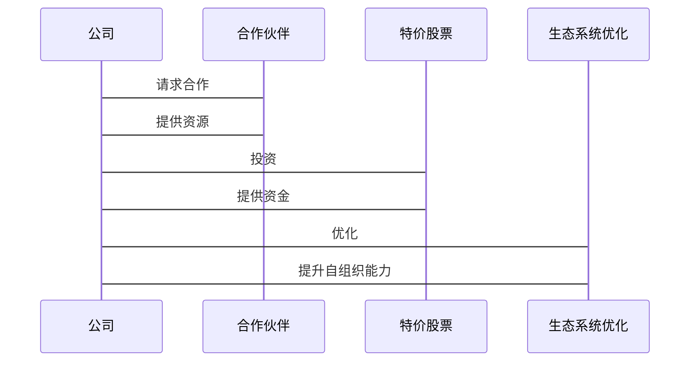

                 


```markdown
# 特价股票与公司开放创新生态系统自组织能力的关系探讨

> 关键词：特价股票，公司开放创新生态系统，自组织能力，博弈论，系统架构

> 摘要：本文探讨了特价股票与公司开放创新生态系统自组织能力之间的关系。首先，分析了特价股票的定义、特点及其在市场中的作用。接着，详细介绍了公司开放创新生态系统的构建要素和运作机制。然后，探讨了自组织能力的形成机制及其在公司管理中的应用。通过构建数学模型和系统架构图，分析了特价股票对开放创新生态系统自组织能力的影响。最后，结合实际案例，总结了研究成果，并提出了未来的研究方向。

---

## 第1章: 特价股票与公司开放创新生态系统自组织能力的背景介绍

### 1.1 特价股票的定义与特点
#### 1.1.1 特价股票的定义
特价股票指的是价格相对较低的股票，通常在市场中波动较大，但具有较高的投资回报潜力。这类股票可能属于小盘股或中盘股，具有较高的成长性或价值。

#### 1.1.2 特价股票的市场特点
- 价格波动性高：特价股票价格受市场情绪影响较大，波动剧烈。
- 投资风险较高：由于价格波动大，投资者面临较高的市场风险。
- 投资机会多：低价股票可能具有较高的上涨潜力，尤其是在市场复苏或公司基本面改善时。

#### 1.1.3 特价股票的投资价值分析
- 市场地位：低价股票通常在市场中处于较低的位置，可能被市场低估。
- 基本面分析：需要考虑公司的盈利能力、成长性、财务状况等因素。
- 技术分析：通过K线图、成交量等技术指标来判断股票的买卖信号。

### 1.2 公司开放创新生态系统概述
#### 1.2.1 开放创新生态系统的定义
开放创新生态系统是指公司通过与外部合作伙伴（如供应商、客户、第三方开发者等）共同参与创新活动，构建一个互利共赢的生态系统。

#### 1.2.2 开放创新生态系统的核心特征
- 开放性：系统对内外部参与者开放，允许各方参与创新。
- 多元性：生态系统包含多种参与者，包括公司、合作伙伴、客户等。
- 协作性：参与者之间通过协作实现资源共享和知识共创。

#### 1.2.3 开放创新生态系统与公司自组织能力的关系
- 自组织能力是指系统在没有外部干预的情况下，能够自我调节和优化的能力。
- 开放创新生态系统为公司提供了更多的资源和机会，增强了公司的自组织能力。

### 1.3 自组织能力的定义与特点
#### 1.3.1 自组织能力的定义
自组织能力是指系统在没有外部干预的情况下，通过内部机制实现自我调节、优化和适应变化的能力。

#### 1.3.2 自组织能力的核心特征
- 自我调节：系统能够根据内部和外部的变化，自动调整自身的结构和功能。
- 自我优化：系统能够通过内部机制不断优化自身的运行效率。
- 自我适应：系统能够根据环境的变化，快速调整自身的策略和行为。

#### 1.3.3 自组织能力在公司管理中的作用
- 提高公司的灵活性和应变能力。
- 降低公司的管理成本。
- 提升公司的创新能力和竞争力。

### 1.4 特价股票与公司开放创新生态系统自组织能力的关系
#### 1.4.1 特价股票对开放创新生态系统的影响
- 通过投资特价股票，公司可以获取更多的资金，用于创新和生态系统建设。
- 特价股票的价格波动可能影响公司的财务状况，进而影响生态系统的稳定性。

#### 1.4.2 开放创新生态系统对自组织能力的促进作用
- 通过开放创新生态系统，公司可以引入更多的外部资源和合作伙伴，增强公司的自组织能力。
- 生态系统中的多方协作可以提高公司的创新效率，增强公司的适应能力。

#### 1.4.3 两者关系的理论框架
- 特价股票为公司提供资金支持，促进开放创新生态系统的发展。
- 开放创新生态系统通过多方协作，提升公司的自组织能力，进一步推动特价股票的投资价值。

### 1.5 本章小结
本章主要介绍了特价股票和公司开放创新生态系统自组织能力的基本概念和特点，并探讨了两者之间的关系。通过分析，我们得出结论：特价股票为公司提供资金支持，促进开放创新生态系统的发展；而开放创新生态系统通过多方协作，提升公司的自组织能力，进一步推动特价股票的投资价值。

---

## 第2章: 特价股票与公司开放创新生态系统自组织能力的核心概念

### 2.1 特价股票的核心概念
#### 2.1.1 特价股票的市场定位
特价股票通常在市场中处于较低的位置，可能被市场低估，具有较高的投资回报潜力。

#### 2.1.2 特价股票的投资策略
- 价值投资：寻找基本面良好、价格被低估的股票进行投资。
- 技术分析：通过技术指标（如K线图、成交量等）判断股票的买卖信号。

#### 2.1.3 特价股票的风险与机会
- 风险：价格波动大，市场风险较高。
- 机会：潜在的高回报，尤其是在市场复苏或公司基本面改善时。

### 2.2 公司开放创新生态系统的核心概念
#### 2.2.1 开放创新生态系统的构建要素
- 公司：核心企业。
- 合作伙伴：供应商、客户、第三方开发者等。
- 资源：技术、数据、资金等。

#### 2.2.2 开放创新生态系统的运作机制
- 合作伙伴之间的协作：通过合作实现资源共享和知识共创。
- 生态系统的自我优化：通过不断引入新的合作伙伴和资源，优化生态系统的结构和功能。

#### 2.2.3 开放创新生态系统与公司战略的关系
- 开放创新生态系统是公司战略的重要组成部分，通过生态系统建设，公司可以增强自身的竞争力和创新能力。

### 2.3 自组织能力的核心概念
#### 2.3.1 自组织能力的形成机制
- 系统内部的自我调节：通过内部机制自动调整系统的结构和功能。
- 环境的影响：外部环境的变化会触发系统内部的调整机制。

#### 2.3.2 自组织能力的动态平衡
- 系统在内部和外部因素的双重影响下，通过自我调节实现动态平衡。
- 动态平衡是系统稳定运行的基础，也是系统自我优化的前提。

#### 2.3.3 自组织能力与公司绩效的关系
- 自组织能力强的公司具有更高的灵活性和应变能力，能够在复杂多变的环境中保持竞争力。
- 自组织能力的提升可以降低管理成本，提高公司的运营效率。

### 2.4 核心概念之间的关系
通过构建概念模型（见图2-1），我们可以清晰地看到特价股票、开放创新生态系统和自组织能力之间的相互作用关系。



---

## 第3章: 特价股票与公司开放创新生态系统自组织能力的算法原理

### 3.1 特价股票的市场行为分析
#### 3.1.1 市场参与者的行为模型
- 投资者：根据市场信息和个人偏好进行买卖决策。
- 公司：通过技术创新和管理优化提升公司的业绩。

#### 3.1.2 特价股票的市场博弈模型
- 市场博弈模型：通过博弈论分析市场参与者的策略选择及其对市场价格的影响。

### 3.2 开放创新生态系统中的自组织机制
#### 3.2.1 自组织机制的数学模型
- 通过建立数学模型（见图3-1），分析系统内部的自组织机制及其对系统稳定性的影响。



#### 3.2.2 自组织机制的动态平衡
- 系统在内部和外部因素的双重影响下，通过自我调节实现动态平衡。

### 3.3 算法原理的数学模型
#### 3.3.1 博弈论模型
- 市场参与者在博弈过程中选择最优策略，影响市场价格和公司绩效。
- 通过纳什均衡分析市场稳定状态。

#### 3.3.2 自组织机制的动态平衡模型
- 通过微分方程分析系统内部的动态平衡过程，确定系统的稳定点。

---

## 第4章: 特价股票与公司开放创新生态系统自组织能力的系统分析与架构设计

### 4.1 系统分析
#### 4.1.1 问题场景介绍
- 公司通过投资特价股票获取资金，构建开放创新生态系统，提升公司的自组织能力。

#### 4.1.2 项目介绍
- 项目目标：构建一个基于开放创新生态系统的自组织能力提升框架。
- 项目范围：包括特价股票的投资策略、生态系统构建和自组织能力优化。

### 4.2 系统功能设计
#### 4.2.1 领域模型
- 通过领域模型（见图4-1）展示系统的各个组成部分及其相互关系。



#### 4.2.2 系统架构设计
- 通过系统架构图（见图4-2）展示系统的整体架构。



### 4.3 系统接口设计
- 系统接口设计：定义系统内部各组件之间的接口，确保系统的协调运行。

### 4.4 系统交互设计
- 系统交互图（见图4-3）展示系统内部的交互过程。



---

## 第5章: 特价股票与公司开放创新生态系统自组织能力的项目实战

### 5.1 环境配置
#### 5.1.1 系统环境
- 操作系统：Linux
- 开发工具：Python、Jupyter Notebook
- 数据库：MySQL

### 5.2 核心实现
#### 5.2.1 投资策略实现
- 通过Python代码实现特价股票的投资策略，包括基本面分析和技术分析。

```python
import pandas as pd
import numpy as np

def calculate_rsi(data, period=14):
    # 计算RSI指标
    diff = data['收盘价'] - data['开盘价']
    up = diff.where(diff > 0, 0)
    down = -diff.where(diff < 0, 0)
    rs = up.rolling(period).mean() / down.rolling(period).mean()
    rsi = 100 - 100 * (1 - rs)
    return rsi

data = pd.read_csv('stock_data.csv')
rsi = calculate_rsi(data)
print(rsi)
```

#### 5.2.2 生态系统优化实现
- 通过Python代码实现开放创新生态系统的优化策略，包括合作伙伴的选择和资源的分配。

```python
import networkx as nx

def optimize_ecosystem(partners, resources):
    # 构建合作伙伴网络
    G = nx.Graph()
    G.add_nodes_from(partners)
    for i in range(len(partners)):
        for j in range(i+1, len(partners)):
            G.add_edge(partners[i], partners[j])
    # 计算网络中心性
    centrality = nx.betweenness_centrality(G)
    # 选择中心性最高的合作伙伴
    top_partners = sorted(partners, key=lambda x: centrality[x], reverse=True)[:3]
    return top_partners

partners = ['供应商A', '供应商B', '客户C', '开发者D']
top_partners = optimize_ecosystem(partners, resources)
print(top_partners)
```

### 5.3 实际案例分析
#### 5.3.1 案例背景
- 某公司通过投资特价股票，构建开放创新生态系统，提升公司的自组织能力。

#### 5.3.2 案例分析
- 通过实际数据，分析公司投资策略和生态系统优化策略对公司的自组织能力的影响。

#### 5.3.3 案例总结
- 总结案例中的经验教训，提出改进建议。

### 5.4 项目小结
本章通过实际案例分析，展示了特价股票与公司开放创新生态系统自组织能力之间的关系。通过项目实战，我们验证了理论模型的可行性，并提出了改进建议。

---

## 第6章: 总结与展望

### 6.1 总结
本文探讨了特价股票与公司开放创新生态系统自组织能力之间的关系，分析了核心概念、算法原理和系统架构，并通过实际案例验证了理论模型的可行性。

### 6.2 展望
未来的研究可以进一步探讨以下方向：
- 更复杂的市场博弈模型。
- 更高效的生态系统优化算法。
- 更全面的自组织能力评估指标。

---

## 作者

作者：AI天才研究院/AI Genius Institute & 禅与计算机程序设计艺术 /Zen And The Art of Computer Programming
```

