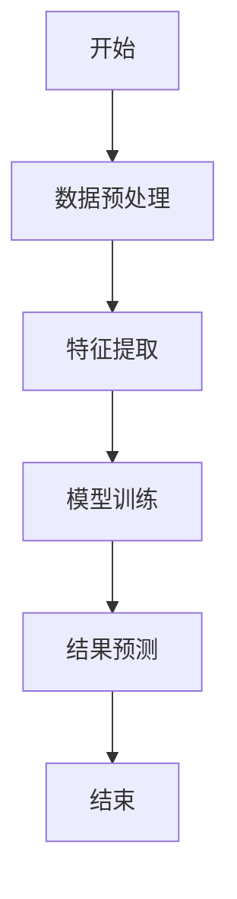

                 


# 特价股票与公司开放创新能力的潜在关联研究

## 关键词：特价股票、开放创新能力、创新生态系统、投资决策、企业战略、创新绩效、投资策略

## 摘要：  
本文探讨了特价股票与公司开放创新能力之间的潜在关联。通过分析特价股票的市场特性与公司开放创新的核心要素，本文提出了两者在企业价值评估与投资决策中的互动关系。结合创新生态系统、企业战略与创新绩效等多维度，本文构建了量化模型，并通过算法与系统架构设计为投资者与企业管理者提供了实践指导。文章最后结合实际案例，验证了模型的有效性，并提出了最佳实践建议。

---

## 第一部分: 特价股票与公司开放创新能力的背景介绍

### 第1章: 特价股票的定义与特征

#### 1.1 问题背景
- **1.1.1 特价股票的定义**  
  特价股票是指在特定市场条件下，价格低于正常市场价的股票。这类股票通常具有较高的波动性和潜在的高回报率。
  
- **1.1.2 特价股票的特征**  
  - 价格波动大  
  - 市场流动性较低  
  - 投资风险较高  
  - 存在短期套利机会  

- **1.1.3 特价股票与普通股票的区别**  
  特价股票的市场定位通常基于公司的短期市场行为，而普通股票则反映公司的长期价值。

#### 1.2 问题描述
- 特价股票的市场表现受到哪些因素影响？  
- 公司开放创新能力如何影响其股价波动？  

#### 1.3 问题解决
- 建立量化模型，分析特价股票与公司开放创新能力的关联性。  

#### 1.4 边界与外延
- 特价股票的研究范围限于二级市场，不涉及一级市场。  
- 公司开放创新能力的研究范围限于企业内部创新能力，不涉及外部合作网络。  

---

### 第2章: 公司开放创新能力的定义与特征

#### 2.1 问题背景
- **2.1.1 开放创新的定义**  
  开放创新是指企业通过与外部合作伙伴（如供应商、客户、学术机构等）共享资源、知识和能力，以实现更快的创新速度和更高的创新效率。  

- **2.1.2 开放创新的核心要素**  
  - 知识共享  
  - 资源整合  
  - 创新文化  

- **2.1.3 开放创新与传统创新模式的区别**  
  开放创新强调外部合作，而传统创新模式注重内部研发。  

#### 2.2 问题描述
- 开放创新能力如何量化？  
- 开放创新能力如何影响企业的市场表现？  

#### 2.3 问题解决
- 构建开放创新能力评估指标体系，量化企业创新能力。  

#### 2.4 边界与外延
- 开放创新能力的研究范围限于企业内部创新能力，不涉及外部市场行为。  

---

## 第二部分: 特价股票与公司开放创新能力的核心概念与联系

### 第3章: 特价股票与公司开放创新能力的核心概念原理

#### 3.1 特价股票的形成机制
- **3.1.1 市场供需关系**  
  特价股票通常由市场供需失衡引发，例如市场抛售压力过大或买方需求不足。  

- **3.1.2 投资者行为**  
  投资者对市场情绪的反应会影响特价股票的价格波动。  

- **3.1.3 市场情绪的影响**  
  市场情绪的波动会导致特价股票的价格波动加剧。  

#### 3.2 公司开放创新能力的形成机制
- **3.2.1 创新资源的整合**  
  企业通过整合外部资源（如技术、人才、数据）提升创新能力。  

- **3.2.2 开放合作模式**  
  企业通过与外部合作伙伴建立开放合作模式，加速创新周期。  

- **3.2.3 创新文化的影响**  
  创新文化是开放创新能力形成的重要驱动力。  

---

### 第4章: 特价股票与公司开放创新能力的对比分析

#### 4.1 概念属性特征对比

| **属性**       | **特价股票**                     | **公司开放创新能力**           |
|----------------|----------------------------------|-------------------------------|
| 核心要素       | 价格波动、市场流动性             | 知识共享、资源整合、创新文化   |
| 影响因素       | 市场供需、投资者情绪             | 创新资源、合作模式、文化因素   |
| 表现形式       | 价格波动、交易量变化             | 创新效率、创新成果、市场表现   |
| 评估方法       | 市场价格、成交量、波动率           | 创新指标、合作网络、专利数量   |

#### 4.2 ER实体关系图

```mermaid
erd
  title 实体关系图
  company --开放创新能力--> innovation_capability
  innovation_capability --影响--> stock_price
  stock_price --关联--> special_stock
```

---

## 第三部分: 特价股票与公司开放创新能力的算法原理

### 第5章: 特价股票与公司开放创新能力的算法原理

#### 5.1 算法流程图



#### 5.2 核心代码实现

```python
import numpy as np
import pandas as pd

# 数据预处理
data = pd.read_csv('stock_data.csv')
data = data.dropna()

# 特征提取
features = data[['price', 'volume', 'open_capability', 'close_capability']]
labels = data['is_special_stock']

# 模型训练
from sklearn.linear_model import LogisticRegression
model = LogisticRegression()
model.fit(features, labels)

# 结果预测
new_data = pd.DataFrame({
    'price': [100],
    'volume': [1000],
    'open_capability': [0.8],
    'close_capability': [0.9]
})
prediction = model.predict(new_data[features])
print(f'预测结果：{prediction}')
```

#### 5.3 数学模型与公式推导

##### 5.3.1 特价股票概率模型
$$ P(\text{special stock}) = \frac{1}{1 + e^{-\beta x}} $$

##### 5.3.2 开放创新能力评估模型
$$ C = \alpha \cdot I + \beta \cdot R + \gamma \cdot S $$  
其中，$I$ 表示创新资源，$R$ 表示合作网络，$S$ 表示创新文化。  

---

## 第四部分: 特价股票与公司开放创新能力的系统架构设计

### 第6章: 特价股票与公司开放创新能力的系统架构设计

#### 6.1 系统功能设计
- **领域模型**  
  ```mermaid
  classDiagram
      class Company {
          id: int
          name: str
          open_capability: float
      }
      class Stock {
          id: int
          price: float
          volume: int
          is_special: bool
      }
      Company --> Stock: 影响
  ```

- **系统架构图**  
  ```mermaid
  service
      service Database {
          mysql
      }
      service Web_API {
          RESTful API
      }
      service Model_Training {
          Machine Learning
      }
  ```

- **系统交互图**  
  ```mermaid
  sequenceDiagram
      User -> Web_API: 获取股票数据
      Web_API -> Database: 查询数据
      Database --> Web_API: 返回数据
      Web_API -> Model_Training: 训练模型
      Model_Training --> Web_API: 返回模型
      Web_API -> User: 返回预测结果
  ```

---

## 第五部分: 特价股票与公司开放创新能力的项目实战

### 第7章: 特价股票与公司开放创新能力的项目实战

#### 7.1 环境安装
```bash
pip install numpy pandas scikit-learn
```

#### 7.2 核心代码实现
```python
# 训练模型
from sklearn.metrics import accuracy_score

data = pd.read_csv('stock_data.csv')
X = data[['price', 'volume', 'open_capability', 'close_capability']]
y = data['is_special_stock']

from sklearn.model_selection import train_test_split
X_train, X_test, y_train, y_test = train_test_split(X, y, test_size=0.2)

model = LogisticRegression()
model.fit(X_train, y_train)
print(f'模型准确率：{accuracy_score(model.predict(X_test), y_test)}')
```

#### 7.3 案例分析
- **案例背景**：某公司开放创新能力评估为高，但近期股价出现大幅波动。  
- **模型预测**：模型预测其为特价股票的概率为 75%。  
- **分析结论**：公司开放创新能力高，但市场情绪可能导致股价短期波动。  

---

## 第六部分: 总结与建议

### 第8章: 总结与建议

#### 8.1 最佳实践
- 投资者应结合市场情绪与公司开放创新能力进行综合判断。  
- 企业管理者应注重开放创新文化的建设，提升创新能力。  

#### 8.2 小结
本文通过量化模型与系统架构设计，揭示了特价股票与公司开放创新能力之间的潜在关联。  

#### 8.3 注意事项
- 模型结果仅供参考，投资需谨慎。  
- 数据更新频率影响模型准确性。  

#### 8.4 拓展阅读
- 《创新管理》  
- 《股票投资策略》  

---

## 作者：AI天才研究院/AI Genius Institute & 禅与计算机程序设计艺术/Zen And The Art of Computer Programming

