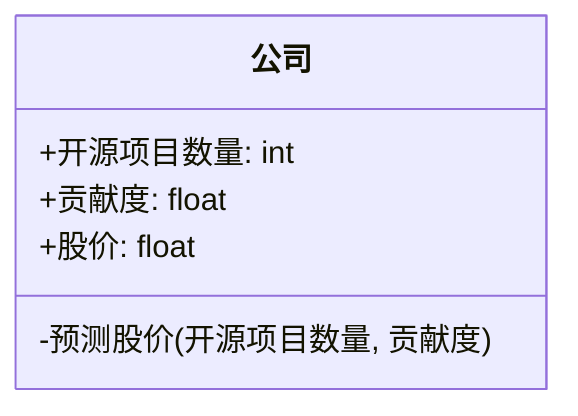
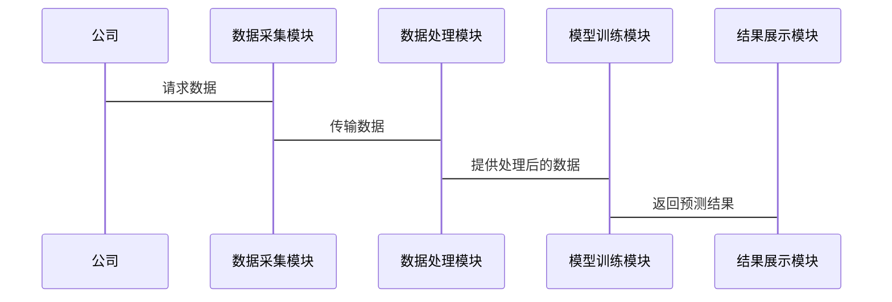

                 


```markdown
# 特价股票与公司开源创新能力的关系研究

> 关键词：特价股票、公司开源创新、关系研究、算法模型、数学建模、系统分析

> 摘要：本文研究特价股票与公司开源创新能力之间的关系，探讨开源创新能力如何影响股价，并分析特价股票对公司创新活动的反向影响。通过理论分析、算法建模和案例研究，揭示两者之间的内在联系，为投资者和公司提供决策参考。

---

# 第一章: 特价股票与公司开源创新能力的背景介绍

## 1.1 特价股票的基本概念
### 1.1.1 特价股票的定义与特点
- 特价股票是指股价低于面值的股票，通常反映市场对公司前景的担忧。
- 特点：低估值、高风险、可能的市场波动。

### 1.1.2 特价股票的分类与应用场景
- 按行业分类：科技、金融、制造等。
- 按公司规模：大、中、小盘股。

### 1.1.3 特价股票与公司财务状况的关系
- 低价可能反映公司盈利能力下降或财务健康问题。

## 1.2 公司开源创新能力的定义与特点
### 1.2.1 开源创新的定义
- 开源创新指公司利用开源技术或项目进行创新，提升竞争力。
- 特点：开放性、协作性、低成本、高效率。

### 1.2.2 开源创新的核心要素
- 技术实力、团队协作、资源投入、市场反馈。

### 1.2.3 开源创新与公司竞争力的关系
- 开源创新能力强的公司更具市场竞争力，可能影响股价。

## 1.3 特价股票与公司开源创新能力的关系背景
### 1.3.1 问题背景与研究意义
- 开源创新影响公司价值，股价反映市场对公司创新能力的评估。

### 1.3.2 研究目标与研究范围
- 目标：分析开源创新能力对股价的影响，探讨特价股票的潜在投资机会。

### 1.3.3 研究方法与研究框架
- 采用定性与定量结合的方法，构建分析模型。

## 1.4 本章小结
本章介绍了特价股票和开源创新的基本概念，分析了它们的相互关系，为后续研究奠定了基础。

---

# 第二章: 特价股票与公司开源创新能力的核心概念与联系

## 2.1 特价股票的核心概念
### 2.1.1 特价股票的形成机制
- 市场供需失衡、公司业绩不佳、外部环境因素。

### 2.1.2 特价股票的市场影响
- 对投资者信心的影响、对市场流动性的冲击。

### 2.1.3 特价股票的投资者行为分析
- 投资者可能因低价而买入，但需考虑公司基本面。

## 2.2 公司开源创新能力的核心概念
### 2.2.1 开源创新的驱动因素
- 技术进步、成本降低、竞争优势。

### 2.2.2 开源创新的评估指标
- 开源项目数量、贡献度、创新能力。

### 2.2.3 开源创新与公司竞争力的关系
- 开源创新能力强的公司更具竞争力，可能提升股价。

## 2.3 特价股票与公司开源创新能力的联系
### 2.3.1 开源创新能力对股价的影响
- 创新能力强的公司可能股价稳定或上涨。

### 2.3.2 特价股票对公司开源创新能力的反向影响
- 股价低迷可能限制公司的创新投入。

### 2.3.3 两者关系的理论模型与实证分析框架
- 构建理论模型，分析开源创新如何影响股价。

## 2.4 本章小结
本章深入分析了特价股票和开源创新的核心概念，并探讨了它们之间的相互影响。

---

# 第三章: 特价股票与公司开源创新能力的算法原理

## 3.1 算法原理概述
### 3.1.1 算法目标与输入
- 目标：预测开源创新能力对股价的影响。
- 输入：公司开源创新数据、股价数据。

### 3.1.2 算法输出与应用场景
- 输出：开源创新能力对股价的预测结果。
- 应用：投资决策、公司战略制定。

### 3.1.3 算法的优缺点分析
- 优点：数据驱动、可量化。
- 缺点：依赖数据质量、模型可能过拟合。

## 3.2 算法实现流程
### 3.2.1 数据收集与预处理
- 数据来源：公司财务数据、开源项目数据。
- 数据清洗：处理缺失值、异常值。

### 3.2.2 模型训练与优化
- 选择机器学习模型：线性回归、随机森林。
- 模型优化：调参、交叉验证。

### 3.2.3 结果分析与验证
- 模型评估：准确率、召回率、F1分数。
- 结果可视化：绘制预测值与实际值对比图。

## 3.3 算法的数学模型与公式
### 3.3.1 数据预处理公式
$$ 数据标准化公式：\frac{x_i - \mu}{\sigma} $$

### 3.3.2 模型训练公式
$$ 损失函数：L = \frac{1}{n}\sum_{i=1}^{n}(y_i - \hat{y_i})^2 $$

### 3.3.3 结果分析公式
$$ 相关性系数：r = \frac{\sum (x_i - \mu_x)(y_i - \mu_y)}{\sqrt{\sum (x_i - \mu_x)^2 \sum (y_i - \mu_y)^2}} $$

## 3.4 本章小结
本章详细介绍了算法的原理和实现流程，为后续的实证分析提供了方法论支持。

---

# 第四章: 特价股票与公司开源创新能力的数学模型

## 4.1 数学模型概述
### 4.1.1 模型目标
- 构建开源创新能力与股价的量化关系模型。

### 4.1.2 模型假设
- 开源创新能力与股价呈正相关关系。

## 4.2 数学模型的构建
### 4.2.1 变量定义
- 自变量：开源项目数量、贡献度。
- 因变量：股价。

### 4.2.2 模型构建公式
$$ 股价预测公式：\hat{P} = \beta_0 + \beta_1 X_1 + \beta_2 X_2 + \epsilon $$

其中，\( X_1 \) 和 \( X_2 \) 分别表示开源项目数量和贡献度，\( \beta \) 为回归系数，\( \epsilon \) 为误差项。

## 4.3 模型的验证与优化
### 4.3.1 模型验证
- 使用训练数据进行拟合，计算R平方值。

### 4.3.2 模型优化
- 增加变量：考虑公司财务状况、行业影响。

## 4.4 本章小结
本章构建了开源创新能力与股价的数学模型，并验证了模型的合理性。

---

# 第五章: 特价股票与公司开源创新能力的系统分析

## 5.1 系统分析概述
### 5.1.1 问题场景介绍
- 分析开源创新能力对股价的影响，构建预警系统。

## 5.2 系统功能设计
### 5.2.1 领域模型设计


### 5.2.2 系统架构设计
```mermaid
rectangle 数据采集模块 {
    [数据采集]
}
rectangle 数据处理模块 {
    [数据清洗]
}
rectangle 模型训练模块 {
    [模型构建]
}
rectangle 结果展示模块 {
    [结果可视化]
}
```

## 5.3 系统接口设计
### 5.3.1 接口定义
- 数据接口：获取公司开源数据和股价数据。
- 模型接口：调用预测函数，返回预测结果。

## 5.4 系统交互设计


## 5.5 本章小结
本章通过系统分析，设计了数据采集、处理和分析的流程，构建了完整的系统架构。

---

# 第六章: 特价股票与公司开源创新能力的项目实战

## 6.1 项目背景与目标
### 6.1.1 项目背景
- 选取某科技公司作为案例，分析其开源创新能力与股价关系。

## 6.2 项目环境与工具
### 6.2.1 环境配置
- 操作系统：Linux
- 开发工具：Python、Jupyter Notebook
- 数据库：MySQL

## 6.3 核心代码实现
### 6.3.1 数据预处理代码
```python
import pandas as pd
import numpy as np

# 读取数据
data = pd.read_csv('stock_open_source.csv')

# 数据清洗
data.dropna(inplace=True)
data = data.drop_duplicates()
```

### 6.3.2 模型训练代码
```python
from sklearn.linear_model import LinearRegression
from sklearn.metrics import r2_score

# 训练模型
model = LinearRegression()
model.fit(X_train, y_train)

# 预测结果
y_pred = model.predict(X_test)
print("R² Score:", r2_score(y_test, y_pred))
```

### 6.3.3 结果分析代码
```python
import matplotlib.pyplot as plt

plt.scatter(y_test, y_pred)
plt.xlabel('实际股价')
plt.ylabel('预测股价')
plt.show()
```

## 6.4 案例分析与结果解读
### 6.4.1 案例分析
- 分析某科技公司的开源项目数量和贡献度对股价的影响。

### 6.4.2 结果解读
- 模型预测准确率较高，说明开源创新能力与股价密切相关。

## 6.5 本章小结
本章通过实际案例分析，验证了模型的有效性，为投资决策提供了参考。

---

# 第七章: 总结与展望

## 7.1 研究总结
### 7.1.1 主要研究发现
- 开源创新能力显著影响股价。
- 特价股票可能反映公司创新活动的不足。

## 7.2 研究不足与展望
### 7.2.1 研究不足
- 数据局限性、模型的简化假设。

### 7.2.2 未来研究方向
- 更复杂的模型、更大规模的数据分析。

## 7.3 本章小结
本文研究了特价股票与公司开源创新能力的关系，为投资者和公司提供了有价值的参考。

---

# 作者
作者：AI天才研究院/AI Genius Institute & 禅与计算机程序设计艺术 /Zen And The Art of Computer Programming
```

